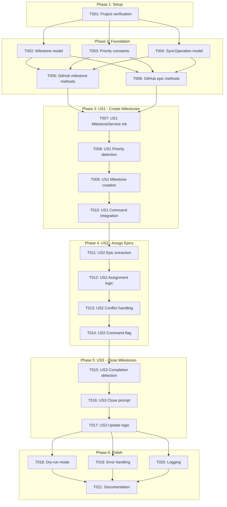
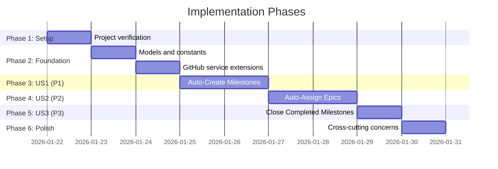

# Tasks: GitHub Milestone Generation from Priorities

**Input**: Design documents from `/specs/041-milestone-generation/`
**Prerequisites**: plan.md, spec.md, research.md, data-model.md, contracts/

**Tests**: Tests are NOT explicitly requested in the specification. Focus on implementation only.

**Organization**: Tasks are grouped by user story to enable independent implementation and testing of each story.

## Task Dependencies

<!--
  AUTO-GENERATED: This section is populated by /doit.taskit based on task relationships.
  The flowchart shows task execution order and parallel opportunities.
  Regenerate by running /doit.taskit again.
-->

<!-- BEGIN:AUTO-GENERATED section="task-dependencies" -->

<!-- END:AUTO-GENERATED -->

## Phase Timeline

<!--
  AUTO-GENERATED: This section is populated by /doit.taskit based on phase structure.
  The gantt chart shows estimated phase durations and dependencies.
  Regenerate by running /doit.taskit again.
-->

<!-- BEGIN:AUTO-GENERATED section="phase-timeline" -->

<!-- END:AUTO-GENERATED -->

## Format: `[ID] [P?] [Story] Description`

- **[P]**: Can run in parallel (different files, no dependencies)
- **[Story]**: Which user story this task belongs to (e.g., US1, US2, US3)
- Include exact file paths in descriptions

## Path Conventions

- **Single project**: `src/doit_cli/`, `tests/` at repository root
- Paths below follow the structure from plan.md

---

## Phase 1: Setup (Shared Infrastructure)

**Purpose**: Project verification and initial structure validation

- [X] T001 Verify existing GitHub integration services (RoadmapParser, RoadmapMatcher, GitHubService) are available and functional

---

## Phase 2: Foundational (Blocking Prerequisites)

**Purpose**: Core models and GitHub service extensions that ALL user stories depend on

**⚠️ CRITICAL**: No user story work can begin until this phase is complete

- [X] T002 [P] Create Milestone dataclass model in src/doit_cli/models/milestone.py with attributes: number, title, description, state, url
- [X] T003 [P] Create Priority constants module in src/doit_cli/models/priority.py with P1-P4 mappings to display names
- [X] T004 [P] Create SyncOperation and SyncResultItem dataclasses in src/doit_cli/models/sync_operation.py for tracking sync results
- [X] T005 Extend GitHubService in src/doit_cli/services/github_service.py with get_all_milestones() method using gh CLI
- [X] T006 Extend GitHubService in src/doit_cli/services/github_service.py with create_milestone() method using gh CLI

**Checkpoint**: Foundation ready - user story implementation can now begin in parallel

---

## Phase 3: User Story 1 - Auto-Create Milestones from Roadmap Priorities (Priority: P1) 🎯 MVP

**Goal**: Automatically create GitHub milestones for P1-P4 priority levels if they don't exist, providing GitHub-native view of roadmap priorities

**Independent Test**: Run `/doit roadmapit sync-milestones` on repository without priority milestones, verify 4 milestones created with correct titles

### Implementation for User Story 1

- [X] T007 [US1] Create MilestoneService class skeleton in src/doit_cli/services/milestone_service.py with __init__ accepting GitHubService dependency
- [X] T008 [US1] Implement detect_priority_sections() method in MilestoneService to parse roadmap.md and identify P1-P4 sections using regex from research.md
- [X] T009 [US1] Implement create_missing_milestones() method in MilestoneService to check existing milestones and create missing ones with standard titles
- [X] T010 [US1] Add sync_milestones command to src/doit_cli/commands/roadmapit.py that calls MilestoneService.create_missing_milestones()

**Checkpoint**: At this point, User Story 1 should be fully functional - milestones auto-created from roadmap

---

## Phase 4: User Story 2 - Auto-Assign Epics to Priority Milestones (Priority: P2)

**Goal**: Automatically assign each GitHub epic to its corresponding priority milestone based on roadmap priority

**Independent Test**: Create roadmap with mixed priority items (P1, P2, P3), run sync, verify each epic assigned to correct milestone in GitHub

### Implementation for User Story 2

- [X] T011 [US2] Implement extract_epic_references() method in MilestoneService to parse roadmap items and extract GitHub epic numbers using regex pattern
- [X] T012 [US2] Implement assign_epics_to_milestones() method in MilestoneService to assign each epic to matching priority milestone using gh issue edit
- [X] T013 [US2] Add check_existing_assignment() helper in MilestoneService to detect and log when epic is reassigned from different milestone
- [X] T014 [US2] Update sync_milestones command in src/doit_cli/commands/roadmapit.py to call both milestone creation and epic assignment

**Checkpoint**: At this point, User Stories 1 AND 2 should both work independently - milestones created and epics assigned

---

## Phase 5: User Story 3 - Close Completed Priority Milestones (Priority: P3)

**Goal**: Detect when all items in a priority are completed and offer to close the corresponding GitHub milestone

**Independent Test**: Complete all P2 items, move to completed_roadmap.md, run sync, verify system prompts to close P2 milestone

### Implementation for User Story 3

- [X] T015 [US3] Implement detect_completed_priorities() method in MilestoneService to check roadmap.md and completed_roadmap.md for empty priority sections
- [X] T016 [US3] Implement prompt_close_milestone() method in MilestoneService using Rich prompt to ask user confirmation before closing
- [X] T017 [US3] Extend GitHubService in src/doit_cli/services/github_service.py with close_milestone() method using gh api PATCH

**Checkpoint**: All user stories should now be independently functional - create, assign, and close milestones

---

## Phase 6: Polish & Cross-Cutting Concerns

**Purpose**: Improvements that affect multiple user stories

- [X] T018 [P] Add --dry-run flag support to sync_milestones command in src/doit_cli/commands/roadmapit.py with preview output
- [X] T019 [P] Implement comprehensive error handling in MilestoneService for GitHub API failures (rate limits, network errors, missing epics)
- [X] T020 [P] Add Rich console logging throughout MilestoneService for all operations (created, assigned, skipped, errors) with color coding
- [X] T021 Update quickstart.md with real examples from actual sync execution output

---

## Dependencies & Execution Order

### Phase Dependencies

- **Setup (Phase 1)**: No dependencies - can start immediately
- **Foundational (Phase 2)**: Depends on Setup completion - BLOCKS all user stories
- **User Stories (Phase 3-5)**: All depend on Foundational phase completion
  - User Story 1 (P1): Can start after Foundational - No dependencies on other stories
  - User Story 2 (P2): Depends on User Story 1 completion (needs milestones to exist)
  - User Story 3 (P3): Depends on User Story 1 completion (needs milestones to exist)
- **Polish (Phase 6)**: Depends on all user stories being complete

### User Story Dependencies

- **User Story 1 (P1)**: Can start after Foundational (Phase 2) - Creates the milestone infrastructure
- **User Story 2 (P2)**: Depends on User Story 1 - Requires milestones to exist before assigning epics
- **User Story 3 (P3)**: Depends on User Story 1 - Requires milestones to exist before closing them

### Within Each User Story

**User Story 1 (Milestone Creation)**:
1. T007: Service skeleton (foundation)
2. T008: Priority detection (prerequisite for creation)
3. T009: Milestone creation logic (depends on T008)
4. T010: Command integration (depends on T009)

**User Story 2 (Epic Assignment)**:
1. T011: Epic extraction (can start immediately after US1)
2. T012: Assignment logic (depends on T011)
3. T013: Conflict handling (depends on T012)
4. T014: Command integration (depends on T013)

**User Story 3 (Milestone Closing)**:
1. T015: Completion detection (can start immediately after US1)
2. T016: Close prompt (depends on T015)
3. T017: Update logic (depends on T016)

### Parallel Opportunities

- **Phase 2 Foundation**: All tasks (T002, T003, T004) can run in parallel - different files
- **Phase 6 Polish**: Tasks T018, T019, T020 can run in parallel - different concerns
- **Between User Stories**: Cannot parallelize due to dependencies (US2 and US3 both need US1 complete)
- **Within User Stories**: Most tasks are sequential due to logical dependencies

---

## Parallel Example: Foundation Phase

```bash
# Launch all foundational models together:
Task: "Create Milestone dataclass model in src/doit_cli/models/milestone.py"
Task: "Create Priority constants module in src/doit_cli/models/priority.py"
Task: "Create SyncOperation dataclass in src/doit_cli/models/sync_operation.py"
```

---

## Implementation Strategy

### MVP First (User Story 1 Only)

1. Complete Phase 1: Setup (T001)
2. Complete Phase 2: Foundational (T002-T006) - CRITICAL
3. Complete Phase 3: User Story 1 (T007-T010)
4. **STOP and VALIDATE**: Test milestone creation independently
5. Deploy/demo if ready

**Deliverable**: Automatic milestone creation for all roadmap priorities - immediate value without manual setup

### Incremental Delivery

1. Complete Setup + Foundational → Foundation ready
2. Add User Story 1 → Test independently → Deploy/Demo (MVP! Milestones auto-created)
3. Add User Story 2 → Test independently → Deploy/Demo (Epics auto-assigned to milestones)
4. Add User Story 3 → Test independently → Deploy/Demo (Completed priorities auto-close)
5. Add Polish → Test thoroughly → Deploy/Demo (Production-ready with dry-run, error handling)

### Sequential Strategy (Recommended)

This feature has sequential dependencies between user stories:

1. Team completes Setup + Foundational together (T001-T006)
2. Complete User Story 1 (T007-T010) - Creates milestone infrastructure
3. Complete User Story 2 (T011-T014) - Uses milestones from US1
4. Complete User Story 3 (T015-T017) - Uses milestones from US1
5. Complete Polish (T018-T021) - Enhances all stories

**Rationale**: US2 and US3 both depend on US1 creating the milestone structure, so parallel development offers limited benefit.

---

## Task Summary

**Total Tasks**: 21
- Phase 1 (Setup): 1 task
- Phase 2 (Foundational): 5 tasks
- Phase 3 (User Story 1 - P1): 4 tasks
- Phase 4 (User Story 2 - P2): 4 tasks
- Phase 5 (User Story 3 - P3): 3 tasks
- Phase 6 (Polish): 4 tasks

**Parallel Opportunities**: 6 tasks marked [P] (29%)
- Foundation phase: 3 parallel tasks
- Polish phase: 3 parallel tasks

**MVP Scope (Recommended First Delivery)**: Phases 1-3 (10 tasks)
- Delivers automatic milestone creation from roadmap priorities
- Provides immediate value for team visibility
- Independently testable and deployable

**Estimated Timeline**:
- MVP (Phases 1-3): 4 days
- Full Feature (All Phases): 8 days
- With Polish: 9 days

---

## Notes

- [P] tasks = different files, no dependencies, can run in parallel
- [Story] label maps task to specific user story for traceability
- Each user story should be independently testable after completion
- Commit after each task or logical group
- Stop at any checkpoint to validate story independently
- Tests are NOT included per specification (focus on implementation)
- User Stories 2 and 3 both depend on User Story 1 completing first
- --dry-run flag should be added early in development for safety during testing
