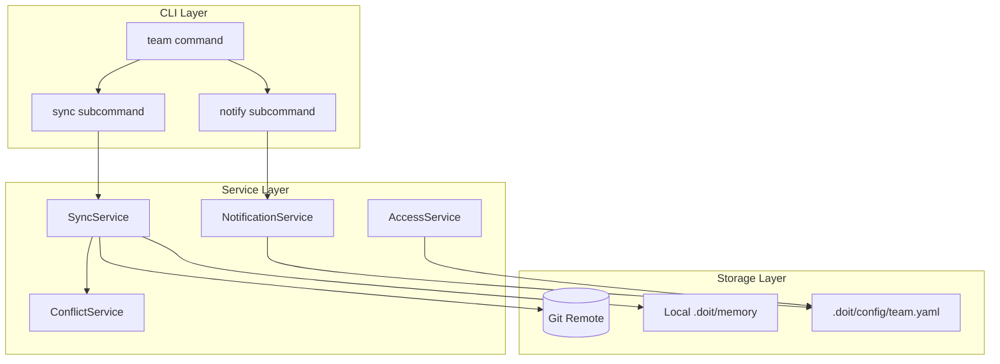

# Implementation Plan: Team Collaboration Features

**Branch**: `042-team-collaboration` | **Date**: 2026-01-22 | **Spec**: [spec.md](./spec.md)
**Input**: Feature specification from `/specs/042-team-collaboration/spec.md`

## Summary

Enable multi-developer workflows by implementing shared project memory synchronization with conflict resolution, change notifications, and team access management. The feature extends the existing doit CLI with new commands for team collaboration while maintaining the file-based storage principle using Git as the synchronization mechanism.

## Technical Context

**Language/Version**: Python 3.11+ (per constitution)
**Primary Dependencies**: Typer (CLI), Rich (formatting), httpx (GitHub API), watchdog (file monitoring)
**Storage**: File-based using Git for synchronization (aligns with constitution - no external database)
**Testing**: pytest (per constitution)
**Target Platform**: Cross-platform CLI (macOS, Linux, Windows)
**Project Type**: single (extends existing CLI tool)
**Performance Goals**: Sync completes in <10 seconds for typical projects (<100KB), notifications delivered within 5 minutes
**Constraints**: Must work offline with graceful degradation, Git required for sync functionality
**Scale/Scope**: Teams of 2-20 developers, memory files under 1MB each

## Architecture Overview

<!-- BEGIN:AUTO-GENERATED section="architecture" -->

<!-- END:AUTO-GENERATED -->

## Constitution Check

*GATE: Must pass before Phase 0 research. Re-check after Phase 1 design.*

| Principle | Status | Notes |
|-----------|--------|-------|
| I. Specification-First | ✅ PASS | spec.md created before implementation |
| II. Persistent Memory | ✅ PASS | Uses file-based storage in .doit/memory/, synced via Git |
| III. Auto-Generated Diagrams | ✅ PASS | Mermaid diagrams auto-generated in plan |
| IV. Opinionated Workflow | ✅ PASS | Follows specit → planit → taskit workflow |
| V. AI-Native Design | ✅ PASS | Adds `/doit.team` slash command for AI assistants |
| Tech Stack Alignment | ✅ PASS | Uses Python 3.11+, Typer, Rich, pytest (all per constitution) |

**Gate Result**: PASS - No violations requiring justification.

## Project Structure

### Documentation (this feature)

```text
specs/042-team-collaboration/
├── spec.md              # Feature specification
├── plan.md              # This file
├── research.md          # Phase 0 output
├── data-model.md        # Phase 1 output
├── quickstart.md        # Phase 1 output
├── contracts/           # Phase 1 output
│   └── team-api.md      # Internal API contracts
└── checklists/
    └── requirements.md  # Quality checklist
```

### Source Code (repository root)

```text
src/
├── doit_cli/
│   ├── cli/
│   │   └── team_command.py      # New: team CLI command
│   ├── models/
│   │   ├── team_models.py       # New: Team, TeamMember, etc.
│   │   └── sync_models.py       # New: SyncOperation, ConflictRecord
│   └── services/                # Existing services directory
│       ├── sync_service.py      # New: Memory synchronization
│       ├── notification_service.py  # New: Change notifications
│       ├── conflict_service.py  # New: Conflict detection/resolution
│       └── access_service.py    # New: Team access control
└── doit_toolkit_cli/            # Existing toolkit (may add sync utilities)

tests/
├── unit/
│   ├── test_sync_service.py
│   ├── test_notification_service.py
│   ├── test_conflict_service.py
│   └── test_access_service.py
└── integration/
    └── test_team_workflow.py
```

**Structure Decision**: Single project structure extending existing `doit_cli` package. New services follow established patterns in `src/doit_cli/services/`.

## Key Design Decisions

### 1. Git-Based Synchronization

Use Git as the sync mechanism rather than building a custom sync service:
- **Rationale**: Aligns with constitution (file-based, version-controlled), leverages existing tooling, no external service dependencies
- **Approach**: `.doit/memory/` files pushed/pulled via Git remote; conflicts detected via Git merge conflicts

### 2. Local Notifications via File Watchers

Notifications implemented via local file watching rather than push notifications:
- **Rationale**: No external service required, works offline, aligns with local-first design
- **Approach**: `watchdog` library monitors `.doit/memory/` for changes after sync; batched into digest

### 3. Team Configuration File

Team settings stored in `.doit/config/team.yaml`:
- **Rationale**: Consistent with existing doit config patterns, version-controllable
- **Content**: Team members, roles, notification preferences, sync settings

## Complexity Tracking

> No constitution violations requiring justification.

## Risk Assessment

| Risk | Likelihood | Impact | Mitigation |
|------|------------|--------|------------|
| Git merge conflicts difficult to resolve | Medium | Medium | Provide interactive conflict UI with clear choices |
| Notification delays due to polling | Low | Low | Configurable polling interval, manual sync option |
| Access control bypass via direct file edit | Low | Medium | Document that access control is advisory, not enforced |

## Planning Progress

| Phase | Status | Artifacts |
|-------|--------|-----------|
| Phase 0: Research | ✅ Complete | [research.md](./research.md) |
| Phase 1: Design | ✅ Complete | [data-model.md](./data-model.md), [contracts/team-api.md](./contracts/team-api.md) |
| Phase 2: Tasks | ✅ Complete | [tasks.md](./tasks.md) |

**Next Step**: Run `/doit.implementit` to start executing the implementation tasks.
