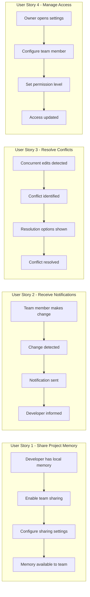
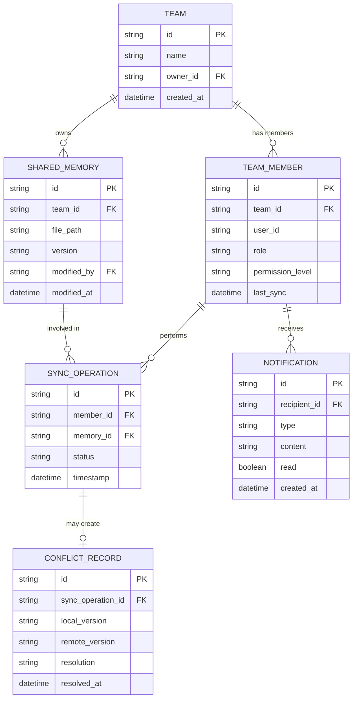

# Feature Specification: Team Collaboration Features

**Feature Branch**: `[042-team-collaboration]`
**Created**: 2026-01-22
**Status**: Complete
**GitHub Epic**: [#601](https://github.com/seanbarlow/doit/issues/601)
**Input**: User description: "Team collaboration features (shared memory, notifications) - Enables multi-developer workflows with shared context"

## Summary

Enable multiple developers to collaborate effectively on the same doit-managed project by sharing project memory (constitution, roadmap, specifications) and receiving notifications when team members make changes. This creates a unified development experience where all team members have consistent context regardless of when they joined the project or last synchronized.

## User Scenarios & Testing *(mandatory)*

### User Story 1 - Share Project Memory with Team (Priority: P1)

A developer working on a team project can share their project's memory files (constitution, roadmap, completed roadmap) with teammates so everyone operates from the same context. When a team member joins the project or returns after time away, they can pull the latest shared memory to get up to speed instantly.

**Why this priority**: This is the core functionality that enables team collaboration. Without shared memory, each developer maintains their own isolated context, leading to misalignment on project principles, priorities, and history.

**Independent Test**: Can be fully tested by having Developer A configure sharing, Developer B joining the project, and verifying Developer B receives the same constitution, roadmap, and completed roadmap files.

**Acceptance Scenarios**:

1. **Given** a project with existing memory files, **When** a developer enables team sharing, **Then** the memory files become available to other authorized team members
2. **Given** a team member joins an existing shared project, **When** they run the sync command, **Then** they receive all shared memory files
3. **Given** a developer has local memory files, **When** team sharing is enabled, **Then** the system warns about potential overwrites and asks for confirmation
4. **Given** no network connectivity, **When** a developer attempts to sync, **Then** the system fails gracefully with a clear error message and continues using local files

---

### User Story 2 - Receive Change Notifications (Priority: P2)

Team members receive notifications when another developer makes significant changes to shared memory files. This keeps everyone informed about project evolution without requiring manual communication.

**Why this priority**: Notifications provide awareness without requiring constant manual checks. The project is still usable without notifications (developers can manually sync), but notifications significantly improve team coordination.

**Independent Test**: Can be tested by having Developer A modify the roadmap, then verifying Developer B receives a notification about the change within the configured timeframe.

**Acceptance Scenarios**:

1. **Given** team sharing is enabled, **When** a developer modifies the roadmap, **Then** other team members receive a notification within 5 minutes
2. **Given** a developer has notifications enabled, **When** multiple changes occur in quick succession, **Then** the system batches notifications to avoid overwhelming users (max 1 notification per 5-minute window)
3. **Given** a developer prefers not to receive notifications, **When** they disable notifications in settings, **Then** they stop receiving change alerts but can still manually sync
4. **Given** a notification is received, **When** the developer views it, **Then** it shows what changed, who made the change, and when

---

### User Story 3 - Resolve Memory Conflicts (Priority: P3)

When two developers modify the same memory file simultaneously, the system detects the conflict and helps resolve it. This prevents accidental overwrites and ensures intentional merging of changes.

**Why this priority**: Conflicts are relatively rare in practice (most teams have informal coordination), but when they occur, they need clear resolution. Core sharing functionality works without this, making it a P3.

**Independent Test**: Can be tested by having Developer A and Developer B both modify the roadmap offline, then both attempting to sync, and verifying the conflict resolution flow is triggered.

**Acceptance Scenarios**:

1. **Given** Developer A and B both modified the roadmap, **When** Developer B attempts to sync, **Then** the system detects the conflict and presents both versions
2. **Given** a conflict is detected, **When** the developer chooses "keep mine", **Then** their version is used and the other version is archived
3. **Given** a conflict is detected, **When** the developer chooses "keep theirs", **Then** the remote version replaces their local version
4. **Given** a conflict is detected, **When** the developer chooses "merge manually", **Then** both versions are shown side-by-side for manual resolution

---

### User Story 4 - Manage Team Access (Priority: P4)

Project owners can control which team members have access to shared memory and what level of access they have (read-only vs. read-write). This supports different team structures and security requirements.

**Why this priority**: Basic sharing works with implicit trust among team members. Explicit access control is valuable for larger teams or sensitive projects but not essential for initial adoption.

**Independent Test**: Can be tested by configuring a team member as read-only, having them attempt to modify shared memory, and verifying the modification is rejected.

**Acceptance Scenarios**:

1. **Given** a project with team sharing, **When** the owner adds a new team member, **Then** they can specify read-only or read-write access
2. **Given** a team member has read-only access, **When** they attempt to push changes, **Then** the system rejects the push with a clear permission error
3. **Given** a team member's access is revoked, **When** they attempt to sync, **Then** they receive an authorization error
4. **Given** an owner wants to see team activity, **When** they run the team status command, **Then** they see a list of team members and their last sync time

---

### Edge Cases

- What happens when a team member syncs with an outdated local version?
  - System detects version mismatch and prompts for resolution strategy
- How does the system handle very large memory files?
  - Files exceeding 1MB trigger a warning; files exceeding 10MB are rejected with guidance to reduce content
- What happens when the sharing service is unavailable?
  - System operates in offline mode with clear indication; changes queue for next sync
- How are deleted files handled?
  - Deletions sync as explicit remove operations; accidentally deleted files can be recovered from history

## User Journey Visualization

<!-- BEGIN:AUTO-GENERATED section="user-journey" -->

<!-- END:AUTO-GENERATED -->

## Entity Relationships

<!-- BEGIN:AUTO-GENERATED section="entity-relationships" -->

<!-- END:AUTO-GENERATED -->

## Requirements *(mandatory)*

### Functional Requirements

- **FR-001**: System MUST allow project owners to enable team sharing for `.doit/memory/` files
- **FR-002**: System MUST synchronize constitution, roadmap, and completed roadmap files between team members
- **FR-003**: System MUST detect when local and remote memory files differ
- **FR-004**: System MUST provide clear options for resolving conflicts (keep local, keep remote, merge manually)
- **FR-005**: System MUST send notifications when shared memory files are modified
- **FR-006**: System MUST allow users to configure notification preferences (enable/disable, frequency)
- **FR-007**: System MUST batch notifications to prevent overwhelming users (maximum 1 per 5-minute window)
- **FR-008**: System MUST support offline operation with automatic sync when connectivity is restored
- **FR-009**: System MUST maintain a history of changes for recovery purposes
- **FR-010**: System MUST support read-only and read-write access levels for team members
- **FR-011**: System MUST reject unauthorized modifications with clear error messages
- **FR-012**: System MUST display team member status (last sync time, online/offline)

### Key Entities

- **Team**: A group of developers collaborating on a project; has owner and members
- **TeamMember**: A developer with access to shared memory; has role (owner/member) and permission level (read/write)
- **SharedMemory**: A synchronized memory file; tracks version, last modified by, and modification timestamp
- **SyncOperation**: A record of a sync attempt; tracks status (success/conflict/error), timestamp, and resolution
- **Notification**: An alert about memory changes; has type, content, recipient, and read status
- **ConflictRecord**: Details of a detected conflict; stores both versions and resolution outcome

## Success Criteria *(mandatory)*

### Measurable Outcomes

- **SC-001**: Team members can sync shared memory files in under 10 seconds for typical project sizes (< 100KB total)
- **SC-002**: Notifications are delivered within 5 minutes of a change being pushed
- **SC-003**: 95% of conflicts are resolved on first attempt without requiring manual file editing
- **SC-004**: New team members can access shared context within 2 minutes of joining a project
- **SC-005**: System maintains 99.9% sync accuracy (no silent data loss or corruption)
- **SC-006**: Offline changes sync automatically within 30 seconds of connectivity being restored
- **SC-007**: 80% of teams report improved alignment on project context after adoption

## Assumptions

- Team members use git for version control and have existing GitHub/GitLab accounts
- Network connectivity is intermittent but available for initial setup
- Teams are small to medium size (2-20 developers)
- Memory files are text-based and reasonably sized (under 1MB each)
- Users have basic familiarity with sync/conflict concepts from git usage

## Out of Scope

- Real-time collaborative editing (Google Docs style)
- Video/audio communication features
- Integration with external team communication tools (Slack, Teams, Discord)
- Project management features (task assignment, sprints, burndown)
- Code review or pull request workflows (covered by existing git workflows)
