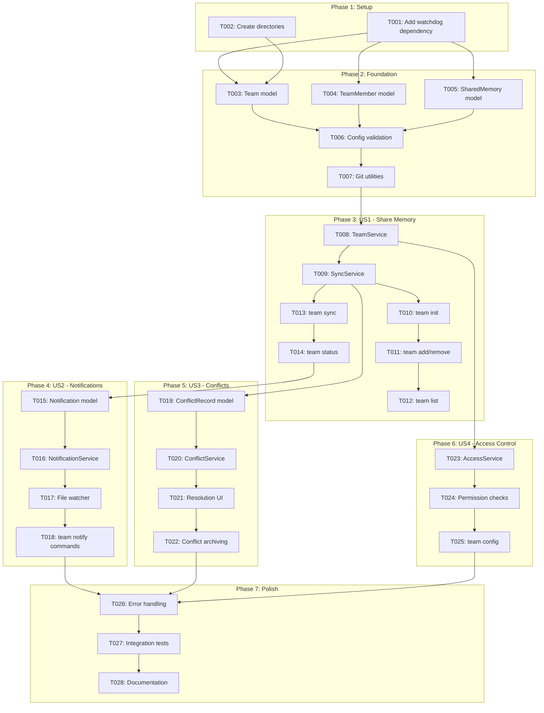
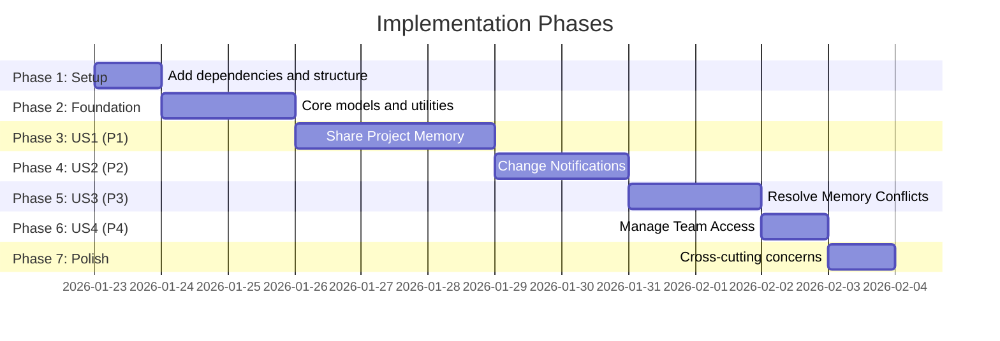

# Tasks: Team Collaboration Features

**Input**: Design documents from `/specs/042-team-collaboration/`
**Prerequisites**: plan.md, spec.md, data-model.md, contracts/team-api.md, research.md

**Organization**: Tasks are grouped by user story to enable independent implementation and testing of each story.

## Task Dependencies

<!-- BEGIN:AUTO-GENERATED section="task-dependencies" -->

<!-- END:AUTO-GENERATED -->

## Phase Timeline

<!-- BEGIN:AUTO-GENERATED section="phase-timeline" -->

<!-- END:AUTO-GENERATED -->

## Format: `[ID] [P?] [Story] Description`

- **[P]**: Can run in parallel (different files, no dependencies)
- **[Story]**: Which user story this task belongs to (e.g., US1, US2, US3, US4)
- Include exact file paths in descriptions

---

## Phase 1: Setup (Shared Infrastructure)

**Purpose**: Project initialization and dependency setup

- [x] T001 Add `watchdog>=3.0.0` to dependencies in pyproject.toml
- [x] T002 [P] Create directory structure: src/doit_cli/models/, src/doit_cli/services/ (if not exists)

---

## Phase 2: Foundational (Blocking Prerequisites)

**Purpose**: Core infrastructure that MUST be complete before ANY user story can be implemented

**⚠️ CRITICAL**: No user story work can begin until this phase is complete

- [x] T003 [P] Create Team dataclass model in src/doit_cli/models/team_models.py
- [x] T004 [P] Create TeamMember dataclass model in src/doit_cli/models/team_models.py
- [x] T005 [P] Create SharedMemory dataclass model in src/doit_cli/models/team_models.py
- [x] T006 Implement team.yaml configuration loader and validator in src/doit_cli/services/team_config.py
- [x] T007 Create Git utilities for subprocess operations in src/doit_cli/services/git_utils.py

**Checkpoint**: Foundation ready - user story implementation can now begin

---

## Phase 3: User Story 1 - Share Project Memory with Team (Priority: P1) 🎯 MVP

**Goal**: Enable developers to share project memory files (constitution, roadmap, completed roadmap) via Git-based synchronization

**Independent Test**: Developer A enables sharing, Developer B joins and syncs, verify B receives same files as A

### Implementation for User Story 1

- [x] T008 [US1] Implement TeamService class in src/doit_cli/services/team_service.py with init_team, get_team, add_member, remove_member, list_members methods
- [x] T009 [US1] Implement SyncService class in src/doit_cli/services/sync_service.py with sync, get_status, get_pending_changes methods
- [x] T010 [US1] Implement `doit team init` command in src/doit_cli/cli/team_command.py (creates team.yaml, initializes state files)
- [x] T011 [US1] Implement `doit team add` and `doit team remove` commands in src/doit_cli/cli/team_command.py
- [x] T012 [US1] Implement `doit team list` command with table/json/yaml output in src/doit_cli/cli/team_command.py
- [x] T013 [US1] Implement `doit team sync` command in src/doit_cli/cli/team_command.py (push/pull via Git operations)
- [x] T014 [US1] Implement `doit team status` command showing sync status and file states in src/doit_cli/cli/team_command.py

**Checkpoint**: At this point, User Story 1 should be fully functional - teams can share and sync memory files

---

## Phase 4: User Story 2 - Receive Change Notifications (Priority: P2)

**Goal**: Team members receive notifications when shared memory files are modified by others

**Independent Test**: Developer A modifies roadmap.md, Developer B receives notification about the change within 5 minutes

### Implementation for User Story 2

- [x] T015 [P] [US2] Create Notification dataclass model in src/doit_cli/models/sync_models.py
- [x] T016 [US2] Implement NotificationService class in src/doit_cli/services/notification_service.py with create_notification, get_notifications, mark_read, process_batch methods
- [x] T017 [US2] Implement FileWatcherService using watchdog in src/doit_cli/services/file_watcher_service.py for monitoring .doit/memory/ changes
- [x] T018 [US2] Implement `doit team notify` commands (list, read, config) in src/doit_cli/cli/team_command.py

**Checkpoint**: At this point, User Stories 1 AND 2 should both work - sync with notifications

---

## Phase 5: User Story 3 - Resolve Memory Conflicts (Priority: P3)

**Goal**: When concurrent edits occur, system detects conflicts and provides resolution options (keep mine, keep theirs, merge manually)

**Independent Test**: Developer A and B both modify roadmap.md offline, both sync, verify conflict resolution flow triggers

### Implementation for User Story 3

- [x] T019 [P] [US3] Create ConflictRecord and ConflictVersion dataclass models in src/doit_cli/models/sync_models.py
- [x] T020 [US3] Implement ConflictService class in src/doit_cli/services/conflict_service.py with detect_conflicts, resolve_conflict methods
- [x] T021 [US3] Implement conflict resolution UI using Rich in src/doit_cli/cli/team_command.py (side-by-side diff, resolution options)
- [x] T022 [US3] Implement conflict archiving to .doit/state/conflicts/ in src/doit_cli/services/conflict_service.py

**Checkpoint**: All sync scenarios now handled - including conflicts

---

## Phase 6: User Story 4 - Manage Team Access (Priority: P4)

**Goal**: Project owners can control team member access levels (read-only vs read-write)

**Independent Test**: Configure member as read-only, have them attempt push, verify rejection with clear error

### Implementation for User Story 4

- [x] T023 [US4] Implement AccessService class in src/doit_cli/services/access_service.py with check_permission, get_current_user methods
- [x] T024 [US4] Add permission checks before push operations in src/doit_cli/services/sync_service.py
- [x] T025 [US4] Implement `doit team config` command for viewing/updating team settings in src/doit_cli/cli/team_command.py

**Checkpoint**: Full access control now available for team management

---

## Phase 7: Polish & Cross-Cutting Concerns

**Purpose**: Improvements that affect multiple user stories

- [x] T026 Implement comprehensive error handling with TeamError hierarchy in src/doit_cli/models/team_errors.py
- [x] T027 [P] Create integration tests for team workflow in tests/integration/test_team_workflow.py
- [x] T028 [P] Update CLI help text and add inline documentation in src/doit_cli/cli/team_command.py

---

## Dependencies & Execution Order

### Phase Dependencies

- **Setup (Phase 1)**: No dependencies - can start immediately
- **Foundational (Phase 2)**: Depends on Setup completion - BLOCKS all user stories
- **User Stories (Phase 3-6)**: All depend on Foundational phase completion
  - US1 (P1): Can start after Foundation
  - US2 (P2): Builds on US1 sync infrastructure
  - US3 (P3): Builds on US1 sync infrastructure
  - US4 (P4): Builds on US1 team management
- **Polish (Phase 7)**: Depends on all user stories being complete

### User Story Dependencies

| Story | Depends On | Key Components |
|-------|------------|----------------|
| US1 (P1) | Foundation only | TeamService, SyncService, team commands |
| US2 (P2) | US1 (needs sync) | NotificationService, FileWatcher |
| US3 (P3) | US1 (needs sync) | ConflictService, Resolution UI |
| US4 (P4) | US1 (needs team) | AccessService, permission checks |

### Parallel Opportunities

**Phase 2 (Foundation)**:
- T003, T004, T005 can run in parallel (different model classes)

**Phase 3 (US1)**:
- T011, T012 can run in parallel after T010 (different CLI commands)

**Phase 4 (US2)**:
- T015 can run in parallel with earlier US2 setup tasks

**Phase 5 (US3)**:
- T019 can run in parallel with US2 completion

**Phase 7 (Polish)**:
- T027, T028 can run in parallel (tests and docs)

---

## Parallel Example: Foundation Phase

```bash
# Launch all models together (different classes in same file):
Task: "Create Team dataclass model in src/doit_cli/models/team_models.py"
Task: "Create TeamMember dataclass model in src/doit_cli/models/team_models.py"
Task: "Create SharedMemory dataclass model in src/doit_cli/models/team_models.py"
```

## Parallel Example: User Story 1 Commands

```bash
# After team init is complete, these can run in parallel:
Task: "Implement doit team add and doit team remove commands"
Task: "Implement doit team list command with table/json/yaml output"
```

---

## Implementation Strategy

### MVP First (User Story 1 Only)

1. Complete Phase 1: Setup (add watchdog dependency)
2. Complete Phase 2: Foundation (models, config loader, git utils)
3. Complete Phase 3: User Story 1 (team init, add, remove, list, sync, status)
4. **STOP and VALIDATE**: Test team sharing end-to-end
5. Deploy/demo if ready - teams can now share memory!

### Incremental Delivery

1. Setup + Foundation → Core infrastructure ready
2. Add User Story 1 → Test independently → Deploy (MVP: team sharing!)
3. Add User Story 2 → Test independently → Deploy (adds notifications)
4. Add User Story 3 → Test independently → Deploy (adds conflict resolution)
5. Add User Story 4 → Test independently → Deploy (adds access control)
6. Each story adds value without breaking previous stories

### File Summary

| File | Tasks | Purpose |
|------|-------|---------|
| pyproject.toml | T001 | Add watchdog dependency |
| src/doit_cli/models/team_models.py | T003-T005 | Team, TeamMember, SharedMemory |
| src/doit_cli/models/sync_models.py | T015, T019 | Notification, ConflictRecord |
| src/doit_cli/models/team_errors.py | T026 | Error hierarchy |
| src/doit_cli/services/team_config.py | T006 | Config loader/validator |
| src/doit_cli/services/git_utils.py | T007 | Git subprocess operations |
| src/doit_cli/services/team_service.py | T008 | Team management |
| src/doit_cli/services/sync_service.py | T009, T024 | Memory synchronization |
| src/doit_cli/services/notification_service.py | T016 | Notifications |
| src/doit_cli/services/file_watcher_service.py | T017 | File monitoring |
| src/doit_cli/services/conflict_service.py | T020, T022 | Conflict handling |
| src/doit_cli/services/access_service.py | T023 | Access control |
| src/doit_cli/cli/team_command.py | T010-T014, T018, T021, T025, T028 | CLI commands |
| tests/integration/test_team_workflow.py | T027 | Integration tests |

---

## Notes

- [P] tasks = different files, no dependencies
- [Story] label maps task to specific user story for traceability
- Each user story should be independently completable and testable
- Commit after each task or logical group
- Stop at any checkpoint to validate story independently
- MVP = User Story 1 only (team can share memory files)
