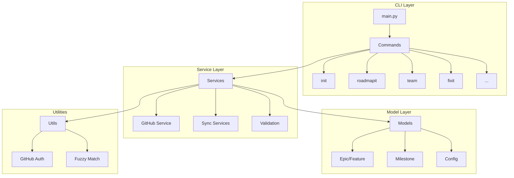

# Implementation Plan: Unified CLI Package

**Branch**: `043-unified-cli` | **Date**: 2026-01-22 | **Spec**: [spec.md](./spec.md)
**Input**: Feature specification from `/specs/043-unified-cli/spec.md`

## Summary

Consolidate `doit_cli` and `doit_toolkit_cli` into a single unified package by moving all toolkit modules into the main doit_cli package structure. This is a pure refactoring effort with no new functionality - all existing commands and behavior remain identical.

## Technical Context

**Language/Version**: Python 3.11+ (from constitution)
**Primary Dependencies**: Typer, Rich, httpx, pytest (from constitution)
**Storage**: File-based markdown (no database)
**Testing**: pytest
**Target Platform**: Cross-platform CLI (PyPI distribution)
**Project Type**: single
**Performance Goals**: N/A (refactoring, no performance changes)
**Constraints**: Zero behavior changes, all tests must pass
**Scale/Scope**: ~112 Python files total (94 + 18 to merge)

## Architecture Overview

<!-- BEGIN:AUTO-GENERATED section="architecture" -->

<!-- END:AUTO-GENERATED -->

## Constitution Check

*GATE: Must pass before Phase 0 research. Re-check after Phase 1 design.*

| Principle | Status | Notes |
|-----------|--------|-------|
| I. Specification-First | PASS | Spec created via /doit.specit |
| II. Persistent Memory | PASS | No changes to memory files |
| III. Auto-Generated Diagrams | N/A | Refactoring only |
| IV. Opinionated Workflow | PASS | Following specit → planit → taskit |
| V. AI-Native Design | PASS | All commands remain slash-command compatible |
| Tech Stack Alignment | PASS | Python 3.11+, Typer, pytest - all per constitution |

**Gate Status**: PASSED - No violations

## Project Structure

### Documentation (this feature)

```text
specs/043-unified-cli/
├── spec.md              # Feature specification
├── plan.md              # This file
├── research.md          # Package analysis and migration strategy
├── quickstart.md        # Migration execution guide
└── checklists/
    └── requirements.md  # Quality checklist
```

### Source Code (repository root)

**Before Migration**:

```text
src/
├── doit_cli/                    # Main CLI package (94 files)
│   ├── __init__.py
│   ├── main.py
│   ├── cli/                     # Command modules
│   ├── formatters/              # Output formatters
│   ├── models/                  # Data models
│   ├── prompts/                 # Interactive prompts
│   ├── rules/                   # Validation rules
│   └── services/                # Business logic
│
└── doit_toolkit_cli/            # Secondary package (18 files) - TO BE REMOVED
    ├── commands/
    ├── models/
    ├── services/
    └── utils/
```

**After Migration**:

```text
src/
└── doit_cli/                    # Unified package (~112 files)
    ├── __init__.py
    ├── main.py
    ├── cli/                     # All commands including roadmapit
    │   └── roadmapit_impl.py    # Moved from toolkit
    ├── formatters/
    ├── models/                  # Merged models
    │   ├── github_epic.py       # From toolkit
    │   ├── milestone.py         # From toolkit
    │   ├── priority.py          # From toolkit
    │   └── ...
    ├── prompts/
    ├── rules/
    ├── services/                # Merged services
    │   ├── github_service.py    # MERGED (both versions)
    │   ├── github_cache_service.py
    │   ├── milestone_service.py
    │   └── ...
    └── utils/                   # NEW directory
        ├── fuzzy_match.py
        ├── github_auth.py
        ├── priority_mapper.py
        └── spec_parser.py
```

**Structure Decision**: Single package structure with new `utils/` subdirectory for toolkit utilities. All toolkit modules merged into existing doit_cli directories.

## Migration Phases

### Phase 1: Prepare Structure

- Create `src/doit_cli/utils/` directory
- Create `src/doit_cli/utils/__init__.py`

### Phase 2: Move Models (7 files)

Move from `doit_toolkit_cli/models/` to `doit_cli/models/`:
- github_epic.py
- github_feature.py
- milestone.py
- priority.py
- roadmap.py
- sync_metadata.py
- sync_operation.py

### Phase 3: Move Utils (4 files)

Move from `doit_toolkit_cli/utils/` to `doit_cli/utils/`:
- fuzzy_match.py
- github_auth.py
- priority_mapper.py
- spec_parser.py

### Phase 4: Move Services (4 files + 1 merge)

Move from `doit_toolkit_cli/services/` to `doit_cli/services/`:
- github_cache_service.py
- github_linker.py
- milestone_service.py
- roadmap_matcher.py
- roadmap_merge_service.py

**Special**: Merge `github_service.py` (combine issue + epic functionality)

### Phase 5: Move Command

Move from `doit_toolkit_cli/commands/` to `doit_cli/cli/`:
- roadmapit.py → roadmapit_impl.py

Update `doit_cli/cli/roadmapit_command.py` to import from new location.

### Phase 6: Update All Imports

Search and replace all `from doit_toolkit_cli` to `from doit_cli`:
- Update moved files
- Update importing files in doit_cli
- Update test files

### Phase 7: Update Configuration

Update `pyproject.toml`:
```toml
[tool.hatch.build.targets.wheel]
packages = ["src/doit_cli"]  # Remove doit_toolkit_cli
```

### Phase 8: Cleanup

- Delete `src/doit_toolkit_cli/` directory
- Verify no references remain
- Run full test suite

## Key Technical Decisions

### D1: Merge vs Split github_service.py

**Decision**: Merge into single comprehensive service

**Rationale**: Methods are complementary (issues vs epics/milestones), same underlying pattern (gh CLI calls), reduces import complexity

### D2: Roadmapit command location

**Decision**: Rename to `roadmapit_impl.py` in `cli/` directory

**Rationale**: Avoids conflict with existing `roadmapit_command.py` wrapper, maintains clear separation

### D3: Utils directory

**Decision**: Create new `utils/` directory in doit_cli

**Rationale**: Toolkit utils are general-purpose, separate from services/models

## Success Verification

| Check | Command | Expected |
|-------|---------|----------|
| No toolkit imports | `grep -r "doit_toolkit_cli" src/` | No matches |
| Package structure | `ls src/` | Only `doit_cli` directory |
| Tests pass | `pytest` | All tests pass |
| Build succeeds | `hatch build` | Wheel created |
| CLI works | `doit --help` | All commands listed |
