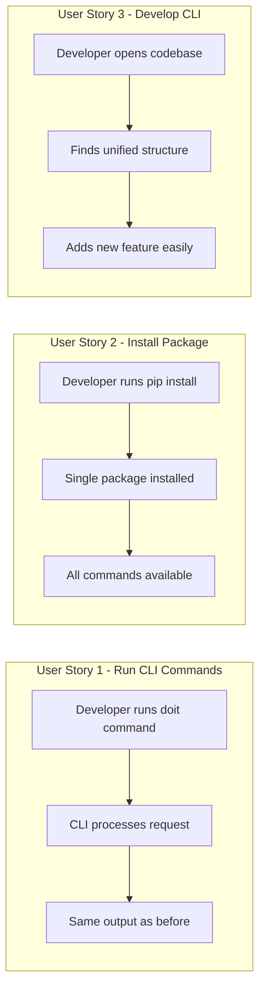

# Feature Specification: Unified CLI Package

**Feature Branch**: `[043-unified-cli]`
**Created**: 2026-01-22
**Status**: Complete
**Input**: User description: "combine the doit_cli and doit_toolkit_cli into a single unified cli"

## Summary

Consolidate the two separate CLI packages (`doit_cli` and `doit_toolkit_cli`) into a single unified package structure. Currently, `doit_toolkit_cli` contains GitHub integration services, roadmap management, and related utilities that are imported by `doit_cli`. This split creates maintenance overhead, confusion about package boundaries, and import complexity. Merging them into one cohesive `doit_cli` package will simplify the codebase, reduce import paths, and provide a cleaner architecture.

## User Scenarios & Testing *(mandatory)*

### User Story 1 - Run CLI Commands After Unification (Priority: P1)

A developer using the doit CLI continues to run all existing commands (`doit init`, `doit roadmapit`, `doit team`, etc.) exactly as before. The command behavior, output, and options remain identical - only the internal package structure changes.

**Why this priority**: This is the core requirement - maintaining full backward compatibility for all users. Any regression in CLI functionality would break existing workflows.

**Independent Test**: Can be fully tested by running the complete test suite after the merge and verifying all existing tests pass without modification to test logic (only import path changes allowed).

**Acceptance Scenarios**:

1. **Given** a developer with the previous version installed, **When** they upgrade to the unified package, **Then** all CLI commands work identically without any changes to their workflow
2. **Given** a developer running `doit roadmapit show`, **When** the command executes, **Then** the output is identical to the previous version
3. **Given** a developer running `doit team sync`, **When** the command executes, **Then** the GitHub integration works exactly as before
4. **Given** a CI/CD pipeline using doit commands, **When** the unified package is installed, **Then** all pipeline scripts continue to work without modification

---

### User Story 2 - Install Package from PyPI (Priority: P2)

A developer installs the doit package from PyPI using `pip install doit-toolkit-cli` and receives a single, well-organized package without the previous split structure.

**Why this priority**: Clean installation experience is essential for adoption, but the package already installs as a single unit - this just improves the internal organization.

**Independent Test**: Can be tested by building the wheel, installing in a fresh virtualenv, and verifying import paths and CLI availability.

**Acceptance Scenarios**:

1. **Given** a fresh Python environment, **When** a developer runs `pip install doit-toolkit-cli`, **Then** only one package directory (`doit_cli`) is installed in site-packages
2. **Given** an installed package, **When** a developer imports from `doit_cli`, **Then** all previously available modules are accessible
3. **Given** an installed package, **When** a developer runs `doit --help`, **Then** all commands are available

---

### User Story 3 - Develop and Extend the CLI (Priority: P3)

A developer contributing to doit can find all CLI-related code in a single package with clear organization. Services, models, and commands follow a consistent structure without cross-package imports.

**Why this priority**: Developer experience is important for contributions but doesn't affect end-user functionality.

**Independent Test**: Can be tested by reviewing the final package structure and verifying no circular imports or cross-package dependencies exist.

**Acceptance Scenarios**:

1. **Given** a developer exploring the codebase, **When** they look at `src/doit_cli/`, **Then** all CLI functionality is contained within that single package
2. **Given** a developer adding a new command, **When** they need GitHub integration, **Then** they can import from `doit_cli.services.github_*` without a separate package
3. **Given** the merged codebase, **When** running import analysis, **Then** no imports reference `doit_toolkit_cli`

---

### Edge Cases

- What happens when users have code that imports directly from `doit_toolkit_cli`?
  - The import will fail with a clear error; this is expected as `doit_toolkit_cli` was never a public API
- How does the system handle naming conflicts between the two packages?
  - Any conflicts will be resolved by keeping the most recent/complete implementation and merging functionality where appropriate
- What happens during a partial upgrade where old cached modules exist?
  - Fresh installation in a clean environment is recommended; uninstall before reinstall for major restructuring

## User Journey Visualization

<!-- BEGIN:AUTO-GENERATED section="user-journey" -->

<!-- END:AUTO-GENERATED -->

## Requirements *(mandatory)*

### Functional Requirements

- **FR-001**: System MUST maintain all existing CLI command functionality after merging packages
- **FR-002**: System MUST preserve all existing command-line options and arguments
- **FR-003**: System MUST keep the `doit` entry point working identically
- **FR-004**: System MUST move all `doit_toolkit_cli` modules into `doit_cli` with appropriate subdirectory organization
- **FR-005**: System MUST update all import statements across the codebase to use `doit_cli` paths
- **FR-006**: System MUST update `pyproject.toml` to reference only the unified package
- **FR-007**: System MUST remove the `doit_toolkit_cli` package directory after migration
- **FR-008**: System MUST ensure all existing tests pass with updated imports
- **FR-009**: System MUST resolve any naming conflicts between modules (e.g., both packages have `github_service.py`)
- **FR-010**: System MUST update any documentation referencing the old package structure

### Assumptions

- The `doit_toolkit_cli` package has no external consumers outside this project
- All cross-package imports flow from `doit_cli` to `doit_toolkit_cli` (not reverse)
- Test files may need import path updates but not logic changes
- No third-party packages depend on `doit_toolkit_cli` specifically

## Success Criteria *(mandatory)*

### Measurable Outcomes

- **SC-001**: All existing tests pass without test logic modifications (only import path changes allowed)
- **SC-002**: The `src/` directory contains only one package directory (`doit_cli`)
- **SC-003**: Zero imports reference `doit_toolkit_cli` anywhere in the codebase
- **SC-004**: The installed package size does not increase by more than 5% (no accidental file duplication)
- **SC-005**: All CLI commands produce identical output before and after the merge
- **SC-006**: Package builds successfully with `hatch build` and installs cleanly
