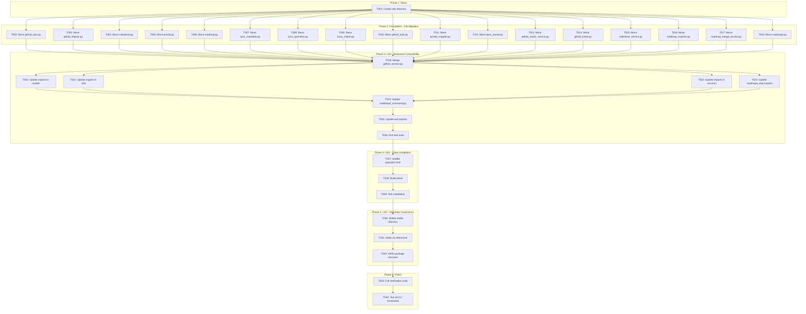
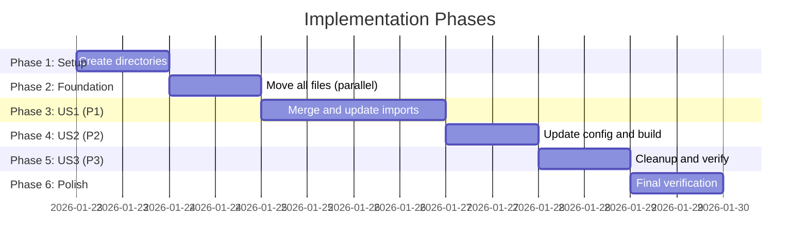

# Tasks: Unified CLI Package

**Input**: Design documents from `/specs/043-unified-cli/`
**Prerequisites**: plan.md, spec.md, research.md, quickstart.md

**Organization**: Tasks are grouped by user story to enable independent implementation and testing of each story.

## Task Dependencies

<!-- BEGIN:AUTO-GENERATED section="task-dependencies" -->

<!-- END:AUTO-GENERATED -->

## Phase Timeline

<!-- BEGIN:AUTO-GENERATED section="phase-timeline" -->

<!-- END:AUTO-GENERATED -->

## Format: `[ID] [P?] [Story] Description`

- **[P]**: Can run in parallel (different files, no dependencies)
- **[Story]**: Which user story this task belongs to (e.g., US1, US2, US3)
- Include exact file paths in descriptions

---

## Phase 1: Setup (Shared Infrastructure)

**Purpose**: Prepare the target directory structure

- [x] T001 Create utils directory and __init__.py at src/doit_cli/utils/__init__.py

---

## Phase 2: Foundational (File Migration)

**Purpose**: Move all files from doit_toolkit_cli to doit_cli - MUST complete before import updates

**⚠️ CRITICAL**: No import updates until all files are in their new locations

### Move Models (7 files)

- [x] T002 [P] Move model file from src/doit_toolkit_cli/models/github_epic.py to src/doit_cli/models/github_epic.py
- [x] T003 [P] Move model file from src/doit_toolkit_cli/models/github_feature.py to src/doit_cli/models/github_feature.py
- [x] T004 [P] Move model file from src/doit_toolkit_cli/models/milestone.py to src/doit_cli/models/milestone.py
- [x] T005 [P] Move model file from src/doit_toolkit_cli/models/priority.py to src/doit_cli/models/priority.py
- [x] T006 [P] Move model file from src/doit_toolkit_cli/models/roadmap.py to src/doit_cli/models/roadmap.py
- [x] T007 [P] Move model file from src/doit_toolkit_cli/models/sync_metadata.py to src/doit_cli/models/sync_metadata.py
- [x] T008 [P] Move model file from src/doit_toolkit_cli/models/sync_operation.py to src/doit_cli/models/sync_operation.py

### Move Utils (4 files)

- [x] T009 [P] Move util file from src/doit_toolkit_cli/utils/fuzzy_match.py to src/doit_cli/utils/fuzzy_match.py
- [x] T010 [P] Move util file from src/doit_toolkit_cli/utils/github_auth.py to src/doit_cli/utils/github_auth.py
- [x] T011 [P] Move util file from src/doit_toolkit_cli/utils/priority_mapper.py to src/doit_cli/utils/priority_mapper.py
- [x] T012 [P] Move util file from src/doit_toolkit_cli/utils/spec_parser.py to src/doit_cli/utils/spec_parser.py

### Move Services (5 files)

- [x] T013 [P] Move service file from src/doit_toolkit_cli/services/github_cache_service.py to src/doit_cli/services/github_cache_service.py
- [x] T014 [P] Move service file from src/doit_toolkit_cli/services/github_linker.py to src/doit_cli/services/github_linker.py
- [x] T015 [P] Move service file from src/doit_toolkit_cli/services/milestone_service.py to src/doit_cli/services/milestone_service.py
- [x] T016 [P] Move service file from src/doit_toolkit_cli/services/roadmap_matcher.py to src/doit_cli/services/roadmap_matcher.py
- [x] T017 [P] Move service file from src/doit_toolkit_cli/services/roadmap_merge_service.py to src/doit_cli/services/roadmap_merge_service.py

### Move Command (1 file)

- [x] T018 Move and rename command from src/doit_toolkit_cli/commands/roadmapit.py to src/doit_cli/cli/roadmapit_impl.py

**Checkpoint**: All 18 files moved to new locations - ready for import updates

---

## Phase 3: User Story 1 - Run CLI Commands After Unification (Priority: P1) 🎯 MVP

**Goal**: Ensure all CLI commands work identically after the merge by merging github_service.py and updating all imports

**Independent Test**: Run `pytest` and verify all existing tests pass; run `doit --help` and verify all commands listed

### Implementation for User Story 1

- [x] T019 [US1] Merge github_service.py: Add GitHubAuthError, GitHubAPIError, and epic/milestone methods from toolkit version into src/doit_cli/services/github_service.py
- [x] T020 [P] [US1] Update imports in moved model files to use doit_cli paths in src/doit_cli/models/github_epic.py, src/doit_cli/models/roadmap.py
- [x] T021 [P] [US1] Update imports in moved util files to use doit_cli paths (no changes expected - utils are standalone)
- [x] T022 [P] [US1] Update imports in moved service files to use doit_cli paths in src/doit_cli/services/github_cache_service.py, src/doit_cli/services/github_linker.py, src/doit_cli/services/milestone_service.py, src/doit_cli/services/roadmap_matcher.py, src/doit_cli/services/roadmap_merge_service.py
- [x] T023 [US1] Update imports in roadmapit_impl.py to use doit_cli paths in src/doit_cli/cli/roadmapit_impl.py
- [x] T024 [US1] Update roadmapit_command.py wrapper to import from new location: change `from doit_toolkit_cli.commands.roadmapit` to `from doit_cli.cli.roadmapit_impl` in src/doit_cli/cli/roadmapit_command.py
- [x] T025 [US1] Update test file imports to use doit_cli paths in tests/ directory (find all files with `from doit_toolkit_cli` and update)
- [x] T026 [US1] Run pytest to verify all tests pass after import updates

**Checkpoint**: All CLI commands should work identically - tests passing confirms US1 complete

---

## Phase 4: User Story 2 - Install Package from PyPI (Priority: P2)

**Goal**: Ensure clean package installation with only doit_cli in the wheel

**Independent Test**: Run `hatch build` and inspect wheel contents; install in fresh virtualenv and verify imports

### Implementation for User Story 2

- [x] T027 [US2] Update pyproject.toml to remove doit_toolkit_cli from packages list: change `packages = ["src/doit_cli", "src/doit_toolkit_cli"]` to `packages = ["src/doit_cli"]` in pyproject.toml
- [x] T028 [US2] Build wheel with `hatch build` and verify only doit_cli is included
- [x] T029 [US2] Test installation: create fresh virtualenv, pip install the wheel, verify `doit --help` works

**Checkpoint**: Package builds and installs cleanly with single package structure

---

## Phase 5: User Story 3 - Develop and Extend the CLI (Priority: P3)

**Goal**: Clean up the codebase so developers find all code in one package

**Independent Test**: Verify `src/` contains only `doit_cli/` and no imports reference `doit_toolkit_cli`

### Implementation for User Story 3

- [x] T030 [US3] Delete the doit_toolkit_cli package directory: remove src/doit_toolkit_cli/ entirely
- [x] T031 [US3] Verify no references remain: run `grep -r "doit_toolkit_cli" src/ tests/` and confirm no matches
- [x] T032 [US3] Verify package structure: confirm `ls src/` shows only `doit_cli` directory

**Checkpoint**: Codebase is clean with single unified package

---

## Phase 6: Polish & Cross-Cutting Concerns

**Purpose**: Final verification and quality assurance

- [x] T033 Run full verification suite: pytest, hatch build, grep for old imports
- [x] T034 Test all CLI commands manually: doit init, doit roadmapit show, doit team, doit fixit, doit validate

---

## Dependencies & Execution Order

### Phase Dependencies

- **Setup (Phase 1)**: No dependencies - can start immediately
- **Foundational (Phase 2)**: Depends on Setup - moves all files before any import changes
- **US1 (Phase 3)**: Depends on Foundational - all files must be in place before updating imports
- **US2 (Phase 4)**: Depends on US1 - tests must pass before updating build config
- **US3 (Phase 5)**: Depends on US2 - build must work before deleting old package
- **Polish (Phase 6)**: Depends on all user stories complete

### User Story Dependencies

| Story | Depends On | Key Components |
|-------|------------|----------------|
| US1 (P1) | Foundational phase | Merge github_service.py, update all imports |
| US2 (P2) | US1 complete | Update pyproject.toml, build wheel |
| US3 (P3) | US2 complete | Delete old package, verify structure |

### Parallel Opportunities

**Phase 2 (Foundational)**:
- T002-T008 (models) can run in parallel
- T009-T012 (utils) can run in parallel
- T013-T017 (services) can run in parallel
- All file moves can be done in a single batch

**Phase 3 (US1)**:
- T020, T021, T022 can run in parallel (updating imports in different file groups)

---

## Parallel Example: Phase 2 File Moves

```bash
# Launch all model moves together:
mv src/doit_toolkit_cli/models/github_epic.py src/doit_cli/models/
mv src/doit_toolkit_cli/models/github_feature.py src/doit_cli/models/
mv src/doit_toolkit_cli/models/milestone.py src/doit_cli/models/
mv src/doit_toolkit_cli/models/priority.py src/doit_cli/models/
mv src/doit_toolkit_cli/models/roadmap.py src/doit_cli/models/
mv src/doit_toolkit_cli/models/sync_metadata.py src/doit_cli/models/
mv src/doit_toolkit_cli/models/sync_operation.py src/doit_cli/models/

# Launch all util moves together:
mv src/doit_toolkit_cli/utils/fuzzy_match.py src/doit_cli/utils/
mv src/doit_toolkit_cli/utils/github_auth.py src/doit_cli/utils/
mv src/doit_toolkit_cli/utils/priority_mapper.py src/doit_cli/utils/
mv src/doit_toolkit_cli/utils/spec_parser.py src/doit_cli/utils/
```

---

## Implementation Strategy

### MVP First (User Story 1 Only)

1. Complete Phase 1: Setup (create utils directory)
2. Complete Phase 2: Foundational (move all 18 files)
3. Complete Phase 3: User Story 1 (merge github_service.py, update imports)
4. **STOP and VALIDATE**: Run pytest - all tests must pass
5. Commands work! US1 complete - backward compatibility achieved

### Incremental Delivery

1. Setup + Foundational → Files in new locations (but imports broken)
2. Add User Story 1 → Tests pass → Commands work! (MVP)
3. Add User Story 2 → Build clean → Package installs correctly
4. Add User Story 3 → Delete old package → Clean codebase
5. Each story adds confidence without breaking previous stories

### File Summary

| Task Range | Category | File Count |
|------------|----------|------------|
| T002-T008 | Models | 7 |
| T009-T012 | Utils | 4 |
| T013-T017 | Services | 5 |
| T018 | Command | 1 |
| T019 | Merge | 1 |
| **Total moves** | | **18** |

---

## Notes

- [P] tasks = different files, no dependencies
- [Story] label maps task to specific user story for traceability
- This is a refactoring task - no new functionality, only file reorganization
- Commit after each phase for easy rollback
- Critical: Do not update imports until all files are moved (Phase 2 complete)
- The merge of github_service.py (T019) is the most complex task - combines issue + epic functionality
