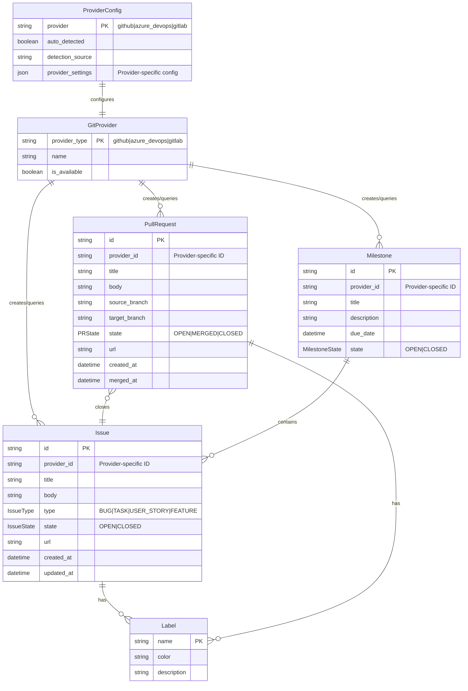

# Data Model: Git Provider Abstraction Layer

**Feature**: 044-git-provider-abstraction
**Date**: 2026-01-22
**Status**: Complete

## Entity Relationship Diagram



## Entity Definitions

### GitProvider (Abstract Interface)

The base interface that all git providers must implement.

| Attribute | Type | Description |
|-----------|------|-------------|
| `provider_type` | `str` | Provider identifier: `github`, `azure_devops`, `gitlab` |
| `name` | `str` | Human-readable name |
| `is_available` | `bool` | Whether the provider is properly configured |

**Operations**:
- `create_issue(request: IssueCreateRequest) -> Issue`
- `get_issue(id: str) -> Issue`
- `list_issues(filters: IssueFilters) -> list[Issue]`
- `update_issue(id: str, updates: IssueUpdateRequest) -> Issue`
- `create_pull_request(request: PRCreateRequest) -> PullRequest`
- `get_pull_request(id: str) -> PullRequest`
- `list_pull_requests(filters: PRFilters) -> list[PullRequest]`
- `create_milestone(request: MilestoneCreateRequest) -> Milestone`
- `list_milestones() -> list[Milestone]`

### Issue

A unified representation of issues across providers.

| Attribute | Type | Required | Description |
|-----------|------|----------|-------------|
| `id` | `str` | Yes | Unified identifier (format: `{provider}:{provider_id}`) |
| `provider_id` | `str` | Yes | Provider-specific identifier |
| `title` | `str` | Yes | Issue title |
| `body` | `str` | No | Issue description/body (markdown) |
| `type` | `IssueType` | Yes | Unified type classification |
| `state` | `IssueState` | Yes | Current state |
| `labels` | `list[Label]` | No | Associated labels |
| `milestone` | `Milestone` | No | Associated milestone |
| `url` | `str` | Yes | Web URL to view the issue |
| `created_at` | `datetime` | Yes | Creation timestamp |
| `updated_at` | `datetime` | Yes | Last update timestamp |

**Provider Mappings**:

| Attribute | GitHub | Azure DevOps | GitLab |
|-----------|--------|--------------|--------|
| `id` | `github:{number}` | `ado:{work_item_id}` | `gitlab:{iid}` |
| `provider_id` | Issue number | Work item ID | Issue IID |
| `type` | From labels | Work item type | From labels |
| `state` | `open`/`closed` | State field | `opened`/`closed` |

### IssueType (Enum)

```python
class IssueType(Enum):
    BUG = "bug"
    TASK = "task"
    USER_STORY = "user_story"
    FEATURE = "feature"
    EPIC = "epic"
```

**Provider Type Mappings**:

| Unified Type | GitHub Labels | Azure DevOps Type | GitLab Labels |
|--------------|---------------|-------------------|---------------|
| `BUG` | `bug` | `Bug` | `bug` |
| `TASK` | `task`, `chore` | `Task` | `task` |
| `USER_STORY` | `enhancement` | `User Story` | `feature` |
| `FEATURE` | `feature` | `Feature` | `feature` |
| `EPIC` | `epic` | `Epic` | `epic` |

### IssueState (Enum)

```python
class IssueState(Enum):
    OPEN = "open"
    CLOSED = "closed"
```

### PullRequest

A unified representation of pull requests / merge requests.

| Attribute | Type | Required | Description |
|-----------|------|----------|-------------|
| `id` | `str` | Yes | Unified identifier |
| `provider_id` | `str` | Yes | Provider-specific identifier |
| `title` | `str` | Yes | PR title |
| `body` | `str` | No | PR description (markdown) |
| `source_branch` | `str` | Yes | Source branch name |
| `target_branch` | `str` | Yes | Target branch name |
| `state` | `PRState` | Yes | Current state |
| `labels` | `list[Label]` | No | Associated labels |
| `closes_issues` | `list[Issue]` | No | Issues that will be closed on merge |
| `url` | `str` | Yes | Web URL to view the PR |
| `created_at` | `datetime` | Yes | Creation timestamp |
| `merged_at` | `datetime` | No | Merge timestamp (if merged) |

**Provider Mappings**:

| Attribute | GitHub | Azure DevOps | GitLab |
|-----------|--------|--------------|--------|
| `id` | `github:pr:{number}` | `ado:pr:{id}` | `gitlab:mr:{iid}` |
| `source_branch` | `head.ref` | `sourceRefName` | `source_branch` |
| `target_branch` | `base.ref` | `targetRefName` | `target_branch` |

### PRState (Enum)

```python
class PRState(Enum):
    OPEN = "open"
    MERGED = "merged"
    CLOSED = "closed"  # Closed without merging
```

### Milestone

A unified representation of milestones / iterations / sprints.

| Attribute | Type | Required | Description |
|-----------|------|----------|-------------|
| `id` | `str` | Yes | Unified identifier |
| `provider_id` | `str` | Yes | Provider-specific identifier |
| `title` | `str` | Yes | Milestone title |
| `description` | `str` | No | Milestone description |
| `due_date` | `datetime` | No | Target completion date |
| `state` | `MilestoneState` | Yes | Current state |
| `issue_count` | `int` | No | Number of associated issues |
| `closed_issue_count` | `int` | No | Number of closed issues |

**Provider Mappings**:

| Attribute | GitHub | Azure DevOps | GitLab |
|-----------|--------|--------------|--------|
| Concept | Milestone | Iteration/Sprint | Milestone |
| `id` | `github:ms:{number}` | `ado:iter:{id}` | `gitlab:ms:{id}` |
| `due_date` | `due_on` | `finishDate` | `due_date` |

### MilestoneState (Enum)

```python
class MilestoneState(Enum):
    OPEN = "open"
    CLOSED = "closed"
```

### Label

A unified representation of labels / tags.

| Attribute | Type | Required | Description |
|-----------|------|----------|-------------|
| `name` | `str` | Yes | Label name |
| `color` | `str` | No | Hex color code (e.g., `#ff0000`) |
| `description` | `str` | No | Label description |

### ProviderConfig

Configuration for a git provider.

| Attribute | Type | Required | Description |
|-----------|------|----------|-------------|
| `provider` | `str` | Yes | Provider type |
| `auto_detected` | `bool` | Yes | Whether config was auto-detected |
| `detection_source` | `str` | No | How provider was detected |
| `github` | `GitHubConfig` | No | GitHub-specific settings |
| `azure_devops` | `AzureDevOpsConfig` | No | Azure DevOps settings |
| `gitlab` | `GitLabConfig` | No | GitLab-specific settings |

### GitHubConfig

```python
@dataclass
class GitHubConfig:
    auth_method: str = "gh_cli"  # or "token"
    enterprise_host: str | None = None
```

### AzureDevOpsConfig

```python
@dataclass
class AzureDevOpsConfig:
    organization: str
    project: str
    auth_method: str = "pat"  # Personal Access Token
    api_version: str = "7.0"
```

### GitLabConfig

```python
@dataclass
class GitLabConfig:
    host: str = "gitlab.com"
    auth_method: str = "token"
```

## Request/Response Models

### IssueCreateRequest

```python
@dataclass
class IssueCreateRequest:
    title: str
    body: str | None = None
    type: IssueType = IssueType.TASK
    labels: list[str] = field(default_factory=list)
    milestone_id: str | None = None
```

### IssueUpdateRequest

```python
@dataclass
class IssueUpdateRequest:
    title: str | None = None
    body: str | None = None
    state: IssueState | None = None
    labels: list[str] | None = None
    milestone_id: str | None = None
```

### IssueFilters

```python
@dataclass
class IssueFilters:
    state: IssueState | None = None
    labels: list[str] | None = None
    milestone_id: str | None = None
    type: IssueType | None = None
```

### PRCreateRequest

```python
@dataclass
class PRCreateRequest:
    title: str
    body: str | None = None
    source_branch: str
    target_branch: str = "main"
    labels: list[str] = field(default_factory=list)
    closes_issues: list[str] = field(default_factory=list)  # Issue IDs
```

### MilestoneCreateRequest

```python
@dataclass
class MilestoneCreateRequest:
    title: str
    description: str | None = None
    due_date: datetime | None = None
```

## Validation Rules

### Issue
- `title` must be non-empty and <= 256 characters
- `body` must be <= 65536 characters (GitHub limit)
- `type` must be a valid `IssueType`

### PullRequest
- `title` must be non-empty and <= 256 characters
- `source_branch` and `target_branch` must be valid branch names
- `source_branch` must differ from `target_branch`

### Milestone
- `title` must be non-empty and <= 256 characters
- `due_date` should be in the future (warning if past)
