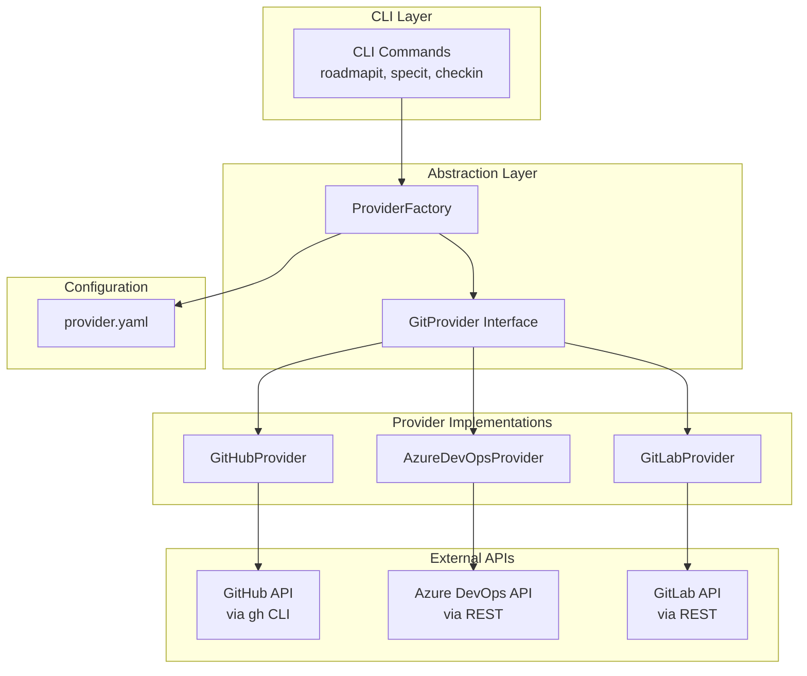

# Implementation Plan: Git Provider Abstraction Layer

**Branch**: `044-git-provider-abstraction` | **Date**: 2026-01-22 | **Spec**: [spec.md](./spec.md)
**Input**: Feature specification from `/specs/044-git-provider-abstraction/spec.md`

## Summary

Create a unified abstraction layer that enables the doit CLI to work with multiple git hosting providers (GitHub, Azure DevOps, GitLab) through a single consistent interface. The abstraction follows a Strategy pattern where each provider implements a common interface, allowing the CLI commands to remain provider-agnostic while supporting provider-specific behaviors through configuration.

## Technical Context

**Language/Version**: Python 3.11+
**Primary Dependencies**: Typer (CLI), Rich (output), httpx (HTTP client), pytest (testing)
**Storage**: File-based (`.doit/config/provider.yaml` for provider settings)
**Testing**: pytest with unit and integration tests
**Target Platform**: Cross-platform CLI (Linux, macOS, Windows)
**Project Type**: single (CLI application)
**Performance Goals**: Provider API calls complete within 5 seconds under normal conditions
**Constraints**: Must maintain backward compatibility with existing GitHub-based commands
**Scale/Scope**: 3 providers (GitHub, Azure DevOps, GitLab stub), 6 core operations per provider

## Architecture Overview

<!-- BEGIN:AUTO-GENERATED section="architecture" -->

<!-- END:AUTO-GENERATED -->

## Constitution Check

*GATE: Must pass before Phase 0 research. Re-check after Phase 1 design.*

| Principle | Status | Notes |
|-----------|--------|-------|
| I. Specification-First | ✅ Pass | Spec completed before planning |
| II. Persistent Memory | ✅ Pass | Provider config stored in `.doit/config/` |
| III. Auto-Generated Diagrams | ✅ Pass | Plan includes Mermaid diagrams |
| IV. Opinionated Workflow | ✅ Pass | Follows specit → planit → taskit flow |
| V. AI-Native Design | ✅ Pass | Commands remain slash-command compatible |

**Tech Stack Alignment**:

| Requirement | Constitution | This Feature | Status |
|-------------|--------------|--------------|--------|
| Language | Python 3.11+ | Python 3.11+ | ✅ Aligned |
| CLI Framework | Typer | Typer | ✅ Aligned |
| HTTP Client | httpx | httpx | ✅ Aligned |
| Testing | pytest | pytest | ✅ Aligned |
| Storage | File-based markdown | File-based YAML | ✅ Aligned |

## Project Structure

### Documentation (this feature)

```text
specs/044-git-provider-abstraction/
├── spec.md              # Feature specification
├── plan.md              # This file
├── research.md          # Phase 0 output - design decisions
├── data-model.md        # Phase 1 output - entity definitions
├── quickstart.md        # Phase 1 output - implementation guide
├── contracts/           # Phase 1 output - interface definitions
│   └── provider_interface.py
├── checklists/
│   └── requirements.md  # Spec quality checklist
└── tasks.md             # Phase 2 output (created by /doit.taskit)
```

### Source Code (repository root)

```text
src/doit_cli/
├── models/
│   ├── provider_models.py      # NEW: Provider-agnostic data models
│   ├── github_epic.py          # EXISTING: Keep for backward compat
│   └── github_feature.py       # EXISTING: Keep for backward compat
├── services/
│   ├── providers/              # NEW: Provider implementations
│   │   ├── __init__.py
│   │   ├── base.py             # GitProvider abstract base class
│   │   ├── github.py           # GitHub implementation (refactored)
│   │   ├── azure_devops.py     # Azure DevOps implementation
│   │   └── gitlab.py           # GitLab stub implementation
│   ├── provider_factory.py     # NEW: Factory for provider instances
│   ├── provider_config.py      # NEW: Configuration management
│   └── github_service.py       # REFACTOR: Delegate to providers/github.py
├── cli/
│   └── provider.py             # NEW: doit provider commands
└── utils/
    ├── github_auth.py          # EXISTING: Keep for GitHub
    └── provider_auth.py        # NEW: Provider-agnostic auth utilities

tests/
├── unit/
│   ├── test_provider_factory.py
│   ├── test_provider_config.py
│   └── providers/
│       ├── test_github_provider.py
│       ├── test_azure_devops_provider.py
│       └── test_gitlab_provider.py
└── integration/
    └── test_provider_integration.py
```

**Structure Decision**: Single project structure (CLI application). New code added under `services/providers/` with a factory pattern. Existing `github_service.py` will be refactored to delegate to the new provider abstraction while maintaining backward compatibility.

## Implementation Phases

### Phase 1: Foundation (P1 - Configure Git Provider)

1. Define `GitProvider` abstract base class with core operations
2. Create `ProviderConfig` for configuration management
3. Create `ProviderFactory` for instantiating providers
4. Add `doit provider configure` CLI command
5. Auto-detect provider from git remote URL

### Phase 2: GitHub Migration (P1 - Create Issues)

1. Create `GitHubProvider` by extracting from `GitHubService`
2. Implement unified `Issue`, `PullRequest`, `Milestone` models
3. Update existing commands to use provider abstraction
4. Maintain backward compatibility (existing tests must pass)

### Phase 3: Azure DevOps (P2)

1. Implement `AzureDevOpsProvider` with REST API
2. Handle Azure DevOps-specific concepts (work items, iterations)
3. Implement label/tag translation
4. Add Azure DevOps authentication (PAT-based)

### Phase 4: GitLab Stub (P3)

1. Create `GitLabProvider` stub with NotImplemented warnings
2. Document GitLab API requirements for future implementation
3. Graceful degradation when GitLab operations attempted

### Phase 5: Polish

1. Error handling and rate limiting
2. Offline mode support
3. Documentation and examples
4. Integration tests across providers

## Complexity Tracking

No constitution violations requiring justification. Feature uses approved tech stack and follows established patterns.

## Dependencies

| Dependency | Type | Notes |
|------------|------|-------|
| httpx | Existing | Already in constitution |
| PyYAML | Existing | For provider.yaml config |
| gh CLI | External | Required for GitHub provider |
| Azure CLI | External | Optional, can use PAT instead |

## Risks and Mitigations

| Risk | Impact | Mitigation |
|------|--------|------------|
| Azure DevOps API differences | Medium | Label translation layer, comprehensive mapping tests |
| Breaking existing GitHub workflows | High | Maintain GitHubService facade, full regression testing |
| Authentication complexity | Medium | Clear documentation, interactive wizard |
