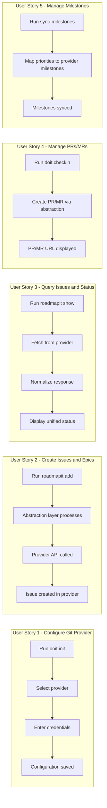
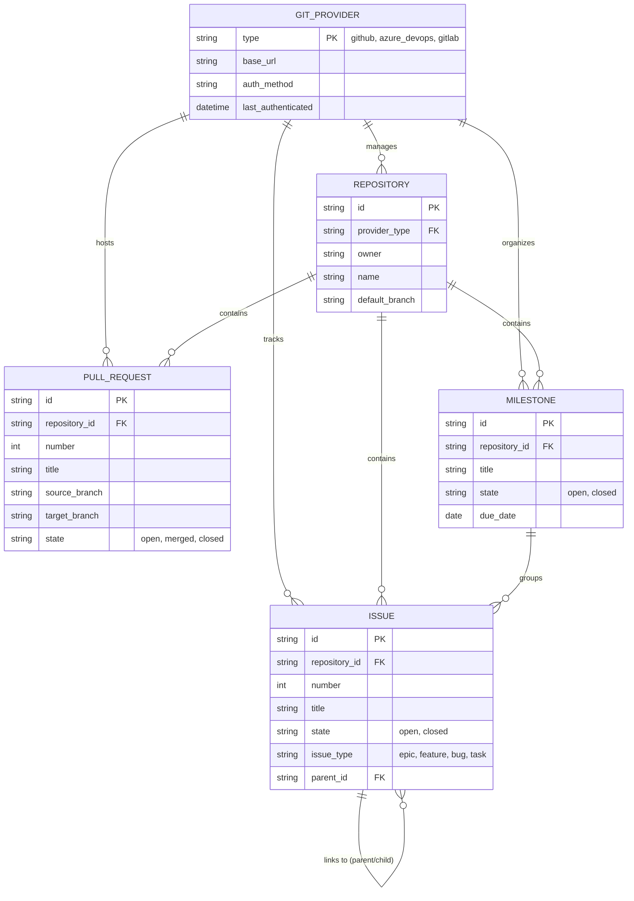

# Feature Specification: Git Provider Abstraction Layer

**Feature Branch**: `[044-git-provider-abstraction]`
**Created**: 2026-01-22
**Status**: Complete
**Input**: User description: "Git provider abstraction layer - Create a unified interface for git providers (GitHub, Azure DevOps, GitLab) to enable easier addition of future providers and consistent behavior across platforms"

## Summary

Create a unified abstraction layer that enables the doit CLI to work with multiple git hosting providers (GitHub, Azure DevOps, GitLab) through a single consistent interface. This eliminates provider-specific code scattered throughout the CLI and enables easy addition of new providers without modifying existing commands.

## User Scenarios & Testing *(mandatory)*

### User Story 1 - Configure Git Provider (Priority: P1)

A developer setting up doit for a new project needs to specify which git provider they are using so the CLI knows how to interact with their repository for issues, epics, and pull requests.

**Why this priority**: Without provider configuration, no provider-specific features can work. This is the foundation for all other functionality.

**Independent Test**: Can be fully tested by configuring a provider and verifying the configuration is persisted and loaded correctly on subsequent CLI invocations.

**Acceptance Scenarios**:

1. **Given** a project without provider configuration, **When** the user runs `doit init` or `doit provider configure`, **Then** they are prompted to select their git provider (GitHub, Azure DevOps, GitLab, or None)
2. **Given** a project with a GitHub remote URL, **When** the user runs provider configuration, **Then** GitHub is auto-detected and suggested as the default provider
3. **Given** a user selects a provider, **When** configuration completes, **Then** the provider choice is saved to `.doit/config/provider.yaml`
4. **Given** invalid or unsupported provider credentials, **When** configuration is attempted, **Then** a clear error message explains what is missing or incorrect

---

### User Story 2 - Create Issues and Epics (Priority: P1)

A developer using `/doit.specit` or `doit roadmapit add` wants to create issues and epics in their git provider's issue tracker, regardless of which provider they use.

**Why this priority**: Issue creation is one of the most frequent provider interactions. The abstraction must handle this core use case reliably.

**Independent Test**: Can be fully tested by creating an epic and issue through the abstraction layer and verifying they appear correctly in the provider's web interface.

**Acceptance Scenarios**:

1. **Given** a configured provider, **When** `doit roadmapit add` creates an epic, **Then** the epic is created in the provider's issue system with correct labels
2. **Given** a configured provider, **When** `/doit.specit` creates feature issues, **Then** issues are created with appropriate linking (parent/child, epic references)
3. **Given** different label naming conventions across providers, **When** an issue is created, **Then** labels are translated to the provider's format (e.g., GitHub labels vs Azure DevOps tags)
4. **Given** no provider configured, **When** issue creation is attempted, **Then** a helpful message explains how to configure a provider

---

### User Story 3 - Query Issues and Status (Priority: P2)

A developer running `doit roadmapit show` or `doit team status` wants to see issue status and synchronization information from their git provider.

**Why this priority**: Reading issue status is important but secondary to creating issues. Projects can function with local-only tracking if needed.

**Independent Test**: Can be fully tested by querying existing issues through the abstraction and verifying the returned data matches what's visible in the provider's web interface.

**Acceptance Scenarios**:

1. **Given** a configured provider with existing epics, **When** `doit roadmapit show` runs, **Then** epic status (open/closed) is fetched and displayed
2. **Given** a repository with multiple issues, **When** issues are queried, **Then** results include consistent fields (number, title, state, labels) regardless of provider
3. **Given** a provider API rate limit is exceeded, **When** a query is attempted, **Then** the system handles the rate limit gracefully with clear messaging

---

### User Story 4 - Manage Pull Requests / Merge Requests (Priority: P2)

A developer using `/doit.checkin` wants to create pull requests (GitHub, GitLab) or merge requests (Azure DevOps) to submit their completed feature for review.

**Why this priority**: PR/MR creation is the final step of the feature workflow. It's important but occurs less frequently than issue operations.

**Independent Test**: Can be fully tested by creating a PR/MR through the abstraction and verifying it appears correctly in the provider with correct target branch and description.

**Acceptance Scenarios**:

1. **Given** a configured provider, **When** `/doit.checkin` creates a PR/MR, **Then** it is created with the correct source branch, target branch, and description
2. **Given** GitHub, GitLab, or Azure DevOps, **When** a PR/MR is created, **Then** the terminology and URLs in output match the provider (PR for GitHub/GitLab, MR for Azure DevOps)
3. **Given** a PR/MR is created successfully, **When** the command completes, **Then** the PR/MR URL is displayed for the user to open

---

### User Story 5 - Manage Milestones (Priority: P3)

A developer using `doit roadmapit sync-milestones` wants to synchronize priority-based milestones with their git provider's milestone or iteration system.

**Why this priority**: Milestone management is a convenience feature that enhances project tracking but isn't essential for core workflow.

**Independent Test**: Can be fully tested by syncing milestones and verifying they appear correctly in the provider's project board or milestone list.

**Acceptance Scenarios**:

1. **Given** a configured provider, **When** `doit roadmapit sync-milestones` runs, **Then** milestones are created or updated in the provider's system
2. **Given** Azure DevOps uses "iterations" instead of "milestones", **When** milestone sync runs, **Then** the abstraction maps to the correct Azure DevOps concept
3. **Given** a milestone already exists in the provider, **When** sync runs, **Then** the existing milestone is updated rather than duplicated

---

### Edge Cases

- What happens when the provider API is unreachable (network issues)?
  - System operates in offline mode with clear indication; commands that require provider access fail gracefully with specific error messages
- How does the system handle provider authentication expiration?
  - Clear error message with instructions to re-authenticate; no silent failures
- What happens when a user switches providers mid-project?
  - Warning about existing provider data; option to migrate or start fresh
- How are provider-specific features that don't exist in all providers handled?
  - Features gracefully degrade; e.g., if a provider doesn't support labels, a warning is shown but the operation continues

## User Journey Visualization

<!-- BEGIN:AUTO-GENERATED section="user-journey" -->

<!-- END:AUTO-GENERATED -->

## Entity Relationships

<!-- BEGIN:AUTO-GENERATED section="entity-relationships" -->

<!-- END:AUTO-GENERATED -->

## Requirements *(mandatory)*

### Functional Requirements

#### Provider Interface

- **FR-001**: System MUST define a unified provider interface with operations: create_issue, get_issue, list_issues, create_pull_request, get_pull_request, create_milestone, list_milestones
- **FR-002**: System MUST support provider implementations for GitHub, Azure DevOps, and GitLab (GitLab may be stub initially)
- **FR-003**: System MUST auto-detect the provider type from the git remote URL when possible
- **FR-004**: System MUST allow explicit provider configuration override regardless of remote URL detection

#### Configuration

- **FR-005**: System MUST store provider configuration in `.doit/config/provider.yaml`
- **FR-006**: System MUST support authentication via environment variables, credential files, or interactive prompts
- **FR-007**: System MUST validate provider credentials on configuration and provide clear error messages for failures
- **FR-008**: System MUST NOT store sensitive credentials in plain text in configuration files (use credential helpers or environment variables)

#### Issue Management

- **FR-009**: System MUST create issues with: title, body, labels, and optional parent issue reference
- **FR-010**: System MUST query issues with filtering by: state (open/closed), labels, and milestone
- **FR-011**: System MUST translate label names between providers when necessary (e.g., "epic" label on GitHub vs "Epic" work item type on Azure DevOps)
- **FR-012**: System MUST support linking issues to parent epics using provider-specific mechanisms

#### Pull Request / Merge Request

- **FR-013**: System MUST create PRs/MRs with: title, body, source branch, target branch
- **FR-014**: System MUST return the PR/MR URL for user reference
- **FR-015**: System MUST use provider-appropriate terminology in user-facing messages (PR vs MR)

#### Milestone Management

- **FR-016**: System MUST create and update milestones with: title, description, due date
- **FR-017**: System MUST map doit priority levels (P1-P4) to milestone titles consistently across providers
- **FR-018**: System MUST handle provider-specific milestone concepts (GitHub milestones, Azure DevOps iterations, GitLab milestones)

#### Error Handling

- **FR-019**: System MUST handle API rate limits with exponential backoff and clear user messaging
- **FR-020**: System MUST provide actionable error messages for authentication failures
- **FR-021**: System MUST operate gracefully when provider is unavailable (offline mode for local-only operations)

### Key Entities

- **GitProvider**: Abstract interface representing a git hosting provider; defines operations for issues, PRs, and milestones
- **ProviderConfig**: Configuration data for a specific provider including authentication method and base URL
- **Repository**: Unified representation of a git repository with owner, name, and provider reference
- **Issue**: Unified representation of an issue/work item with number, title, state, labels, and parent reference
- **PullRequest**: Unified representation of a PR/MR with number, title, branches, and state
- **Milestone**: Unified representation of a milestone/iteration with title, state, and due date

## Success Criteria *(mandatory)*

### Measurable Outcomes

- **SC-001**: All existing GitHub-specific doit commands work without modification through the abstraction layer
- **SC-002**: Adding a new provider implementation requires changes only in the provider layer (no modifications to existing commands)
- **SC-003**: Issue creation succeeds on configured provider within 5 seconds under normal network conditions
- **SC-004**: Provider configuration completes in under 2 minutes including authentication
- **SC-005**: 100% of provider-specific API calls are routed through the abstraction layer (no direct provider calls in commands)
- **SC-006**: Clear, actionable error messages are shown for all authentication and API failures
- **SC-007**: Offline operations (local-only commands) work without any provider configuration

## Assumptions

- Users have accounts on their chosen git provider with appropriate permissions
- Network connectivity is available for provider operations (offline mode handles unavailability gracefully)
- The `gh` CLI is available for GitHub (existing dependency); Azure DevOps and GitLab may use REST APIs directly
- Provider APIs are reasonably stable and backwards compatible
- Users understand basic git concepts (remotes, branches, PRs)

## Out of Scope

- Full GitLab implementation (stub with warning is acceptable for this feature)
- Migration tools to move issues between providers
- Bi-directional sync between multiple providers
- Support for self-hosted provider instances (may be added later)
- Git operations (clone, push, pull) - only issue/PR/milestone management is abstracted

## Dependencies

- Existing GitHub service implementation (will be refactored into provider pattern)
- Python httpx library for REST API calls
- Provider authentication mechanisms (gh CLI for GitHub, PAT for Azure DevOps)
