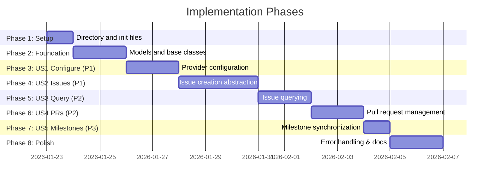

# Tasks: Git Provider Abstraction Layer

**Input**: Design documents from `/specs/044-git-provider-abstraction/`
**Prerequisites**: plan.md ✓, spec.md ✓, research.md ✓, data-model.md ✓, contracts/ ✓

**Tests**: Not explicitly requested in specification - tests excluded by default.

**Organization**: Tasks are grouped by user story to enable independent implementation and testing of each story.

## Task Dependencies

```mermaid
flowchart TD
    subgraph "Phase 1: Setup"
        T001[T001: Directory structure]
        T002[T002: __init__.py files]
    end

    subgraph "Phase 2: Foundation"
        T003[T003: Provider models]
        T004[T004: Exception hierarchy]
        T005[T005: GitProvider base]
        T006[T006: ProviderFactory]
        T007[T007: ProviderConfig]
    end

    subgraph "Phase 3: US1 - Configure Provider"
        T008[T008: Provider detection]
        T009[T009: CLI configure cmd]
        T010[T010: CLI status cmd]
        T011[T011: Integration tests]
    end

    subgraph "Phase 4: US2 - Create Issues"
        T012[T012: GitHub create_issue]
        T013[T013: GitHub label mapping]
        T014[T014: ADO create_issue]
        T015[T015: ADO label mapping]
        T016[T016: GitLab stub]
        T017[T017: Update github_service]
    end

    subgraph "Phase 5: US3 - Query Issues"
        T018[T018: GitHub list_issues]
        T019[T019: GitHub get_issue]
        T020[T020: ADO list_issues]
        T021[T021: ADO get_issue]
    end

    subgraph "Phase 6: US4 - Pull Requests"
        T022[T022: GitHub create_pr]
        T023[T023: GitHub get_pr]
        T024[T024: ADO create_pr]
        T025[T025: ADO get_pr]
    end

    subgraph "Phase 7: US5 - Milestones"
        T026[T026: GitHub milestones]
        T027[T027: ADO iterations]
    end

    subgraph "Phase 8: Polish"
        T028[T028: Rate limiting]
        T029[T029: Offline mode]
        T030[T030: Error messages]
        T031[T031: Documentation]
    end

    T001 --> T002 --> T003
    T003 --> T004 & T005
    T004 & T005 --> T006 & T007
    T006 & T007 --> T008
    T008 --> T009 & T010
    T009 & T010 --> T011
    T011 --> T012
    T012 --> T013 --> T014
    T014 --> T015 --> T016 --> T017
    T017 --> T018
    T018 --> T019 --> T020 --> T021
    T021 --> T022
    T022 --> T023 --> T024 --> T025
    T025 --> T026 --> T027
    T027 --> T028 --> T029 --> T030 --> T031
```

<!-- BEGIN:AUTO-GENERATED section="task-dependencies" -->

<!-- END:AUTO-GENERATED -->

## Phase Timeline

<!-- BEGIN:AUTO-GENERATED section="phase-timeline" -->

<!-- END:AUTO-GENERATED -->

## Format: `[ID] [P?] [Story] Description`

- **[P]**: Can run in parallel (different files, no dependencies)
- **[Story]**: Which user story this task belongs to (e.g., US1, US2, US3)
- Include exact file paths in descriptions

## Path Conventions

- **Project type**: Single CLI application
- **Source**: `src/doit_cli/`
- **Tests**: `tests/`

---

## Phase 1: Setup (Shared Infrastructure)

**Purpose**: Create directory structure for provider abstraction

- [x] T001 Create provider directory structure: `src/doit_cli/services/providers/`
- [x] T002 [P] Create `__init__.py` files for new modules in `src/doit_cli/services/providers/__init__.py` and `src/doit_cli/models/__init__.py`

---

## Phase 2: Foundational (Blocking Prerequisites)

**Purpose**: Core infrastructure that MUST be complete before ANY user story can be implemented

**⚠️ CRITICAL**: No user story work can begin until this phase is complete

- [x] T003 Create provider-agnostic data models (Issue, PullRequest, Milestone, Label, enums) in `src/doit_cli/models/provider_models.py` based on data-model.md
- [x] T004 [P] Create exception hierarchy (ProviderError, AuthenticationError, RateLimitError, ResourceNotFoundError, ValidationError, NetworkError) in `src/doit_cli/services/providers/exceptions.py`
- [x] T005 [P] Create GitProvider abstract base class with all operations in `src/doit_cli/services/providers/base.py` based on contracts/provider_interface.py
- [x] T006 Create ProviderFactory with auto-detection logic in `src/doit_cli/services/provider_factory.py`
- [x] T007 [P] Create ProviderConfig for YAML configuration management in `src/doit_cli/services/provider_config.py`

**Checkpoint**: Foundation ready - user story implementation can now begin

---

## Phase 3: User Story 1 - Configure Git Provider (Priority: P1) 🎯 MVP

**Goal**: Enable developers to specify and configure their git provider so CLI knows how to interact with their repository

**Independent Test**: Configure a provider and verify the configuration is persisted and loaded correctly on subsequent CLI invocations

### Implementation for User Story 1

- [x] T008 [US1] Implement provider auto-detection from git remote URL in `src/doit_cli/services/provider_factory.py` (detect GitHub, Azure DevOps, GitLab patterns)
- [x] T009 [US1] Create `doit provider configure` CLI command with interactive provider selection in `src/doit_cli/cli/provider.py`
- [x] T010 [P] [US1] Create `doit provider status` CLI command to show current provider configuration in `src/doit_cli/cli/provider.py`
- [x] T011 [US1] Add provider commands to main CLI app in `src/doit_cli/cli/main.py`

**Checkpoint**: User Story 1 complete - users can configure and verify their git provider

---

## Phase 4: User Story 2 - Create Issues and Epics (Priority: P1)

**Goal**: Enable issue/epic creation through abstraction layer regardless of provider

**Independent Test**: Create an epic and issue through the abstraction layer and verify they appear correctly in the provider's web interface

### Implementation for User Story 2

- [x] T012 [US2] Implement `create_issue` method in GitHubProvider using gh CLI in `src/doit_cli/services/providers/github.py`
- [x] T013 [US2] Implement label translation for GitHub (epic labels, priority mapping) in `src/doit_cli/services/providers/github.py`
- [x] T014 [US2] Implement `create_issue` method in AzureDevOpsProvider using REST API in `src/doit_cli/services/providers/azure_devops.py`
- [x] T015 [US2] Implement label/tag translation for Azure DevOps (work item types, tags) in `src/doit_cli/services/providers/azure_devops.py`
- [x] T016 [P] [US2] Create GitLabProvider stub with NotImplementedError and guidance in `src/doit_cli/services/providers/gitlab.py`
- [x] T017 [US2] Refactor existing `github_service.py` to delegate to GitHubProvider while maintaining backward compatibility in `src/doit_cli/services/github_service.py`

**Checkpoint**: User Story 2 complete - issues can be created through abstraction on GitHub and Azure DevOps

---

## Phase 5: User Story 3 - Query Issues and Status (Priority: P2)

**Goal**: Enable querying issue status from git provider for display in CLI commands

**Independent Test**: Query existing issues through the abstraction and verify returned data matches provider's web interface

### Implementation for User Story 3

- [x] T018 [US3] Implement `list_issues` method in GitHubProvider with filtering support in `src/doit_cli/services/providers/github.py`
- [x] T019 [P] [US3] Implement `get_issue` method in GitHubProvider in `src/doit_cli/services/providers/github.py`
- [x] T020 [US3] Implement `list_issues` method in AzureDevOpsProvider with work item query in `src/doit_cli/services/providers/azure_devops.py`
- [x] T021 [P] [US3] Implement `get_issue` method in AzureDevOpsProvider in `src/doit_cli/services/providers/azure_devops.py`

**Checkpoint**: User Story 3 complete - issue status can be queried and displayed

---

## Phase 6: User Story 4 - Manage Pull Requests / Merge Requests (Priority: P2)

**Goal**: Enable PR/MR creation through abstraction for `/doit.checkin` workflow

**Independent Test**: Create a PR/MR through the abstraction and verify it appears correctly in the provider with correct branches and description

### Implementation for User Story 4

- [x] T022 [US4] Implement `create_pull_request` method in GitHubProvider using gh CLI in `src/doit_cli/services/providers/github.py`
- [x] T023 [P] [US4] Implement `get_pull_request` and `list_pull_requests` methods in GitHubProvider in `src/doit_cli/services/providers/github.py`
- [x] T024 [US4] Implement `create_pull_request` method in AzureDevOpsProvider using REST API in `src/doit_cli/services/providers/azure_devops.py`
- [x] T025 [P] [US4] Implement `get_pull_request` and `list_pull_requests` methods in AzureDevOpsProvider in `src/doit_cli/services/providers/azure_devops.py`

**Checkpoint**: User Story 4 complete - PRs/MRs can be created through abstraction

---

## Phase 7: User Story 5 - Manage Milestones (Priority: P3)

**Goal**: Enable milestone synchronization with provider's milestone/iteration system

**Independent Test**: Sync milestones and verify they appear correctly in provider's project board or milestone list

### Implementation for User Story 5

- [x] T026 [US5] Implement milestone operations (`create_milestone`, `get_milestone`, `list_milestones`) in GitHubProvider in `src/doit_cli/services/providers/github.py`
- [x] T027 [US5] Implement iteration operations (mapped as milestones) in AzureDevOpsProvider in `src/doit_cli/services/providers/azure_devops.py`

**Checkpoint**: User Story 5 complete - milestones can be synced across providers

---

## Phase 8: Polish & Cross-Cutting Concerns

**Purpose**: Improvements that affect multiple user stories

- [x] T028 Implement rate limit handling with exponential backoff in `src/doit_cli/services/providers/base.py`
- [x] T029 [P] Implement offline mode graceful degradation in `src/doit_cli/services/provider_factory.py`
- [x] T030 [P] Improve error messages for authentication failures in `src/doit_cli/services/providers/exceptions.py`
- [x] T031 Update documentation with provider configuration guide in `docs/features/044-git-provider-abstraction.md`

---

## Dependencies & Execution Order

### Phase Dependencies

- **Setup (Phase 1)**: No dependencies - can start immediately
- **Foundational (Phase 2)**: Depends on Setup completion - BLOCKS all user stories
- **User Stories (Phase 3-7)**: All depend on Foundational phase completion
  - US1 (Configure) must complete before other user stories
  - US2-US5 can proceed in priority order
- **Polish (Phase 8)**: Depends on all user stories being complete

### User Story Dependencies

- **User Story 1 (P1 - Configure)**: BLOCKS all other stories - configuration required first
- **User Story 2 (P1 - Issues)**: Depends on US1 - can start after US1 completes
- **User Story 3 (P2 - Query)**: Depends on US2 - builds on issue infrastructure
- **User Story 4 (P2 - PRs)**: Can start after US1, independent of US2/US3
- **User Story 5 (P3 - Milestones)**: Can start after US1, independent of US2/US3/US4

### Within Each User Story

- Models before services
- Services before CLI commands
- GitHub implementation before Azure DevOps
- Core implementation before refinements

### Parallel Opportunities

- T003 and T004/T005 can run in parallel (different files)
- T006 and T007 can run in parallel (factory vs config)
- T009 and T010 can run in parallel (different CLI commands)
- T018/T019 and T020/T021 can run in parallel (different providers)
- T022/T023 and T024/T025 can run in parallel (different providers)
- T028, T029, T030 can all run in parallel (different concerns)

---

## Parallel Example: Phase 2 Foundation

```bash
# Launch foundation models in parallel:
Task: "Create provider-agnostic data models in src/doit_cli/models/provider_models.py"

# Then launch exception and base class in parallel:
Task: "Create exception hierarchy in src/doit_cli/services/providers/exceptions.py"
Task: "Create GitProvider abstract base class in src/doit_cli/services/providers/base.py"

# Then launch factory and config in parallel:
Task: "Create ProviderFactory in src/doit_cli/services/provider_factory.py"
Task: "Create ProviderConfig in src/doit_cli/services/provider_config.py"
```

---

## Implementation Strategy

### MVP First (User Story 1 + 2 Only)

1. Complete Phase 1: Setup
2. Complete Phase 2: Foundational (CRITICAL - blocks all stories)
3. Complete Phase 3: User Story 1 (Configure Provider)
4. Complete Phase 4: User Story 2 (Create Issues)
5. **STOP and VALIDATE**: Test issue creation on GitHub and Azure DevOps
6. Existing `doit roadmapit add` should work through abstraction

### Incremental Delivery

1. Complete Setup + Foundational → Foundation ready
2. Add User Story 1 → Provider can be configured → Checkpoint
3. Add User Story 2 → Issues can be created → Deploy/Demo (MVP!)
4. Add User Story 3 → Issues can be queried → Deploy/Demo
5. Add User Story 4 → PRs can be created → Deploy/Demo
6. Add User Story 5 → Milestones can be synced → Deploy/Demo
7. Each story adds value without breaking previous stories

### Backward Compatibility Strategy

- `github_service.py` continues to work as facade
- Existing commands don't need modification
- Provider abstraction is opt-in through configuration

---

## Notes

- [P] tasks = different files, no dependencies
- [Story] label maps task to specific user story for traceability
- Each user story should be independently completable and testable
- Commit after each task or logical group
- Stop at any checkpoint to validate story independently
- GitHub provider uses `gh` CLI (existing pattern)
- Azure DevOps provider uses REST API with httpx
- GitLab is stub only (NotImplementedError with guidance)
