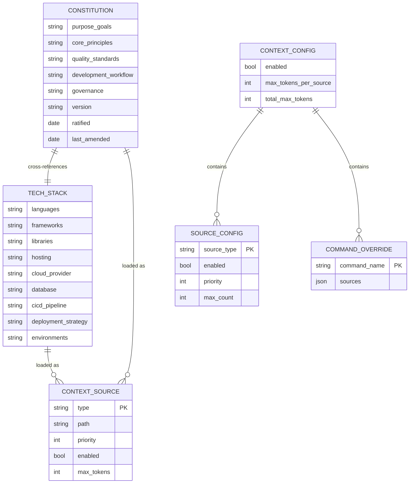
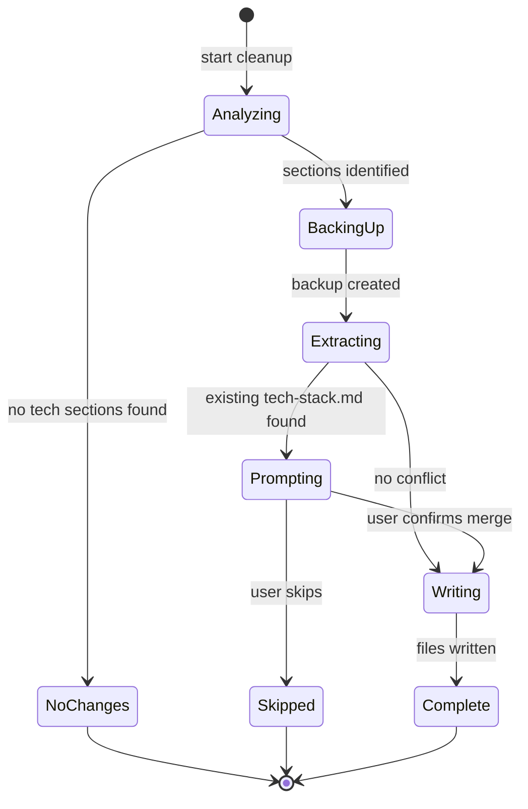

# Data Model: Constitution and Tech Stack Separation

**Feature**: 046-constitution-tech-stack-split
**Date**: 2026-01-22

## Entity Relationship Diagram

<!-- BEGIN:AUTO-GENERATED section="er-diagram" -->

<!-- END:AUTO-GENERATED -->

## Entity Definitions

### Constitution

**Purpose**: Project-level document defining principles, governance, and workflow.

**Location**: `.doit/memory/constitution.md`

| Field | Type | Required | Description |
| ----- | ---- | -------- | ----------- |
| purpose_goals | markdown | Yes | Project purpose and success criteria |
| core_principles | markdown | Yes | Numbered principles (I, II, III, etc.) |
| quality_standards | markdown | Yes | Testing and quality requirements |
| development_workflow | markdown | Yes | Step-by-step workflow process |
| governance | markdown | Yes | Amendment rules and compliance |
| version | semver | Yes | Constitution version (e.g., "1.0.0") |
| ratified | date | Yes | Date constitution was ratified |
| last_amended | date | Yes | Date of last amendment |

**Validation Rules**:
- Must contain all required sections
- Version must follow semantic versioning
- Core principles must be numbered with Roman numerals

---

### TechStack

**Purpose**: Project-level document defining technical implementation choices.

**Location**: `.doit/memory/tech-stack.md`

| Field | Type | Required | Description |
| ----- | ---- | -------- | ----------- |
| languages | markdown | Yes | Primary and secondary languages |
| frameworks | markdown | Yes | Application frameworks |
| libraries | markdown | Yes | Key libraries and dependencies |
| hosting | markdown | Yes | Where the application is hosted |
| cloud_provider | markdown | No | Cloud provider if applicable |
| database | markdown | No | Database technology if applicable |
| cicd_pipeline | markdown | Yes | CI/CD tool and process |
| deployment_strategy | markdown | Yes | Deployment approach |
| environments | markdown | Yes | Environment definitions |

**Validation Rules**:
- Must contain languages section
- Must contain deployment section
- Should include cross-reference to constitution.md

---

### ContextSource

**Purpose**: Represents a loaded context source for AI injection.

**Existing Model**: `src/doit_cli/models/context_config.py`

| Field | Type | Required | Description |
| ----- | ---- | -------- | ----------- |
| type | string | Yes | Source type (constitution, tech_stack, roadmap, etc.) |
| path | Path | Yes | File path to source |
| priority | int | Yes | Loading priority (1 = highest) |
| enabled | bool | Yes | Whether source is enabled |
| max_tokens | int | No | Maximum tokens for this source |

**New Source Type**:
```python
# Add to SourceConfig.get_defaults()
"tech_stack": SourceConfig(
    enabled=True,
    priority=2,  # After constitution (1), before roadmap (3)
    max_count=1,
)
```

---

### CleanupResult

**Purpose**: Result of constitution cleanup operation.

**New Model**: To be created in `src/doit_cli/models/cleanup_models.py`

| Field | Type | Required | Description |
| ----- | ---- | -------- | ----------- |
| backup_path | Path | Yes | Path to backup file |
| extracted_sections | list[str] | Yes | Section names extracted to tech-stack |
| preserved_sections | list[str] | Yes | Section names kept in constitution |
| unclear_sections | list[str] | No | Sections marked for manual review |
| constitution_size_before | int | Yes | Constitution size in bytes before |
| constitution_size_after | int | Yes | Constitution size in bytes after |
| tech_stack_created | bool | Yes | Whether tech-stack.md was created |

---

## State Machines

### CleanupOperation State



## File Templates

### constitution.md Template (Updated)

```markdown
# [PROJECT_NAME] Constitution

> **See also**: [Tech Stack](tech-stack.md) for languages, frameworks, and deployment details.

## Purpose & Goals

### Project Purpose

[PROJECT_DESCRIPTION]

### Success Criteria

- [CRITERION_1]
- [CRITERION_2]

## Core Principles

### I. [PRINCIPLE_1_NAME]

[PRINCIPLE_1_DESCRIPTION]

### II. [PRINCIPLE_2_NAME]

[PRINCIPLE_2_DESCRIPTION]

## Quality Standards

[QUALITY_REQUIREMENTS]

## Development Workflow

1. [STEP_1]
2. [STEP_2]

## Governance

[GOVERNANCE_RULES]

**Version**: 1.0.0 | **Ratified**: [DATE] | **Last Amended**: [DATE]
```

### tech-stack.md Template (New)

```markdown
# [PROJECT_NAME] Tech Stack

> **See also**: [Constitution](constitution.md) for project principles and governance.

## Tech Stack

### Languages

[PRIMARY_LANGUAGE]

### Frameworks

- [FRAMEWORK_1]
- [FRAMEWORK_2]

### Libraries

- [LIBRARY_1]
- [LIBRARY_2]

## Infrastructure

### Hosting

[HOSTING_PLATFORM]

### Cloud Provider

[CLOUD_PROVIDER or "None (local deployment)"]

### Database

[DATABASE or "None (file-based storage)"]

## Deployment

### CI/CD Pipeline

[CICD_TOOL]

### Deployment Strategy

[DEPLOYMENT_APPROACH]

### Environments

- Development (local)
- [ADDITIONAL_ENVIRONMENTS]
```
