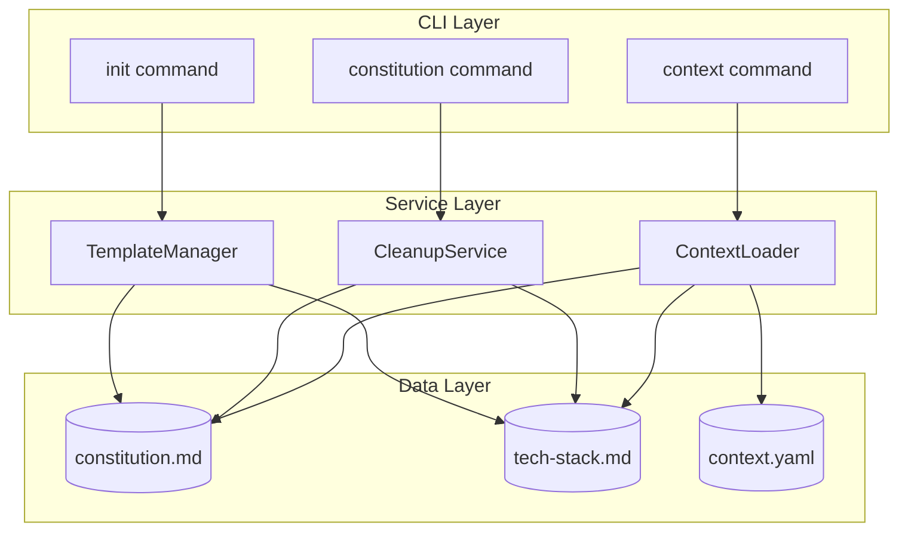

# Implementation Plan: Constitution and Tech Stack Separation

**Branch**: `046-constitution-tech-stack-split` | **Date**: 2026-01-22 | **Spec**: [spec.md](spec.md)
**Input**: Feature specification from `specs/046-constitution-tech-stack-split/spec.md`

## Summary

Separate the monolithic constitution.md file into two focused documents:
1. **constitution.md** - Project principles, governance, quality standards, and workflow
2. **tech-stack.md** - Languages, frameworks, libraries, infrastructure, and deployment

This separation improves AI context efficiency (selective loading) and provides clearer separation of concerns between "how we work" and "what we use."

## Technical Context

**Language/Version**: Python 3.11+
**Primary Dependencies**: Typer (CLI), Rich (terminal formatting), readchar (keyboard input)
**Storage**: File-based markdown in `.doit/memory/`
**Testing**: pytest
**Target Platform**: CLI (Linux, macOS, Windows)
**Project Type**: single
**Performance Goals**: N/A (file-based operations)
**Constraints**: Backward compatibility with existing constitution.md files
**Scale/Scope**: Single-project CLI tool

## Architecture Overview

<!-- BEGIN:AUTO-GENERATED section="architecture" -->

<!-- END:AUTO-GENERATED -->

## Constitution Check

*GATE: Must pass before Phase 0 research. Re-check after Phase 1 design.*

| Principle | Status | Notes |
|-----------|--------|-------|
| I. Specification-First | ✅ PASS | Spec completed with 4 user stories, 16 FRs |
| II. Persistent Memory | ✅ PASS | All data in `.doit/memory/` markdown files |
| III. Auto-Generated Diagrams | ✅ PASS | Mermaid diagrams in spec and plan |
| IV. Opinionated Workflow | ✅ PASS | Following specit → planit → taskit flow |
| V. AI-Native Design | ✅ PASS | Slash command `/doit.constitution cleanup` |

**Tech Stack Alignment**: All technology choices align with constitution tech stack.

## Project Structure

### Documentation (this feature)

```text
specs/046-constitution-tech-stack-split/
├── spec.md              # Feature specification
├── plan.md              # This file
├── research.md          # Phase 0 research findings
├── data-model.md        # Entity definitions
├── quickstart.md        # Implementation quickstart
├── contracts/           # N/A for this feature
├── checklists/
│   └── requirements.md  # Requirements checklist
└── tasks.md             # Implementation tasks (from /doit.taskit)
```

### Source Code (repository root)

```text
src/doit_cli/
├── cli/
│   ├── init_command.py      # Update: create both files during init
│   ├── constitution_command.py  # NEW: cleanup subcommand
│   └── context_command.py   # Update: show tech-stack.md status
├── services/
│   ├── template_manager.py  # Update: copy tech-stack.md template
│   ├── context_loader.py    # Update: load tech-stack.md as source
│   └── cleanup_service.py   # NEW: content separation logic
└── models/
    └── context_config.py    # Update: add tech_stack source config

templates/
├── memory/
│   ├── constitution.md      # Update: remove tech stack sections
│   └── tech-stack.md        # NEW: tech stack template
└── commands/
    ├── doit.planit.md       # Update: reference tech-stack.md
    ├── doit.taskit.md       # Update: reference tech-stack.md
    └── doit.constitution.md # Update: add cleanup subcommand

tests/
├── unit/
│   ├── test_cleanup_service.py  # NEW
│   └── test_context_loader.py   # Update
└── integration/
    └── test_init_command.py     # Update
```

**Structure Decision**: Single project structure following existing doit patterns.

## Complexity Tracking

No violations requiring justification.

## Implementation Phases

### Phase 1: Template Updates (FR-001, FR-002, FR-003, FR-006)

1. Create new `templates/memory/tech-stack.md` template
2. Update `templates/memory/constitution.md` to remove tech stack sections
3. Add cross-references between both templates
4. Update `TemplateManager.MEMORY_TEMPLATES` to include `tech-stack.md`

### Phase 2: Init Command Updates (FR-004, FR-005)

1. Update `run_init()` in `init_command.py` to copy `tech-stack.md`
2. Add workflow step to ask tech stack questions separately (optional)
3. Verify both files are created with proper cross-references

### Phase 3: Cleanup Command (FR-007, FR-008, FR-009, FR-010)

1. Create `CleanupService` in `services/cleanup_service.py`
2. Implement content analysis logic (section headers, keywords)
3. Create backup before modification
4. Handle edge cases (no tech sections, existing tech-stack.md, unclear content)
5. Add `cleanup` subcommand to `constitution_command.py`
6. Update `doit.constitution.md` template with cleanup instructions

### Phase 4: Context Integration (FR-014, FR-015, FR-016)

1. Add `tech_stack` source to `SourceConfig.get_defaults()`
2. Update `ContextLoader` to load `tech-stack.md`
3. Add command overrides for selective loading (specit: no tech-stack, planit: with tech-stack)
4. Update `context show` to display tech-stack.md status
5. Update `context.yaml` template with tech_stack source configuration

### Phase 5: Command Template Updates (FR-011, FR-012, FR-013)

1. Update `doit.planit.md` to reference tech-stack.md for technical research
2. Update `doit.taskit.md` to reference tech-stack.md for implementation details
3. Add fallback logic in templates for legacy projects (constitution-only)

### Phase 6: Testing & Documentation

1. Add unit tests for `CleanupService`
2. Add integration tests for init with separated files
3. Update context loading tests for tech-stack.md source
4. Update docs/tutorials if affected

## Key Decisions

| Decision | Choice | Rationale |
|----------|--------|-----------|
| Cleanup command location | `/doit.constitution cleanup` | Logical grouping with constitution management |
| Backup location | `.doit/memory/constitution.md.bak` | Keep backups in memory directory |
| Content detection | Section headers + keywords | Simple, deterministic approach |
| Default for new init | Both files created | Clean separation from start |
| Legacy fallback | Load constitution.md | Backward compatible |

## Dependencies

- No new external dependencies required
- Uses existing Rich, Typer stack
- File-based operations only

## Risk Assessment

| Risk | Likelihood | Impact | Mitigation |
|------|------------|--------|------------|
| Incorrect content classification | Medium | Low | Backup + manual review markers |
| Breaking existing workflows | Low | Medium | Graceful fallback to constitution.md |
| Context loading regression | Low | High | Comprehensive test coverage |

## Next Steps

After this plan is approved, run `/doit.taskit` to generate implementation tasks.
