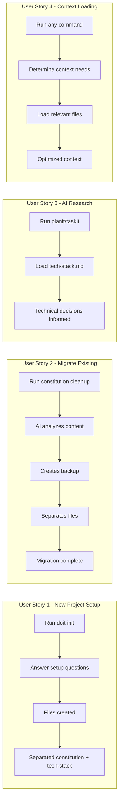
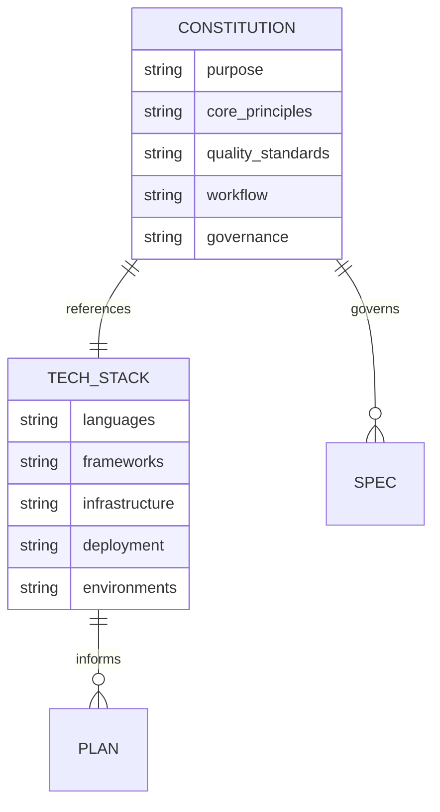

# Feature Specification: Constitution and Tech Stack Separation

**Feature Branch**: `[046-constitution-tech-stack-split]`
**Created**: 2026-01-22
**Status**: Complete
**GitHub Epic**: [#605](https://github.com/seanbarlow/doit/issues/605)
**Input**: User description: "Constitution and tech stack separation - constitution should only have core principles, best practices, standards, and governance; tech-stack.md should have tech stack and deployment information; include a slash command for AI agents to cleanup existing projects"

## Summary

Separate the constitution file into two distinct documents: one focused on project principles and governance (constitution.md), and another focused on technical implementation decisions (tech-stack.md). This separation improves clarity, enables better AI context loading, and ensures the right information is available to AI agents during different workflow phases.

## User Scenarios & Testing *(mandatory)*

### User Story 1 - New Project Setup (Priority: P1)

A developer initializing a new project with `doit init` wants the constitution and tech-stack files to be properly separated from the start, so principles don't get mixed with technical decisions.

**Why this priority**: New projects should start with the correct structure. This is the foundation for all other scenarios.

**Independent Test**: Can be fully tested by running `doit init` on a new project and verifying that constitution.md contains only principles and tech-stack.md contains only technical details.

**Acceptance Scenarios**:

1. **Given** a new project without doit configuration, **When** the user runs `doit init`, **Then** the system creates a `constitution.md` with only principles, governance, and quality standards sections
2. **Given** a new project without doit configuration, **When** the user runs `doit init`, **Then** the system creates a `tech-stack.md` with languages, frameworks, infrastructure, and deployment sections
3. **Given** a new project, **When** both files are created, **Then** they reference each other for cross-navigation

---

### User Story 2 - Migrate Existing Constitution (Priority: P1)

A developer with an existing project that has a combined constitution file wants to run a cleanup command that automatically separates the technical content into a new tech-stack.md file.

**Why this priority**: Many existing projects have combined files. Migration must be seamless and non-destructive.

**Independent Test**: Can be fully tested by running the cleanup command on a project with a combined constitution and verifying proper content separation.

**Acceptance Scenarios**:

1. **Given** an existing constitution.md with mixed content, **When** the user runs `/doit.constitution cleanup`, **Then** tech-related sections are extracted to tech-stack.md
2. **Given** an existing constitution.md with mixed content, **When** cleanup completes, **Then** constitution.md retains only principles, governance, and standards
3. **Given** an existing constitution.md, **When** cleanup runs, **Then** a backup is created before modification
4. **Given** an existing tech-stack.md already exists, **When** cleanup runs, **Then** the user is prompted to merge or skip

---

### User Story 3 - AI Agent Research Phase (Priority: P2)

During `/doit.planit` and `/doit.taskit`, AI agents need to access tech stack information to make appropriate technical decisions without that information polluting the constitution context.

**Why this priority**: Enables more focused AI context and better planning decisions, but the separation must exist first.

**Independent Test**: Can be fully tested by running planit on a project with separated files and verifying the agent accesses tech-stack.md for technical research.

**Acceptance Scenarios**:

1. **Given** a project with separated constitution and tech-stack files, **When** an AI agent runs `/doit.planit`, **Then** it loads tech-stack.md for technical context
2. **Given** a project with separated files, **When** an AI agent runs `/doit.taskit`, **Then** it references tech-stack.md for implementation details
3. **Given** only a constitution.md exists (legacy), **When** an AI agent runs planning commands, **Then** it gracefully falls back to the constitution with a warning

---

### User Story 4 - Context Loading Optimization (Priority: P3)

A developer wants AI context loading to be optimized so that constitution principles are always loaded (they're concise) but tech stack is loaded only when relevant to the current task.

**Why this priority**: Optimization that improves context efficiency but requires the separation to exist first.

**Independent Test**: Can be fully tested by running context show and verifying selective loading based on task type.

**Acceptance Scenarios**:

1. **Given** separated files, **When** running `/doit.specit`, **Then** only constitution.md is loaded (specs don't need tech details)
2. **Given** separated files, **When** running `/doit.planit`, **Then** both constitution.md and tech-stack.md are loaded
3. **Given** separated files, **When** running `doit context show`, **Then** tech-stack.md is shown as a separate loadable source

---

### Edge Cases

- What happens when constitution.md has no clear tech-related sections?
  - The cleanup command reports "no changes needed" and leaves the file unchanged
- What happens when the user declines to create tech-stack.md during init?
  - Tech stack sections are stored in constitution.md (backward compatible)
- How does the system handle partial migrations (some content unclear)?
  - Unclear content stays in constitution.md with a comment marker for manual review

## User Journey Visualization

<!-- BEGIN:AUTO-GENERATED section="user-journey" -->

<!-- END:AUTO-GENERATED -->

## Entity Relationships

<!-- BEGIN:AUTO-GENERATED section="entity-relationships" -->

<!-- END:AUTO-GENERATED -->

## Requirements *(mandatory)*

### Functional Requirements

#### File Structure

- **FR-001**: System MUST support a `constitution.md` file containing only: Purpose & Goals, Core Principles, Quality Standards, Development Workflow, and Governance
- **FR-002**: System MUST support a `tech-stack.md` file containing only: Languages, Frameworks, Libraries, Infrastructure, Deployment, and Environments
- **FR-003**: Both files MUST include a cross-reference to each other for navigation

#### Init Command Updates

- **FR-004**: The `doit init` command MUST create separate constitution.md and tech-stack.md files
- **FR-005**: The init workflow MUST ask tech stack questions separately from principles questions
- **FR-006**: System MUST provide templates for both files in `.doit/templates/`

#### Cleanup Command

- **FR-007**: System MUST provide a `/doit.constitution cleanup` command (or `doit constitution cleanup`) for migrating existing combined files
- **FR-008**: The cleanup command MUST create a backup of constitution.md before modification
- **FR-009**: The cleanup command MUST identify tech-related sections using content analysis (section headers and keywords)
- **FR-010**: The cleanup command MUST preserve any custom sections that don't fit either category

#### Script Updates

- **FR-011**: The `/doit.planit` command template MUST reference tech-stack.md for technical research
- **FR-012**: The `/doit.taskit` command template MUST reference tech-stack.md for implementation details
- **FR-013**: Research scripts MUST check for tech-stack.md first, falling back to constitution.md for legacy support

#### Context Integration

- **FR-014**: The context loading system MUST recognize tech-stack.md as a loadable source
- **FR-015**: Context loading MUST be configurable to include/exclude tech-stack.md based on command type
- **FR-016**: The `doit context show` command MUST display tech-stack.md status separately

### Key Entities

- **Constitution**: Project-level document defining purpose, principles, quality standards, workflow, and governance. Focused on "why" and "how we work" rather than "what we use."
- **Tech Stack**: Project-level document defining languages, frameworks, libraries, infrastructure, and deployment. Focused on "what we use" and "how we deploy."
- **Context Source**: A loadable document that AI agents can include in their context window for informed decision-making.

## Success Criteria *(mandatory)*

### Measurable Outcomes

- **SC-001**: New projects created with `doit init` have separated files 100% of the time
- **SC-002**: The cleanup command successfully separates 95% of content correctly (measured by content type accuracy)
- **SC-003**: AI agents running `/doit.planit` access tech-stack.md for technical decisions in 100% of projects with separated files
- **SC-004**: Context loading with separated files reduces constitution.md size by at least 30% (removing tech content)
- **SC-005**: Developers can complete the cleanup migration in under 2 minutes for typical projects
- **SC-006**: Zero data loss during migration (backup always created, original content preserved in one file or the other)

## Assumptions

- Existing constitutions have relatively clear section headers that can be parsed
- The tech stack sections can be identified by keywords like "Tech Stack", "Languages", "Frameworks", "Infrastructure", "Deployment", "Hosting", "Database"
- AI agents can be updated to look for tech-stack.md without breaking existing workflows
- Backward compatibility with combined constitution.md files is required during transition period

## Out of Scope

- Automatic synchronization between constitution and tech-stack files
- Version control or change tracking for individual files
- Multi-project tech stack inheritance or sharing
- Graphical UI for editing either file
