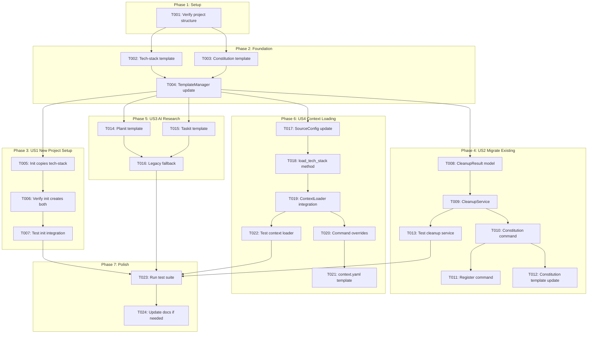
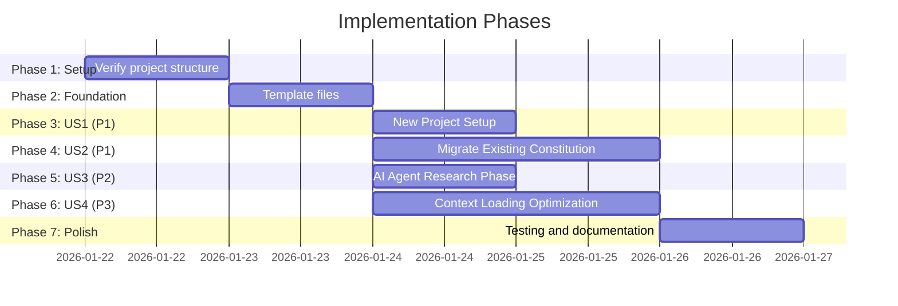

# Tasks: Constitution and Tech Stack Separation

**Input**: Design documents from `/specs/046-constitution-tech-stack-split/`
**Prerequisites**: plan.md (required), spec.md (required), research.md, data-model.md

**Tests**: Tests included per quality standards in constitution.

**Organization**: Tasks are grouped by user story to enable independent implementation and testing.

## Task Dependencies

<!-- BEGIN:AUTO-GENERATED section="task-dependencies" -->

<!-- END:AUTO-GENERATED -->

## Phase Timeline

<!-- BEGIN:AUTO-GENERATED section="phase-timeline" -->

<!-- END:AUTO-GENERATED -->

## Format: `[ID] [P?] [Story] Description`

- **[P]**: Can run in parallel (different files, no dependencies)
- **[Story]**: Which user story this task belongs to (US1, US2, US3, US4)
- Include exact file paths in descriptions

## Path Conventions

- **Single project**: `src/doit_cli/`, `tests/` at repository root
- `templates/` for template files

---

## Phase 1: Setup

**Purpose**: Verify project structure and dependencies

- [x] T001 Verify existing project structure matches plan.md source code layout

---

## Phase 2: Foundation (Blocking Prerequisites)

**Purpose**: Create template files that ALL user stories depend on

**⚠️ CRITICAL**: No user story work can begin until templates are in place

- [x] T002 [P] Create tech-stack.md template in templates/memory/tech-stack.md with Languages, Frameworks, Libraries, Infrastructure, Deployment sections and cross-reference to constitution.md
- [x] T003 [P] Update constitution.md template in templates/memory/constitution.md to remove Tech Stack, Infrastructure, Deployment sections and add cross-reference to tech-stack.md
- [x] T004 Update MEMORY_TEMPLATES constant in src/doit_cli/services/template_manager.py to include "tech-stack.md"

**Checkpoint**: Foundation ready - all templates exist with proper cross-references

---

## Phase 3: User Story 1 - New Project Setup (Priority: P1) 🎯 MVP

**Goal**: When a developer runs `doit init` on a new project, both constitution.md and tech-stack.md are created with proper separation and cross-references.

**Independent Test**: Run `doit init --yes` on a new directory and verify both files exist in `.doit/memory/` with correct content separation.

### Implementation for User Story 1

- [x] T005 [US1] Verify run_init() in src/doit_cli/cli/init_command.py copies tech-stack.md via existing copy_memory_templates() method (should work after T004)
- [x] T006 [US1] Manual verification: Create test directory, run `doit init --yes`, confirm both constitution.md and tech-stack.md exist in .doit/memory/
- [x] T007 [US1] Add integration test in tests/integration/test_init_command.py to verify both files are created with cross-references

**Checkpoint**: User Story 1 complete - new projects get separated files

---

## Phase 4: User Story 2 - Migrate Existing Constitution (Priority: P1)

**Goal**: Developers with existing combined constitution files can run `/doit.constitution cleanup` to automatically separate tech content into tech-stack.md.

**Independent Test**: Create a combined constitution.md, run cleanup, verify content is properly separated with backup created.

### Implementation for User Story 2

- [x] T008 [US2] Create CleanupResult dataclass in src/doit_cli/models/cleanup_models.py with backup_path, extracted_sections, preserved_sections, unclear_sections, tech_stack_created fields
- [x] T009 [US2] Create CleanupService in src/doit_cli/services/cleanup_service.py with TECH_SECTIONS constant, analyze(), create_backup(), and cleanup() methods per research.md algorithm
- [x] T010 [US2] Create constitution command in src/doit_cli/cli/constitution_command.py with cleanup subcommand that accepts --merge and --dry-run flags
- [x] T011 [US2] Register constitution command in src/doit_cli/cli/main.py using app.add_typer()
- [x] T012 [US2] Update templates/commands/doit.constitution.md to document cleanup subcommand usage
- [x] T013 [US2] Add unit tests in tests/unit/test_cleanup_service.py for analyze(), create_backup(), and cleanup() methods including edge cases (no tech sections, existing tech-stack.md)

**Checkpoint**: User Story 2 complete - existing projects can migrate to separated files

---

## Phase 5: User Story 3 - AI Agent Research Phase (Priority: P2)

**Goal**: AI agents running `/doit.planit` and `/doit.taskit` load tech-stack.md for technical decisions.

**Independent Test**: Run `/doit.planit` on a project with separated files and verify the command references tech-stack.md.

### Implementation for User Story 3

- [x] T014 [P] [US3] Update templates/commands/doit.planit.md to add instruction to read .doit/memory/tech-stack.md for technology decisions
- [x] T015 [P] [US3] Update templates/commands/doit.taskit.md to add instruction to reference tech-stack.md for implementation technology choices
- [x] T016 [US3] Add fallback logic note in both templates for legacy projects: "If tech-stack.md doesn't exist, check constitution.md for Tech Stack section"

**Checkpoint**: User Story 3 complete - AI agents access tech-stack.md during planning

---

## Phase 6: User Story 4 - Context Loading Optimization (Priority: P3)

**Goal**: Context loading system recognizes tech-stack.md as a loadable source with command-specific configuration.

**Independent Test**: Run `doit context show` and verify tech-stack.md appears as a separate source.

### Implementation for User Story 4

- [x] T017 [US4] Add "tech_stack" entry to SourceConfig.get_defaults() in src/doit_cli/models/context_config.py with priority=2, enabled=True
- [x] T018 [US4] Add load_tech_stack() method to ContextLoader in src/doit_cli/services/context_loader.py following pattern of load_constitution()
- [x] T019 [US4] Update ContextLoader.load() method to call load_tech_stack() and include result in aggregated context
- [x] T020 [US4] Add command overrides in src/doit_cli/models/context_config.py: specit disables tech_stack, constitution command disables tech_stack
- [x] T021 [US4] Update templates/config/context.yaml to include tech_stack source configuration and command_overrides for specit and constitution
- [x] T022 [US4] Add unit tests in tests/unit/test_context_loader.py for load_tech_stack() method and command-specific overrides

**Checkpoint**: User Story 4 complete - context loading supports selective tech-stack loading

---

## Phase 7: Polish & Cross-Cutting Concerns

**Purpose**: Final validation and cleanup

- [x] T023 Run full test suite with pytest and verify all tests pass
- [x] T024 [P] Update docs/tutorials if any references to constitution need updating for tech-stack separation

---

## Dependencies & Execution Order

### Phase Dependencies

- **Setup (Phase 1)**: No dependencies - can start immediately
- **Foundation (Phase 2)**: Depends on Setup - BLOCKS all user stories
- **User Stories (Phases 3-6)**: All depend on Foundation completion
  - US1 and US2 are both P1 priority - can run in parallel
  - US3 and US4 can run in parallel with US1/US2
- **Polish (Phase 7)**: Depends on all user stories complete

### User Story Dependencies

- **User Story 1 (P1)**: Depends on Phase 2 only - no cross-story dependencies
- **User Story 2 (P1)**: Depends on Phase 2 only - independent of US1
- **User Story 3 (P2)**: Depends on Phase 2 only - independent of US1/US2
- **User Story 4 (P3)**: Depends on Phase 2 only - independent of other stories

### Within Each User Story

- Models before services
- Services before commands
- Core implementation before tests
- Commit after each logical task group

### Parallel Opportunities

- T002 and T003 can run in parallel (different files)
- T014 and T015 can run in parallel (different files)
- All four user story phases can run in parallel after Phase 2 completes
- T023 and T024 can run in parallel

---

## Parallel Example: Phase 2 Foundation

```bash
# Launch template tasks in parallel:
Task: "Create tech-stack.md template in templates/memory/tech-stack.md"
Task: "Update constitution.md template in templates/memory/constitution.md"

# Then sequentially:
Task: "Update MEMORY_TEMPLATES constant in template_manager.py"
```

---

## Implementation Strategy

### MVP First (User Story 1 Only)

1. Complete Phase 1: Setup
2. Complete Phase 2: Foundation
3. Complete Phase 3: User Story 1
4. **STOP and VALIDATE**: Test with `doit init --yes`
5. New projects now get separated files

### Incremental Delivery

1. Complete Setup + Foundation → Templates ready
2. Add User Story 1 → New projects work → MVP!
3. Add User Story 2 → Existing projects can migrate
4. Add User Story 3 → AI agents reference tech-stack.md
5. Add User Story 4 → Context loading optimized
6. Polish → All tests pass, docs updated

### Parallel Team Strategy

With multiple developers:

1. Team completes Setup + Foundation together
2. Once Foundation is done:
   - Developer A: User Story 1 + 3 (init + templates)
   - Developer B: User Story 2 (cleanup command)
   - Developer C: User Story 4 (context integration)
3. Stories complete and integrate independently

---

## Notes

- [P] tasks = different files, no dependencies
- [Story] label maps task to specific user story for traceability
- Each user story is independently completable and testable
- Commit after each task or logical group
- Stop at any checkpoint to validate story independently
- All user stories share Phase 2 templates as foundation
