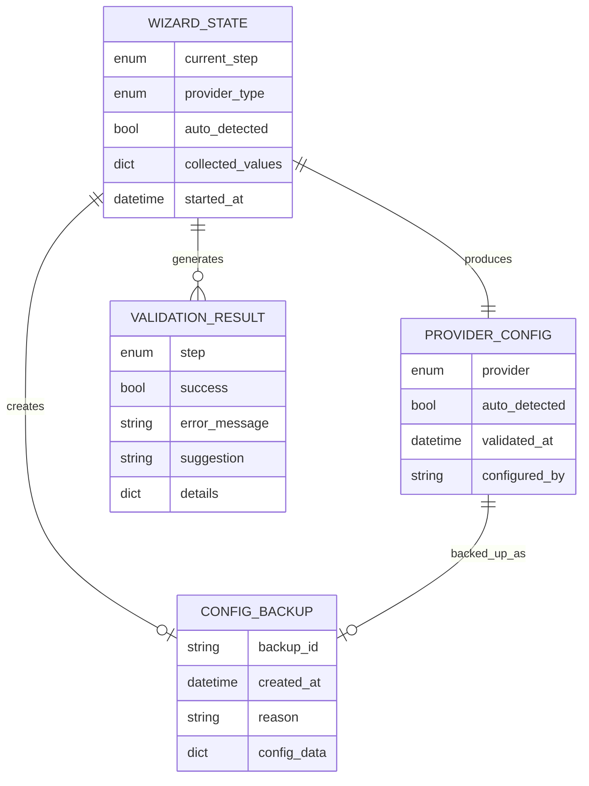
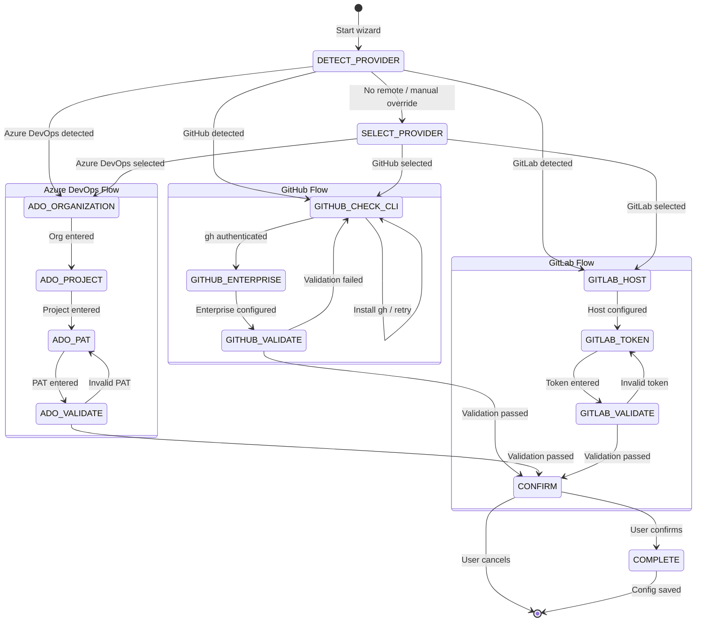

# Data Model: Git Provider Configuration Wizard

**Branch**: `047-provider-config-wizard` | **Date**: 2026-01-22 | **Spec**: [spec.md](spec.md)

## Entities

### WizardStep (Enum)

Represents the current step in the wizard flow.

```python
class WizardStep(str, Enum):
    """Wizard step identifiers."""
    DETECT_PROVIDER = "detect_provider"
    SELECT_PROVIDER = "select_provider"
    # GitHub flow
    GITHUB_CHECK_CLI = "github_check_cli"
    GITHUB_ENTERPRISE = "github_enterprise"
    GITHUB_VALIDATE = "github_validate"
    # Azure DevOps flow
    ADO_ORGANIZATION = "ado_organization"
    ADO_PROJECT = "ado_project"
    ADO_PAT = "ado_pat"
    ADO_VALIDATE = "ado_validate"
    # GitLab flow
    GITLAB_HOST = "gitlab_host"
    GITLAB_TOKEN = "gitlab_token"
    GITLAB_VALIDATE = "gitlab_validate"
    # Common
    CONFIRM = "confirm"
    COMPLETE = "complete"
```

### WizardState

Tracks wizard progress, collected values, and validation results.

| Field | Type | Required | Description |
|-------|------|----------|-------------|
| current_step | WizardStep | Yes | Current wizard position |
| provider_type | ProviderType | No | Selected/detected provider |
| auto_detected | bool | Yes | Whether provider was auto-detected |
| detection_source | str | No | How provider was detected (e.g., "git_remote") |
| collected_values | dict[str, Any] | Yes | Values collected during wizard |
| validation_results | list[ValidationResult] | Yes | Results from validation steps |
| started_at | datetime | Yes | When wizard started |
| existing_config | ProviderConfig | No | Previous config for backup |

**collected_values keys by provider:**

GitHub:
- `auth_method`: "gh_cli" or "token"
- `enterprise_host`: Optional host for GHE

Azure DevOps:
- `organization`: Organization name
- `project`: Project name
- `pat`: Personal Access Token (not persisted to config)
- `api_version`: API version (default "7.0")

GitLab:
- `host`: GitLab instance host (default "gitlab.com")
- `token`: Personal Access Token (not persisted to config)

### ValidationResult

Captures the outcome of a validation step.

| Field | Type | Required | Description |
|-------|------|----------|-------------|
| step | WizardStep | Yes | Which step was validated |
| success | bool | Yes | Whether validation passed |
| timestamp | datetime | Yes | When validation occurred |
| error_message | str | No | Error details if failed |
| suggestion | str | No | Actionable recovery suggestion |
| details | dict[str, Any] | No | Additional validation info |

**details examples:**

GitHub validation:
```python
{
    "gh_version": "2.42.0",
    "authenticated_user": "octocat",
    "scopes": ["repo", "read:org"],
    "has_repo_access": True
}
```

Azure DevOps validation:
```python
{
    "organization_accessible": True,
    "project_accessible": True,
    "pat_scopes": ["Code (Read & Write)", "Work Items (Read & Write)"],
    "missing_scopes": []
}
```

### ConfigBackup

Stores previous configuration when reconfiguring.

| Field | Type | Required | Description |
|-------|------|----------|-------------|
| backup_id | str | Yes | Unique identifier (timestamp-based) |
| created_at | datetime | Yes | When backup was created |
| reason | str | Yes | Why backup was created (e.g., "provider_switch") |
| config_data | dict[str, Any] | Yes | Serialized ProviderConfig |

**Storage location:** `.doit/config/provider_backup.yaml`

### Extended ProviderConfig

Additions to existing ProviderConfig:

| Field | Type | Required | Description |
|-------|------|----------|-------------|
| validated_at | datetime | No | Last successful validation timestamp |
| configured_by | str | No | "wizard" or "manual" |
| wizard_version | str | No | Version of wizard used |

## Entity Relationships



## State Transitions



## Data Validation Rules

### WizardState

| Field | Validation |
|-------|------------|
| current_step | Must be valid WizardStep enum |
| provider_type | Must be valid ProviderType enum when set |
| collected_values | Keys must match provider requirements |
| validation_results | Each must have valid step reference |

### ValidationResult

| Field | Validation |
|-------|------------|
| step | Must exist in WizardStep enum |
| success | Boolean, required |
| error_message | Required when success=False |
| suggestion | Recommended when success=False |

### ConfigBackup

| Field | Validation |
|-------|------------|
| backup_id | Format: `YYYYMMDD_HHMMSS` |
| reason | Non-empty string |
| config_data | Valid serialized ProviderConfig |

## Storage Format

### wizard_state.json (transient)

Not persisted - only exists during active wizard session.

### provider.yaml (updated schema)

```yaml
provider: github
auto_detected: true
detection_source: git_remote
validated_at: "2026-01-22T14:30:00Z"
configured_by: wizard
wizard_version: "0.1.12"

github:
  auth_method: gh_cli
  enterprise_host: null
```

### provider_backup.yaml (new file)

```yaml
backups:
  - backup_id: "20260122_143000"
    created_at: "2026-01-22T14:30:00Z"
    reason: "provider_switch"
    config_data:
      provider: azure_devops
      auto_detected: false
      azure_devops:
        organization: old-org
        project: old-project
        auth_method: pat
```

## Indexing and Performance

Not applicable - configuration files are small and read infrequently.

## Migration Notes

Existing `provider.yaml` files will work without modification. New fields (`validated_at`, `configured_by`, `wizard_version`) are optional and will be populated when the wizard is next run.
