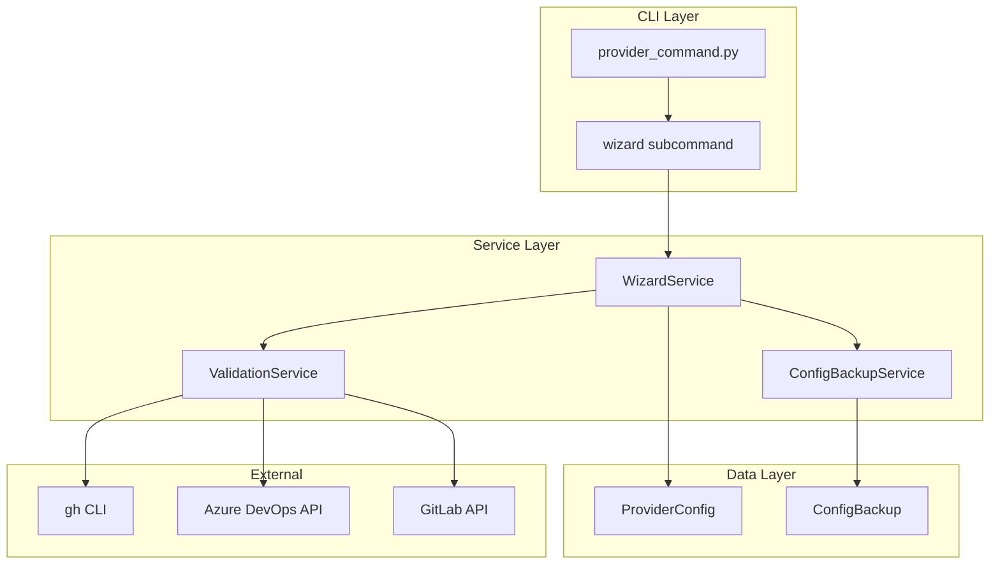
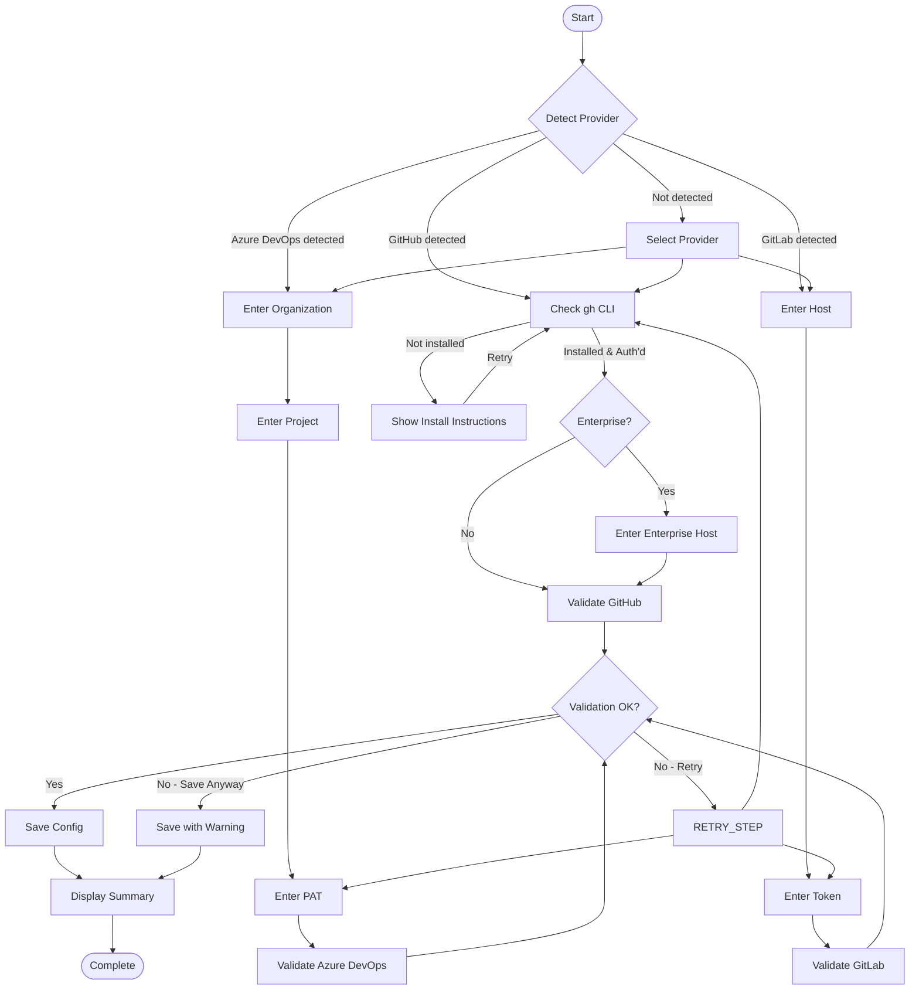

# Implementation Plan: Git Provider Configuration Wizard

**Branch**: `047-provider-config-wizard` | **Date**: 2026-01-22 | **Spec**: [spec.md](spec.md)
**Input**: Feature specification from `/specs/047-provider-config-wizard/spec.md`

## Summary

Add an interactive step-by-step wizard (`doit provider wizard`) that guides users through configuring authentication and default settings for GitHub, Azure DevOps, or GitLab. The wizard auto-detects the provider from git remote, validates credentials before saving, displays clear progress indicators, supports back navigation, and preserves existing configuration as backup when reconfiguring.

## Technical Context

**Language/Version**: Python 3.11+
**Primary Dependencies**: Typer (CLI), Rich (terminal UI), httpx (HTTP client), readchar (keyboard input)
**Storage**: File-based YAML in `.doit/config/provider.yaml` and `.doit/config/provider_backup.yaml`
**Testing**: pytest with mocked I/O
**Target Platform**: macOS, Linux, Windows (cross-platform CLI)
**Project Type**: Single CLI application
**Performance Goals**: Complete wizard flow in <3 minutes for standard setups
**Constraints**: Terminal-only (no GUI), must not store raw credentials in config files

## Architecture Overview

<!-- BEGIN:AUTO-GENERATED section="architecture" -->

<!-- END:AUTO-GENERATED -->

## Wizard Flow

<!-- BEGIN:AUTO-GENERATED section="wizard-flow" -->

<!-- END:AUTO-GENERATED -->

## Constitution Check

*GATE: Must pass before Phase 0 research. Re-check after Phase 1 design.*

| Principle | Compliance |
|-----------|------------|
| Specification-First | ✓ Spec created with user stories and requirements |
| Persistent Memory | ✓ Configuration stored in `.doit/config/` |
| Auto-Generated Diagrams | ✓ Flow diagrams generated from spec |
| Opinionated Workflow | ✓ Follows specit → planit → taskit sequence |
| AI-Native Design | ✓ Integrates with existing CLI commands |

## Project Structure

### Documentation (this feature)

```text
specs/047-provider-config-wizard/
├── plan.md              # This file
├── research.md          # Phase 0 output
├── data-model.md        # Phase 1 output
├── quickstart.md        # Phase 1 output
├── contracts/           # Phase 1 output
│   ├── wizard_service.md
│   ├── validation_service.md
│   └── backup_service.md
├── checklists/
│   └── requirements.md  # Spec validation checklist
└── tasks.md             # Phase 2 output (via /doit.taskit)
```

### Source Code (repository root)

```text
src/doit_cli/
├── cli/
│   └── provider_command.py  # EXTEND: Add wizard subcommand
├── models/
│   └── wizard_models.py     # NEW: WizardStep, WizardState, ValidationResult
└── services/
    ├── wizard_service.py     # NEW: Wizard flow orchestration
    ├── validation_service.py # NEW: Credential validation
    ├── backup_service.py     # NEW: Config backup management
    └── provider_config.py    # EXTEND: Add validated_at, configured_by fields

tests/
├── unit/
│   └── services/
│       ├── test_wizard_service.py
│       ├── test_validation_service.py
│       └── test_backup_service.py
└── integration/
    └── test_provider_wizard.py
```

**Structure Decision**: Single project structure following existing `src/doit_cli` layout.

## Implementation Phases

### Phase 1: Core Models (FR-related: FR-006, FR-011)

1. Create `wizard_models.py`:
   - `WizardStep` enum for wizard states
   - `WizardState` dataclass for tracking progress
   - `ValidationResult` dataclass for validation outcomes
   - `WizardResult` for wizard completion status
   - Exception classes: `WizardCancelledError`, `WizardStepError`

### Phase 2: Validation Service (FR-004, FR-005, FR-020, FR-021, FR-033)

1. Create `validation_service.py`:
   - `check_gh_cli_installed()` - Check gh binary exists
   - `check_gh_cli_authenticated()` - Verify gh auth status
   - `validate_github()` - Full GitHub validation flow
   - `validate_azure_devops()` - PAT validation with scope checks
   - `validate_gitlab()` - Basic token validation
   - `test_github_repo_access()` - Repository access verification
   - `get_ado_pat_scopes()` - Infer PAT scopes from endpoint tests

### Phase 3: Backup Service (FR-009, FR-010)

1. Create `backup_service.py`:
   - `create_backup()` - Save current config before changes
   - `list_backups()` - List available backups
   - `restore_backup()` - Restore specific backup
   - `prune_old_backups()` - Maintain backup limit (5 max)

### Phase 4: Wizard Service (FR-001, FR-002, FR-003, FR-006, FR-007, FR-008)

1. Create `wizard_service.py`:
   - `run()` - Main wizard orchestration
   - `detect_provider()` - Auto-detection from git remote
   - `select_provider()` - Interactive provider selection UI
   - `collect_github_config()` - GitHub-specific steps
   - `collect_azure_devops_config()` - ADO-specific steps
   - `collect_gitlab_config()` - GitLab-specific steps
   - `validate_and_save()` - Validation and persistence
   - `display_summary()` - Configuration summary
   - `handle_cancellation()` - Graceful exit handling

### Phase 5: CLI Integration (FR-001, FR-012)

1. Extend `provider_command.py`:
   - Add `wizard` subcommand
   - Add `--force` flag for forced reconfiguration
   - Wire service dependencies
   - Handle keyboard interrupt

### Phase 6: Provider-Specific Implementation

1. GitHub flow (FR-020, FR-021, FR-022, FR-023):
   - gh CLI installation detection
   - Authentication status check
   - GitHub Enterprise host configuration
   - Repository access verification

2. Azure DevOps flow (FR-030, FR-031, FR-032, FR-033, FR-034, FR-035):
   - Organization prompt with validation
   - Project prompt with validation
   - PAT prompt (hidden input) with scope validation
   - Environment variable support (AZURE_DEVOPS_PAT)
   - Connection testing

3. GitLab flow (FR-040, FR-041, FR-042):
   - Custom host configuration
   - Token prompt (hidden input)
   - Limited feature support messaging

### Phase 7: Configuration Updates

1. Extend `provider_config.py`:
   - Add `validated_at` field
   - Add `configured_by` field
   - Add `wizard_version` field
   - Update `save()` to include new fields

### Phase 8: Testing

1. Unit tests:
   - `test_validation_service.py` - All validation methods
   - `test_backup_service.py` - Backup CRUD operations
   - `test_wizard_service.py` - Flow logic with mocked I/O

2. Integration tests:
   - `test_provider_wizard.py` - End-to-end wizard flows

## Dependencies

| Dependency | Version | Purpose |
|------------|---------|---------|
| typer | >=0.9.0 | CLI framework |
| rich | >=13.0.0 | Terminal UI components |
| httpx | >=0.25.0 | HTTP client for API validation |
| pyyaml | >=6.0 | Configuration serialization |

No new dependencies required - all are already in project.

## Risk Mitigation

| Risk | Mitigation |
|------|------------|
| gh CLI not installed | Clear installation instructions with link |
| Invalid PAT scopes | Test specific endpoints, list required scopes |
| Network timeout | Allow save without validation with warning |
| User cancels mid-wizard | No partial saves, restore from backup |
| GHE authentication differs | Test enterprise endpoint patterns |

## Success Metrics

- **SC-001**: Configuration completes in <3 minutes - Measured by wizard timestamps
- **SC-002**: 95% success on first try - Track validation retries
- **SC-003**: Actionable errors in <5 seconds - Timeout on validation
- **SC-004**: Zero data loss on cancel - Backup restoration verified
- **SC-005**: 100% backup on reconfigure - Backup count tracking

## References

- [research.md](research.md) - Technical analysis
- [data-model.md](data-model.md) - Entity definitions
- [contracts/](contracts/) - Service interfaces
- [quickstart.md](quickstart.md) - Developer guide
