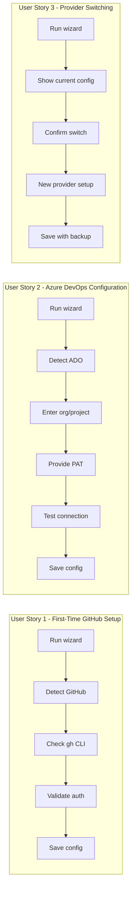
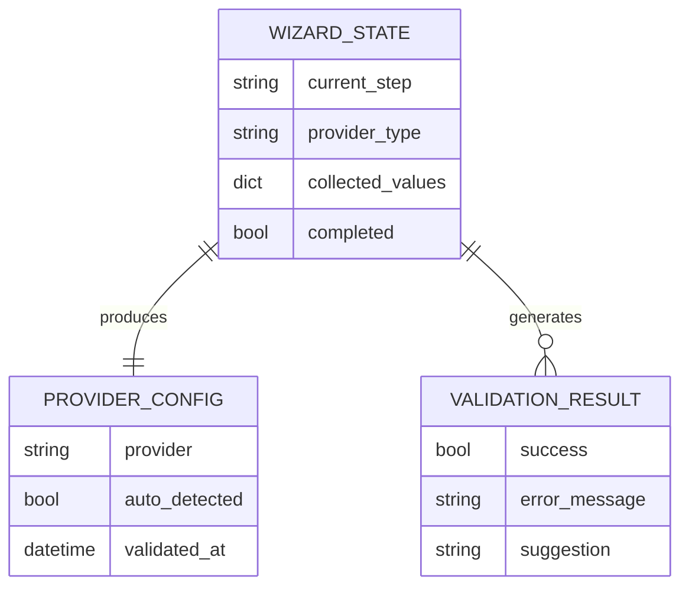

# Feature Specification: Git Provider Configuration Wizard

**Feature Branch**: `[047-provider-config-wizard]`
**Created**: 2026-01-22
**Status**: In Progress
**GitHub Epic**: [#607](https://github.com/seanbarlow/doit/issues/607)
**Input**: User description: "Git provider configuration wizard - Interactive setup wizard to configure authentication and default settings for each git provider (GitHub, Azure DevOps, GitLab)"

## Summary

An interactive, step-by-step wizard that guides users through configuring authentication and default settings for their preferred git provider. The wizard validates credentials, tests connections, and provides clear feedback to ensure successful setup of GitHub, Azure DevOps, or GitLab integration.

## User Scenarios & Testing *(mandatory)*

### User Story 1 - First-Time GitHub Setup (Priority: P1)

A developer setting up doit for the first time on a GitHub-hosted repository wants to quickly configure GitHub integration with guided steps and validation, so they can start using roadmap sync and issue linking features.

**Why this priority**: GitHub is the most common provider and first-time setup experience is critical for user adoption. Most users will encounter this flow.

**Independent Test**: Can be fully tested by running `doit provider wizard` on a fresh project with GitHub remote and verifying authentication succeeds.

**Acceptance Scenarios**:

1. **Given** a project with GitHub remote and no provider configuration, **When** the user runs `doit provider wizard`, **Then** the wizard detects GitHub and offers guided GitHub setup
2. **Given** the wizard is in GitHub setup mode, **When** the user has `gh` CLI authenticated, **Then** the wizard detects existing authentication and confirms it works
3. **Given** the wizard is in GitHub setup mode, **When** the user does not have `gh` CLI, **Then** the wizard guides them to install and authenticate with clear instructions
4. **Given** successful GitHub authentication, **When** the wizard completes, **Then** the configuration is saved and a summary is displayed

---

### User Story 2 - Azure DevOps Configuration (Priority: P1)

A developer working on an enterprise Azure DevOps-hosted project wants to configure Azure DevOps integration with proper organization, project, and PAT settings, so they can use doit features with their Azure DevOps repositories.

**Why this priority**: Azure DevOps is a major enterprise provider requiring more configuration steps. Proper wizard guidance reduces support burden.

**Independent Test**: Can be fully tested by running `doit provider wizard` with Azure DevOps remote and providing valid PAT credentials.

**Acceptance Scenarios**:

1. **Given** a project with Azure DevOps remote and no provider configuration, **When** the user runs `doit provider wizard`, **Then** the wizard detects Azure DevOps and offers guided setup
2. **Given** the wizard is in Azure DevOps setup mode, **When** organization is not provided, **Then** the wizard prompts for organization name with validation
3. **Given** the wizard is in Azure DevOps setup mode, **When** the user provides a Personal Access Token, **Then** the wizard validates it has required scopes and stores it securely
4. **Given** all Azure DevOps settings are provided, **When** the wizard tests the connection, **Then** it confirms access to the specified project

---

### User Story 3 - Provider Switching (Priority: P2)

A developer who previously configured one provider (e.g., GitHub) now needs to switch to a different provider (e.g., migrating to Azure DevOps), so they can continue using doit features with their new repository hosting.

**Why this priority**: Provider migration is less common but important for enterprise users. Clear reconfiguration flow prevents confusion.

**Independent Test**: Can be fully tested by running wizard on project with existing GitHub config and successfully switching to Azure DevOps.

**Acceptance Scenarios**:

1. **Given** a project with existing provider configuration, **When** the user runs `doit provider wizard`, **Then** the wizard shows current configuration and offers to reconfigure
2. **Given** the user confirms reconfiguration, **When** they select a different provider, **Then** the wizard guides them through the new provider setup
3. **Given** reconfiguration completes, **When** configuration is saved, **Then** the old provider settings are preserved as backup in config history

---

### User Story 4 - GitLab Configuration (Priority: P3)

A developer working on a GitLab-hosted project wants to configure GitLab integration when full GitLab support is available, so they can use doit features with their GitLab repositories.

**Why this priority**: GitLab support is currently a stub. Wizard should handle this gracefully until full implementation.

**Independent Test**: Can be fully tested by running wizard with GitLab remote and verifying appropriate messaging about current support level.

**Acceptance Scenarios**:

1. **Given** a project with GitLab remote, **When** the user runs `doit provider wizard`, **Then** the wizard detects GitLab and shows current support status
2. **Given** GitLab is selected but not fully implemented, **When** setup proceeds, **Then** the wizard clearly indicates which features are available
3. **Given** GitLab token is provided, **When** the wizard validates it, **Then** basic connectivity is tested even with limited feature support

---

### Edge Cases

- What happens when no git remote is configured? The wizard prompts user to add a remote first or allows manual provider selection
- What happens when credentials are invalid? The wizard displays clear error messages and allows retry without restarting
- What happens when user cancels mid-wizard? The wizard does not save partial configuration and restores previous state
- What happens when network is unavailable during validation? The wizard allows saving configuration without validation with appropriate warning

## User Journey Visualization

<!-- BEGIN:AUTO-GENERATED section="user-journey" -->

<!-- END:AUTO-GENERATED -->

## Requirements *(mandatory)*

### Functional Requirements

- **FR-001**: System MUST provide a `doit provider wizard` command that launches interactive configuration
- **FR-002**: System MUST auto-detect git provider from remote URL when available
- **FR-003**: System MUST support step-by-step configuration for GitHub, Azure DevOps, and GitLab providers
- **FR-004**: System MUST validate authentication credentials before completing setup
- **FR-005**: System MUST test provider connectivity and display results to user
- **FR-006**: System MUST display clear progress indicators during multi-step wizard
- **FR-007**: System MUST allow users to go back to previous steps to correct input
- **FR-008**: System MUST save configuration only upon successful completion
- **FR-009**: System MUST preserve existing configuration as backup when reconfiguring
- **FR-010**: System MUST handle cancellation gracefully without corrupting configuration
- **FR-011**: System MUST provide clear error messages with recovery suggestions
- **FR-012**: System MUST display authentication instructions with links to documentation

### GitHub-Specific Requirements

- **FR-020**: For GitHub, system MUST detect existing `gh` CLI authentication
- **FR-021**: For GitHub, system MUST guide user to install `gh` CLI if not present
- **FR-022**: For GitHub, system MUST support GitHub Enterprise with custom host configuration
- **FR-023**: For GitHub, system MUST validate that authenticated user has repository access

### Azure DevOps-Specific Requirements

- **FR-030**: For Azure DevOps, system MUST prompt for organization name
- **FR-031**: For Azure DevOps, system MUST prompt for project name
- **FR-032**: For Azure DevOps, system MUST securely prompt for Personal Access Token (hidden input)
- **FR-033**: For Azure DevOps, system MUST validate PAT has required scopes (Code read/write, Work Items read/write)
- **FR-034**: For Azure DevOps, system MUST support environment variable for PAT (AZURE_DEVOPS_PAT)
- **FR-035**: For Azure DevOps, system MUST test access to specified organization and project

### GitLab-Specific Requirements

- **FR-040**: For GitLab, system MUST support custom host configuration for self-hosted instances
- **FR-041**: For GitLab, system MUST prompt for personal access token
- **FR-042**: For GitLab, system MUST clearly indicate current implementation status (stub vs full support)

### Key Entities *(include if feature involves data)*

- **WizardState**: Tracks current step, provider selection, collected configuration values, and validation status throughout the wizard flow
- **ValidationResult**: Captures success/failure status, error messages, and actionable suggestions for resolution
- **ProviderConfig**: Extended configuration including authentication method, credentials reference, and last validation timestamp

## Entity Relationships *(include if Key Entities defined)*

<!-- BEGIN:AUTO-GENERATED section="entity-relationships" -->

<!-- END:AUTO-GENERATED -->

## Success Criteria *(mandatory)*

### Measurable Outcomes

- **SC-001**: Users can complete provider configuration in under 3 minutes for standard setups
- **SC-002**: 95% of configuration attempts result in successful provider connection on first try
- **SC-003**: Users with invalid credentials receive actionable error messages within 5 seconds
- **SC-004**: Zero data loss occurs when user cancels wizard mid-configuration
- **SC-005**: Configuration backup is created for 100% of reconfiguration scenarios

## Assumptions

- Users have basic familiarity with their git provider (know their organization/project names)
- Users have permission to create Personal Access Tokens on their git provider
- The `gh` CLI is the standard authentication method for GitHub users
- Network connectivity is available during initial setup (validation step)
- The existing ProviderConfig and ProviderFactory infrastructure can be extended

## Constraints

- Must integrate with existing `doit provider` command structure
- Must not require storing raw credentials in configuration files (use environment variables or CLI tools)
- Must work in terminal environments without GUI access
- GitLab implementation is limited until full GitLab provider support is complete

## Dependencies

- Requires existing provider abstraction layer (feature 044-git-provider-abstraction)
- Uses Rich library for terminal UI components
- Uses readchar for keyboard input handling
- Depends on `gh` CLI for GitHub authentication

## Out of Scope

- OAuth browser-based authentication flows
- Credential storage in system keychain
- Multi-provider configuration (one provider per project)
- Automated credential rotation
- SSO/SAML authentication for enterprise providers
