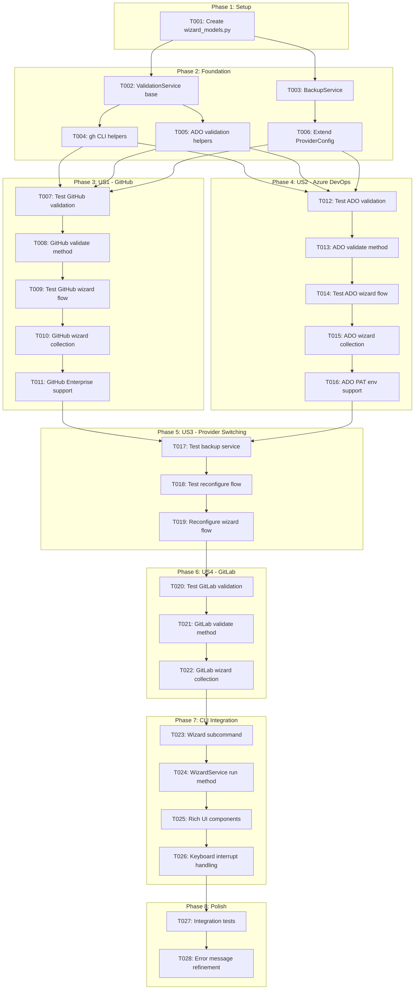
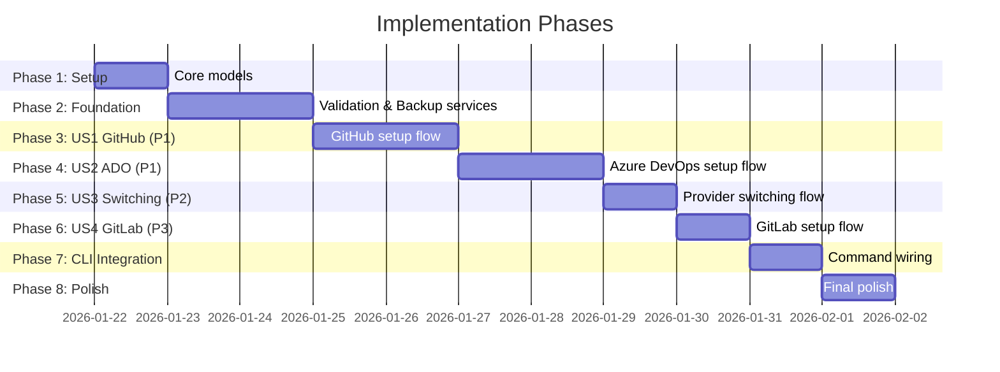

# Tasks: Git Provider Configuration Wizard

**Input**: Design documents from `/specs/047-provider-config-wizard/`
**Prerequisites**: plan.md (required), spec.md (required for user stories), research.md, data-model.md, contracts/

**Tests**: Unit tests are included as per project quality standards (pytest required).

**Organization**: Tasks are grouped by user story to enable independent implementation and testing of each story.

## Task Dependencies

<!-- BEGIN:AUTO-GENERATED section="task-dependencies" -->

<!-- END:AUTO-GENERATED -->

## Phase Timeline

<!-- BEGIN:AUTO-GENERATED section="phase-timeline" -->

<!-- END:AUTO-GENERATED -->

## Format: `[ID] [P?] [Story] Description`

- **[P]**: Can run in parallel (different files, no dependencies)
- **[Story]**: Which user story this task belongs to (e.g., US1, US2, US3)
- Include exact file paths in descriptions

## Path Conventions

- **Single project**: `src/doit_cli/` for source, `tests/` for tests
- Based on plan.md: Models in `models/`, Services in `services/`, CLI in `cli/`

---

## Phase 1: Setup (Shared Infrastructure)

**Purpose**: Create core model structures needed by all components

- [x] T001 Create wizard data models (WizardStep enum, WizardState, ValidationResult, WizardResult, exceptions) in src/doit_cli/models/wizard_models.py

---

## Phase 2: Foundational (Blocking Prerequisites)

**Purpose**: Core infrastructure that MUST be complete before ANY user story can be implemented

**⚠️ CRITICAL**: No user story work can begin until this phase is complete

- [x] T002 Create ValidationService base class with timeout config and validate_provider() dispatch in src/doit_cli/services/validation_service.py
- [x] T003 [P] Create ConfigBackupService with create_backup(), list_backups(), restore_backup(), prune_old_backups() in src/doit_cli/services/backup_service.py
- [x] T004 [P] Add check_gh_cli_installed() and check_gh_cli_authenticated() helpers to ValidationService in src/doit_cli/services/validation_service.py
- [x] T005 [P] Add Azure DevOps HTTP client helper with Basic auth in ValidationService in src/doit_cli/services/validation_service.py
- [x] T006 Extend ProviderConfig with validated_at, configured_by, wizard_version fields in src/doit_cli/services/provider_config.py

**Checkpoint**: Foundation ready - user story implementation can now begin

---

## Phase 3: User Story 1 - First-Time GitHub Setup (Priority: P1) 🎯 MVP

**Goal**: Guide users through GitHub configuration with gh CLI authentication

**Independent Test**: Run `doit provider wizard` on fresh project with GitHub remote, verify auth succeeds

### Tests for User Story 1

- [x] T007 [P] [US1] Unit test for validate_github() method (gh installed, gh authenticated, gh not found scenarios) in tests/unit/services/test_validation_service.py

### Implementation for User Story 1

- [x] T008 [US1] Implement validate_github() method with gh auth status check and repo access test in src/doit_cli/services/validation_service.py
- [x] T009 [US1] Unit test for GitHub wizard collection flow (detect gh, show install instructions, validate) in tests/unit/services/test_wizard_service.py
- [x] T010 [US1] Implement collect_github_config() in WizardService with gh CLI detection and auth check in src/doit_cli/services/wizard_service.py
- [x] T011 [US1] Add GitHub Enterprise host prompt to collect_github_config() with --hostname support in src/doit_cli/services/wizard_service.py

**Checkpoint**: GitHub setup flow fully functional and testable independently

---

## Phase 4: User Story 2 - Azure DevOps Configuration (Priority: P1)

**Goal**: Guide users through Azure DevOps PAT configuration with scope validation

**Independent Test**: Run `doit provider wizard` with ADO remote, provide valid PAT, verify connection test passes

### Tests for User Story 2

- [x] T012 [P] [US2] Unit test for validate_azure_devops() method (valid PAT, invalid PAT, missing scopes scenarios) in tests/unit/services/test_validation_service.py

### Implementation for User Story 2

- [x] T013 [US2] Implement validate_azure_devops() with org/project access test and scope detection in src/doit_cli/services/validation_service.py
- [x] T014 [US2] Unit test for ADO wizard collection flow (org prompt, project prompt, PAT hidden input) in tests/unit/services/test_wizard_service.py
- [x] T015 [US2] Implement collect_azure_devops_config() in WizardService with org/project/PAT prompts in src/doit_cli/services/wizard_service.py
- [x] T016 [US2] Add AZURE_DEVOPS_PAT environment variable detection in collect_azure_devops_config() in src/doit_cli/services/wizard_service.py

**Checkpoint**: Azure DevOps setup flow fully functional and testable independently

---

## Phase 5: User Story 3 - Provider Switching (Priority: P2)

**Goal**: Allow reconfiguration while preserving previous config as backup

**Independent Test**: Run wizard on project with existing GitHub config, switch to ADO, verify backup created

### Tests for User Story 3

- [x] T017 [P] [US3] Unit test for ConfigBackupService (create, list, restore, prune operations) in tests/unit/services/test_backup_service.py
- [x] T018 [P] [US3] Unit test for reconfiguration flow (detect existing, prompt confirm, create backup) in tests/unit/services/test_wizard_service.py

### Implementation for User Story 3

- [x] T019 [US3] Implement reconfiguration detection and backup creation in WizardService.run() in src/doit_cli/services/wizard_service.py

**Checkpoint**: Provider switching preserves config history

---

## Phase 6: User Story 4 - GitLab Configuration (Priority: P3)

**Goal**: Guide users through GitLab token configuration with current support status messaging

**Independent Test**: Run wizard with GitLab remote, verify limited support warning shown

### Tests for User Story 4

- [x] T020 [P] [US4] Unit test for validate_gitlab() method (valid token, invalid token scenarios) in tests/unit/services/test_validation_service.py

### Implementation for User Story 4

- [x] T021 [US4] Implement validate_gitlab() with token validation and limited support warning in src/doit_cli/services/validation_service.py
- [x] T022 [US4] Implement collect_gitlab_config() in WizardService with host and token prompts in src/doit_cli/services/wizard_service.py

**Checkpoint**: GitLab flow shows appropriate limited support messaging

---

## Phase 7: CLI Integration

**Purpose**: Wire wizard service to CLI and add Rich UI components

- [x] T023 Add wizard subcommand to provider_command.py with --force flag in src/doit_cli/cli/provider_command.py
- [x] T024 Implement WizardService.run() orchestration (detect → select → collect → validate → save → summary) in src/doit_cli/services/wizard_service.py
- [x] T025 Add Rich UI components (Panel for steps, Status spinner for validation, Table for summary) in src/doit_cli/services/wizard_service.py
- [x] T026 Add keyboard interrupt (Ctrl+C) handling with config restoration in wizard command in src/doit_cli/cli/provider_command.py

---

## Phase 8: Polish & Cross-Cutting Concerns

**Purpose**: Final integration and quality improvements

- [x] T027 [P] Integration test for end-to-end wizard flow (GitHub path) in tests/integration/test_provider_wizard.py
- [x] T028 [P] Refine error messages with actionable suggestions per contracts/validation_service.md in src/doit_cli/services/validation_service.py

---

## Dependencies & Execution Order

### Phase Dependencies

- **Setup (Phase 1)**: No dependencies - can start immediately
- **Foundational (Phase 2)**: Depends on Setup completion - BLOCKS all user stories
- **User Stories (Phase 3-6)**: All depend on Foundational phase completion
  - US1 (GitHub) and US2 (ADO) can proceed in parallel after Foundation
  - US3 (Switching) depends on US1 and US2 being complete
  - US4 (GitLab) can proceed after US3
- **CLI Integration (Phase 7)**: Depends on all user stories
- **Polish (Phase 8)**: Depends on CLI Integration

### User Story Dependencies

- **User Story 1 (P1)**: Can start after Foundational - No dependencies on other stories
- **User Story 2 (P1)**: Can start after Foundational - No dependencies on other stories (can run parallel with US1)
- **User Story 3 (P2)**: Depends on at least one provider flow existing to test switching
- **User Story 4 (P3)**: Can start after Foundational - Independent but low priority

### Within Each User Story

- Tests written first, verify they FAIL before implementation
- Validation method before wizard collection
- Core flow before enhancements (e.g., GHE, PAT env var)
- Story complete before moving to next priority

### Parallel Opportunities

- T002, T003 can run in parallel (different files)
- T004, T005, T006 can run in parallel (different methods/files)
- T007 and T012 can run in parallel (different test files)
- T017, T018 can run in parallel (different aspects)
- T020 can run in parallel with other work (separate file)
- T027, T028 can run in parallel (different files)

---

## Parallel Example: Foundational Phase

```bash
# Launch foundational tasks together:
Task T002: "Create ValidationService base class in src/doit_cli/services/validation_service.py"
Task T003: "Create ConfigBackupService in src/doit_cli/services/backup_service.py"

# Then launch helper methods together:
Task T004: "Add gh CLI helpers to ValidationService"
Task T005: "Add ADO HTTP client helper to ValidationService"
Task T006: "Extend ProviderConfig with new fields"
```

---

## Implementation Strategy

### MVP First (User Story 1 Only)

1. Complete Phase 1: Setup (T001)
2. Complete Phase 2: Foundational (T002-T006)
3. Complete Phase 3: User Story 1 - GitHub (T007-T011)
4. Add CLI Integration (T023-T026) with GitHub-only support
5. **STOP and VALIDATE**: Test GitHub setup flow independently
6. Deploy/demo if ready

### Incremental Delivery

1. Complete Setup + Foundational → Foundation ready
2. Add User Story 1 (GitHub) → Test independently → Demo (MVP!)
3. Add User Story 2 (ADO) → Test independently → Demo
4. Add User Story 3 (Switching) → Test independently → Demo
5. Add User Story 4 (GitLab) → Test independently → Demo
6. Each story adds value without breaking previous stories

### Parallel Team Strategy

With multiple developers:

1. Team completes Setup + Foundational together
2. Once Foundational is done:
   - Developer A: User Story 1 (GitHub)
   - Developer B: User Story 2 (ADO)
3. After US1 + US2 complete:
   - Any developer: User Story 3 (Switching)
   - Any developer: User Story 4 (GitLab)
4. Team: CLI Integration + Polish

---

## Notes

- [P] tasks = different files, no dependencies
- [Story] label maps task to specific user story for traceability
- Each user story should be independently completable and testable
- Verify tests fail before implementing
- Commit after each task or logical group
- Stop at any checkpoint to validate story independently
- Avoid: vague tasks, same file conflicts, cross-story dependencies that break independence
