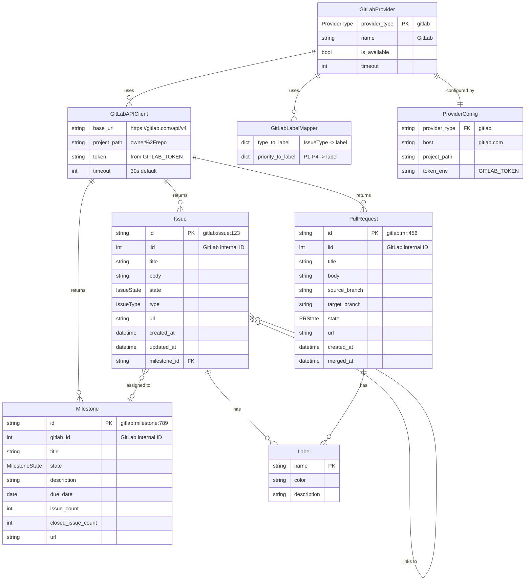
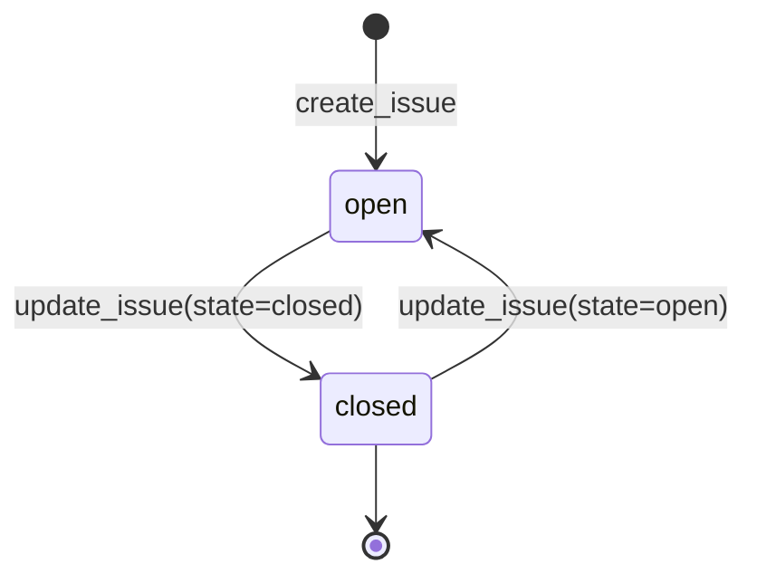
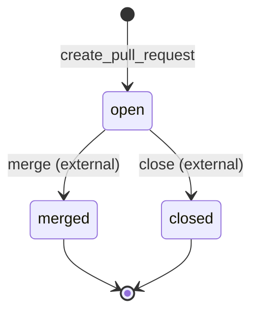
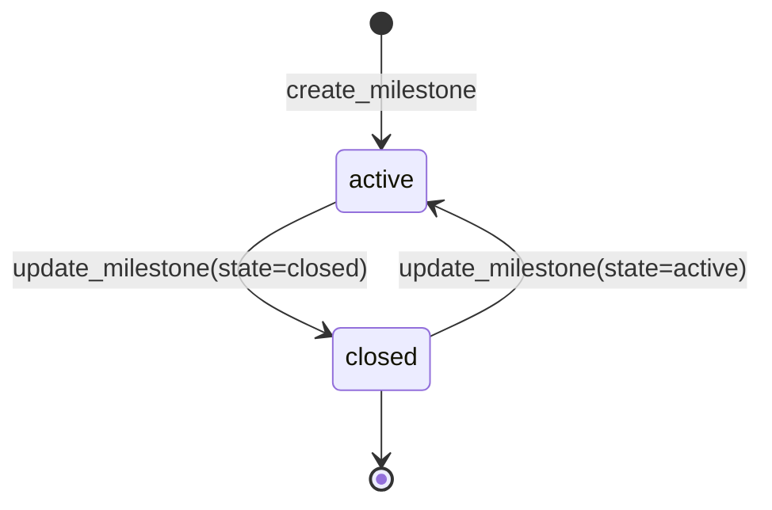

# Data Model: GitLab Git Provider Support

**Feature**: 048-gitlab-provider
**Date**: 2026-01-22

## Entity Relationship Diagram

<!-- BEGIN:AUTO-GENERATED section="er-diagram" -->

<!-- END:AUTO-GENERATED -->

## Entity Definitions

### GitLabProvider

The main provider class implementing the `GitProvider` abstract interface.

| Field | Type | Description |
| ----- | ---- | ----------- |
| provider_type | ProviderType | Always `ProviderType.GITLAB` |
| name | str | Always `"GitLab"` |
| is_available | bool | True if configured and authenticated |
| timeout | int | HTTP timeout in seconds (default: 30) |

**Methods**:
- `create_issue(request: IssueCreateRequest) -> Issue`
- `get_issue(issue_id: str) -> Issue`
- `list_issues(filters: Optional[IssueFilters]) -> list[Issue]`
- `update_issue(issue_id: str, updates: IssueUpdateRequest) -> Issue`
- `create_pull_request(request: PRCreateRequest) -> PullRequest`
- `get_pull_request(pr_id: str) -> PullRequest`
- `list_pull_requests(filters: Optional[PRFilters]) -> list[PullRequest]`
- `create_milestone(request: MilestoneCreateRequest) -> Milestone`
- `get_milestone(milestone_id: str) -> Milestone`
- `list_milestones(state: Optional[MilestoneState]) -> list[Milestone]`

### GitLabAPIClient

Internal HTTP client for GitLab REST API v4 communication.

| Field | Type | Description |
| ----- | ---- | ----------- |
| base_url | str | API base URL (e.g., `https://gitlab.com/api/v4`) |
| project_path | str | URL-encoded project path (e.g., `owner%2Frepo`) |
| token | str | Personal Access Token from environment |
| timeout | int | Request timeout in seconds |

**Methods**:
- `get(endpoint: str, params: dict) -> dict` - GET request
- `post(endpoint: str, data: dict) -> dict` - POST request
- `put(endpoint: str, data: dict) -> dict` - PUT request
- `validate_token() -> dict` - Validate token via `/user` endpoint

### GitLabLabelMapper

Maps between unified issue types and GitLab labels.

| Field | Type | Description |
| ----- | ---- | ----------- |
| type_to_label | dict[IssueType, str] | Maps IssueType enum to GitLab label name |
| priority_to_label | dict[str, str] | Maps P1-P4 to scoped labels |

**Mappings**:

```python
TYPE_TO_LABEL = {
    IssueType.EPIC: "Epic",
    IssueType.FEATURE: "Feature",
    IssueType.BUG: "Bug",
    IssueType.TASK: "Task",
    IssueType.USER_STORY: "User Story",
}

PRIORITY_TO_LABEL = {
    "P1": "priority::1",
    "P2": "priority::2",
    "P3": "priority::3",
    "P4": "priority::4",
}
```

**Methods**:
- `to_gitlab_labels(issue_type: IssueType, priority: str, extra: list[str]) -> list[str]`
- `from_gitlab_labels(labels: list[str]) -> tuple[IssueType, str, list[str]]`

### Unified Models (Existing)

These models are already defined in `provider_models.py` and are reused:

- **Issue**: Unified issue representation
- **PullRequest**: Unified PR/MR representation
- **Milestone**: Unified milestone representation
- **Label**: Label with name, color, description

## State Transitions

### Issue State

<!-- BEGIN:AUTO-GENERATED section="issue-state" -->

<!-- END:AUTO-GENERATED -->

**GitLab API Mapping**:
- `open` → GitLab state: `opened`
- `closed` → GitLab state: `closed`
- Transition via `state_event`: `close` or `reopen`

### Merge Request State

<!-- BEGIN:AUTO-GENERATED section="mr-state" -->

<!-- END:AUTO-GENERATED -->

**GitLab API Mapping**:
- `open` → GitLab state: `opened`
- `merged` → GitLab state: `merged`
- `closed` → GitLab state: `closed`

### Milestone State

<!-- BEGIN:AUTO-GENERATED section="milestone-state" -->

<!-- END:AUTO-GENERATED -->

**GitLab API Mapping**:
- `active` → GitLab state: `active`
- `closed` → GitLab state: `closed`
- Transition via `state_event`: `close` or `activate`

## Validation Rules

### Issue Creation

| Field | Rule |
| ----- | ---- |
| title | Required, max 255 characters |
| body | Optional, no limit |
| labels | Optional, auto-created if missing |

### Merge Request Creation

| Field | Rule |
| ----- | ---- |
| title | Required, max 255 characters |
| source_branch | Required, must exist |
| target_branch | Required, must exist |
| body | Optional |

### Milestone Creation

| Field | Rule |
| ----- | ---- |
| title | Required, unique per project |
| description | Optional |
| due_date | Optional, ISO 8601 format (YYYY-MM-DD) |
