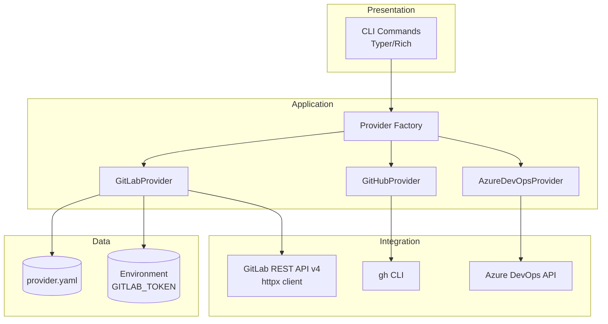

# Implementation Plan: GitLab Git Provider Support

**Branch**: `048-gitlab-provider` | **Date**: 2026-01-22 | **Spec**: [spec.md](spec.md)
**Input**: Feature specification from `/specs/048-gitlab-provider/spec.md`

**Note**: This template is filled in by the `/doit.planit` command. See `.claude/commands/doit.planit.md` for the execution workflow.

## Summary

Implement full GitLab support in the doit CLI by completing the existing `GitLabProvider` stub. This involves implementing all methods from the `GitProvider` abstract interface using GitLab REST API v4 (`/api/v4/`), supporting both gitlab.com and self-hosted instances via httpx HTTP client with Personal Access Token authentication.

## Technical Context

**Language/Version**: Python 3.11+ (per constitution tech-stack.md)
**Primary Dependencies**: Typer (CLI), Rich (output), httpx (HTTP client), pytest (testing)
**Storage**: File-based (provider config in `.doit/config/provider.yaml`)
**Testing**: pytest with mocked httpx responses
**Target Platform**: Cross-platform (Linux, macOS, Windows)
**Project Type**: single (CLI tool with service layer)
**Performance Goals**: API calls complete within 5 seconds under normal network conditions (per spec SC-002)
**Constraints**: Must maintain interface compatibility with existing GitProvider abstraction
**Scale/Scope**: Single provider implementation extending existing multi-provider architecture

## Architecture Overview

<!-- BEGIN:AUTO-GENERATED section="architecture" -->

<!-- END:AUTO-GENERATED -->

## Constitution Check

*GATE: Must pass before Phase 0 research. Re-check after Phase 1 design.*

| Principle | Status | Notes |
|-----------|--------|-------|
| I. Specification-First | ✅ PASS | spec.md created and approved before implementation |
| II. Persistent Memory | ✅ PASS | Provider config stored in `.doit/config/provider.yaml` |
| III. Auto-Generated Diagrams | ✅ PASS | Mermaid diagrams generated from Technical Context |
| IV. Opinionated Workflow | ✅ PASS | Following specit → planit → taskit → implementit flow |
| V. AI-Native Design | ✅ PASS | Slash commands work with AI assistants |

**Tech Stack Alignment**:
| Tech Choice | Constitution Tech Stack | Status |
|-------------|------------------------|--------|
| Python 3.11+ | Python 3.11+ | ✅ Aligned |
| httpx | httpx (HTTP client) | ✅ Aligned |
| Typer | Typer (CLI framework) | ✅ Aligned |
| Rich | Rich (terminal formatting) | ✅ Aligned |
| pytest | pytest (testing framework) | ✅ Aligned |

**Gate Result**: ✅ PASS - All principles satisfied, tech stack aligned.

## Project Structure

### Documentation (this feature)

```text
specs/048-gitlab-provider/
├── spec.md              # Feature specification
├── plan.md              # This file (/doit.planit command output)
├── research.md          # Phase 0 output (/doit.planit command)
├── data-model.md        # Phase 1 output (/doit.planit command)
├── quickstart.md        # Phase 1 output (/doit.planit command)
├── contracts/           # Phase 1 output (/doit.planit command)
│   └── gitlab-api.yaml  # OpenAPI spec for GitLab REST API usage
└── tasks.md             # Phase 2 output (/doit.taskit command)
```

### Source Code (repository root)

```text
src/doit_cli/
├── services/
│   └── providers/
│       ├── __init__.py          # Provider exports
│       ├── base.py              # GitProvider abstract base class (existing)
│       ├── exceptions.py        # Provider exceptions (existing)
│       ├── github.py            # GitHubProvider (existing, reference)
│       ├── azure_devops.py      # AzureDevOpsProvider (existing)
│       └── gitlab.py            # GitLabProvider (TO IMPLEMENT)
├── models/
│   └── provider_models.py       # Unified data models (existing)
└── config/
    └── provider_config.py       # Provider configuration handling (existing)

tests/
├── unit/
│   └── services/
│       └── providers/
│           └── test_gitlab.py   # Unit tests for GitLabProvider
└── integration/
    └── providers/
        └── test_gitlab_integration.py  # Integration tests (mocked API)
```

**Structure Decision**: Extending existing single project structure. New code goes in `src/doit_cli/services/providers/gitlab.py` replacing the current stub.

## Complexity Tracking

No constitution violations. Implementation follows existing patterns from GitHubProvider and AzureDevOpsProvider.
