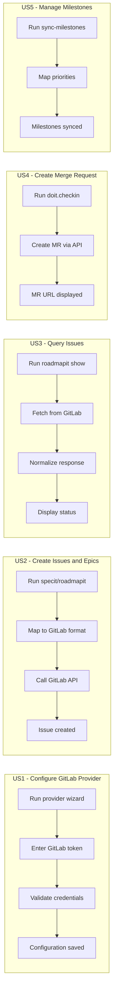

# Feature Specification: GitLab Git Provider Support

**Feature Branch**: `048-gitlab-provider`
**Created**: 2026-01-22
**Status**: Complete
**Epic**: [#637](https://github.com/seanbarlow/doit/issues/637)
**Input**: User description: "GitLab git provider support - Support GitLab as a git provider option, enabling teams using GitLab for source control and CI/CD"

## Summary

Implement full GitLab support in the doit CLI by completing the existing GitLabProvider stub. This enables teams using GitLab for source control to use all doit workflow features (issue creation, merge request management, milestone synchronization) with their GitLab repositories, whether using gitlab.com or self-hosted GitLab instances.

## User Scenarios & Testing *(mandatory)*

### User Story 1 - Configure GitLab Provider (Priority: P1)

A developer using GitLab for their project wants to configure doit to work with their GitLab repository so they can use the full doit workflow with their existing GitLab issues and merge requests.

**Why this priority**: Without proper configuration, no GitLab features can work. This is the foundation that enables all other functionality.

**Independent Test**: Can be fully tested by running the provider wizard with a GitLab repository, entering valid credentials, and verifying the configuration is saved and validated.

**Acceptance Scenarios**:

1. **Given** a project with a GitLab remote URL, **When** the user runs `doit provider wizard`, **Then** GitLab is auto-detected and suggested as the default provider
2. **Given** the user selects GitLab, **When** they enter a valid personal access token, **Then** the token is validated against the GitLab API and user info is displayed
3. **Given** valid credentials, **When** configuration completes, **Then** the provider type, host, and token reference are saved to `.doit/config/provider.yaml`
4. **Given** an invalid or expired token, **When** validation runs, **Then** a clear error message explains the issue with instructions to create a new token

---

### User Story 2 - Create Issues and Epics (Priority: P1)

A developer using `/doit.specit` or `doit roadmapit add` wants to create issues and epics in their GitLab project, with proper labels and parent-child relationships.

**Why this priority**: Issue creation is core to the doit workflow. The GitLab provider must handle this reliably for basic feature development.

**Independent Test**: Can be fully tested by creating an epic and feature issue through the CLI and verifying they appear correctly in GitLab with proper labels and relationships.

**Acceptance Scenarios**:

1. **Given** a configured GitLab provider, **When** `doit roadmapit add` creates an epic, **Then** the issue is created in GitLab with the `Epic` label
2. **Given** a configured GitLab provider, **When** `/doit.specit` creates feature issues, **Then** issues are created with appropriate priority labels (P1, P2, P3, P4)
3. **Given** an epic and feature issue, **When** the feature is linked to the epic, **Then** GitLab's issue relationship is established via related issues API
4. **Given** no GitLab provider configured, **When** issue creation is attempted, **Then** a helpful message explains how to configure the GitLab provider

---

### User Story 3 - Query Issues and Synchronize Status (Priority: P2)

A developer running `doit roadmapit show` wants to see the current status of GitLab issues synchronized with the local roadmap, including open/closed state and labels.

**Why this priority**: Reading issue status is important for project tracking but secondary to creating issues. The workflow functions locally even without this.

**Independent Test**: Can be fully tested by querying existing GitLab issues and verifying the returned data matches what's visible in the GitLab web interface.

**Acceptance Scenarios**:

1. **Given** a configured GitLab provider with existing issues, **When** `doit roadmapit show` runs, **Then** issue state (open/closed) is fetched and displayed
2. **Given** issues with various labels, **When** issues are queried, **Then** labels are correctly mapped to the unified format (epic, feature, priority)
3. **Given** a GitLab API rate limit is reached, **When** a query is attempted, **Then** the system handles the limit gracefully with clear messaging and retry guidance

---

### User Story 4 - Create Merge Requests (Priority: P2)

A developer using `/doit.checkin` wants to create a merge request in GitLab to submit their completed feature for review, with the correct source and target branches.

**Why this priority**: Merge request creation is the final step of the feature workflow. It's important but occurs less frequently than issue operations.

**Independent Test**: Can be fully tested by creating a merge request through the CLI and verifying it appears in GitLab with correct branches and description.

**Acceptance Scenarios**:

1. **Given** a configured GitLab provider, **When** `/doit.checkin` creates a merge request, **Then** it is created with the correct source branch, target branch, and description
2. **Given** a merge request is created successfully, **When** the command completes, **Then** the merge request URL is displayed for the user to review
3. **Given** GitLab terminology, **When** merge requests are referenced, **Then** the CLI uses "Merge Request" and "MR" terminology (not PR)

---

### User Story 5 - Manage Milestones (Priority: P3)

A developer using `doit roadmapit sync-milestones` wants to synchronize priority-based milestones with their GitLab project milestones for better sprint/release planning.

**Why this priority**: Milestone management enhances project tracking but isn't essential for core workflow. Projects can function without milestone sync.

**Independent Test**: Can be fully tested by syncing milestones and verifying they appear correctly in GitLab's milestone list.

**Acceptance Scenarios**:

1. **Given** a configured GitLab provider, **When** `doit roadmapit sync-milestones` runs, **Then** milestones are created or updated in GitLab
2. **Given** priority levels P1-P4 in the roadmap, **When** milestones sync, **Then** corresponding milestones are created with appropriate titles
3. **Given** a milestone already exists in GitLab, **When** sync runs, **Then** the existing milestone is updated rather than duplicated

---

### User Story 6 - Self-Hosted GitLab Support (Priority: P3)

A developer using a self-hosted GitLab instance (not gitlab.com) wants to configure doit to work with their company's GitLab server.

**Why this priority**: Self-hosted GitLab is common in enterprises but gitlab.com support addresses the majority of users.

**Independent Test**: Can be fully tested by configuring a custom GitLab host and verifying API calls are directed to the correct server.

**Acceptance Scenarios**:

1. **Given** a self-hosted GitLab URL in the git remote, **When** provider detection runs, **Then** the custom host is detected and used
2. **Given** the user configures a custom GitLab host, **When** the wizard completes, **Then** all API calls use the specified host
3. **Given** a self-hosted instance with SSL certificate issues, **When** validation runs, **Then** a clear error message explains the SSL issue

---

### Edge Cases

- What happens when the GitLab API is unreachable?
  - System operates in offline mode; commands requiring GitLab access fail gracefully with specific error messages
- How does the system handle token expiration?
  - Clear error message with instructions to create a new token; no silent failures
- What happens when a project doesn't exist or user lacks permissions?
  - Specific error message indicating the permission or access issue with guidance
- How are GitLab-specific features (epics in Premium/Ultimate) handled in free tier?
  - Graceful degradation with warning; use regular issues with Epic label as fallback

## User Journey Visualization

<!-- BEGIN:AUTO-GENERATED section="user-journey" -->

<!-- END:AUTO-GENERATED -->

## Requirements *(mandatory)*

### Functional Requirements

#### Authentication & Configuration

- **FR-001**: System MUST support Personal Access Token (PAT) authentication for GitLab API access
- **FR-002**: System MUST validate the token by calling the `/api/v4/user` endpoint on configuration
- **FR-003**: System MUST support both gitlab.com and self-hosted GitLab instances
- **FR-004**: System MUST store the GitLab host URL in provider configuration (default: gitlab.com)
- **FR-005**: System MUST support token storage via environment variable `GITLAB_TOKEN` or secure credential storage

#### Issue Management

- **FR-010**: System MUST create issues via POST to `/api/v4/projects/:id/issues`
- **FR-011**: System MUST support issue labels for type categorization (Epic, Feature, Bug, Task)
- **FR-012**: System MUST support priority labels (P1, P2, P3, P4)
- **FR-013**: System MUST query issues via GET `/api/v4/projects/:id/issues` with filtering support
- **FR-014**: System MUST update issues via PUT `/api/v4/projects/:id/issues/:iid`
- **FR-015**: System MUST close issues by setting state_event to "close" via the update endpoint
- **FR-016**: System MUST support issue relationships via `/api/v4/projects/:id/issues/:iid/links` (when available)

#### Merge Request Management

- **FR-020**: System MUST create merge requests via POST to `/api/v4/projects/:id/merge_requests`
- **FR-021**: System MUST specify source_branch, target_branch, title, and description in MR creation
- **FR-022**: System MUST return the merge request web_url for user reference
- **FR-023**: System MUST query merge requests via GET `/api/v4/projects/:id/merge_requests`

#### Milestone Management

- **FR-030**: System MUST create milestones via POST to `/api/v4/projects/:id/milestones`
- **FR-031**: System MUST update milestones via PUT `/api/v4/projects/:id/milestones/:id`
- **FR-032**: System MUST query milestones via GET `/api/v4/projects/:id/milestones`
- **FR-033**: System MUST support milestone state filtering (active, closed)
- **FR-034**: System MUST support optional due_date for milestones

#### Error Handling

- **FR-040**: System MUST handle HTTP 401 errors with clear "authentication failed" message and token creation guidance
- **FR-041**: System MUST handle HTTP 403 errors with "insufficient permissions" message
- **FR-042**: System MUST handle HTTP 404 errors with "project or resource not found" message
- **FR-043**: System MUST handle HTTP 429 rate limiting with retry-after guidance
- **FR-044**: System MUST handle network timeouts with retry guidance

#### Label Mapping

- **FR-050**: System MUST map IssueType.EPIC to GitLab label "Epic"
- **FR-051**: System MUST map IssueType.FEATURE to GitLab label "Feature"
- **FR-052**: System MUST map IssueType.BUG to GitLab label "Bug"
- **FR-053**: System MUST map IssueType.TASK to GitLab label "Task"
- **FR-054**: System MUST create labels automatically if they don't exist in the project

### Key Entities

- **GitLabProvider**: Concrete implementation of GitProvider interface for GitLab REST API v4
- **GitLabConfig**: Configuration including host URL, project path, and token reference
- **GitLabLabelMapper**: Maps between unified IssueType/labels and GitLab-specific labels
- **GitLabAPIClient**: HTTP client wrapper with authentication, error handling, and rate limit support

## Success Criteria *(mandatory)*

### Measurable Outcomes

- **SC-001**: All doit commands that work with GitHub also work with GitLab when properly configured
- **SC-002**: Issue creation succeeds on gitlab.com within 5 seconds under normal network conditions
- **SC-003**: Provider configuration completes in under 2 minutes including authentication
- **SC-004**: Clear, actionable error messages are shown for all authentication and API failures
- **SC-005**: Self-hosted GitLab instances are supported without code modifications
- **SC-006**: The GitLabProvider returns is_available = True and implements all interface methods
- **SC-007**: No ProviderNotImplementedError exceptions are raised from GitLabProvider

## Assumptions

- Users have GitLab accounts with appropriate permissions to create issues and merge requests
- Users can create Personal Access Tokens with `api` scope
- GitLab API v4 is used (GitLab 9.0+, released 2017)
- Network connectivity is available for GitLab operations
- Self-hosted instances run GitLab 12.0+ for full API compatibility

## Out of Scope

- GitLab CI/CD pipeline integration
- Group-level operations (only project-level supported)
- GitLab Premium/Ultimate native Epics feature (use label-based fallback)
- OAuth2 authentication (PAT only for simplicity)
- GitLab GraphQL API (REST v4 only)
- Two-factor authentication handling (token-based auth bypasses 2FA)

## Dependencies

- Existing GitProvider interface from 044-git-provider-abstraction
- Provider configuration system from 047-provider-config-wizard
- Python httpx library for REST API calls
- Existing provider models (Issue, PullRequest, Milestone)
