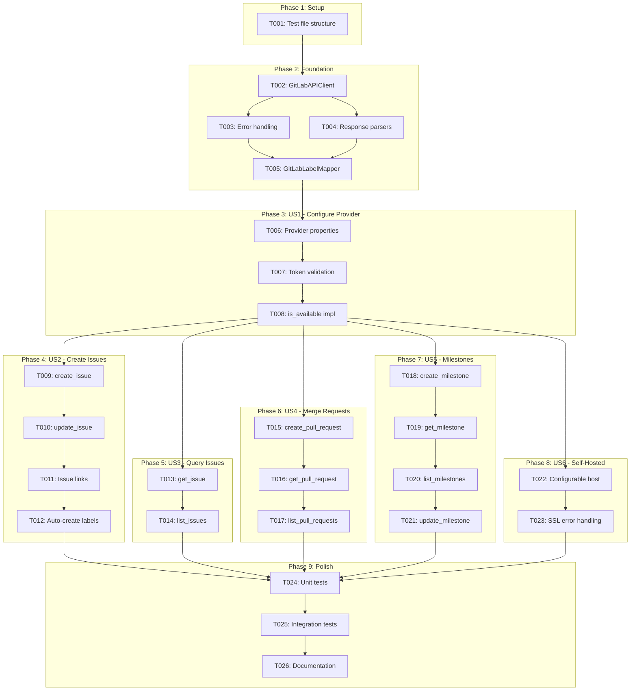
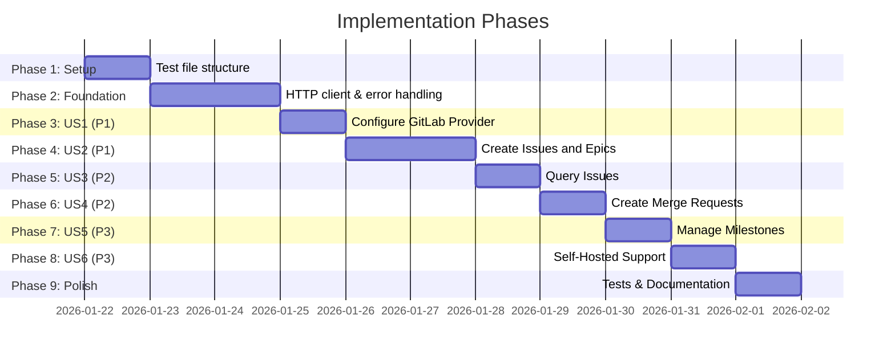

# Tasks: GitLab Git Provider Support

**Input**: Design documents from `/specs/048-gitlab-provider/`
**Prerequisites**: plan.md (required), spec.md (required), research.md, data-model.md, contracts/

**Tests**: No explicit test tasks requested in specification. Unit tests for GitLabProvider to be added in Polish phase.

**Organization**: Tasks are grouped by user story to enable independent implementation and testing of each story.

## Task Dependencies

<!-- BEGIN:AUTO-GENERATED section="task-dependencies" -->

<!-- END:AUTO-GENERATED -->

## Phase Timeline

<!-- BEGIN:AUTO-GENERATED section="phase-timeline" -->

<!-- END:AUTO-GENERATED -->

## Format: `[ID] [P?] [Story] Description`

- **[P]**: Can run in parallel (different files, no dependencies)
- **[Story]**: Which user story this task belongs to (e.g., US1, US2, US3)
- Include exact file paths in descriptions

## Path Conventions

- **Single project**: `src/doit_cli/`, `tests/` at repository root
- Main implementation file: `src/doit_cli/services/providers/gitlab.py`

---

## Phase 1: Setup

**Purpose**: Ensure test infrastructure is ready for GitLabProvider

- [x] T001 Create test file structure at tests/unit/services/providers/test_gitlab.py with empty test class

---

## Phase 2: Foundational (Blocking Prerequisites)

**Purpose**: Core infrastructure that MUST be complete before ANY user story can be implemented

**CRITICAL**: No user story work can begin until this phase is complete

- [x] T002 Implement GitLabAPIClient class with httpx client, base_url, project_path, and token handling in src/doit_cli/services/providers/gitlab.py
- [x] T003 [P] Implement _handle_response() method for HTTP error mapping (401→AuthenticationError, 403→AuthenticationError, 404→ResourceNotFoundError, 429→RateLimitError, 5xx→NetworkError) in src/doit_cli/services/providers/gitlab.py
- [x] T004 [P] Implement response parsing helpers (_parse_issue, _parse_pull_request, _parse_milestone) to convert GitLab JSON to unified models in src/doit_cli/services/providers/gitlab.py
- [x] T005 Implement GitLabLabelMapper class with TYPE_TO_LABEL and PRIORITY_TO_LABEL mappings, to_gitlab_labels() and from_gitlab_labels() methods in src/doit_cli/services/providers/gitlab.py

**Checkpoint**: Foundation ready - user story implementation can now begin

---

## Phase 3: User Story 1 - Configure GitLab Provider (Priority: P1)

**Goal**: Enable developers to configure doit to work with their GitLab repository

**Independent Test**: Run `doit provider wizard`, select GitLab, enter valid token, verify configuration is saved and validated

### Implementation for User Story 1

- [x] T006 [US1] Implement provider_type and name properties (return ProviderType.GITLAB and "GitLab") in src/doit_cli/services/providers/gitlab.py
- [x] T007 [US1] Implement validate_token() method calling GET /api/v4/user endpoint to verify PAT in src/doit_cli/services/providers/gitlab.py
- [x] T008 [US1] Implement is_available property checking GITLAB_TOKEN env var and validating via validate_token() in src/doit_cli/services/providers/gitlab.py

**Checkpoint**: GitLab provider can be configured and validated - `is_available` returns True with valid token

---

## Phase 4: User Story 2 - Create Issues and Epics (Priority: P1)

**Goal**: Enable issue and epic creation in GitLab with proper labels and relationships

**Independent Test**: Create an epic and feature issue through CLI, verify they appear in GitLab with correct labels

### Implementation for User Story 2

- [x] T009 [US2] Implement create_issue() method with POST to /api/v4/projects/:id/issues, label mapping via GitLabLabelMapper in src/doit_cli/services/providers/gitlab.py
- [x] T010 [US2] Implement update_issue() method with PUT to /api/v4/projects/:id/issues/:iid, support state_event for close/reopen in src/doit_cli/services/providers/gitlab.py
- [x] T011 [US2] Implement _create_issue_link() helper method for POST to /api/v4/projects/:id/issues/:iid/links to link features to epics in src/doit_cli/services/providers/gitlab.py
- [x] T012 [US2] Implement _ensure_labels_exist() helper to auto-create missing labels via POST to /api/v4/projects/:id/labels in src/doit_cli/services/providers/gitlab.py

**Checkpoint**: Issues and epics can be created with proper labels and linked together

---

## Phase 5: User Story 3 - Query Issues and Synchronize Status (Priority: P2)

**Goal**: Enable querying GitLab issues to display status in roadmap

**Independent Test**: Query existing GitLab issues, verify returned data matches GitLab web interface

### Implementation for User Story 3

- [x] T013 [US3] Implement get_issue() method with GET to /api/v4/projects/:id/issues/:iid in src/doit_cli/services/providers/gitlab.py
- [x] T014 [US3] Implement list_issues() method with GET to /api/v4/projects/:id/issues with state, labels, milestone filtering in src/doit_cli/services/providers/gitlab.py

**Checkpoint**: Issues can be queried and their status displayed

---

## Phase 6: User Story 4 - Create Merge Requests (Priority: P2)

**Goal**: Enable merge request creation from /doit.checkin

**Independent Test**: Create a merge request through CLI, verify it appears in GitLab with correct branches

### Implementation for User Story 4

- [x] T015 [US4] Implement create_pull_request() method with POST to /api/v4/projects/:id/merge_requests, map source_branch, target_branch, title, description in src/doit_cli/services/providers/gitlab.py
- [x] T016 [US4] Implement get_pull_request() method with GET to /api/v4/projects/:id/merge_requests/:iid in src/doit_cli/services/providers/gitlab.py
- [x] T017 [US4] Implement list_pull_requests() method with GET to /api/v4/projects/:id/merge_requests with state, source_branch, target_branch filtering in src/doit_cli/services/providers/gitlab.py

**Checkpoint**: Merge requests can be created and queried

---

## Phase 7: User Story 5 - Manage Milestones (Priority: P3)

**Goal**: Enable milestone synchronization with GitLab

**Independent Test**: Sync milestones, verify they appear correctly in GitLab milestone list

### Implementation for User Story 5

- [x] T018 [US5] Implement create_milestone() method with POST to /api/v4/projects/:id/milestones in src/doit_cli/services/providers/gitlab.py
- [x] T019 [US5] Implement get_milestone() method with GET to /api/v4/projects/:id/milestones/:id in src/doit_cli/services/providers/gitlab.py
- [x] T020 [US5] Implement list_milestones() method with GET to /api/v4/projects/:id/milestones with state filtering in src/doit_cli/services/providers/gitlab.py
- [x] T021 [US5] Implement update_milestone() method with PUT to /api/v4/projects/:id/milestones/:id, support state_event for close/activate in src/doit_cli/services/providers/gitlab.py

**Checkpoint**: Milestones can be created, queried, and updated

---

## Phase 8: User Story 6 - Self-Hosted GitLab Support (Priority: P3)

**Goal**: Enable doit to work with self-hosted GitLab instances

**Independent Test**: Configure custom GitLab host, verify API calls use specified host

### Implementation for User Story 6

- [x] T022 [US6] Update GitLabAPIClient.__init__() to accept host parameter with gitlab.com default, construct base_url dynamically in src/doit_cli/services/providers/gitlab.py
- [x] T023 [US6] Add SSL certificate error handling with clear error message in _handle_response() for truststore/SSL issues in src/doit_cli/services/providers/gitlab.py

**Checkpoint**: Self-hosted GitLab instances work without code modifications

---

## Phase 9: Polish & Cross-Cutting Concerns

**Purpose**: Tests, documentation, and final validation

- [x] T024 [P] Add unit tests for GitLabProvider with mocked httpx responses in tests/unit/services/providers/test_gitlab.py
- [x] T025 Add integration test scaffolding with environment-based GitLab API testing in tests/integration/providers/test_gitlab_integration.py
- [x] T026 [P] Update quickstart.md with actual implementation examples based on final code in specs/048-gitlab-provider/quickstart.md

---

## Dependencies & Execution Order

### Phase Dependencies

- **Setup (Phase 1)**: No dependencies - can start immediately
- **Foundational (Phase 2)**: Depends on Setup completion - BLOCKS all user stories
- **User Stories (Phases 3-8)**: All depend on Foundational phase completion
  - US1 (Phase 3) must complete before US2-US6 (all need is_available)
  - US2-US6 can proceed in parallel after US1
- **Polish (Phase 9)**: Depends on all user stories being complete

### User Story Dependencies

- **User Story 1 (P1)**: Can start after Foundational (Phase 2) - Foundation for all other stories
- **User Story 2 (P1)**: Depends on US1 completion (needs is_available)
- **User Story 3 (P2)**: Depends on US1 completion (needs is_available)
- **User Story 4 (P2)**: Depends on US1 completion (needs is_available)
- **User Story 5 (P3)**: Depends on US1 completion (needs is_available)
- **User Story 6 (P3)**: Depends on US1 completion (extends configuration)

### Within Each User Story

- HTTP client methods before service methods
- Service methods before helper utilities
- Story complete before moving to next priority

### Parallel Opportunities

- T003 and T004 can run in parallel (different concerns)
- After US1 completes, US2-US6 can start in parallel (if team capacity allows)
- T024 and T026 can run in parallel (tests vs docs)

---

## Parallel Example: Phase 2 Foundation

```bash
# After T002 completes, launch T003 and T004 together:
Task: "Implement _handle_response() for HTTP error mapping in src/doit_cli/services/providers/gitlab.py"
Task: "Implement response parsing helpers in src/doit_cli/services/providers/gitlab.py"
```

---

## Implementation Strategy

### MVP First (User Stories 1 + 2 Only)

1. Complete Phase 1: Setup
2. Complete Phase 2: Foundational (CRITICAL - blocks all stories)
3. Complete Phase 3: User Story 1 - Configure Provider
4. Complete Phase 4: User Story 2 - Create Issues
5. **STOP and VALIDATE**: GitLab provider can create issues with labels
6. Deploy/demo if ready - basic GitLab support is functional

### Incremental Delivery

1. Complete Setup + Foundational + US1 + US2 → MVP! (issue creation works)
2. Add US3 (Query Issues) → Roadmap sync works
3. Add US4 (Merge Requests) → /doit.checkin works
4. Add US5 (Milestones) → Full milestone sync
5. Add US6 (Self-Hosted) → Enterprise support
6. Each story adds value without breaking previous stories

### Single File Implementation

All tasks modify the same file: `src/doit_cli/services/providers/gitlab.py`

This is intentional - the GitLabProvider is a single cohesive class. Execute tasks sequentially within each phase.

---

## Notes

- [P] tasks = different concerns, can run in parallel
- [Story] label maps task to specific user story for traceability
- Each user story should be independently completable and testable
- Commit after each task or logical group
- Stop at any checkpoint to validate story independently
- All implementation in single file: `src/doit_cli/services/providers/gitlab.py`
