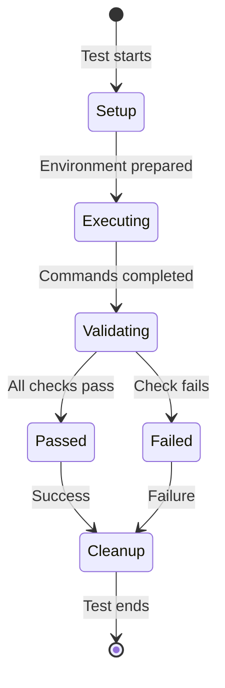

# Data Model: End-to-End Testing for Windows and PowerShell

**Feature**: 049-e2e-windows-tests
**Phase**: 1 (Design & Contracts)
**Date**: 2026-01-26

## Overview

This document defines the data structures and models used in the Windows and PowerShell end-to-end testing infrastructure. Since this is a testing feature rather than a business domain feature, the models focus on test configuration, test results, and test artifacts rather than persistent business entities.

## Test Data Structures

### TestEnvironment

Represents the Windows test environment configuration and state.

**Attributes**:
- `platform`: str - Platform identifier (e.g., 'win32', 'Windows-10', 'Windows-11')
- `powershell_version`: str - PowerShell version (e.g., '7.3.0')
- `python_version`: str - Python version (e.g., '3.11.5')
- `git_version`: str - Git for Windows version (e.g., '2.42.0.windows.1')
- `is_ci`: bool - Whether running in CI environment
- `temp_dir`: Path - Temporary directory for test artifacts
- `encoding`: str - System encoding (typically 'utf-8')
- `line_ending`: str - Default line ending ('CRLF' or 'LF')

**Purpose**: Captures environment details for test execution and result interpretation.

**Lifecycle**: Created at test session start, destroyed at test session end.

---

### PowerShellScriptResult

Represents the result of executing a PowerShell script during testing.

**Attributes**:
- `script_path`: Path - Path to the executed PowerShell script
- `exit_code`: int - Script exit code (0 for success)
- `stdout`: str - Standard output captured from script
- `stderr`: str - Standard error captured from script
- `execution_time`: float - Execution time in seconds
- `args`: list[str] - Arguments passed to script
- `environment_vars`: dict[str, str] - Environment variables set for execution

**Purpose**: Stores comprehensive result data from PowerShell script execution for validation and comparison.

**Lifecycle**: Created for each PowerShell script test execution.

---

### CrossPlatformComparisonResult

Represents the result of comparing Windows and Linux test outputs.

**Attributes**:
- `test_name`: str - Name of the test case
- `windows_output`: str - Normalized Windows output
- `linux_output`: str - Normalized Linux output
- `matches`: bool - Whether outputs match after normalization
- `discrepancies`: list[Discrepancy] - List of identified differences
- `normalization_applied`: list[str] - List of normalizations applied (e.g., 'line_endings', 'paths')

**Discrepancy SubStructure**:
- `location`: str - Where the discrepancy was found (line number or section)
- `windows_value`: str - Value from Windows output
- `linux_value`: str - Value from Linux output
- `severity`: str - 'critical' | 'warning' | 'info'
- `description`: str - Human-readable explanation

**Purpose**: Tracks cross-platform parity validation results for reporting.

**Lifecycle**: Created for each cross-platform comparison test.

---

### TestArtifact

Represents files and data generated during test execution.

**Attributes**:
- `artifact_type`: str - Type of artifact (e.g., 'spec', 'plan', 'log', 'screenshot')
- `file_path`: Path - Path to the artifact file
- `test_case`: str - Test case that generated the artifact
- `created_at`: datetime - Timestamp of artifact creation
- `size_bytes`: int - File size in bytes
- `description`: str - Human-readable description

**Purpose**: Tracks all files generated during test execution for cleanup and CI artifact upload.

**Lifecycle**: Created during test execution, persisted for CI artifact collection, cleaned up after test session.

---

### WindowsPathInfo

Represents Windows path analysis for validation testing.

**Attributes**:
- `original_path`: str - Original path as provided
- `normalized_path`: str - Normalized path (forward slashes)
- `is_absolute`: bool - Whether path is absolute
- `drive_letter`: str | None - Drive letter if Windows absolute path (e.g., 'C')
- `is_unc`: bool - Whether path is UNC path (\\\\server\\share)
- `length`: int - Path length in characters
- `exceeds_max_path`: bool - Whether path exceeds Windows MAX_PATH (260 chars)
- `contains_reserved_name`: bool - Whether path contains reserved filename
- `reserved_name`: str | None - The reserved name if present (e.g., 'CON', 'PRN')

**Purpose**: Analyzes Windows path characteristics for validation in path handling tests.

**Lifecycle**: Created on-demand during path validation tests.

---

### E2EWorkflowResult

Represents the result of running a full end-to-end workflow test.

**Attributes**:
- `workflow_name`: str - Name of workflow (e.g., 'init-to-checkin')
- `commands_executed`: list[str] - List of doit commands executed in order
- `success`: bool - Whether workflow completed successfully
- `failure_point`: str | None - Command that failed (if any)
- `generated_files`: list[Path] - Files generated during workflow
- `execution_time`: float - Total workflow execution time in seconds
- `environment`: TestEnvironment - Environment in which workflow ran

**Purpose**: Captures comprehensive workflow test results for validation and debugging.

**Lifecycle**: Created for each E2E workflow test execution.

---

## Test Fixture Data

### Sample Project Structures

Predefined project structures used as test fixtures:

#### MinimalProject
- Empty project with only `.doit/` directory
- Used for testing `doit init` command

#### SimpleFeatureProject
- Project with one completed feature spec
- Used for testing single-feature workflows

#### MultiFeatureProject
- Project with multiple features in various states
- Used for testing complex scenarios and edge cases

---

## Test Configuration

### WindowsTestConfig

Global configuration for Windows E2E tests (loaded from pyproject.toml or conftest.py).

**Attributes**:
- `powershell_timeout`: int - Timeout for PowerShell script execution (seconds, default: 30)
- `workflow_timeout`: int - Timeout for full workflow tests (seconds, default: 300)
- `artifact_retention`: bool - Whether to retain test artifacts on success (default: False)
- `strict_parity`: bool - Whether cross-platform parity must be exact (default: False)
- `skip_slow_tests`: bool - Whether to skip tests marked as slow (default: False in CI)
- `parallel_execution`: bool - Whether to run tests in parallel (default: False on Windows)

**Purpose**: Centralized configuration for test behavior customization.

---

## Data Flow

```mermaid
flowchart LR
    TEST[Test Case] --> ENV[TestEnvironment]
    TEST --> EXEC[Execute PowerShell Script]
    EXEC --> PS_RESULT[PowerShellScriptResult]

    TEST --> WORKFLOW[Run E2E Workflow]
    WORKFLOW --> E2E_RESULT[E2EWorkflowResult]
    E2E_RESULT --> ARTIFACTS[TestArtifact[]]

    TEST --> COMPARE[Cross-Platform Comparison]
    COMPARE --> COMP_RESULT[CrossPlatformComparisonResult]

    PS_RESULT --> VALIDATE[Validation]
    E2E_RESULT --> VALIDATE
    COMP_RESULT --> VALIDATE

    VALIDATE --> REPORT[Test Report]
```

---

## Validation Rules

### PowerShell Script Validation
- Exit code must be 0 for success cases
- stdout must not be empty for output-producing scripts
- stderr should be empty for success cases (warnings tolerated)
- Execution time must be under timeout threshold

### Cross-Platform Parity Validation
- After normalization (line endings, paths), outputs must match
- Exit codes must match exactly
- File structures (directories, filenames) must match
- File contents must match after normalization
- Discrepancies marked as 'critical' cause test failure

### E2E Workflow Validation
- All commands in workflow must complete successfully
- Expected files must be generated at each step
- File contents must pass validation checks (e.g., spec has required sections)
- Workflow must complete within timeout threshold

---

## State Transitions

Since test data structures are transient (created and destroyed during test execution), they don't have complex state machines. However, E2E workflow tests do have a progression:



---

## Storage and Persistence

**Test artifacts are stored temporarily**:
- Location: `{temp_dir}/doit-test-artifacts/{test_session_id}/`
- Retention: Deleted after test session unless `artifact_retention=True`
- CI Upload: Artifacts uploaded to GitHub Actions on failure or if explicitly configured

**Test results are reported via pytest**:
- Standard pytest result collection
- JUnit XML format for CI integration
- HTML reports for local debugging (pytest-html plugin)

---

## Notes

This data model focuses on test infrastructure rather than business domain entities. All structures are designed to be:
- **Lightweight**: Minimal memory footprint for fast test execution
- **Serializable**: Can be converted to JSON for CI artifact upload
- **Platform-agnostic**: Work on both Windows and Unix systems (with platform-specific fields marked clearly)
