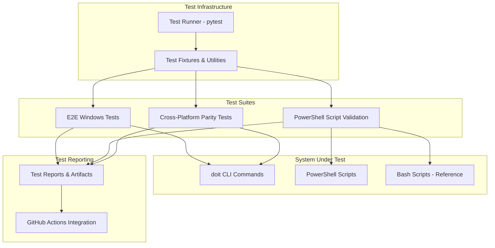

# Implementation Plan: End-to-End Testing for Windows and PowerShell

**Branch**: `049-e2e-windows-tests` | **Date**: 2026-01-26 | **Spec**: [spec.md](spec.md)
**Input**: Feature specification from `/specs/049-e2e-windows-tests/spec.md`

**Note**: This template is filled in by the `/doit.planit` command. See `.claude/commands/doit.planit.md` for the execution workflow.

## Summary

Implement comprehensive end-to-end testing infrastructure for Windows and PowerShell environments to ensure the doit toolkit functions correctly on Windows platforms. The test suite will validate core doit commands, PowerShell script functionality, cross-platform parity, and CI/CD integration with GitHub Actions Windows runners. This ensures Windows users have the same reliable experience as Linux/macOS users, with automated testing preventing platform-specific regressions.

## Technical Context

**Language/Version**: Python 3.11+ (from constitution)
**Primary Dependencies**: pytest (testing framework), typer (CLI framework), rich (terminal formatting)
**Storage**: File-based (markdown specs, test artifacts in `.doit/` directories)
**Testing**: pytest with platform-specific markers and fixtures
**Target Platform**: Windows 10 and Windows 11, with PowerShell 7.x
**Project Type**: single (CLI tool with testing infrastructure)
**Performance Goals**: Test suite execution under 5 minutes on standard Windows development machines; CI workflow completion within 10 minutes
**Constraints**: Must handle Windows path limitations (260 characters), CRLF line endings, case-insensitive filesystem; PowerShell 7.x required (not Windows PowerShell 5.1)
**Scale/Scope**: 15 functional requirements across 4 user stories (2 P1, 1 P2, 1 P3); comprehensive coverage of Windows-specific edge cases

## Architecture Overview

<!-- BEGIN:AUTO-GENERATED section="architecture" -->

<!-- END:AUTO-GENERATED -->

## Constitution Check

*GATE: Must pass before Phase 0 research. Re-check after Phase 1 design.*

### Alignment Verification

- **✓ Tech Stack Alignment**: Uses Python 3.11+ and pytest per constitution
- **✓ Dependencies Alignment**: Leverages existing dependencies (typer, rich) from constitution
- **✓ Infrastructure Alignment**: File-based storage in `.doit/` directories consistent with constitution principle II (Persistent Memory)
- **✓ Deployment Alignment**: GitHub Actions CI/CD consistent with constitution deployment strategy
- **✓ Core Principles**: Follows specification-first approach (Principle I), maintains all context in markdown files (Principle II)
- **✓ Quality Standards**: All code includes tests per constitution standards
- **✓ Workflow Alignment**: Follows opinionated workflow (Principle IV): specit → planit → taskit → implementit

### New Dependencies

No new external dependencies required. Feature uses existing constitution tech stack:
- pytest (already in constitution)
- Python 3.11+ (already in constitution)
- Platform-specific test markers (pytest built-in feature)

### Deviations

**None**. This feature is fully aligned with constitution principles and tech stack.

## Project Structure

### Documentation (this feature)

```text
specs/049-e2e-windows-tests/
├── plan.md              # This file (/doit.planit command output)
├── research.md          # Phase 0 output (/doit.planit command)
├── data-model.md        # Phase 1 output (/doit.planit command)
├── quickstart.md        # Phase 1 output (/doit.planit command)
├── contracts/           # Phase 1 output (/doit.planit command)
│   └── test-api.md     # Testing API contracts and patterns
└── tasks.md             # Phase 2 output (/doit.taskit command - NOT created by /doit.planit)
```

### Source Code (repository root)

```text
tests/
├── e2e/
│   └── windows/
│       ├── __init__.py
│       ├── conftest.py                    # Windows-specific fixtures
│       ├── test_init_workflow.py          # Test doit init on Windows
│       ├── test_specit_workflow.py        # Test doit specit on Windows
│       ├── test_planit_workflow.py        # Test doit planit on Windows
│       ├── test_taskit_workflow.py        # Test doit taskit on Windows
│       ├── test_implementit_workflow.py   # Test doit implementit on Windows
│       ├── test_checkin_workflow.py       # Test doit checkin on Windows
│       ├── test_powershell_scripts.py     # PowerShell script validation
│       └── test_cross_platform_parity.py  # Cross-platform comparison tests
│
├── fixtures/
│   └── windows/
│       ├── sample_projects/               # Sample project structures for testing
│       ├── expected_outputs/              # Expected outputs for validation
│       └── test_scripts/                  # Test PowerShell and Bash scripts
│
└── utils/
    └── windows/
        ├── path_utils.py                  # Windows path handling utilities
        ├── line_ending_utils.py           # CRLF/LF normalization utilities
        └── comparison_utils.py            # Output comparison utilities

.github/
└── workflows/
    └── windows-e2e-tests.yml              # GitHub Actions Windows workflow

pyproject.toml                             # Update with pytest markers for Windows tests
```

**Structure Decision**: Extended the existing tests/ directory with a new e2e/windows/ subdirectory to house Windows-specific E2E tests. This maintains separation of concerns while integrating with the existing pytest infrastructure. Added GitHub Actions workflow for CI integration. Test utilities are organized in tests/utils/windows/ for reusability across test modules.

## Complexity Tracking

> **Fill ONLY if Constitution Check has violations that must be justified**

No violations. This feature is fully compliant with constitution principles and tech stack.

## Phase 0: Research & Resolution

*See [research.md](research.md) for detailed findings and decisions.*

### Key Research Areas

1. **Pytest Windows-Specific Configuration**
   - Platform markers for selective test execution
   - Fixture design for Windows environment setup
   - Path handling strategies for cross-platform tests

2. **PowerShell Script Testing Patterns**
   - Best practices for testing PowerShell scripts from Python
   - Output capture and comparison techniques
   - Error handling validation approaches

3. **Cross-Platform Test Parity**
   - Normalization strategies for path separators
   - Line ending handling (CRLF vs LF)
   - Output comparison tolerances for platform differences

4. **GitHub Actions Windows Runner**
   - Available tools and pre-installed software
   - Performance characteristics and limitations
   - Artifact upload strategies for test results

5. **Windows-Specific Edge Cases**
   - Path length limitations (260 characters)
   - Reserved filenames (CON, PRN, AUX, etc.)
   - Case-insensitive filesystem behavior
   - PowerShell execution policies
   - File permission handling (no chmod equivalent)

### Decisions Made

*Detailed in research.md - see Phase 0 output*

## Phase 1: Design & Contracts

*See [data-model.md](data-model.md), [contracts/](contracts/), and [quickstart.md](quickstart.md) for details.*

### Core Components

1. **Test Runner Configuration** (tests/e2e/windows/conftest.py)
   - Windows-specific pytest fixtures
   - Environment setup and teardown
   - Path normalization utilities
   - PowerShell session management

2. **E2E Test Suites** (tests/e2e/windows/test_*.py)
   - One test module per doit command
   - Comprehensive acceptance scenario coverage
   - Error condition validation
   - Output verification

3. **PowerShell Script Validator** (tests/e2e/windows/test_powershell_scripts.py)
   - Script discovery and execution
   - Output comparison with Bash equivalents
   - Error handling validation
   - Environment variable testing

4. **Cross-Platform Parity Checker** (tests/e2e/windows/test_cross_platform_parity.py)
   - Parallel test execution on Windows and Linux
   - Output normalization and comparison
   - Discrepancy reporting

5. **Test Utilities** (tests/utils/windows/*.py)
   - Path handling utilities for Windows paths
   - Line ending normalization (CRLF ↔ LF)
   - Output comparison with tolerances
   - Windows-specific helper functions

6. **CI/CD Integration** (.github/workflows/windows-e2e-tests.yml)
   - GitHub Actions workflow for Windows runners
   - Artifact collection and upload
   - Test result reporting
   - Failure diagnostics

### Testing Strategy

- **Unit Tests**: Test utilities in tests/utils/windows/
- **Integration Tests**: Individual command workflows
- **E2E Tests**: Full workflow sequences (init → specit → planit → taskit)
- **Parity Tests**: Cross-platform comparison tests

### Key Contracts

*See [contracts/test-api.md](contracts/test-api.md) for detailed API contracts*

- Test fixture interfaces for Windows environment
- PowerShell script execution interface
- Output comparison and validation interface
- CI/CD workflow contract for GitHub Actions

## Next Steps

**After this command completes**:
1. Run `/doit.taskit` to generate actionable implementation tasks
2. Review [research.md](research.md) for technical decisions and rationale
3. Review [data-model.md](data-model.md) for test data structures (if applicable)
4. Review [contracts/test-api.md](contracts/test-api.md) for testing interfaces
5. Review [quickstart.md](quickstart.md) for developer onboarding guide
