# Feature Specification: End-to-End Testing for Windows and PowerShell

**Feature Branch**: `049-e2e-windows-tests`
**Created**: 2026-01-26
**Status**: Draft
**Input**: User description: "end-to-end testing for windows and powershell"

## User Scenarios & Testing *(mandatory)*

### User Story 1 - Windows E2E Test Execution (Priority: P1)

A developer working on the doit toolkit needs to verify that all commands and workflows function correctly on Windows systems before releasing a new version. They need an automated test suite that runs the complete workflow from initialization through feature completion, validating that Windows-specific paths, line endings, and PowerShell scripts all work as expected.

**Why this priority**: This is the foundation for Windows support validation. Without basic E2E testing on Windows, we cannot confidently support Windows users, and regressions may go undetected until production use.

**Independent Test**: Can be fully tested by executing a test command (e.g., `pytest tests/e2e/test_windows_basic.py`) on a Windows machine and verifying that all core doit commands (init, specit, planit, etc.) complete successfully with expected output.

**Acceptance Scenarios**:

1. **Given** a fresh Windows 10 or 11 environment with Python 3.11+ installed, **When** a developer runs the E2E test suite with `pytest tests/e2e/windows/`, **Then** all tests pass and a summary report shows 100% success rate
2. **Given** the doit toolkit is installed on Windows, **When** E2E tests execute the full workflow (init → specit → planit → taskit → implementit), **Then** each command completes without errors and produces expected output files
3. **Given** Windows-specific path handling requirements, **When** tests create and navigate project directories with spaces or special characters, **Then** all file operations succeed without path-related errors
4. **Given** CRLF line ending conventions on Windows, **When** tests generate markdown files and scripts, **Then** line endings are correctly preserved and files are readable by Windows tools

---

### User Story 2 - PowerShell Script Validation (Priority: P1)

A developer needs to ensure that PowerShell script equivalents of Bash scripts work identically on Windows systems. The test suite must validate that PowerShell scripts produce the same outcomes as their Bash counterparts, ensuring feature parity between Unix and Windows environments.

**Why this priority**: PowerShell is the primary scripting environment on Windows. If PowerShell scripts fail or produce different results than Bash scripts, Windows users will have a broken experience, making this critical for cross-platform support.

**Independent Test**: Can be fully tested by running PowerShell-specific test cases that execute each `.ps1` script with known inputs and verify outputs match expected results, including exit codes, stdout/stderr content, and created files.

**Acceptance Scenarios**:

1. **Given** PowerShell 7.x is available on the test system, **When** E2E tests execute PowerShell scripts with standard inputs, **Then** scripts complete successfully and produce output identical to Bash script equivalents
2. **Given** a PowerShell script that creates project structure, **When** tests run the script and verify created directories/files, **Then** all expected artifacts exist with correct content and permissions
3. **Given** error conditions in PowerShell scripts, **When** tests trigger error scenarios (missing files, invalid arguments), **Then** scripts return appropriate error codes and user-friendly error messages
4. **Given** environment variables required by scripts, **When** tests set up Windows-style environment variables (e.g., `$env:VAR`), **Then** PowerShell scripts correctly read and use these variables

---

### User Story 3 - Cross-Platform Parity Validation (Priority: P2)

A maintainer needs to verify that the doit toolkit behaves identically on Windows and Unix systems. The test suite must run the same test scenarios on both platforms and flag any differences in behavior, ensuring users have a consistent experience regardless of operating system.

**Why this priority**: Cross-platform consistency is important for user trust and documentation accuracy, but individual platform functionality (P1) must work first. This validates that both implementations meet the same requirements.

**Independent Test**: Can be fully tested by running a comparison test suite that executes identical commands on both Windows (PowerShell) and Linux (Bash), then compares outputs (files created, console output, exit codes) and reports any discrepancies.

**Acceptance Scenarios**:

1. **Given** identical test scenarios defined in platform-agnostic format, **When** tests run on both Windows and Linux environments, **Then** generated files (specs, plans, tasks) have identical content (ignoring line endings)
2. **Given** the same doit command executed on both platforms, **When** tests capture and normalize output (paths, line endings), **Then** normalized outputs match exactly
3. **Given** configuration files (constitution.md, roadmap.md) with cross-platform paths, **When** tests read and process these files on both systems, **Then** path resolution works correctly on both platforms
4. **Given** Git operations performed by doit commands, **When** tests execute git-related workflows on both platforms, **Then** branch creation, commits, and status checks work identically

---

### User Story 4 - CI/CD Integration for Windows Testing (Priority: P3)

A DevOps engineer needs to integrate Windows E2E tests into the CI/CD pipeline to automatically validate Windows functionality on every pull request and release. The test suite must be executable in GitHub Actions Windows runners and provide clear failure diagnostics.

**Why this priority**: Automated testing in CI prevents regressions, but manual testing can suffice initially. This becomes critical for maintaining quality at scale but isn't required for initial Windows support.

**Independent Test**: Can be fully tested by configuring a GitHub Actions workflow that runs on Windows runners, executes the E2E test suite, and successfully reports results with proper artifacts and failure notifications.

**Acceptance Scenarios**:

1. **Given** a GitHub Actions workflow configured for Windows runners, **When** a pull request is created with code changes, **Then** Windows E2E tests execute automatically and results appear in the PR checks
2. **Given** test execution in CI environment, **When** tests complete (pass or fail), **Then** test artifacts (logs, screenshots, generated files) are uploaded and accessible for debugging
3. **Given** a test failure in CI, **When** developers review the failure report, **Then** error messages clearly identify the failing test, platform-specific details, and relevant stack traces
4. **Given** test execution time constraints in CI, **When** the full E2E suite runs, **Then** tests complete within 10 minutes to avoid workflow timeouts

---

### Edge Cases

- What happens when PowerShell execution policy blocks script execution?
- How does the system handle Windows paths with mixed forward/backward slashes?
- What occurs when Git is not in the Windows PATH environment variable?
- How are file permissions handled differently between Windows and Unix (no chmod)?
- What happens when Windows line endings (CRLF) are mixed with Unix line endings (LF) in the same repository?
- How does testing handle Windows-specific limitations (path length limits, reserved filenames like CON, PRN)?
- What occurs when tests run on Windows with case-insensitive filesystem but code assumes case-sensitivity?
- How are symbolic links handled on Windows vs Unix?

## User Journey Visualization

```mermaid
flowchart LR
    subgraph "US1: Windows E2E Test Execution"
        US1_S[Developer on Windows] --> US1_A1[Run pytest tests/e2e/windows/]
        US1_A1 --> US1_A2[Execute init → specit → planit workflow]
        US1_A2 --> US1_A3[Validate paths, line endings, outputs]
        US1_A3 --> US1_E[All tests pass with report]
    end

    subgraph "US2: PowerShell Script Validation"
        US2_S[Developer testing scripts] --> US2_A1[Execute .ps1 scripts]
        US2_A1 --> US2_A2[Verify outputs match Bash equivalents]
        US2_A2 --> US2_A3[Test error handling]
        US2_A3 --> US2_E[Scripts pass validation]
    end

    subgraph "US3: Cross-Platform Parity"
        US3_S[Maintainer validates parity] --> US3_A1[Run tests on Windows & Linux]
        US3_A1 --> US3_A2[Compare normalized outputs]
        US3_A2 --> US3_A3[Identify discrepancies]
        US3_A3 --> US3_E[Parity report generated]
    end

    subgraph "US4: CI/CD Integration"
        US4_S[DevOps configures CI] --> US4_A1[Setup GitHub Actions Windows runner]
        US4_A1 --> US4_A2[Execute E2E tests on PR]
        US4_A2 --> US4_A3[Upload test artifacts]
        US4_A3 --> US4_E[CI results in PR checks]
    end
```

<!-- BEGIN:AUTO-GENERATED section="user-journey" -->

<!-- END:AUTO-GENERATED -->

## Requirements *(mandatory)*

### Functional Requirements

- **FR-001**: System MUST execute end-to-end test suite on Windows 10 and Windows 11 operating systems
- **FR-002**: System MUST test all PowerShell scripts (`.ps1` files) for correct execution and expected output
- **FR-003**: System MUST validate that PowerShell script outputs match Bash script equivalents for cross-platform parity
- **FR-004**: System MUST detect and validate Windows-specific path handling (backslashes, drive letters, UNC paths)
- **FR-005**: System MUST verify correct handling of Windows line endings (CRLF) in generated files
- **FR-006**: System MUST test all core doit commands (init, specit, planit, taskit, implementit, checkin) on Windows
- **FR-007**: System MUST validate Git operations (branch creation, commits, status) work correctly on Windows
- **FR-008**: System MUST provide clear test failure messages with platform-specific diagnostic information
- **FR-009**: System MUST generate test reports showing pass/fail status for each test case
- **FR-010**: System MUST support execution in GitHub Actions Windows runners for CI/CD integration
- **FR-011**: System MUST test error handling for Windows-specific limitations (path length, reserved filenames, execution policies)
- **FR-012**: System MUST validate environment variable handling in PowerShell scripts (`$env:VAR` syntax)
- **FR-013**: System MUST test file and directory operations with Windows paths containing spaces and special characters
- **FR-014**: System MUST verify that configuration files (constitution.md, roadmap.md) are correctly parsed on Windows
- **FR-015**: System MUST test that generated markdown files are compatible with Windows markdown viewers

### Key Entities

Since this feature focuses on testing infrastructure rather than data modeling, there are no persistent entities to define. The feature involves test cases, test results, and test artifacts, which are transient and tied to test execution rather than core domain entities.

## Success Criteria *(mandatory)*

### Measurable Outcomes

- **SC-001**: E2E test suite runs successfully on Windows 10 and Windows 11 with 100% test pass rate
- **SC-002**: Test suite completes execution in under 5 minutes on standard Windows development machines
- **SC-003**: Test coverage for PowerShell scripts exceeds 80% (lines of code executed during tests)
- **SC-004**: Cross-platform parity tests report zero behavioral discrepancies between Windows and Linux implementations
- **SC-005**: GitHub Actions Windows workflow executes successfully on every PR with test results visible within 10 minutes
- **SC-006**: Test failure diagnostics enable developers to identify and fix Windows-specific issues within 1 hour of test execution
- **SC-007**: Zero Windows-specific regressions detected in production after implementing this test suite
- **SC-008**: 95% of Windows-specific edge cases (path handling, line endings, permissions) are covered by automated tests

## Out of Scope *(optional)*

The following are explicitly **not** included in this feature:

- **macOS E2E testing**: This feature focuses specifically on Windows. macOS testing would be a separate feature.
- **Legacy Windows versions**: Only Windows 10 and Windows 11 are supported. Windows 7/8 are not tested.
- **Windows-specific GUI testing**: Testing focuses on CLI and scripting. GUI interactions are out of scope.
- **Performance benchmarking**: While execution time is measured, detailed performance profiling is not included.
- **Security testing**: Penetration testing or security vulnerability scanning is not part of this feature.
- **Non-PowerShell shells**: Testing does not cover Command Prompt (cmd.exe) or alternative shells like Cygwin.

## Assumptions *(optional)*

- **Assumption 1**: Test environments have PowerShell 7.x or later installed (not the legacy Windows PowerShell 5.1)
- **Assumption 2**: Python 3.11+ is available on Windows test systems with pytest installed
- **Assumption 3**: Git for Windows is installed and available in the system PATH
- **Assumption 4**: Test runners have sufficient permissions to execute PowerShell scripts (execution policy allows it)
- **Assumption 5**: GitHub Actions Windows runners provide a representative Windows environment for testing
- **Assumption 6**: Existing Bash-based tests serve as the reference implementation for expected behavior
- **Assumption 7**: Line ending normalization (CRLF ↔ LF) is acceptable when comparing outputs across platforms

## Dependencies *(optional)*

- **Dependency 1**: Requires pytest testing framework with platform-specific test markers
- **Dependency 2**: Requires existing PowerShell scripts (if they don't exist, they must be created first)
- **Dependency 3**: Requires GitHub Actions Windows runner access for CI integration (User Story 4)
- **Dependency 4**: Requires documented expected outputs/behaviors for cross-platform comparison tests
- **Dependency 5**: May require Python packages for Windows-specific operations (e.g., `pywin32` for advanced Windows APIs)

## Risks *(optional)*

- **Risk 1**: Windows environment variability (different configurations, installed software) may cause non-deterministic test failures
- **Risk 2**: PowerShell version differences between systems may lead to script compatibility issues
- **Risk 3**: GitHub Actions Windows runner limitations (execution time, available tools) may constrain test coverage
- **Risk 4**: Path length limitations on Windows (260 characters) may cause failures with deeply nested project structures
- **Risk 5**: Windows Defender or antivirus software may interfere with test execution by blocking script operations

## Technical Constraints *(optional)*

- **Constraint 1**: Tests must run on Windows 10 and Windows 11 (no older Windows versions)
- **Constraint 2**: PowerShell 7.x is required (Windows PowerShell 5.1 compatibility is not guaranteed)
- **Constraint 3**: Test execution must complete within GitHub Actions free tier time limits (10 minutes per workflow)
- **Constraint 4**: Test data and artifacts must respect Windows path length limitations (260 characters)
- **Constraint 5**: Tests must handle Windows filesystem case-insensitivity without assuming case-sensitivity

## Future Enhancements *(optional)*

- **Enhancement 1**: Add support for Windows Subsystem for Linux (WSL) testing to validate hybrid environments
- **Enhancement 2**: Implement automated screenshot capture for debugging test failures in CI
- **Enhancement 3**: Create a Windows-specific test data generator for realistic scenario testing
- **Enhancement 4**: Add performance profiling to identify slow operations on Windows compared to Linux
- **Enhancement 5**: Develop a test dashboard showing historical pass/fail rates and common failure patterns
- **Enhancement 6**: Create Docker-based Windows test environments for consistent local testing
