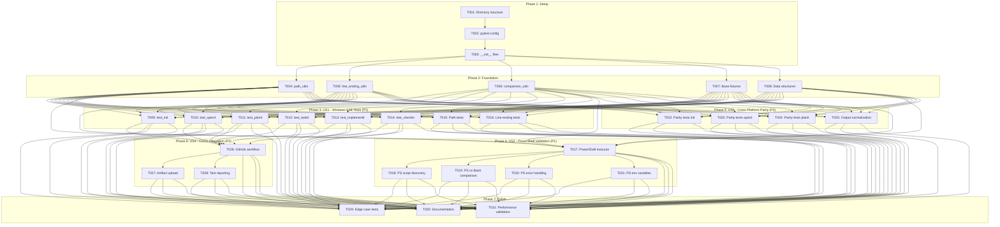
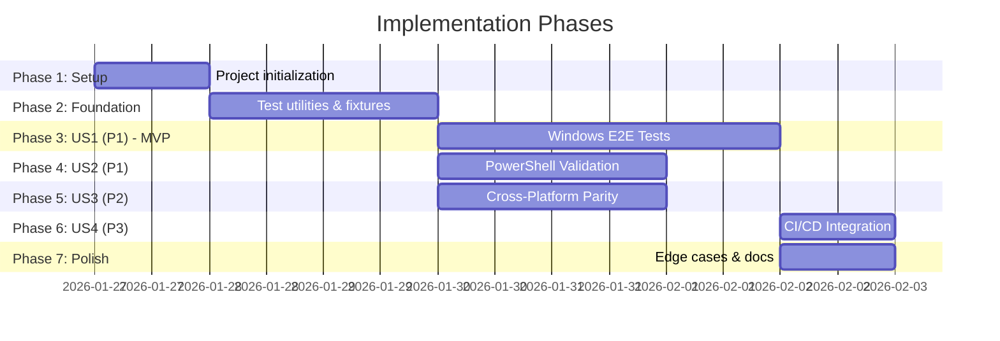

# Tasks: End-to-End Testing for Windows and PowerShell

**Input**: Design documents from `/specs/049-e2e-windows-tests/`
**Prerequisites**: plan.md (required), spec.md (required for user stories), research.md, data-model.md, contracts/

**Tests**: This feature IS the testing infrastructure - implementation tasks create the test suite.

**Organization**: Tasks are grouped by user story to enable independent implementation and testing of each story.

## Task Dependencies

<!-- BEGIN:AUTO-GENERATED section="task-dependencies" -->

<!-- END:AUTO-GENERATED -->

## Phase Timeline

<!-- BEGIN:AUTO-GENERATED section="phase-timeline" -->

<!-- END:AUTO-GENERATED -->

## Format: `[ID] [P?] [Story] Description`

- **[P]**: Can run in parallel (different files, no dependencies)
- **[Story]**: Which user story this task belongs to (e.g., US1, US2, US3, US4)
- Include exact file paths in descriptions

## Path Conventions

- **Test files**: `tests/e2e/windows/` at repository root
- **Utilities**: `tests/utils/windows/`
- **Fixtures**: `tests/fixtures/windows/`
- **CI**: `.github/workflows/`

---

## Phase 1: Setup (Shared Infrastructure)

**Purpose**: Project initialization and basic test structure

- [X] T001 Create test directory structure: tests/e2e/windows/, tests/utils/windows/, tests/fixtures/windows/
- [X] T002 Configure pytest markers in pyproject.toml: windows, powershell, e2e, slow, ci
- [X] T003 [P] Create __init__.py files in tests/e2e/windows/, tests/utils/windows/, tests/fixtures/windows/

---

## Phase 2: Foundational (Blocking Prerequisites)

**Purpose**: Core test infrastructure that MUST be complete before ANY user story tests can be implemented

**⚠️ CRITICAL**: No user story work can begin until this phase is complete

- [X] T004 [P] Implement WindowsPathValidator class in tests/utils/windows/path_utils.py with analyze_path(), is_reserved_name(), exceeds_max_path() methods
- [X] T005 [P] Implement line ending normalization functions in tests/utils/windows/line_ending_utils.py: normalize_line_endings(), detect_line_ending()
- [X] T006 [P] Implement ComparisonTools class in tests/utils/windows/comparison_utils.py with normalize_output(), normalize_path(), compare_outputs(), extract_paths() methods
- [X] T007 Create pytest fixtures in tests/e2e/windows/conftest.py: windows_test_env, temp_project_dir, powershell_executor, comparison_tools
- [X] T008 [P] Implement data structure classes in tests/utils/windows/data_structures.py: TestEnvironment, PowerShellScriptResult, CrossPlatformComparisonResult, TestArtifact, WindowsPathInfo, E2EWorkflowResult

**Checkpoint**: Foundation ready - user story test implementation can now begin in parallel

---

## Phase 3: User Story 1 - Windows E2E Test Execution (Priority: P1) 🎯 MVP

**Goal**: Validate that all core doit commands work correctly on Windows with proper path handling and line endings

**Independent Test**: Run `pytest tests/e2e/windows/test_*_workflow.py -m US1 -v` on Windows and verify all tests pass

### Implementation for User Story 1

- [X] T009 [P] [US1] Create test_init_workflow.py in tests/e2e/windows/ with tests for: doit init creates .doit directory, handles Windows paths with spaces, creates constitution.md with CRLF line endings
- [X] T010 [P] [US1] Create test_specit_workflow.py in tests/e2e/windows/ with tests for: doit specit creates spec.md, handles Windows absolute paths (C:\path), validates CRLF preservation in generated specs
- [X] T011 [P] [US1] Create test_planit_workflow.py in tests/e2e/windows/ with tests for: doit planit creates plan.md, handles nested Windows directories, preserves line endings in plan files
- [X] T012 [P] [US1] Create test_taskit_workflow.py in tests/e2e/windows/ with tests for: doit taskit creates tasks.md, handles Windows path separators, generates valid checkboxes in tasks
- [X] T013 [P] [US1] Create test_implementit_workflow.py in tests/e2e/windows/ with tests for: doit implementit executes tasks, creates files with Windows paths, handles file operations correctly
- [X] T014 [P] [US1] Create test_checkin_workflow.py in tests/e2e/windows/ with tests for: doit checkin creates commits, Git operations work on Windows, branch management succeeds
- [X] T015 [P] [US1] Create test_windows_path_handling.py in tests/e2e/windows/ with tests for: paths with spaces, drive letters, UNC paths, reserved filenames (CON, PRN), path length limits (260 chars)
- [X] T016 [P] [US1] Create test_line_endings.py in tests/e2e/windows/ with tests for: CRLF preservation in generated files, mixed CRLF/LF handling, Git autocrlf behavior

**Checkpoint**: At this point, User Story 1 should be fully functional - all doit commands work on Windows

---

## Phase 4: User Story 2 - PowerShell Script Validation (Priority: P1)

**Goal**: Ensure PowerShell scripts work identically to Bash equivalents

**Independent Test**: Run `pytest tests/e2e/windows/ -m US2 -v` on Windows and verify PowerShell script parity with Bash

### Implementation for User Story 2

- [X] T017 [US2] Implement PowerShellExecutor class in tests/utils/windows/powershell_executor.py with run_script(), run_command() methods, timeout handling, output capture
- [X] T018 [P] [US2] Create test_powershell_script_discovery.py in tests/e2e/windows/ with tests for: discovering all .ps1 scripts in .doit/scripts/powershell/, validating script syntax, checking for required scripts
- [X] T019 [P] [US2] Create test_powershell_vs_bash.py in tests/e2e/windows/ with tests for: create-new-feature.ps1 vs .sh, setup-plan.ps1 vs .sh, output comparison with normalization
- [X] T020 [P] [US2] Create test_powershell_error_handling.py in tests/e2e/windows/ with tests for: missing file errors, invalid arguments, execution policy blocks, proper exit codes
- [X] T021 [P] [US2] Create test_powershell_environment.py in tests/e2e/windows/ with tests for: $env:VAR reading, environment variable passing, script isolation

**Checkpoint**: At this point, User Stories 1 AND 2 should both work independently - Windows E2E works AND PowerShell scripts are validated

---

## Phase 5: User Story 3 - Cross-Platform Parity Validation (Priority: P2)

**Goal**: Verify identical behavior between Windows and Linux/macOS

**Independent Test**: Run `pytest tests/e2e/windows/ -m US3 -v` on Windows and verify cross-platform comparison reports zero discrepancies

### Implementation for User Story 3

- [X] T022 [P] [US3] Create test_cross_platform_parity_init.py in tests/e2e/windows/ with tests for: compare doit init output on Windows vs Linux, normalize paths and line endings, validate file structures match
- [X] T023 [P] [US3] Create test_cross_platform_parity_specit.py in tests/e2e/windows/ with tests for: compare generated specs on Windows vs Linux, validate content matches after normalization
- [X] T024 [P] [US3] Create test_cross_platform_parity_planit.py in tests/e2e/windows/ with tests for: compare generated plans on Windows vs Linux, ensure architecture diagrams identical
- [X] T025 [US3] Implement output normalization test suite in test_output_normalization.py in tests/e2e/windows/ with tests for: path separator normalization (\ to /), line ending normalization (CRLF to LF), timestamp stripping, absolute path relativization

**Checkpoint**: All user stories (1, 2, 3) should now be independently functional - Windows works, PowerShell validated, cross-platform parity confirmed

---

## Phase 6: User Story 4 - CI/CD Integration for Windows Testing (Priority: P3)

**Goal**: Automate Windows E2E testing in GitHub Actions

**Independent Test**: Create a test PR and verify GitHub Actions workflow runs successfully on Windows runner with test results visible

### Implementation for User Story 4

- [X] T026 [US4] Create GitHub Actions workflow file .github/workflows/windows-e2e-tests.yml with: windows-latest runner, Python 3.11 setup, PowerShell 7.x verification, pytest execution with markers, test result reporting
- [X] T027 [P] [US4] Configure artifact upload in .github/workflows/windows-e2e-tests.yml: upload test reports (JUnit XML, HTML), upload test logs on failure, upload generated files for debugging
- [X] T028 [P] [US4] Implement test reporting in tests/e2e/windows/conftest.py: pytest hooks for Windows-specific test metadata, failure diagnostics with platform info, execution time tracking, CI environment detection

**Checkpoint**: All user stories complete - CI/CD automation ensures ongoing validation

---

## Phase 7: Polish & Cross-Cutting Concerns

**Purpose**: Improvements that affect multiple user stories and comprehensive edge case coverage

- [X] T029 [P] Create test_edge_cases.py in tests/e2e/windows/ with tests for: PowerShell execution policy blocks (Restricted, AllSigned), case-insensitive filesystem behavior, symbolic link privilege requirements, path length MAX_PATH limit (260 chars), reserved filenames (CON, PRN, AUX, NUL, COM1-9, LPT1-9), mixed path separators (C:\path/to\file)
- [X] T030 [P] Update quickstart.md with: Windows-specific setup instructions, common troubleshooting (execution policy, long paths), example test run commands, debugging tips for Windows
- [X] T031 Validate test suite performance: ensure full test suite completes in under 5 minutes on Windows, CI workflow completes in under 10 minutes, identify and mark slow tests (>10 seconds) with @pytest.mark.slow

---

## Dependencies & Execution Order

### Phase Dependencies

- **Setup (Phase 1)**: No dependencies - can start immediately
- **Foundational (Phase 2)**: Depends on Setup completion - BLOCKS all user stories
- **User Stories (Phase 3-6)**: All depend on Foundational phase completion
  - US1 (P1): Can start after Foundational - No dependencies on other stories
  - US2 (P1): Can start after Foundational - Can run in parallel with US1
  - US3 (P2): Can start after Foundational - Can run in parallel with US1/US2
  - US4 (P3): Depends on US1 completion (needs working tests to run in CI)
- **Polish (Phase 7)**: Depends on all desired user stories being complete

### User Story Dependencies

- **User Story 1 (P1)**: Can start after Foundational (Phase 2) - No dependencies on other stories ✓ MVP
- **User Story 2 (P1)**: Can start after Foundational (Phase 2) - Independent of US1, can run in parallel
- **User Story 3 (P2)**: Can start after Foundational (Phase 2) - Independent of US1/US2, can run in parallel
- **User Story 4 (P3)**: Depends on US1 (needs E2E tests to exist before running them in CI)

### Within Each User Story

- All test files marked [P] within a user story can be created in parallel (different files)
- Test utilities must be complete before tests that use them
- Fixtures must exist before tests that depend on them

### Parallel Opportunities

- All Setup tasks (T001-T003) can run sequentially (quick)
- All Foundational tasks marked [P] (T004-T006, T008) can run in parallel
- Once Foundational completes:
  - All US1 test files (T009-T016) can be created in parallel
  - All US2 test files (T018-T021) can be created in parallel
  - All US3 test files (T022-T024) can be created in parallel
  - US1, US2, US3 can proceed in parallel if team capacity allows
- Polish tasks (T029-T030) can run in parallel

---

## Parallel Example: User Story 1

```bash
# Launch all test files for User Story 1 together:
Task: "Create test_init_workflow.py in tests/e2e/windows/"
Task: "Create test_specit_workflow.py in tests/e2e/windows/"
Task: "Create test_planit_workflow.py in tests/e2e/windows/"
Task: "Create test_taskit_workflow.py in tests/e2e/windows/"
Task: "Create test_implementit_workflow.py in tests/e2e/windows/"
Task: "Create test_checkin_workflow.py in tests/e2e/windows/"
Task: "Create test_windows_path_handling.py in tests/e2e/windows/"
Task: "Create test_line_endings.py in tests/e2e/windows/"

# All 8 test files can be created simultaneously (different files, no dependencies)
```

## Parallel Example: User Story 2

```bash
# Launch all PowerShell validation tests together (after T017 completes):
Task: "Create test_powershell_script_discovery.py in tests/e2e/windows/"
Task: "Create test_powershell_vs_bash.py in tests/e2e/windows/"
Task: "Create test_powershell_error_handling.py in tests/e2e/windows/"
Task: "Create test_powershell_environment.py in tests/e2e/windows/"

# All 4 test files can be created simultaneously
```

---

## Implementation Strategy

### MVP First (User Story 1 Only)

1. Complete Phase 1: Setup (T001-T003)
2. Complete Phase 2: Foundational (T004-T008) - CRITICAL, blocks all stories
3. Complete Phase 3: User Story 1 (T009-T016)
4. **STOP and VALIDATE**: Run `pytest tests/e2e/windows/ -m US1 -v` on Windows
5. If tests pass, MVP is complete - Windows E2E testing works!

### Incremental Delivery

1. Complete Setup + Foundational → Foundation ready
2. Add User Story 1 → Test on Windows → **MVP!** (Windows E2E works)
3. Add User Story 2 → Test PowerShell → PowerShell validation added
4. Add User Story 3 → Test parity → Cross-platform confidence added
5. Add User Story 4 → Test CI → Automation complete
6. Each story adds value without breaking previous stories

### Parallel Team Strategy

With multiple developers:

1. Team completes Setup + Foundational together (T001-T008)
2. Once Foundational is done:
   - Developer A: User Story 1 (T009-T016) - 8 test files
   - Developer B: User Story 2 (T017-T021) - PowerShell validation
   - Developer C: User Story 3 (T022-T025) - Parity tests
3. Stories complete and validate independently
4. Developer A: User Story 4 (T026-T028) - CI integration (depends on US1)
5. All developers: Polish phase (T029-T031) in parallel

---

## Notes

- [P] tasks = different files, no dependencies
- [Story] label maps task to specific user story for traceability
- Each user story should be independently completable and testable
- This is a TESTING feature - implementation tasks ARE creating tests
- Tests validate Windows functionality, not optional add-ons
- Commit after each task or logical group
- Stop at any checkpoint to validate story independently
- Run tests frequently during development to catch issues early
- Avoid: vague tasks, same file conflicts, cross-story dependencies that break independence

---

## Task Summary

- **Total Tasks**: 31
- **Setup Tasks**: 3 (Phase 1)
- **Foundational Tasks**: 5 (Phase 2)
- **User Story 1 (P1)**: 8 tasks - Windows E2E Test Execution 🎯 MVP
- **User Story 2 (P1)**: 5 tasks - PowerShell Script Validation
- **User Story 3 (P2)**: 4 tasks - Cross-Platform Parity Validation
- **User Story 4 (P3)**: 3 tasks - CI/CD Integration
- **Polish Tasks**: 3 (Phase 7)
- **Parallel Opportunities**: 24 tasks marked [P] can run in parallel within their phase

**MVP Scope**: Phases 1, 2, and 3 (Tasks T001-T016) = 16 tasks

**Estimated Timeline**:
- Setup: 0.5 days
- Foundation: 1-2 days
- US1 (MVP): 2-3 days
- US2: 1-2 days (can parallel with US1 after foundation)
- US3: 1-2 days (can parallel with US1/US2 after foundation)
- US4: 0.5-1 day
- Polish: 0.5-1 day
- **Total**: 6-11 days (sequential) or 4-6 days (parallel with 2-3 developers)
