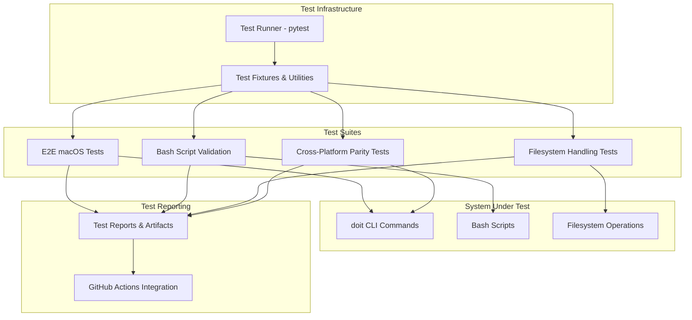

# Implementation Plan: End-to-End Testing for macOS

**Branch**: `050-macos-e2e-tests` | **Date**: 2026-01-27 | **Spec**: [spec.md](spec.md)
**Input**: Feature specification from `/specs/050-macos-e2e-tests/spec.md`

**Note**: This template is filled in by the `/doit.planit` command. See `.claude/commands/doit.planit.md` for the execution workflow.

## Summary

Implement comprehensive end-to-end testing infrastructure for macOS environments to ensure the doit toolkit functions correctly on macOS platforms. The test suite will validate core doit commands, bash script functionality with BSD utilities, macOS-specific filesystem handling (APFS, case-sensitivity, Unicode normalization), and CI/CD integration with GitHub Actions macOS runners. This completes cross-platform testing coverage alongside Windows (049-e2e-windows-tests) and Linux, ensuring macOS users have a reliable experience with automated testing preventing platform-specific regressions.

## Technical Context

**Language/Version**: Python 3.11+ (from constitution)
**Primary Dependencies**: pytest (testing framework), typer (CLI framework), rich (terminal formatting)
**Storage**: File-based (markdown specs, test artifacts in `.doit/` directories)
**Testing**: pytest with platform-specific markers and fixtures
**Target Platform**: macOS 12+ (Monterey, Ventura, Sonoma) with bash/zsh shells
**Project Type**: single (CLI tool with testing infrastructure)
**Performance Goals**: Test suite execution under 5 minutes on standard macOS development machines; CI workflow completion within 10 minutes
**Constraints**: Must handle macOS-specific filesystems (APFS case-sensitive/insensitive), BSD utility differences (grep, sed, awk), Unicode normalization (NFD vs NFC), extended attributes (xattr), LF line endings
**Scale/Scope**: 20 functional requirements across 4 user stories (1 P1, 2 P2, 1 P3); comprehensive coverage of macOS-specific edge cases

## Architecture Overview

<!-- BEGIN:AUTO-GENERATED section="architecture" -->

<!-- END:AUTO-GENERATED -->

## Constitution Check

*GATE: Must pass before Phase 0 research. Re-check after Phase 1 design.*

### Alignment Verification

- **✓ Tech Stack Alignment**: Uses Python 3.11+ and pytest per constitution
- **✓ Dependencies Alignment**: Leverages existing dependencies (typer, rich) from constitution
- **✓ Infrastructure Alignment**: File-based storage in `.doit/` directories consistent with constitution principle II (Persistent Memory)
- **✓ Deployment Alignment**: GitHub Actions CI/CD consistent with constitution deployment strategy
- **✓ Core Principles**: Follows specification-first approach (Principle I), maintains all context in markdown files (Principle II)
- **✓ Quality Standards**: All code includes tests per constitution standards
- **✓ Workflow Alignment**: Follows opinionated workflow (Principle IV): specit → planit → taskit → implementit

### New Dependencies

No new external dependencies required. Feature uses existing constitution tech stack:
- pytest (already in constitution)
- Python 3.11+ (already in constitution)
- Platform-specific test markers (pytest built-in feature)

### Deviations

**None**. This feature is fully aligned with constitution principles and tech stack.

## Project Structure

### Documentation (this feature)

```text
specs/050-macos-e2e-tests/
├── plan.md              # This file (/doit.planit command output)
├── research.md          # Phase 0 output (/doit.planit command)
├── data-model.md        # Phase 1 output (/doit.planit command)
├── quickstart.md        # Phase 1 output (/doit.planit command)
├── contracts/           # Phase 1 output (/doit.planit command)
│   └── test-api.md     # Testing API contracts and patterns
└── tasks.md             # Phase 2 output (/doit.taskit command - NOT created by /doit.planit)
```

### Source Code (repository root)

```text
tests/
├── e2e/
│   └── macos/
│       ├── __init__.py
│       ├── conftest.py                    # macOS-specific fixtures
│       ├── test_init_workflow.py          # Test doit init on macOS
│       ├── test_specit_workflow.py        # Test doit specit on macOS
│       ├── test_planit_workflow.py        # Test doit planit on macOS
│       ├── test_taskit_workflow.py        # Test doit taskit on macOS
│       ├── test_implementit_workflow.py   # Test doit implementit on macOS
│       ├── test_checkin_workflow.py       # Test doit checkin on macOS
│       ├── test_macos_filesystem.py       # APFS, case-sensitivity, Unicode tests
│       ├── test_bash_scripts.py           # Bash script validation with BSD utils
│       ├── test_extended_attributes.py    # xattr handling tests
│       └── test_cross_platform_parity.py  # Cross-platform comparison tests
│
├── fixtures/
│   └── macos/
│       ├── sample_projects/               # Sample project structures for testing
│       ├── expected_outputs/              # Expected outputs for validation
│       ├── test_scripts/                  # Test Bash scripts with BSD utilities
│       └── unicode_test_files/            # Files with NFD/NFC normalized names
│
└── utils/
    └── macos/
        ├── filesystem_utils.py            # APFS, case-sensitivity utilities
        ├── unicode_utils.py               # NFD/NFC normalization utilities
        ├── bsd_utils.py                   # BSD command compatibility utilities
        ├── xattr_utils.py                 # Extended attribute handling
        └── comparison_utils.py            # Output comparison utilities

.github/
└── workflows/
    └── macos-e2e-tests.yml                # GitHub Actions macOS workflow

pyproject.toml                             # Update with pytest markers for macOS tests
```

**Structure Decision**: Extended the existing tests/ directory with a new e2e/macos/ subdirectory to house macOS-specific E2E tests, mirroring the structure of Windows E2E tests (049-e2e-windows-tests). This maintains separation of concerns while integrating with the existing pytest infrastructure. Added GitHub Actions workflow for CI integration. Test utilities are organized in tests/utils/macos/ for reusability across test modules, with focus on macOS-specific filesystem and command-line utilities.

## Complexity Tracking

> **Fill ONLY if Constitution Check has violations that must be justified**

No violations. This feature is fully compliant with constitution principles and tech stack.

## Phase 0: Research & Resolution

*See [research.md](research.md) for detailed findings and decisions.*

### Key Research Areas

1. **Pytest macOS-Specific Configuration**
   - Platform markers for selective test execution
   - Fixture design for macOS environment setup
   - Filesystem handling strategies for APFS volumes
   - Unicode normalization detection and testing

2. **BSD Utility Differences**
   - GNU vs BSD sed differences (especially -i flag)
   - GNU vs BSD grep flag differences
   - awk behavior differences
   - find command syntax variations
   - Detection strategies for HomeBrew GNU utilities

3. **macOS Filesystem Specifics**
   - APFS vs HFS+ characteristics
   - Case-sensitive vs case-insensitive volume detection
   - Unicode normalization (NFD vs NFC) handling
   - Extended attributes (xattr) testing
   - Resource fork handling
   - Symbolic link behavior

4. **Bash vs Zsh Compatibility**
   - Default shell detection (Catalina+ uses zsh)
   - Compatibility testing strategies
   - Environment variable differences
   - Shell-specific syntax differences

5. **GitHub Actions macOS Runner**
   - Available tools and pre-installed software
   - macOS version matrix (12, 13, 14)
   - Performance characteristics and limitations
   - Artifact upload strategies for test results

6. **macOS-Specific Edge Cases**
   - .DS_Store file handling
   - Quarantine attributes (com.apple.quarantine)
   - Gatekeeper interactions with test scripts
   - TMPDIR structure and behavior
   - ~/Library path handling
   - Application Support directory conventions

### Decisions Made

*Detailed in research.md - see Phase 0 output*

## Phase 1: Design & Contracts

*See [data-model.md](data-model.md), [contracts/](contracts/), and [quickstart.md](quickstart.md) for details.*

### Core Components

1. **Test Runner Configuration** (tests/e2e/macos/conftest.py)
   - macOS-specific pytest fixtures
   - Environment setup and teardown
   - Filesystem volume detection (case-sensitive/insensitive)
   - Shell detection (bash vs zsh)
   - BSD utility detection and path configuration

2. **Filesystem Testing Utilities** (tests/utils/macos/)
   - **filesystem_utils.py**: APFS volume type detection, case-sensitivity testing
   - **unicode_utils.py**: NFD/NFC normalization detection and conversion
   - **xattr_utils.py**: Extended attribute reading, writing, comparison
   - **bsd_utils.py**: BSD command compatibility wrappers
   - **comparison_utils.py**: Cross-platform output comparison with macOS-specific normalization

3. **E2E Workflow Tests** (tests/e2e/macos/test_*_workflow.py)
   - Test each doit command (init, specit, planit, taskit, implementit, checkin)
   - Validate file creation, content generation, git operations
   - Verify macOS path handling, line endings, filesystem interactions
   - Ensure compatibility with both case-sensitive and case-insensitive volumes

4. **Filesystem-Specific Tests** (tests/e2e/macos/test_macos_filesystem.py)
   - Case-sensitivity scenarios
   - Unicode filename handling (NFD vs NFC)
   - Extended attribute preservation
   - Symbolic link resolution
   - .DS_Store file tolerance

5. **Bash Script Validation** (tests/e2e/macos/test_bash_scripts.py)
   - Execute bash scripts with BSD utilities
   - Validate output against expected results
   - Test zsh compatibility
   - Verify macOS-specific environment variables

6. **Cross-Platform Parity Tests** (tests/e2e/macos/test_cross_platform_parity.py)
   - Compare outputs with Linux and Windows equivalents
   - Normalize platform-specific differences
   - Flag unexpected discrepancies
   - Validate behavioral consistency

7. **CI/CD Integration** (.github/workflows/macos-e2e-tests.yml)
   - macOS runner matrix (12, 13, 14)
   - Dependency installation
   - Test execution with appropriate markers
   - Artifact collection and upload
   - Failure notification and reporting

### Test Data Organization

**Fixtures** (tests/fixtures/macos/):
- Sample project structures for workflow testing
- Expected outputs for validation
- Test bash scripts using BSD utilities
- Unicode test files with both NFD and NFC normalization
- Files with extended attributes
- Symbolic links and directory structures

### API Contracts

*See [contracts/test-api.md](contracts/test-api.md) for detailed testing API specifications.*

**Pytest Markers**:
```python
@pytest.mark.macos          # Runs only on macOS
@pytest.mark.e2e            # E2E test (slower)
@pytest.mark.filesystem     # Filesystem-specific test
@pytest.mark.bsd            # Tests BSD utility compatibility
@pytest.mark.unicode        # Tests Unicode handling
@pytest.mark.ci             # Suitable for CI execution
@pytest.mark.slow           # Long-running test
```

**Key Test Fixtures**:
```python
@pytest.fixture
def macos_test_env():
    """Provides macOS-specific test environment setup."""

@pytest.fixture
def case_sensitive_volume():
    """Detects or creates case-sensitive APFS volume for testing."""

@pytest.fixture
def unicode_test_files():
    """Provides test files with NFD and NFC normalized names."""

@pytest.fixture
def bsd_command_wrapper():
    """Wraps BSD commands for consistent testing."""
```

### Integration Points

1. **With Windows E2E Tests (049-e2e-windows-tests)**:
   - Share cross-platform parity validation logic
   - Reuse output normalization patterns
   - Coordinate on test coverage metrics

2. **With Existing pytest Infrastructure**:
   - Integrate with existing pytest configuration
   - Use shared fixtures from tests/conftest.py
   - Extend marker system consistently

3. **With GitHub Actions CI/CD**:
   - Parallel execution with Windows and Linux tests
   - Unified test reporting
   - Platform-specific artifact collection

## Phase 2: Task Breakdown

*Run `/doit.taskit` to generate tasks.md from this plan.*

Task breakdown will include:
- Setup tasks for test infrastructure
- Implementation tasks for each test suite
- CI/CD configuration tasks
- Documentation and quickstart tasks

Tasks are organized by user story priority (P1 first, then P2, then P3) to ensure MVP delivery.

## Quickstart Guide

*See [quickstart.md](quickstart.md) for detailed setup and execution instructions.*

### Prerequisites

- macOS 12+ (Monterey, Ventura, or Sonoma)
- Python 3.11+
- Git installed and configured
- Pytest installed (`pip install pytest`)

### Running macOS E2E Tests Locally

```bash
# Run all macOS E2E tests
pytest tests/e2e/macos/ -v

# Run only macOS-specific tests
pytest -m macos -v

# Run filesystem tests
pytest -m filesystem -v

# Run with coverage
pytest tests/e2e/macos/ --cov=src --cov-report=html
```

### Running in CI

GitHub Actions will automatically run macOS E2E tests on:
- Every pull request
- Every push to main/develop branches
- macOS runner matrix: versions 12, 13, 14

### Test Organization

Tests are organized by priority:
- **P1 tests**: Core E2E workflow validation (must pass)
- **P2 tests**: Filesystem and bash script validation (should pass)
- **P3 tests**: CI/CD integration tests (nice to have)

### Debugging Failed Tests

```bash
# Run with verbose output
pytest tests/e2e/macos/ -v -s

# Run specific test
pytest tests/e2e/macos/test_macos_filesystem.py::test_case_sensitivity -v

# Show detailed failure information
pytest tests/e2e/macos/ -v --tb=long
```

## Success Metrics

From spec success criteria:
- **SC-001**: macOS E2E test suite achieves 95%+ pass rate
- **SC-002**: Test suite completes in under 10 minutes in CI
- **SC-003**: 100% cross-platform behavioral consistency
- **SC-004**: All core doit commands have 3+ test scenarios
- **SC-009**: All 9 edge cases have dedicated test coverage

## Dependencies & Constraints

### External Dependencies

- GitHub Actions macOS runners (12, 13, 14)
- Pytest framework (already in constitution)
- Access to both case-sensitive and case-insensitive APFS volumes (for comprehensive testing)

### Technical Constraints

- BSD utilities behave differently from GNU utilities
- Unicode normalization differs from Linux (NFD on macOS, NFC on Linux)
- Case-insensitive filesystem is default (case-sensitive must be tested separately)
- Zsh is default shell on Catalina+ (bash compatibility must be verified)

### Platform Requirements

- macOS 12+ required for consistent behavior
- Xcode command-line tools recommended for development
- PowerShell NOT required (macOS uses bash/zsh)

## Risk Mitigation

**Risk**: BSD utility differences break existing scripts
**Mitigation**: Create BSD command wrappers in bsd_utils.py, test both native BSD and HomeBrew GNU utilities

**Risk**: Unicode normalization issues cause test failures
**Mitigation**: Explicit normalization handling in unicode_utils.py, comprehensive test coverage with both NFD and NFC

**Risk**: Case-insensitive filesystem hides bugs
**Mitigation**: Test on both case-sensitive and case-insensitive volumes, document which tests require which volume type

**Risk**: GitHub Actions macOS runners unavailable or slow
**Mitigation**: Optimize test suite for speed, use parallel execution, implement timeout safeguards

## Related Features

- **049-e2e-windows-tests**: Windows E2E testing (complementary platform coverage)
- **Roadmap P2**: Cross-platform CI matrix testing (next step after macOS tests complete)
- **Roadmap P3**: Test Coverage Reporting Dashboard (future enhancement)

---

*This implementation plan follows the doit opinionated workflow (constitution Principle IV) and maintains all context in version-controlled markdown files (constitution Principle II).*
