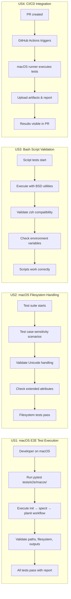

# Feature Specification: End-to-End Testing for macOS

**Feature Branch**: `050-macos-e2e-tests`
**Created**: 2026-01-27
**Status**: Draft
**Input**: User description: "macOS E2E testing infrastructure"

## User Scenarios & Testing *(mandatory)*

### User Story 1 - macOS E2E Test Execution (Priority: P1)

A developer working on the doit toolkit needs to verify that all commands and workflows function correctly on macOS systems before releasing a new version. They need an automated test suite that runs the complete workflow from initialization through feature completion, validating that macOS-specific paths, filesystem behaviors, and bash scripts all work as expected.

**Why this priority**: This is the foundation for macOS support validation. Without basic E2E testing on macOS, we cannot confidently support macOS users, and regressions may go undetected until production use. macOS is a primary development platform and must work flawlessly.

**Independent Test**: Can be fully tested by executing a test command (e.g., `pytest tests/e2e/test_macos_basic.py`) on a macOS machine and verifying that all core doit commands (init, specit, planit, etc.) complete successfully with expected output.

**Acceptance Scenarios**:

1. **Given** a fresh macOS 12+ environment with Python 3.11+ installed, **When** a developer runs the E2E test suite with `pytest tests/e2e/macos/`, **Then** all tests pass and a summary report shows 100% success rate
2. **Given** the doit toolkit is installed on macOS, **When** E2E tests execute the full workflow (init → specit → planit → taskit → implementit), **Then** each command completes without errors and produces expected output files
3. **Given** macOS-specific path handling requirements, **When** tests create and navigate project directories with spaces or special characters, **Then** all file operations succeed without path-related errors
4. **Given** LF line ending conventions on macOS, **When** tests generate markdown files and scripts, **Then** line endings are correctly preserved and files are readable by macOS tools

---

### User Story 2 - macOS-Specific Path and Filesystem Handling (Priority: P2)

A developer needs to ensure that the doit toolkit correctly handles macOS-specific filesystem features including APFS/HFS+ characteristics, case-sensitivity options, resource forks, extended attributes, and Unicode normalization differences. The test suite must validate these platform-specific behaviors.

**Why this priority**: macOS has unique filesystem characteristics that differ from both Windows and Linux. Case-sensitivity is optional, Unicode normalization differs (NFD vs NFC), and extended attributes are commonly used. These must work correctly but basic functionality (P1) takes precedence.

**Independent Test**: Can be fully tested by running macOS filesystem-specific test cases that create files with Unicode characters, test case-sensitivity handling, validate extended attributes, and verify resource fork behavior.

**Acceptance Scenarios**:

1. **Given** a case-sensitive APFS volume, **When** tests create files differing only in case (e.g., 'File.md' and 'file.md'), **Then** both files are created and accessible independently
2. **Given** a case-insensitive APFS volume (default), **When** tests attempt to create files differing only in case, **Then** the system correctly handles the conflict and tests validate expected behavior
3. **Given** filenames containing Unicode characters (accented letters, emoji), **When** tests create, read, and manipulate these files, **Then** all operations succeed with correct character preservation across NFD/NFC normalization
4. **Given** macOS extended attributes (e.g., com.apple.metadata), **When** doit commands create or modify files, **Then** extended attributes are preserved or correctly handled without corruption
5. **Given** symbolic links created on macOS, **When** tests navigate through symlinks in project directories, **Then** path resolution works correctly without breaking

---

### User Story 3 - Bash Script Validation for macOS (Priority: P2)

A developer needs to ensure that bash scripts work correctly on macOS, accounting for differences in the macOS bash/zsh environment, BSD vs GNU command differences, and macOS-specific environment variables. The test suite must validate that scripts produce expected results on macOS.

**Why this priority**: macOS ships with BSD versions of common utilities (grep, sed, awk) which have different flags than GNU versions. Additionally, macOS Catalina+ uses zsh as default shell. Scripts must work correctly, but basic E2E functionality (P1) is more critical.

**Independent Test**: Can be fully tested by running bash-specific test cases that execute scripts using BSD commands, validate zsh compatibility, and verify macOS-specific environment variable handling.

**Acceptance Scenarios**:

1. **Given** bash scripts using common utilities (grep, sed, find), **When** tests execute these scripts on macOS with BSD utilities, **Then** scripts complete successfully and produce expected output
2. **Given** the default zsh shell on macOS Catalina+, **When** tests execute doit bash scripts in zsh environment, **Then** scripts run without compatibility errors (or correctly detect and handle zsh vs bash)
3. **Given** macOS-specific environment variables (e.g., HOME, TMPDIR structure), **When** tests execute scripts that use temp directories or home paths, **Then** scripts correctly read and use these paths
4. **Given** macOS security features (Gatekeeper, quarantine attributes), **When** tests execute downloaded or created scripts, **Then** scripts run without security prompts blocking execution (or tests document expected security handling)

---

### User Story 4 - CI/CD Integration for macOS Testing (Priority: P3)

A DevOps engineer needs to integrate macOS E2E tests into the CI/CD pipeline to automatically validate macOS functionality on every pull request and release. The test suite must be executable in GitHub Actions macOS runners and provide clear failure diagnostics.

**Why this priority**: Automated testing in CI prevents regressions, but manual testing can suffice initially. This becomes critical for maintaining quality at scale but isn't required for initial macOS support.

**Independent Test**: Can be fully tested by configuring a GitHub Actions workflow that runs on macOS runners, executes the E2E test suite, and successfully reports results with proper artifacts and failure notifications.

**Acceptance Scenarios**:

1. **Given** a GitHub Actions workflow configured for macOS runners, **When** a pull request is created with code changes, **Then** macOS E2E tests execute automatically and results appear in the PR checks
2. **Given** test execution in CI environment, **When** tests complete (pass or fail), **Then** test artifacts (logs, generated files) are uploaded and accessible for debugging
3. **Given** a test failure in CI, **When** developers review the failure report, **Then** error messages clearly identify the failing test, platform-specific details, and relevant stack traces
4. **Given** test execution time constraints in CI, **When** the full E2E suite runs, **Then** tests complete within 10 minutes to avoid workflow timeouts

---

### Edge Cases

- What happens when running on macOS with case-sensitive vs case-insensitive filesystem?
- How does the system handle macOS-specific file metadata and extended attributes?
- What occurs when Unicode filenames use different normalization forms (NFD vs NFC)?
- How are BSD command differences handled (e.g., `sed -i` requires extension argument)?
- What happens when using HomeBrew-installed GNU utilities vs native BSD utilities?
- How does testing handle macOS-specific security features (quarantine bits, Gatekeeper)?
- What occurs when tests run under different shells (bash vs zsh)?
- How are macOS-specific paths handled (e.g., ~/Library/Application Support)?
- What happens when resource forks or .DS_Store files are present in project directories?

## User Journey Visualization

<!-- BEGIN:AUTO-GENERATED section="user-journey" -->

<!-- END:AUTO-GENERATED -->

## Requirements *(mandatory)*

### Functional Requirements

- **FR-001**: Test infrastructure MUST support execution on macOS 12+ (Monterey, Ventura, Sonoma)
- **FR-002**: Test suite MUST validate all core doit commands (init, specit, planit, taskit, implementit, reviewit, checkin) on macOS
- **FR-003**: Tests MUST handle both case-sensitive and case-insensitive APFS volumes correctly
- **FR-004**: Test suite MUST validate Unicode filename handling with both NFD and NFC normalization
- **FR-005**: Tests MUST verify bash scripts work with macOS BSD utilities (grep, sed, awk, find)
- **FR-006**: Test suite MUST validate compatibility with both bash and zsh shells
- **FR-007**: Tests MUST handle macOS-specific path structures (e.g., ~/Library, /Applications)
- **FR-008**: Test infrastructure MUST provide cross-platform comparison utilities to validate parity with Linux/Windows
- **FR-009**: Tests MUST validate that Git operations work correctly on macOS
- **FR-010**: Test suite MUST be executable in GitHub Actions with macOS runners
- **FR-011**: Tests MUST generate detailed failure reports with macOS-specific diagnostics
- **FR-012**: Test suite MUST complete within 10 minutes in CI environment
- **FR-013**: Tests MUST validate handling of macOS extended attributes (xattr)
- **FR-014**: Test suite MUST verify symbolic link handling on macOS
- **FR-015**: Tests MUST validate temp directory handling with macOS TMPDIR structure
- **FR-016**: Test infrastructure MUST support pytest markers for macOS-specific tests
- **FR-017**: Tests MUST validate Python 3.11+ compatibility on macOS
- **FR-018**: Test suite MUST verify line ending preservation (LF) on macOS
- **FR-019**: Tests MUST validate that doit configuration files work correctly on macOS
- **FR-020**: Test infrastructure MUST provide utilities for normalizing and comparing outputs across platforms

### Key Entities

This feature focuses on test infrastructure and validation, not data entities. However, key test components include:

- **Test Suite**: Collection of automated tests validating macOS functionality
- **Test Fixtures**: macOS-specific test data including sample projects, file structures, and configuration
- **Test Utilities**: Helper functions for macOS filesystem operations, output comparison, and platform detection
- **Test Reports**: Results, logs, and artifacts from test execution
- **CI Configuration**: GitHub Actions workflow definitions for macOS runners

## Success Criteria *(mandatory)*

### Measurable Outcomes

- **SC-001**: macOS E2E test suite achieves 95%+ pass rate on supported macOS versions (12+)
- **SC-002**: Test suite completes full execution in under 10 minutes on GitHub Actions macOS runners
- **SC-003**: Cross-platform parity tests show 100% behavioral consistency between macOS, Linux, and Windows (after output normalization)
- **SC-004**: Test coverage includes all core doit commands with at least 3 test scenarios per command on macOS
- **SC-005**: Test failures provide actionable diagnostics that allow developers to reproduce and fix issues within 1 hour
- **SC-006**: CI/CD pipeline automatically runs macOS tests on every PR with results visible within 15 minutes
- **SC-007**: Zero regressions in macOS functionality detected by manual testing that were not caught by automated tests (over 3-month period)
- **SC-008**: Test suite successfully validates both case-sensitive and case-insensitive filesystem scenarios
- **SC-009**: All macOS-specific edge cases (Unicode, extended attributes, BSD utilities) have dedicated test coverage
- **SC-010**: Test infrastructure allows adding new macOS-specific tests with less than 50 lines of code per test case

## Dependencies & Assumptions *(include if applicable)*

### Dependencies

- Python 3.11+ installed on macOS test environment
- pytest testing framework with macOS-compatible plugins
- Git installed and configured in test environment
- GitHub Actions macOS runners available for CI/CD
- Access to both case-sensitive and case-insensitive APFS test volumes (or ability to create them)

### Assumptions

- macOS versions 12+ (Monterey, Ventura, Sonoma) have consistent behavior for tested features
- BSD utilities on macOS remain stable across minor version updates
- GitHub Actions macOS runners have sufficient resources and timeout limits
- Developers running tests locally have standard macOS development environment (Xcode command-line tools)
- Test suite will be maintained alongside Windows and Linux E2E tests for consistency

### Out of Scope

- Testing on macOS versions older than 12 (Monterey)
- Support for PowerPC or 32-bit macOS systems
- iOS/iPadOS testing
- macOS-specific GUI application testing
- Performance benchmarking (separate feature: Performance Benchmarking Suite)
- Code coverage reporting (separate feature: Test Coverage Reporting Dashboard)
- Testing with non-standard shells beyond bash/zsh
