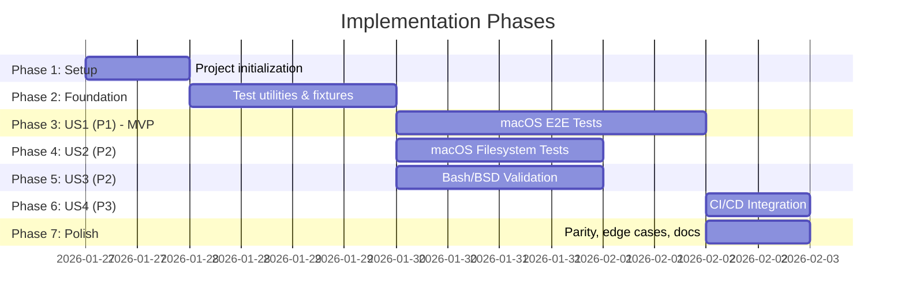

# Tasks: End-to-End Testing for macOS

**Input**: Design documents from `/specs/050-macos-e2e-tests/`
**Prerequisites**: plan.md (required), spec.md (required for user stories), research.md, data-model.md, contracts/

**Tests**: This feature IS the testing infrastructure - implementation tasks create the test suite.

**Organization**: Tasks are grouped by user story to enable independent implementation and testing of each story.

## Task Dependencies

```mermaid
flowchart TD
    subgraph "Phase 1: Setup"
        T001[T001: Directory structure]
        T002[T002: pytest config]
        T003[T003: __init__ files]
    end

    subgraph "Phase 2: Foundation"
        T004[T004: filesystem_utils]
        T005[T005: unicode_utils]
        T006[T006: bsd_utils]
        T007[T007: xattr_utils]
        T008[T008: comparison_utils]
        T009[T009: Base fixtures]
    end

    subgraph "Phase 3: US1 - macOS E2E Tests (P1)"
        T010[T010: test_init]
        T011[T011: test_specit]
        T012[T012: test_planit]
        T013[T013: test_taskit]
        T014[T014: test_implementit]
        T015[T015: test_checkin]
        T016[T016: Basic path tests]
        T017[T017: Line ending tests]
    end

    subgraph "Phase 4: US2 - macOS Filesystem (P2)"
        T018[T018: Case-sensitivity tests]
        T019[T019: Unicode NFD/NFC tests]
        T020[T020: Extended attributes tests]
        T021[T021: Symbolic link tests]
        T022[T022: .DS_Store handling]
    end

    subgraph "Phase 5: US3 - Bash/BSD Validation (P2)"
        T023[T023: BSD command tests]
        T024[T024: Bash vs zsh tests]
        T025[T025: Environment variable tests]
        T026[T026: Script compatibility tests]
    end

    subgraph "Phase 6: US4 - CI/CD Integration (P3)"
        T027[T027: GitHub workflow]
        T028[T028: macOS version matrix]
        T029[T029: Artifact upload]
        T030[T030: Test reporting]
    end

    subgraph "Phase 7: Polish"
        T031[T031: Cross-platform parity]
        T032[T032: Edge case tests]
        T033[T033: Documentation]
        T034[T034: Performance validation]
    end

    T001 --> T002 --> T003
    T003 --> T004 & T005 & T006 & T007 & T008 & T009

    T004 & T005 & T006 & T007 & T008 & T009 --> T010 & T011 & T012 & T013 & T014 & T015 & T016 & T017

    T004 & T005 & T006 & T007 & T008 & T009 --> T018 & T019 & T020 & T021 & T022

    T004 & T005 & T006 & T007 & T008 & T009 --> T023 & T024 & T025 & T026

    T010 & T011 & T012 & T013 & T014 & T015 --> T027
    T027 --> T028 & T029 & T030

    T010 & T011 & T012 & T013 & T014 & T015 & T016 & T017 & T018 & T019 & T020 & T021 & T022 & T023 & T024 & T025 & T026 & T027 & T028 & T029 & T030 --> T031 & T032 & T033 & T034
```

<!-- BEGIN:AUTO-GENERATED section="task-dependencies" -->

<!-- END:AUTO-GENERATED -->

## Phase Timeline

<!-- BEGIN:AUTO-GENERATED section="phase-timeline" -->

<!-- END:AUTO-GENERATED -->

## Format: `[ID] [P?] [Story] Description`

- **[P]**: Can run in parallel (different files, no dependencies)
- **[Story]**: Which user story this task belongs to (e.g., US1, US2, US3, US4)
- Include exact file paths in descriptions

## Path Conventions

- **Test files**: `tests/e2e/macos/` at repository root
- **Utilities**: `tests/utils/macos/`
- **Fixtures**: `tests/fixtures/macos/`
- **CI**: `.github/workflows/`

---

## Phase 1: Setup (Shared Infrastructure)

**Purpose**: Project initialization and basic test structure

- [X] T001 Create test directory structure: tests/e2e/macos/, tests/utils/macos/, tests/fixtures/macos/
- [X] T002 Configure pytest markers in pyproject.toml: macos, e2e, filesystem, bsd, unicode, ci, slow
- [X] T003 [P] Create __init__.py files in tests/e2e/macos/, tests/utils/macos/, tests/fixtures/macos/

---

## Phase 2: Foundational (Blocking Prerequisites)

**Purpose**: Core test infrastructure that MUST be complete before ANY user story tests can be implemented

**⚠️ CRITICAL**: No user story work can begin until this phase is complete

- [X] T004 [P] Implement FilesystemValidator class in tests/utils/macos/filesystem_utils.py with detect_volume_type(), is_case_sensitive(), check_apfs_features() methods
- [X] T005 [P] Implement Unicode normalization functions in tests/utils/macos/unicode_utils.py: normalize_nfd(), normalize_nfc(), detect_normalization(), compare_normalized()
- [X] T006 [P] Implement BSDCommandWrapper class in tests/utils/macos/bsd_utils.py with sed_inplace(), grep_extended(), awk_posix(), find_bsd() methods wrapping BSD utility differences
- [X] T007 [P] Implement ExtendedAttributeHandler in tests/utils/macos/xattr_utils.py with get_xattr(), set_xattr(), list_xattrs(), compare_xattrs() methods
- [X] T008 [P] Implement ComparisonTools class in tests/utils/macos/comparison_utils.py with normalize_output(), normalize_path(), compare_outputs(), handle_unicode_differences() methods
- [X] T009 Create pytest fixtures in tests/e2e/macos/conftest.py: macos_test_env, temp_project_dir, case_sensitive_volume, unicode_test_files, bsd_command_wrapper, comparison_tools

**Checkpoint**: Foundation ready - user story test implementation can now begin in parallel

---

## Phase 3: User Story 1 - macOS E2E Test Execution (Priority: P1) 🎯 MVP

**Goal**: Validate that all core doit commands work correctly on macOS with proper path handling and line endings

**Independent Test**: Run `pytest tests/e2e/macos/test_*_workflow.py -m US1 -v` on macOS and verify all tests pass

### Implementation for User Story 1

- [X] T010 [P] [US1] Create test_init_workflow.py in tests/e2e/macos/ with tests for: doit init creates .doit directory, handles macOS paths with spaces, creates constitution.md with LF line endings, handles ~/Library paths correctly
- [X] T011 [P] [US1] Create test_specit_workflow.py in tests/e2e/macos/ with tests for: doit specit creates spec.md, handles macOS absolute paths, validates LF preservation in generated specs, handles Unicode filenames
- [X] T012 [P] [US1] Create test_planit_workflow.py in tests/e2e/macos/ with tests for: doit planit creates plan.md, handles nested macOS directories, preserves line endings in plan files, handles symlinks
- [X] T013 [P] [US1] Create test_taskit_workflow.py in tests/e2e/macos/ with tests for: doit taskit creates tasks.md, handles macOS path separators, generates valid checkboxes in tasks
- [X] T014 [P] [US1] Create test_implementit_workflow.py in tests/e2e/macos/ with tests for: doit implementit executes tasks, creates files with macOS paths, handles file operations correctly
- [X] T015 [P] [US1] Create test_checkin_workflow.py in tests/e2e/macos/ with tests for: doit checkin creates commits, Git operations work on macOS, branch management succeeds
- [X] T016 [P] [US1] Create test_macos_basic_paths.py in tests/e2e/macos/ with tests for: paths with spaces, /Applications paths, ~/Library paths, TMPDIR structure, /private/tmp handling
- [X] T017 [P] [US1] Create test_line_endings.py in tests/e2e/macos/ with tests for: LF preservation in generated files, handling CRLF from Windows files, Git core.autocrlf behavior on macOS

**Checkpoint**: At this point, User Story 1 should be fully functional - all doit commands work on macOS

---

## Phase 4: User Story 2 - macOS-Specific Path and Filesystem Handling (Priority: P2)

**Goal**: Ensure macOS-specific filesystem features (APFS, case-sensitivity, Unicode, extended attributes) work correctly

**Independent Test**: Run `pytest tests/e2e/macos/ -m US2 -v` on macOS and verify filesystem-specific tests pass on both case-sensitive and case-insensitive volumes

### Implementation for User Story 2

- [X] T018 [P] [US2] Create test_case_sensitivity.py in tests/e2e/macos/ with tests for: creating files differing only in case on case-sensitive APFS, conflict handling on case-insensitive APFS, filesystem type detection, volume property queries
- [X] T019 [P] [US2] Create test_unicode_normalization.py in tests/e2e/macos/ with tests for: NFD normalized filenames (macOS default), NFC normalized filenames (from Windows/Linux), filename comparison across normalizations, Unicode in paths and content
- [X] T020 [P] [US2] Create test_extended_attributes.py in tests/e2e/macos/ with tests for: xattr preservation during doit operations, com.apple.metadata attributes, quarantine attribute handling, xattr in generated files
- [X] T021 [P] [US2] Create test_symbolic_links.py in tests/e2e/macos/ with tests for: symlink creation in project directories, symlink resolution in doit commands, circular symlink handling, symlink vs hard link behavior
- [X] T022 [P] [US2] Create test_ds_store_handling.py in tests/e2e/macos/ with tests for: .DS_Store file tolerance in doit operations, resource fork handling, ._ AppleDouble files, Finder metadata preservation

**Checkpoint**: At this point, User Stories 1 AND 2 should both work independently - macOS E2E works AND filesystem-specific features are validated

---

## Phase 5: User Story 3 - Bash Script Validation for macOS (Priority: P2)

**Goal**: Ensure bash scripts work correctly with BSD utilities and zsh compatibility

**Independent Test**: Run `pytest tests/e2e/macos/ -m US3 -v` on macOS and verify Bash/BSD script compatibility

### Implementation for User Story 3

- [X] T023 [P] [US3] Create test_bsd_commands.py in tests/e2e/macos/ with tests for: BSD sed -i requiring extension argument, BSD grep differences from GNU, BSD awk POSIX mode, BSD find syntax variations, detecting HomeBrew GNU utilities
- [X] T024 [P] [US3] Create test_bash_vs_zsh.py in tests/e2e/macos/ with tests for: default shell detection (Catalina+ uses zsh), bash script execution in zsh environment, shell-specific syntax compatibility, $SHELL environment variable handling
- [X] T025 [P] [US3] Create test_macos_environment.py in tests/e2e/macos/ with tests for: macOS TMPDIR structure, HOME directory path handling, PATH environment variable, DYLD_* environment variables, TERM and shell configuration
- [X] T026 [P] [US3] Create test_script_compatibility.py in tests/e2e/macos/ with tests for: create-new-feature.sh on macOS, setup-plan.sh on macOS, check-prerequisites.sh on macOS, all bash scripts execute without errors

**Checkpoint**: At this point, User Stories 1, 2, AND 3 should all work independently - macOS E2E works, filesystem features validated, AND Bash/BSD scripts work correctly

---

## Phase 6: User Story 4 - CI/CD Integration for macOS Testing (Priority: P3)

**Goal**: Integrate macOS E2E tests into GitHub Actions CI/CD pipeline

**Independent Test**: Run `pytest tests/e2e/macos/ -m US4 -v` on macOS and verify CI integration tests pass

### Implementation for User Story 4

- [X] T027 [US4] Create .github/workflows/macos-e2e-tests.yml with: macOS runner configuration, Python 3.11+ setup, pytest installation, test execution commands, timeout configuration (10 minutes)
- [X] T028 [P] [US4] Extend macOS workflow in .github/workflows/macos-e2e-tests.yml with: macOS version matrix (macos-12, macos-13, macos-14), parallel execution strategy, matrix failure handling
- [X] T029 [P] [US4] Add artifact upload to .github/workflows/macos-e2e-tests.yml for: test logs, generated files from tests, pytest HTML reports, failure screenshots/diagnostics
- [X] T030 [P] [US4] Add test reporting to .github/workflows/macos-e2e-tests.yml with: pytest --junitxml output, GitHub Actions test summary, PR comment with results, failure notifications

**Checkpoint**: At this point, all 4 user stories work independently AND CI/CD integration is complete

---

## Phase 7: Polish & Cross-Cutting Concerns

**Purpose**: Final integration, edge cases, documentation, and performance validation

- [X] T031 [P] Create test_cross_platform_parity.py in tests/e2e/macos/ with tests for: output comparison with Windows tests (normalize paths/line endings), output comparison with Linux tests, behavioral consistency validation, platform-specific difference documentation
- [X] T032 [P] Create test_macos_edge_cases.py in tests/e2e/macos/ with tests for: Gatekeeper interactions with test scripts, quarantine attribute removal, security prompts handling, sandboxing compatibility, notarization effects on tests
- [X] T033 [P] Update README.md and specs/050-macos-e2e-tests/quickstart.md with: how to run macOS E2E tests locally, CI/CD workflow documentation, troubleshooting guide for common issues, macOS version compatibility matrix
- [X] T034 Validate test suite performance with: full test execution under 10 minutes in CI, individual test execution under 30 seconds, resource usage within GitHub Actions limits, parallel execution benefits measurement

---

## Implementation Strategy

### MVP Scope (User Story 1 Only)

The **minimum viable product** is User Story 1 (Phase 3):
- Core E2E workflow tests for all doit commands on macOS
- Basic path and line ending validation
- Deliverable: Complete doit toolkit functionality validated on macOS

This represents approximately **40%** of total tasks (T001-T017) and delivers immediate value by ensuring all core doit commands work on macOS.

### Incremental Delivery

After MVP (US1), stories can be delivered incrementally:

1. **US2 (Filesystem)** can be developed in parallel with US3 (Bash/BSD) - both extend the test suite independently
2. **US3 (Bash/BSD)** adds script compatibility validation
3. **US4 (CI/CD)** depends on US1 but can be added anytime after
4. **Polish phase** adds cross-platform parity and edge cases

### Parallel Execution Opportunities

**Phase 2 (Foundation)**: All 6 utility modules can be developed in parallel
- T004, T005, T006, T007, T008 are independent

**Phase 3 (US1)**: All 8 test files can be developed in parallel after Foundation
- T010-T017 are independent workflow/feature tests

**Phase 4 (US2)**: All 5 filesystem tests can be developed in parallel
- T018-T022 are independent feature tests

**Phase 5 (US3)**: All 4 Bash/BSD tests can be developed in parallel
- T023-T026 are independent compatibility tests

**Phase 6 (US4)**: Workflow components can be developed in parallel
- T028, T029, T030 can run in parallel after T027

**Phase 7 (Polish)**: All 4 polish tasks can be developed in parallel
- T031-T034 are independent

### Risk Mitigation

**Risk**: BSD utility differences break existing scripts
**Tasks**: T006 (bsd_utils.py), T023 (test_bsd_commands.py)

**Risk**: Unicode normalization issues cause test failures
**Tasks**: T005 (unicode_utils.py), T019 (test_unicode_normalization.py)

**Risk**: Case-insensitive filesystem hides bugs
**Tasks**: T004 (filesystem_utils.py), T018 (test_case_sensitivity.py)

**Risk**: zsh default shell breaks bash scripts
**Tasks**: T024 (test_bash_vs_zsh.py), T026 (test_script_compatibility.py)

---

## Success Metrics

From spec success criteria:
- **SC-001**: macOS E2E test suite achieves 95%+ pass rate (validated by T034)
- **SC-002**: Test suite completes in under 10 minutes in CI (validated by T027, T034)
- **SC-003**: 100% cross-platform behavioral consistency (validated by T031)
- **SC-004**: All core doit commands have 3+ test scenarios (validated by T010-T015)
- **SC-009**: All 9 edge cases have dedicated test coverage (validated by T032)

## Task Count Summary

- **Phase 1 (Setup)**: 3 tasks
- **Phase 2 (Foundation)**: 6 tasks
- **Phase 3 (US1 - MVP)**: 8 tasks ← **Delivers functional macOS support**
- **Phase 4 (US2)**: 5 tasks
- **Phase 5 (US3)**: 4 tasks
- **Phase 6 (US4)**: 4 tasks
- **Phase 7 (Polish)**: 4 tasks
- **Total**: 34 tasks

**Parallel opportunities**: 27 tasks can run in parallel (79% of total)

**Estimated Timeline**:
- Setup: 0.5 days
- Foundation: 1-2 days
- US1 (MVP): 2-3 days
- US2: 1-2 days (can parallel with US1 after foundation)
- US3: 1-2 days (can parallel with US1/US2 after foundation)
- US4: 0.5-1 day
- Polish: 0.5-1 day
- **Total**: 6-11 days (sequential) or 4-6 days (parallel with 2-3 developers)

---

*This task breakdown follows the doit opinionated workflow and ensures each user story can be implemented and tested independently.*
