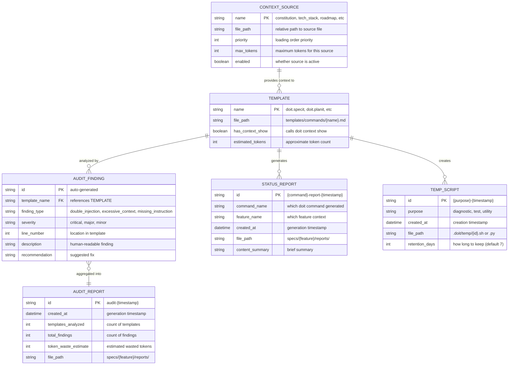
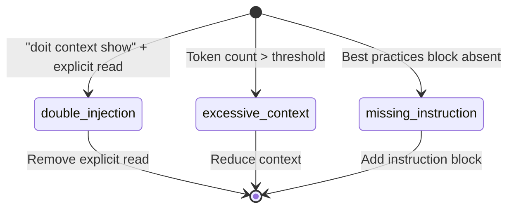

# Data Model: AI Context Optimization

**Feature**: 051-ai-context-optimization
**Date**: 2025-01-28

## Entity Relationships

<!-- BEGIN:AUTO-GENERATED section="er-diagram" -->

<!-- END:AUTO-GENERATED -->

## Entity Definitions

### Context Source

Represents a file or data source that provides context to AI coding assistants.

| Field | Type | Description |
|-------|------|-------------|
| name | string | Unique identifier (constitution, tech_stack, roadmap, completed_roadmap, current_spec, related_specs) |
| file_path | string | Relative path to the source file |
| priority | int | Loading order (1 = highest priority, loaded first) |
| max_tokens | int | Maximum tokens allocated to this source |
| enabled | boolean | Whether this source is active for context loading |

**State Transitions**: None (static configuration)

**Validation Rules**:
- name must be unique
- file_path must exist or be optional (current_spec may not exist)
- priority must be 1-10
- max_tokens must be positive

### Template

Represents a command template file containing AI instructions.

| Field | Type | Description |
|-------|------|-------------|
| name | string | Template identifier (e.g., "doit.specit") |
| file_path | string | Path to template file |
| has_context_show | boolean | Whether template includes `doit context show` |
| estimated_tokens | int | Approximate token count of template |

**State Transitions**: None (file-based, modified by developers)

**Validation Rules**:
- name must match filename pattern `doit.{command}.md`
- file_path must exist in `templates/commands/`

### Audit Finding

Represents a single finding from a context audit.

| Field | Type | Description |
|-------|------|-------------|
| id | string | Auto-generated identifier |
| template_name | string | Reference to template being audited |
| finding_type | enum | Type of finding (double_injection, excessive_context, missing_instruction) |
| severity | enum | Severity level (critical, major, minor) |
| line_number | int | Line number in template where issue found |
| description | string | Human-readable description of the finding |
| recommendation | string | Suggested remediation |

<!-- BEGIN:AUTO-GENERATED section="finding-type-states" -->

<!-- END:AUTO-GENERATED -->

**Finding Types**:
- `double_injection`: Template has both `doit context show` and explicit file reads for same source
- `excessive_context`: Template context exceeds recommended token limit
- `missing_instruction`: Template lacks best practices or artifact storage instructions

**Severity Levels**:
- `critical`: Double-injection patterns (immediate fix required)
- `major`: Missing instruction blocks
- `minor`: Minor optimization opportunities

### Audit Report

Aggregates findings from a complete audit run.

| Field | Type | Description |
|-------|------|-------------|
| id | string | Unique report identifier |
| created_at | datetime | When the audit was run |
| templates_analyzed | int | Number of templates analyzed |
| total_findings | int | Total findings across all templates |
| token_waste_estimate | int | Estimated tokens wasted by issues found |
| file_path | string | Where report is saved |

**Validation Rules**:
- id must follow pattern `audit-{YYYYMMDD-HHMMSS}`
- file_path must be in `specs/{feature}/reports/`

### Status Report

Generated by workflow commands for tracking progress.

| Field | Type | Description |
|-------|------|-------------|
| id | string | Unique report identifier |
| command_name | string | Which doit command generated this |
| feature_name | string | Which feature this relates to |
| created_at | datetime | Generation timestamp |
| file_path | string | Location of saved report |
| content_summary | string | Brief summary of report contents |

**Validation Rules**:
- id must follow pattern `{command}-report-{YYYYMMDD-HHMMSS}`
- file_path must be in `specs/{feature}/reports/`

### Temp Script

Temporary scripts generated by AI during workflow execution.

| Field | Type | Description |
|-------|------|-------------|
| id | string | Unique script identifier |
| purpose | string | What the script does |
| created_at | datetime | Creation timestamp |
| file_path | string | Path in `.doit/temp/` |
| retention_days | int | How long to keep before cleanup |

**Validation Rules**:
- file_path must be in `.doit/temp/`
- retention_days defaults to 7

## Configuration Schema

### context.yaml Structure

```yaml
# .doit/config/context.yaml
global:
  enabled: true
  max_tokens_per_source: 4000
  total_max_tokens: 16000

sources:
  constitution:
    path: ".doit/memory/constitution.md"
    priority: 1
    enabled: true
  tech_stack:
    path: ".doit/memory/tech-stack.md"
    priority: 2
    enabled: true
  roadmap:
    path: ".doit/memory/roadmap.md"
    priority: 3
    enabled: true
  completed_roadmap:
    path: ".doit/memory/completed_roadmap.md"
    priority: 4
    enabled: true
  current_spec:
    path: "specs/{feature}/spec.md"
    priority: 5
    enabled: true

# Per-command overrides
commands:
  specit:
    disabled_sources: [related_specs]
  roadmapit:
    disabled_sources: [current_spec, roadmap]
  constitution:
    disabled_sources: [current_spec, roadmap, completed_roadmap]

# NEW: Source mapping documentation
source_mapping:
  # Sources provided by "doit context show" - DO NOT read explicitly
  provided_by_context_show:
    - constitution
    - tech_stack
    - roadmap
    - completed_roadmap
    - current_spec
  # Sources that require explicit reads
  requires_explicit_read:
    - plan.md
    - data-model.md
    - tasks.md
    - contracts/*
    - checklists/*
```

## File Naming Conventions

### Status Reports
```
{command}-report-{YYYYMMDD-HHMMSS}.md
```
Examples:
- `specit-report-20250128-143022.md`
- `planit-report-20250128-150315.md`

### Temp Scripts
```
{purpose}-{YYYYMMDD-HHMMSS}.{ext}
```
Examples:
- `diagnostic-20250128-143022.sh`
- `test-runner-20250128-150315.py`
- `cleanup-20250128-160000.ps1`

### Audit Reports
```
audit-{YYYYMMDD-HHMMSS}.md
```
Example:
- `audit-20250128-143022.md`
