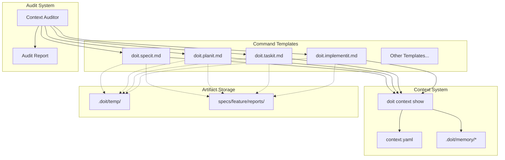

# Implementation Plan: AI Context Optimization

**Branch**: `051-ai-context-optimization` | **Date**: 2025-01-28 | **Spec**: [spec.md](spec.md)
**Input**: Feature specification from `/specs/051-ai-context-optimization/spec.md`

## Summary

This feature optimizes AI context injection by eliminating double-injection patterns where `doit context show` and explicit file read instructions provide duplicate content. It adds standardized best-practices instruction blocks to all 12 command templates, creates a context audit capability, and establishes consistent artifact storage locations (`.doit/temp/` for scripts, `specs/{feature}/reports/` for reports) with proper `.gitignore` configuration.

## Technical Context

**Language/Version**: Python 3.11+ (per constitution)
**Primary Dependencies**: Typer (CLI), Rich (output formatting), pathlib (file operations)
**Storage**: File-based (markdown templates in `templates/commands/`, config in `.doit/config/`)
**Testing**: pytest (per constitution)
**Target Platform**: Cross-platform CLI (Windows, Linux, macOS)
**Project Type**: single (CLI tool)
**Performance Goals**: Context audit completes in <30 seconds for 20 templates
**Constraints**: No external API dependencies, all processing local
**Scale/Scope**: 12 command templates, ~4 context sources, ~50 potential modification points

## Architecture Overview

<!-- BEGIN:AUTO-GENERATED section="architecture" -->

<!-- END:AUTO-GENERATED -->

## Constitution Check

*GATE: Must pass before Phase 0 research. Re-check after Phase 1 design.*

| Principle | Status | Notes |
|-----------|--------|-------|
| Specification-First | PASS | Spec exists and approved |
| Persistent Memory | PASS | Uses file-based storage in `.doit/memory/` |
| Auto-Generated Diagrams | PASS | Mermaid diagrams auto-generated |
| Opinionated Workflow | PASS | Following specit → planit → taskit flow |
| AI-Native Design | PASS | Templates are markdown for AI assistants |
| Tech Stack (Python 3.11+) | PASS | Using constitution-specified stack |
| Tech Stack (Typer/Rich) | PASS | Using constitution-specified libraries |
| Test Requirement | PENDING | Tests will be added during implementation |

## Project Structure

### Documentation (this feature)

```text
specs/051-ai-context-optimization/
├── spec.md              # Feature specification
├── plan.md              # This file
├── research.md          # Phase 0 output
├── data-model.md        # Phase 1 output
├── quickstart.md        # Phase 1 output
├── contracts/           # Phase 1 output
├── checklists/          # Quality checklists
│   └── requirements.md
└── tasks.md             # Phase 2 output (from /doit.taskit)
```

### Source Code (repository root)

```text
# Single project structure (CLI tool)
src/
├── doit_toolkit_cli/
│   ├── services/
│   │   └── context_auditor.py    # NEW: Context audit service
│   └── cli/
│       └── context_command.py    # MODIFY: Add audit subcommand

templates/
└── commands/
    ├── doit.specit.md            # MODIFY: Remove double-injection
    ├── doit.planit.md            # MODIFY: Remove double-injection
    ├── doit.taskit.md            # MODIFY: Remove double-injection
    ├── doit.implementit.md       # MODIFY: Remove double-injection
    ├── doit.reviewit.md          # MODIFY: Remove double-injection
    ├── doit.checkin.md           # MODIFY: Remove double-injection
    ├── doit.testit.md            # MODIFY: Remove double-injection
    ├── doit.fixit.md             # MODIFY: Remove double-injection
    ├── doit.documentit.md        # MODIFY: Remove double-injection
    ├── doit.roadmapit.md         # MODIFY: Remove double-injection
    ├── doit.scaffoldit.md        # MODIFY: Remove double-injection
    └── doit.constitution.md      # MODIFY: Remove double-injection

.doit/
├── config/
│   └── context.yaml              # MODIFY: Document source mappings
└── temp/                         # NEW: Temporary script storage
    └── .gitkeep

.gitignore                        # MODIFY: Add .doit/temp/ exclusion

tests/
├── unit/
│   └── test_context_auditor.py   # NEW: Audit service tests
└── integration/
    └── test_template_context.py  # NEW: Template validation tests
```

**Structure Decision**: Single project structure maintained. All modifications are to existing template files plus one new service file for the context auditor.

## Key Implementation Areas

### 1. Double-Injection Elimination (P1)

**Current Pattern (to remove)**:
```markdown
## Load Project Context
```bash
doit context show
```
...later in same template...
Read `.doit/memory/constitution.md` to understand...
Read `.doit/memory/tech-stack.md` for technology decisions...
```

**Target Pattern**:
```markdown
## Load Project Context
```bash
doit context show
```
**Use loaded context to**:
- Reference constitution principles (already loaded above)
- Consider roadmap priorities (already loaded above)
- Tech stack decisions (already loaded above)

**DO NOT** read these files directly - they are included in context above.
```

### 2. Best Practices Instruction Block (P1)

Add standardized block to all templates:
```markdown
## Code Quality Guidelines

Before generating or modifying code:
1. **Search for existing implementations** - Use Glob/Grep to find similar functionality
2. **Follow established patterns** - Match existing code style and architecture
3. **Avoid duplication** - Reference or extend existing code rather than recreating
4. **Check imports** - Verify required dependencies already exist in the project
```

### 3. Artifact Storage Instructions (P2)

Add to all templates:
```markdown
## Artifact Storage

- **Temporary scripts**: Save to `.doit/temp/{purpose}-{timestamp}.sh`
- **Status reports**: Save to `specs/{feature}/reports/{command}-report-{timestamp}.md`
- **Create directories if needed**: System will auto-create missing folders
```

### 4. Context Audit Command (P1)

New CLI command: `doit context audit`
- Scans all templates in `templates/commands/`
- Identifies double-injection patterns
- Reports token counts per template
- Generates optimization recommendations

## Complexity Tracking

No constitution violations. This feature:
- Uses existing tech stack (Python, Typer, Rich)
- Follows single project structure
- Stores all data in file-based markdown
- Maintains AI-native markdown interface
