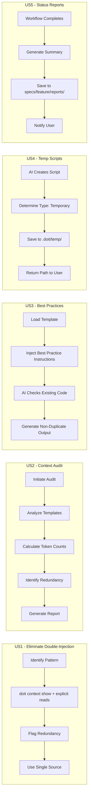

# Feature Specification: AI Context Optimization

**Feature Branch**: `051-ai-context-optimization`
**Created**: 2025-01-28
**Status**: Draft
**Input**: User description: "Enhance scripts and templates to provide better instructions to AI and better context. Check where we are adding more context than necessary and make sure the AI coding assistant has the context it needs to be as accurate and align to best practices and not duplicate code or functionality. Also enhance instructions so that AI creates temporary scripts in a temp folder and status reports/summaries in the spec folder."

## Summary

This feature optimizes how AI coding assistants receive context and instructions within the doit workflow system. It addresses four core concerns: (1) eliminating double-injection of context where `doit context show` provides content that templates also instruct AI to read directly from files, (2) reducing excessive context that dilutes AI focus, (3) ensuring AI has sufficient context to avoid code duplication and follow best practices, and (4) standardizing where AI-generated artifacts are stored (temp folder for scripts, spec folder for reports).

### Known Double-Injection Pattern (Primary Problem)

Currently, templates instruct AI to:

1. Run `doit context show` which loads constitution, tech-stack, roadmap, etc.
2. **Also** explicitly read `.doit/memory/constitution.md` and `.doit/memory/tech-stack.md` directly

This results in the same content being injected twice, wasting context window tokens and potentially confusing the AI with duplicate information.

## User Scenarios & Testing *(mandatory)*

### User Story 1 - Eliminate Double-Injection of Context (Priority: P1)

A developer notices that AI is receiving the same context twice - once from `doit context show` and again from explicit file read instructions in templates. They want templates to use a single, consistent method for context injection to avoid wasting tokens and confusing the AI.

**Why this priority**: Double-injection is the most impactful issue - it wastes 50%+ of context tokens on duplicate content and can cause AI confusion when processing the same information twice.

**Independent Test**: Can be tested by auditing a template for both `doit context show` calls AND explicit file read instructions for the same sources, then verifying the optimized template uses only one method.

**Acceptance Scenarios**:

1. **Given** a template that calls `doit context show`, **When** the template also instructs AI to read constitution/tech-stack files directly, **Then** the audit flags this as a double-injection pattern
2. **Given** an identified double-injection pattern, **When** optimization is applied, **Then** the template uses only `doit context show` for sources it provides (constitution, tech-stack, roadmap) and only explicit reads for sources NOT in `doit context show`
3. **Given** optimized templates, **When** AI processes a command, **Then** each context source appears exactly once in the AI's context window

---

### User Story 2 - Context Audit and Cleanup (Priority: P1)

A project maintainer wants to identify where templates and scripts are providing excessive or redundant context to AI, causing slower responses, confusion, or context window overflow. They need clear visibility into what context is being injected and recommendations for optimization.

**Why this priority**: Excessive context is the primary cause of AI accuracy issues. Reducing noise directly improves AI output quality and reduces token costs.

**Independent Test**: Can be fully tested by running a context audit on existing templates and verifying the audit report identifies redundant patterns and produces actionable recommendations.

**Acceptance Scenarios**:

1. **Given** a project with doit templates configured, **When** a context audit is initiated, **Then** the system produces a report showing each template's context sources, token counts, and redundancy indicators
2. **Given** templates with duplicate context sections, **When** the audit runs, **Then** redundant sections are flagged with specific file locations and recommendations for consolidation
3. **Given** a template exceeding recommended context limits, **When** the audit completes, **Then** optimization suggestions are provided prioritized by impact
4. **Given** a template with `doit context show` AND explicit file reads for the same sources, **When** the audit runs, **Then** double-injection is flagged as a critical issue with specific remediation steps

---

### User Story 3 - AI-Aware Best Practices Instructions (Priority: P1)

A developer using AI coding assistants wants templates to provide clear instructions that guide the AI to follow project best practices, avoid duplicating existing code/patterns, and check for existing implementations before creating new ones.

**Why this priority**: Duplicate code is a common AI output problem. Explicit instructions prevent wasted effort and maintain codebase quality.

**Independent Test**: Can be tested by running a doit command with enhanced templates and verifying AI output references existing code patterns and avoids duplication.

**Acceptance Scenarios**:

1. **Given** a template with best practices instructions, **When** an AI processes a request, **Then** the AI first searches for existing implementations before creating new code
2. **Given** a codebase with established patterns, **When** AI receives context about these patterns, **Then** AI-generated code follows the same conventions
3. **Given** instructions to check for duplication, **When** AI would create a duplicate function, **Then** AI instead references or extends the existing implementation

---

### User Story 4 - Temporary Script Storage in Temp Folder (Priority: P2)

A developer wants AI-generated temporary scripts (diagnostic scripts, one-off utilities, test runners) to be created in a designated temp folder rather than cluttering the project directory or being placed inconsistently.

**Why this priority**: Consistent temp file location prevents project pollution and makes cleanup predictable.

**Independent Test**: Can be tested by triggering AI to create a temporary script and verifying it appears in the designated temp location.

**Acceptance Scenarios**:

1. **Given** AI needs to create a temporary script, **When** the script is generated, **Then** it is placed in the project's designated temp folder (`.doit/temp/`)
2. **Given** a temp folder with scripts, **When** a cleanup operation runs, **Then** all temporary scripts older than the configured retention period are removed
3. **Given** a temporary script is created, **When** the AI references the script, **Then** the path in instructions points to the temp folder location
4. **Given** the `.doit/temp/` folder is created, **When** checking `.gitignore`, **Then** the folder is listed to prevent accidental commits of temporary files

---

### User Story 5 - Status Reports in Spec Folder (Priority: P2)

A developer wants workflow status reports, summaries, and AI-generated documentation to be stored in the feature's spec folder for easy reference and version control alongside the specification.

**Why this priority**: Centralizing reports in the spec folder improves traceability and keeps feature artifacts together.

**Independent Test**: Can be tested by running a workflow command and verifying status reports appear in the spec folder with correct naming.

**Acceptance Scenarios**:

1. **Given** a doit command that generates a status report, **When** the report is created, **Then** it is placed in `specs/{feature}/reports/` with a timestamped filename
2. **Given** multiple workflow stages complete, **When** reviewing the spec folder, **Then** each stage's report is available in chronological order
3. **Given** a summary is generated, **When** saved to the spec folder, **Then** it follows the naming convention `{command}-summary-{timestamp}.md`

---

### User Story 6 - Context Source Configuration Per Command (Priority: P3)

A power user wants to customize which context sources are active for specific doit commands, enabling them to optimize context for their workflow needs.

**Why this priority**: Advanced customization enables users to tune AI behavior for specific use cases.

**Independent Test**: Can be tested by modifying context configuration for a command and verifying only specified sources are loaded.

**Acceptance Scenarios**:

1. **Given** a custom context configuration for `specit`, **When** running `/doit.specit`, **Then** only the configured context sources are loaded
2. **Given** a context source marked as disabled for a command, **When** that command runs, **Then** the disabled source is not included in AI context
3. **Given** token limits are configured per source, **When** context is loaded, **Then** each source is truncated to its configured limit

---

### Edge Cases

- What happens when the temp folder doesn't exist? System creates it automatically with appropriate permissions.
- How does the system handle context that exceeds total token limits? Prioritized truncation based on source priority in config.
- What happens if reports folder creation fails due to permissions? Warning is logged and report is saved to fallback location with notification.
- How are existing patterns identified in large codebases? Semantic search limited to relevant directories based on file type and command context.
- What if a template needs context NOT provided by `doit context show`? Template may include explicit read instructions only for sources not covered by `doit context show` (e.g., feature-specific files, API contracts).
- What happens during migration from double-injection to single-injection? Templates are updated incrementally; audit tool tracks migration progress and validates no regressions.

## User Journey Visualization

<!-- BEGIN:AUTO-GENERATED section="user-journey" -->

<!-- END:AUTO-GENERATED -->

## Requirements *(mandatory)*

### Functional Requirements

#### Double-Injection Elimination (P1)

- **FR-001**: Templates MUST NOT instruct AI to read files that are already provided by `doit context show` (constitution, tech-stack, roadmap, completed_roadmap)
- **FR-002**: Templates that call `doit context show` MUST rely solely on its output for the context sources it provides, removing redundant explicit file read instructions
- **FR-003**: Context audit MUST detect double-injection patterns where both `doit context show` AND explicit file reads target the same source files
- **FR-004**: Documentation MUST clearly specify which context sources are provided by `doit context show` vs. which require explicit file reads

#### Context Audit and Optimization (P1)

- **FR-005**: System MUST provide a context audit capability that analyzes all templates and reports token counts, context sources, and redundancy indicators
- **FR-006**: Audit reports MUST identify specific line numbers and file paths where context optimizations can be made
- **FR-007**: Audit MUST calculate estimated token waste from double-injection patterns

#### Best Practices Instructions (P1)

- **FR-008**: System MUST include standardized "best practices" instruction blocks in all command templates that instruct AI to check for existing implementations before creating new code
- **FR-009**: System MUST include "duplication avoidance" instructions that direct AI to search for existing patterns, utilities, and helper functions before generating new ones

#### Artifact Storage (P2)

- **FR-010**: Templates MUST include explicit instructions directing AI to place temporary scripts in `.doit/temp/` folder
- **FR-011**: Templates MUST include instructions directing AI to save status reports and summaries to `specs/{feature}/reports/` folder
- **FR-012**: System MUST automatically create the temp folder and reports folder if they don't exist when AI attempts to save files
- **FR-013**: Templates MUST provide clear file naming conventions for both temp scripts and reports (e.g., `{purpose}-{timestamp}.sh` for scripts, `{command}-report-{timestamp}.md` for reports)
- **FR-016**: The `.doit/temp/` folder MUST be excluded from source control via `.gitignore` entry
- **FR-017**: When `.doit/temp/` is created, system MUST verify/add the gitignore entry to prevent accidental commits of temporary files

#### Configuration (P3)

- **FR-014**: System MUST support per-command context source configuration in `.doit/config/context.yaml`
- **FR-015**: System MUST include "context relevance" guidance that helps AI determine which loaded context is most relevant to the current task

### Key Entities

- **Context Source**: A file or data source that provides context to AI (constitution, roadmap, tech-stack, current spec, related specs)
- **Template**: A markdown file containing AI instructions for a specific doit command
- **Audit Report**: A generated document showing context analysis with optimization recommendations
- **Status Report**: A workflow-generated summary saved to the spec folder

## Success Criteria *(mandatory)*

### Measurable Outcomes

- **SC-001**: Zero double-injection patterns remain in templates after optimization (100% elimination of cases where `doit context show` AND explicit file reads target the same source)
- **SC-002**: Context token usage per command reduced by 40% after eliminating double-injection
- **SC-003**: AI coding assistants reference existing code patterns in 80% of code generation requests (measured by reviewing AI output for "existing implementation found" or similar references)
- **SC-004**: Duplicate code generation incidents reduce by 50% compared to pre-optimization baseline
- **SC-005**: All temporary scripts created by AI are located in `.doit/temp/` folder (100% compliance)
- **SC-006**: All status reports and summaries are located in `specs/{feature}/reports/` folder (100% compliance)
- **SC-007**: Context audit can be completed within 30 seconds for projects with up to 20 templates
- **SC-008**: Users can configure per-command context sources without editing template files directly
- **SC-009**: Average template context size is reduced by 25% after optimization recommendations are applied

## Assumptions

- AI coding assistants (Claude Code, GitHub Copilot) follow explicit instructions in templates
- The existing `.doit/config/context.yaml` configuration system will be extended rather than replaced
- Users have write permissions to create folders within `.doit/` and `specs/` directories
- Token counting uses approximate methods (word count * 1.3) rather than exact tokenization
- Best practice instructions are effective when placed at the beginning of context rather than buried in middle sections
- Standard retention period for temp files is 7 days unless configured otherwise

## Out of Scope

- Automatic code deduplication or refactoring (AI provides recommendations, not automatic changes)
- Real-time context optimization during AI interactions (optimization happens at template/config level)
- Integration with external AI platforms beyond Claude Code and GitHub Copilot
- Machine learning-based optimization of context (rule-based optimization only)
