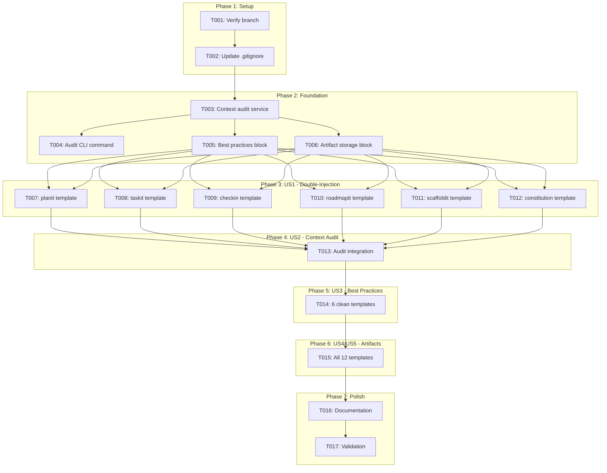
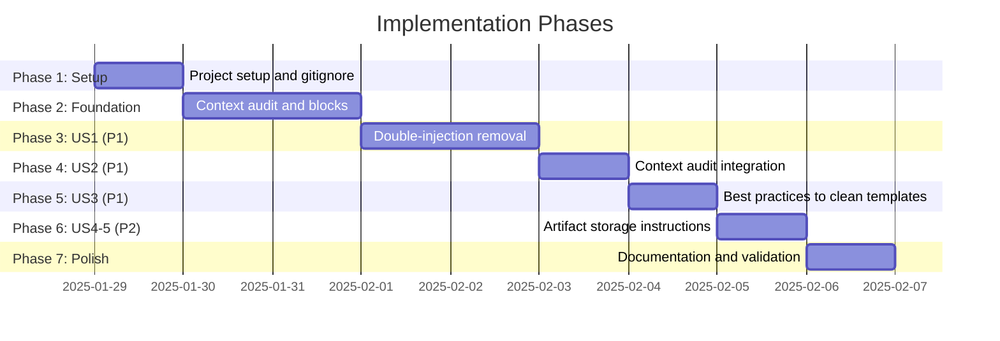

# Tasks: AI Context Optimization

**Input**: Design documents from `/specs/051-ai-context-optimization/`
**Prerequisites**: plan.md (required), spec.md (required for user stories), research.md, data-model.md, contracts/

**Tests**: Not explicitly requested in spec - test tasks marked as optional.

**Organization**: Tasks are grouped by user story to enable independent implementation and testing of each story.

**IMPORTANT**: This feature modifies SOURCE templates in `templates/commands/`, NOT `.doit/` folder files. The CLI uses these source templates when users run commands.

## Task Dependencies

<!-- BEGIN:AUTO-GENERATED section="task-dependencies" -->

<!-- END:AUTO-GENERATED -->

## Phase Timeline

<!-- BEGIN:AUTO-GENERATED section="phase-timeline" -->

<!-- END:AUTO-GENERATED -->

## Format: `[ID] [P?] [Story] Description`

- **[P]**: Can run in parallel (different files, no dependencies)
- **[Story]**: Which user story this task belongs to (e.g., US1, US2, US3)
- Include exact file paths in descriptions

## Path Conventions

- **Source Templates**: `templates/commands/*.md` (CLI source - what we modify)
- **CLI Services**: `src/doit_cli/services/*.py`
- **CLI Commands**: `src/doit_cli/cli/*.py`
- **Tests**: `tests/unit/*.py`, `tests/integration/*.py`

---

## Phase 1: Setup (Shared Infrastructure)

**Purpose**: Project initialization and configuration

- [x] T001 Verify on correct branch `051-ai-context-optimization` and all design docs exist
- [x] T002 Update `.gitignore` to add `.doit/temp/` exclusion entry

---

## Phase 2: Foundational (Blocking Prerequisites)

**Purpose**: Create reusable components that all user stories depend on

**CRITICAL**: No user story work can begin until these blocks are defined

- [x] T003 Create context auditor service skeleton in `src/doit_cli/services/context_auditor.py`
- [x] T004 Add `doit context audit` subcommand to `src/doit_cli/cli/context_command.py`
- [x] T005 Define standardized "Code Quality Guidelines" block content (markdown text to insert)
- [x] T006 Define standardized "Artifact Storage" block content (markdown text to insert)

**Checkpoint**: Foundation ready - template modifications can now begin

---

## Phase 3: User Story 1 - Eliminate Double-Injection (Priority: P1) - MVP

**Goal**: Remove explicit file read instructions from 6 templates that already have `doit context show`

**Independent Test**: Run `doit context audit` and verify zero double-injection patterns are flagged for modified templates

**IMPORTANT**: Modify templates in `templates/commands/`, NOT `.doit/` folder files

### Implementation for User Story 1

- [x] T007 [P] [US1] Remove double-injection patterns from `templates/commands/doit.planit.md`:
  - Remove "Read `.doit/memory/constitution.md`" instruction
  - Remove "Read `.doit/memory/tech-stack.md`" instruction
  - Remove explicit FEATURE_SPEC read (use current_spec from context)
  - Add "Use loaded context to" section clarifying what's already available
  - Add note about legitimate explicit reads (research.md, data-model.md, contracts/*)

- [x] T008 [P] [US1] Remove double-injection patterns from `templates/commands/doit.taskit.md`:
  - Remove "Read `.doit/memory/tech-stack.md`" instruction
  - Remove fallback to constitution.md for Tech Stack section
  - Add "Use loaded context to" clarification section

- [x] T009 [P] [US1] Remove double-injection patterns from `templates/commands/doit.checkin.md`:
  - Remove "Check if `.doit/memory/roadmap.md` exists" instruction
  - Remove "Check `.doit/memory/completed_roadmap.md`" instruction
  - Add clarification that roadmap context is already loaded

- [x] T010 [P] [US1] Remove double-injection patterns from `templates/commands/doit.roadmapit.md`:
  - Remove explicit roadmap file existence checks
  - Remove explicit constitution.md reads
  - Note: roadmapit has roadmap disabled in context show - this is intentional, adjust accordingly

- [x] T011 [P] [US1] Remove double-injection patterns from `templates/commands/doit.scaffoldit.md`:
  - Remove "Read `.doit/memory/constitution.md`" instruction
  - Remove "Load Constitution" section that reads file directly
  - Add clarification that constitution is in context

- [x] T012 [P] [US1] Update `templates/commands/doit.constitution.md`:
  - Update "Constitution Reading Utility" section to document context show sources
  - Remove or update instructions that tell other commands to read memory files directly
  - Document which sources require explicit reads (feature artifacts, contracts)

**Checkpoint**: User Story 1 complete - 6 templates no longer have double-injection patterns

---

## Phase 4: User Story 2 - Context Audit (Priority: P1)

**Goal**: Implement context audit command that detects double-injection patterns

**Independent Test**: Run `doit context audit` on templates/commands/ and verify it produces a report with findings

### Implementation for User Story 2

- [x] T013 [US2] Implement full context auditor logic in `src/doit_cli/services/context_auditor.py`:
  - Scan templates for `doit context show` instruction
  - Scan for explicit file read patterns (Read `.doit/memory/`, Check if `.doit/memory/`)
  - Flag templates with both patterns as "double-injection"
  - Calculate estimated token counts per template
  - Generate recommendations for each finding
  - Return structured AuditReport with findings

**Checkpoint**: User Story 2 complete - context audit command functional

---

## Phase 5: User Story 3 - Best Practices Instructions (Priority: P1)

**Goal**: Add standardized best practices instruction block to all 12 templates

**Independent Test**: Verify all templates in templates/commands/ contain the Code Quality Guidelines section

### Implementation for User Story 3

- [x] T014 [P] [US3] Add "Code Quality Guidelines" block to 6 clean templates (no double-injection):
  - `templates/commands/doit.specit.md`
  - `templates/commands/doit.implementit.md`
  - `templates/commands/doit.reviewit.md`
  - `templates/commands/doit.testit.md`
  - `templates/commands/doit.fixit.md`
  - `templates/commands/doit.documentit.md`

  Block content:
  ```markdown
  ## Code Quality Guidelines

  Before generating or modifying code:

  1. **Search for existing implementations** - Use Glob/Grep to find similar functionality before creating new code
  2. **Follow established patterns** - Match existing code style, naming conventions, and architecture
  3. **Avoid duplication** - Reference or extend existing utilities rather than recreating them
  4. **Check imports** - Verify required dependencies already exist in the project

  **Context already loaded** (DO NOT read these files again):
  - Constitution principles and tech stack
  - Roadmap priorities
  - Current specification
  - Related specifications
  ```

**Note**: The 6 templates modified in US1 should also get this block during their modification

**Checkpoint**: User Story 3 complete - all templates have best practices block

---

## Phase 6: User Stories 4 & 5 - Artifact Storage (Priority: P2)

**Goal**: Add artifact storage instructions to all 12 templates

**Independent Test**: Verify all templates contain the Artifact Storage section with temp and reports paths

### Implementation for User Stories 4 & 5

- [x] T015 [US4] [US5] Add "Artifact Storage" block to all 12 templates in `templates/commands/`:
  - doit.specit.md
  - doit.planit.md
  - doit.taskit.md
  - doit.implementit.md
  - doit.reviewit.md
  - doit.checkin.md
  - doit.testit.md
  - doit.fixit.md
  - doit.documentit.md
  - doit.roadmapit.md
  - doit.scaffoldit.md
  - doit.constitution.md

  Block content:
  ```markdown
  ## Artifact Storage

  - **Temporary scripts**: Save to `.doit/temp/{purpose}-{timestamp}.sh` (or .py/.ps1)
  - **Status reports**: Save to `specs/{feature}/reports/{command}-report-{timestamp}.md`
  - **Create directories if needed**: Use `mkdir -p` before writing files
  - Note: `.doit/temp/` is gitignored - temporary files will not be committed
  ```

**Checkpoint**: User Stories 4 & 5 complete - all templates have artifact storage instructions

---

## Phase 7: Polish & Cross-Cutting Concerns

**Purpose**: Documentation, validation, and cleanup

- [x] T016 [P] Update `specs/051-ai-context-optimization/quickstart.md` with implementation notes
- [x] T017 Run `doit context audit` on all templates and verify:
  - Zero double-injection patterns in any template
  - All 12 templates have "Code Quality Guidelines" section
  - All 12 templates have "Artifact Storage" section
  - Estimated token savings match target (40%+)

---

## Dependencies & Execution Order

### Phase Dependencies

- **Setup (Phase 1)**: No dependencies - start immediately
- **Foundational (Phase 2)**: Depends on Setup - creates reusable blocks
- **US1 (Phase 3)**: Depends on Foundation - modifies 6 templates
- **US2 (Phase 4)**: Depends on US1 - implements audit to verify changes
- **US3 (Phase 5)**: Depends on US2 - adds blocks to remaining 6 templates
- **US4/US5 (Phase 6)**: Depends on US3 - adds artifact block to all templates
- **Polish (Phase 7)**: Depends on all user stories

### User Story Dependencies

- **User Story 1 (P1)**: Can start after Foundation - core double-injection removal
- **User Story 2 (P1)**: Should follow US1 to verify removal worked
- **User Story 3 (P1)**: Can start after US2 - adds to remaining templates
- **User Story 4 & 5 (P2)**: Can start after US3 - final template additions

### Parallel Opportunities

- T007-T012 can all run in parallel (different template files)
- T014 can add blocks to 6 templates in parallel
- T015 can be parallelized across templates

---

## Implementation Strategy

### MVP First (User Story 1 Only)

1. Complete Phase 1: Setup
2. Complete Phase 2: Foundation (create blocks to insert)
3. Complete Phase 3: User Story 1 (remove double-injection from 6 templates)
4. **STOP and VALIDATE**: Run audit to verify 6 templates are clean
5. Demo token savings

### Incremental Delivery

1. Setup + Foundation → Blocks ready
2. Add US1 → Verify with audit → ~40% token reduction achieved
3. Add US2 → Full audit capability deployed
4. Add US3 → All templates have best practices
5. Add US4/US5 → All templates have artifact storage

---

## Summary

| Phase | Tasks | User Stories | Templates Modified |
|-------|-------|-------------|-------------------|
| Setup | T001-T002 | - | .gitignore |
| Foundation | T003-T006 | - | Service + blocks |
| US1 | T007-T012 | US1 (P1) | 6 templates |
| US2 | T013 | US2 (P1) | CLI command |
| US3 | T014 | US3 (P1) | 6 templates |
| US4/US5 | T015 | US4, US5 (P2) | 12 templates |
| Polish | T016-T017 | - | Docs + validation |

**Total Tasks**: 17
**Templates to Modify**: 12 (in `templates/commands/`)
**Files NOT to Modify**: `.doit/config/*`, `.doit/memory/*` (project-specific)

---

## Notes

- [P] tasks = different files, no dependencies
- [Story] label maps task to specific user story for traceability
- All template modifications are to `templates/commands/` (source templates)
- Never modify `.doit/` folder files directly - those are project-specific
- The `.gitignore` update is to the repository's gitignore (source file)
- Context audit scans `templates/commands/` not `.doit/templates/`
