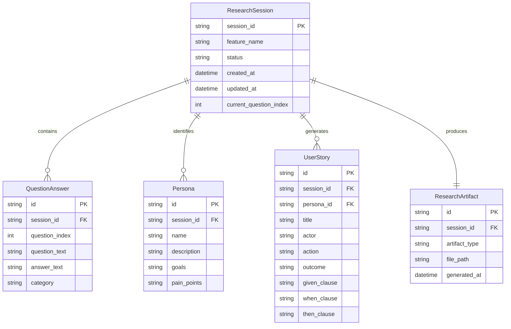
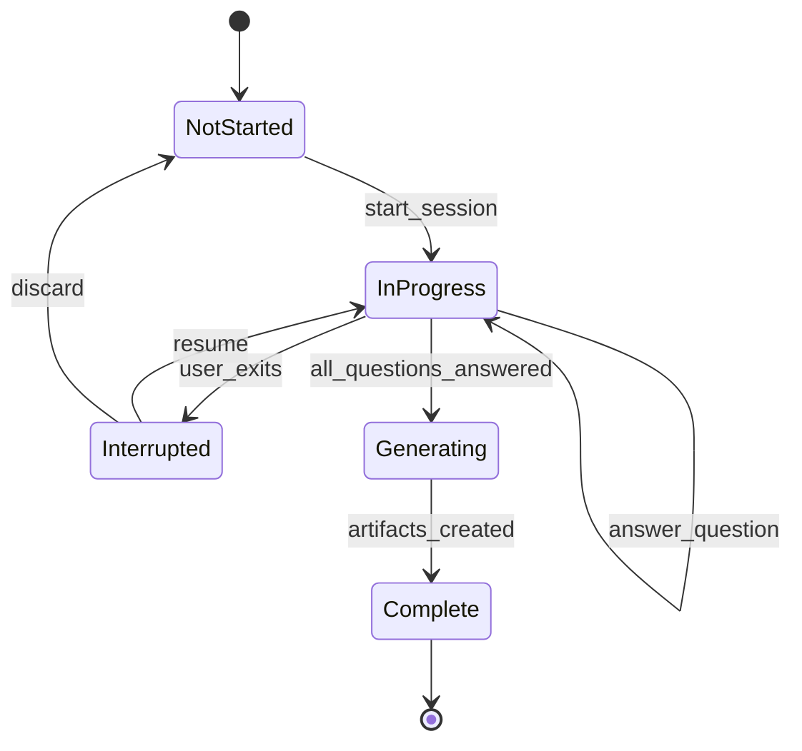
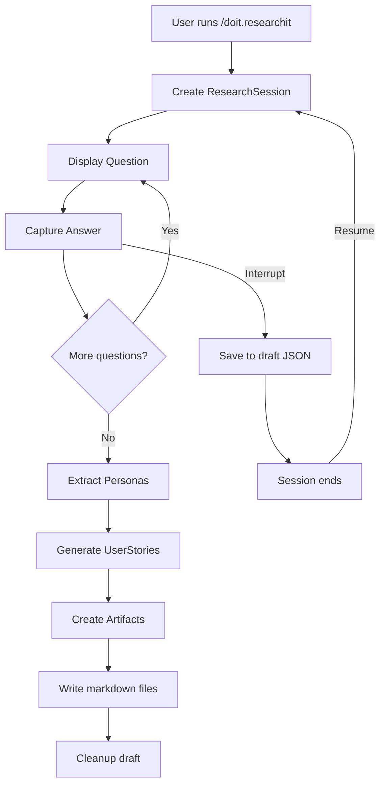

# Data Model: Research Command for Product Owners

**Feature**: 052-researchit-command
**Date**: 2026-01-29

## Entity Relationship Diagram

<!-- BEGIN:AUTO-GENERATED section="er-diagram" -->

<!-- END:AUTO-GENERATED -->

## Session State Machine



## Entity Definitions

### ResearchSession

Represents an active or completed research Q&A session.

| Field | Type | Description | Constraints |
|-------|------|-------------|-------------|
| session_id | string | Unique identifier | UUID v4, PK |
| feature_name | string | Feature being researched | Required, max 100 chars |
| status | enum | Current session state | NotStarted, InProgress, Interrupted, Generating, Complete |
| created_at | datetime | When session started | Auto-generated |
| updated_at | datetime | Last modification | Auto-updated |
| current_question_index | int | Progress through Q&A | 0 to N-1 |

**Validation Rules**:
- feature_name must be valid directory name (alphanumeric, hyphens)
- status transitions must follow state machine

### QuestionAnswer

Stores a single question-answer pair from the Q&A session.

| Field | Type | Description | Constraints |
|-------|------|-------------|-------------|
| id | string | Unique identifier | UUID v4, PK |
| session_id | string | Parent session | FK to ResearchSession |
| question_index | int | Order in Q&A flow | 0 to N-1 |
| question_text | string | The question asked | From predefined set |
| answer_text | string | User's response | Required, non-empty |
| category | enum | Question category | Problem, Users, Requirements, Metrics |

**Validation Rules**:
- answer_text must have minimum 10 characters
- category must be valid enum value

### Persona

Represents an identified user type/persona from the research.

| Field | Type | Description | Constraints |
|-------|------|-------------|-------------|
| id | string | Unique identifier | UUID v4, PK |
| session_id | string | Parent session | FK to ResearchSession |
| name | string | Persona name | Required, e.g., "Product Owner" |
| description | string | Who they are | Required |
| goals | string | What they want to achieve | Required |
| pain_points | string | Current frustrations | Optional |

**Derivation**: Extracted from answers to questions about users (category=Users).

### UserStory

A structured user story derived from research.

| Field | Type | Description | Constraints |
|-------|------|-------------|-------------|
| id | string | Unique identifier | UUID v4, PK |
| session_id | string | Parent session | FK to ResearchSession |
| persona_id | string | Associated persona | FK to Persona |
| title | string | Brief story title | Required, max 80 chars |
| actor | string | Who performs action | From Persona.name |
| action | string | What they do | Required |
| outcome | string | Expected result | Required |
| given_clause | string | Precondition | Given format |
| when_clause | string | Action trigger | When format |
| then_clause | string | Expected outcome | Then format |

**Validation Rules**:
- Must have associated persona
- given/when/then clauses must be non-empty

### ResearchArtifact

Represents a generated output file.

| Field | Type | Description | Constraints |
|-------|------|-------------|-------------|
| id | string | Unique identifier | UUID v4, PK |
| session_id | string | Parent session | FK to ResearchSession |
| artifact_type | enum | Type of artifact | research, user_stories, interview_notes, competitive_analysis |
| file_path | string | Path to generated file | Absolute path |
| generated_at | datetime | When created | Auto-generated |

## File Storage

### Session Draft (Transient)

```
.doit/state/research-draft-{feature-name}.json
```

Contains serialized ResearchSession with QuestionAnswers for resume functionality.

### Generated Artifacts (Persistent)

```
specs/{feature-name}/
├── research.md              # From research artifact
├── user-stories.md          # From user stories
├── interview-notes.md       # Template with personas
└── competitive-analysis.md  # Template structure
```

## Data Flow


