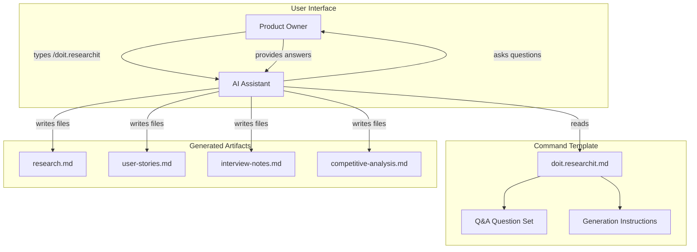

# Implementation Plan: Research Command for Product Owners

**Branch**: `052-researchit-command` | **Date**: 2026-01-29 | **Spec**: [spec.md](spec.md)
**Input**: Feature specification from `/specs/052-researchit-command/spec.md`

## Summary

This feature adds the `/doit.researchit` slash command - a pre-specification workflow stage for Product Owners to capture business requirements through AI-assisted conversation. Like other doit commands (`/doit.specit`, `/doit.planit`), this is a **template-based command** that AI assistants (Claude Code, Copilot) execute by following instructions in `templates/commands/doit.researchit.md`. The AI conducts the Q&A through natural conversation, then generates structured research artifacts (research.md, user-stories.md, interview-notes.md, competitive-analysis.md). Output integrates seamlessly with `/doit.specit` as context for specification generation.

## Technical Context

**Language/Version**: Markdown (command template), Bash (helper scripts if needed)
**Primary Dependencies**: None - template-based execution by AI assistant
**Storage**: File-based (Markdown artifacts in specs/{feature}/)
**Testing**: Manual testing of template execution
**Target Platform**: AI coding assistants (Claude Code, GitHub Copilot, Cursor)
**Project Type**: single (template addition)
**Performance Goals**: N/A - conversational Q&A at human pace
**Constraints**: AI assistant must support slash commands, no external APIs
**Scale/Scope**: 1 command template, 4 artifact templates, ~12 Q&A questions

## Architecture Overview

<!-- BEGIN:AUTO-GENERATED section="architecture" -->

<!-- END:AUTO-GENERATED -->

## Constitution Check

*GATE: Must pass before Phase 0 research. Re-check after Phase 1 design.*

| Principle | Status | Notes |
|-----------|--------|-------|
| Specification-First | PASS | Spec exists and approved |
| Persistent Memory | PASS | Uses file-based storage in `.doit/state/` and `specs/` |
| Auto-Generated Diagrams | N/A | No diagrams in this feature's output |
| Opinionated Workflow | PASS | Extends workflow with pre-specit stage |
| AI-Native Design | PASS | Markdown output for AI assistants |
| Tech Stack (Python 3.11+) | PASS | Using constitution-specified stack |
| Tech Stack (Typer/Rich) | PASS | Using constitution-specified libraries |
| Test Requirement | PENDING | Tests will be added during implementation |

## Project Structure

### Documentation (this feature)

```text
specs/052-researchit-command/
├── spec.md              # Feature specification
├── plan.md              # This file
├── research.md          # Phase 0 output
├── data-model.md        # Phase 1 output
├── quickstart.md        # Phase 1 output
├── contracts/           # Phase 1 output
│   └── researchit-cli.yaml
├── checklists/          # Quality checklists
│   └── requirements.md
└── tasks.md             # Phase 2 output (from /doit.taskit)
```

### Source Code (repository root)

```text
templates/
└── commands/
    └── doit.researchit.md          # NEW: Slash command template

.doit/
└── templates/
    ├── research-template.md        # NEW: research.md artifact template
    ├── user-stories-template.md    # NEW: user-stories.md artifact template
    ├── interview-notes-template.md # NEW: interview-notes.md artifact template
    └── competitive-analysis-template.md # NEW: competitive-analysis.md artifact template
```

**Structure Decision**: Template-based implementation following existing doit command patterns. No Python code required - the AI assistant executes the template instructions directly. Artifact templates guide consistent output format.

## Key Implementation Areas

### 1. Command Template (doit.researchit.md)

Create the slash command template that AI assistants execute:
- Instructions for conducting the Q&A conversation
- Question set organized by phase (Problem, Users, Requirements, Metrics)
- Guidance on when to ask follow-up questions
- Instructions for generating each artifact type
- Next steps recommendation (run `/doit.specit`)

### 2. Q&A Question Set

Define the questions the AI asks Product Owners:
- Phase 1: Problem Understanding (3 questions)
- Phase 2: Users and Goals (3 questions)
- Phase 3: Requirements and Constraints (4 questions)
- Phase 4: Success Metrics (2 questions)
- Follow-up prompts for minimal answers

### 3. Artifact Templates

Create templates for consistent output format:
- research-template.md: Structured sections for problem, users, goals, constraints
- user-stories-template.md: Given/When/Then format with persona linkage
- interview-notes-template.md: Stakeholder interview question templates
- competitive-analysis-template.md: Competitor comparison structure

### 4. Specit Integration

Update `/doit.specit` to consume research artifacts:
- Check for existing research.md in feature directory
- Load research context when generating specification
- Reference user-stories.md for acceptance scenarios

## Complexity Tracking

No constitution violations. This feature:
- Uses existing tech stack (Python, Typer, Rich)
- Follows single project structure
- Stores all data in file-based markdown
- Maintains AI-native markdown interface
- Extends (not replaces) existing workflow

## Implementation Phases

### Phase 1: Core Q&A Template (US1, US2) - MVP

- Create `templates/commands/doit.researchit.md` with Q&A instructions
- Define 12 questions across 4 phases
- Include instructions for generating research.md
- Include instructions for generating user-stories.md

### Phase 2: Full Package Templates (US3)

- Create interview-notes-template.md artifact template
- Create competitive-analysis-template.md artifact template
- Add generation instructions to command template

### Phase 3: Specit Integration (US4)

- Update doit.specit.md to check for research artifacts
- Add context loading from research.md
- Reference user-stories.md for acceptance scenarios

### Phase 4: Quality Improvements (US5)

- Add guidance for handling incomplete answers
- Add follow-up question prompts
- Refine output formatting
