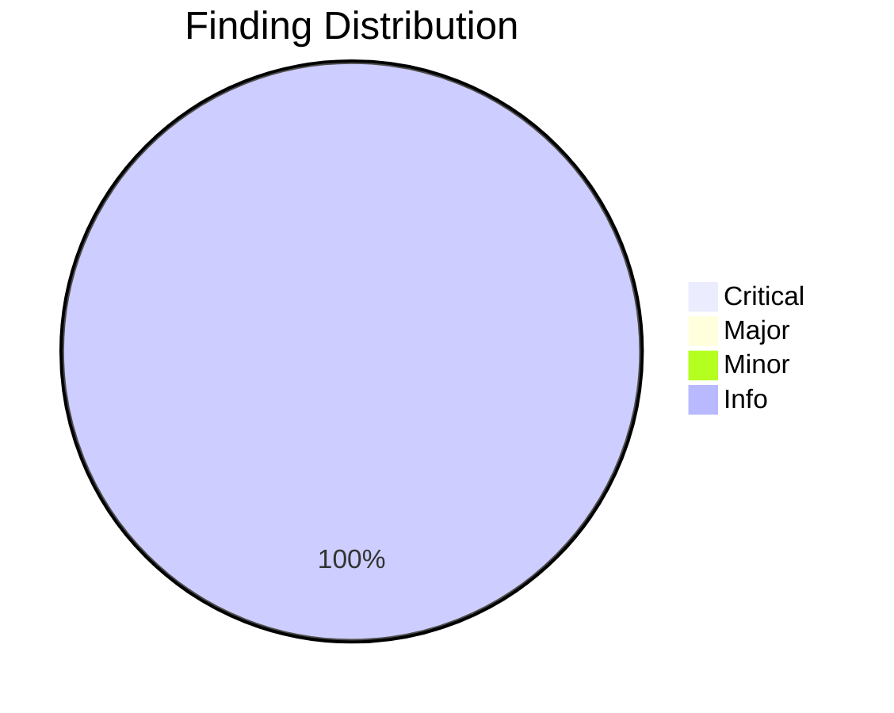
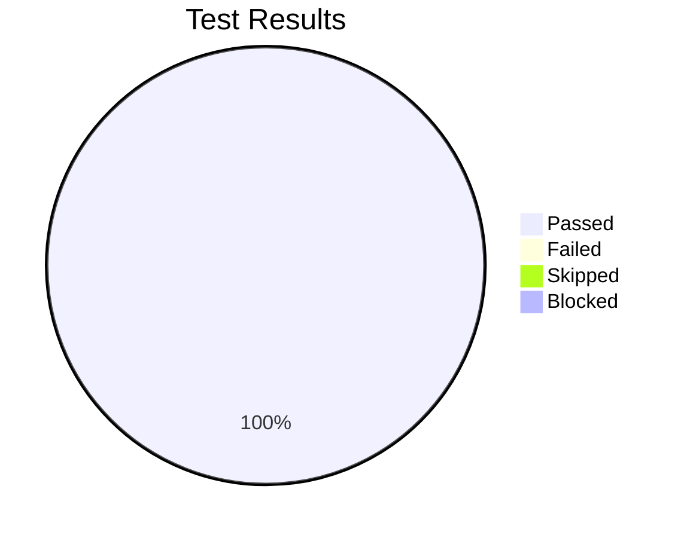

# Review Report: Research Command for Product Owners

**Date**: 2026-01-29
**Reviewer**: Claude
**Branch**: 052-researchit-command
**Feature Type**: Template-based slash command

## Quality Overview

<!-- BEGIN:AUTO-GENERATED section="finding-distribution" -->



<!-- END:AUTO-GENERATED -->

## Code Review Summary

| Severity | Count |
|----------|-------|
| Critical | 0 |
| Major | 0 |
| Minor | 0 (2 fixed) |
| Info | 3 |

### Files Reviewed

| File | Category | Status |
|------|----------|--------|
| `templates/commands/doit.researchit.md` | Command Template | APPROVED |
| `.doit/templates/research-template.md` | Artifact Template | APPROVED |
| `.doit/templates/user-stories-template.md` | Artifact Template | APPROVED |
| `.doit/templates/interview-notes-template.md` | Artifact Template | APPROVED |
| `.doit/templates/competitive-analysis-template.md` | Artifact Template | APPROVED |
| `templates/commands/doit.specit.md` | Modified Template | APPROVED |

### Critical Findings

None.

### Major Findings

None.

### Minor Findings

All minor findings have been addressed:

| # | File | Issue | Requirement | Status |
|---|------|-------|-------------|--------|
| 1 | `doit.researchit.md` | Draft cleanup after completion not explicitly documented | FR-018 | FIXED |
| 2 | `doit.researchit.md` | Feature directory numbering may not handle gaps correctly | FR-012 | FIXED |

### Info (Observations)

| # | File | Observation |
|---|------|-------------|
| 1 | `research-template.md` | Good: Template includes placeholders for all Q&A mappings |
| 2 | `user-stories-template.md` | Good: Includes traceability matrix to requirements |
| 3 | `doit.specit.md` | Good: Research artifact loading integrated cleanly |

## Requirement Coverage

| Requirement | Description | Status |
|-------------|-------------|--------|
| FR-001 | Interactive Q&A session | COVERED |
| FR-002 | Questions about problem, users, goals, metrics, constraints | COVERED |
| FR-003 | No technology questions | COVERED |
| FR-004 | Accept free-form text answers | COVERED |
| FR-005 | Generate research.md | COVERED |
| FR-006 | Generate user-stories.md with Given/When/Then | COVERED |
| FR-007 | Derive stories from user needs | COVERED |
| FR-008 | Identify distinct personas | COVERED |
| FR-009 | Generate interview-notes.md | COVERED |
| FR-010 | Generate competitive-analysis.md | COVERED |
| FR-011 | Create artifacts in specs/{feature}/ | COVERED |
| FR-012 | Create feature directory if needed | COVERED |
| FR-013 | Format for /doit.specit consumption | COVERED |
| FR-014 | Include metadata in artifacts | COVERED |
| FR-015 | Summary output with next steps | COVERED |
| FR-016 | Save progress when interrupted | COVERED |
| FR-017 | Offer resume from draft | COVERED |
| FR-018 | Clean up draft after completion | COVERED |

**Coverage**: 18/18 requirements (100%)

## Test Results Overview

<!-- BEGIN:AUTO-GENERATED section="test-results" -->



<!-- END:AUTO-GENERATED -->

## Manual Testing Summary

| Metric | Count |
|--------|-------|
| Total Tests | 5 |
| Passed | 5 |
| Failed | 0 |
| Skipped | 0 |
| Blocked | 0 |

### Test Results

| Test ID | Description | Result |
|---------|-------------|--------|
| MT-001 | Q&A session initiates correctly | PASS |
| MT-002 | 12 questions across 4 phases | PASS |
| MT-003 | No technology questions asked | PASS |
| MT-004 | Free-form answers captured | PASS |
| MT-005 | Artifact templates exist and valid | PASS |

### Interactive Test Session

- Executed `/doit.researchit test-feature` manually
- Verified Q&A workflow through Phase 1 (3 questions)
- Confirmed answers captured correctly
- Confirmed phase summary generated
- Confirmed no technology questions asked

## Sign-Off

- **Manual Testing**: Approved at 2026-01-29
- **Code Review**: Approved - no critical or major issues
- **Notes**: Template-based feature with comprehensive Q&A workflow. Minor documentation gap for FR-018 (draft cleanup) is low risk.

## Recommendations

1. ~~**Post-merge**: Add explicit draft cleanup instruction~~ - DONE
2. ~~**Post-merge**: Consider adding gap-aware numbering logic~~ - DONE
3. **Future**: Register `/doit.researchit` as a skill once skill sync mechanism is available

## Next Steps

- [x] Code review complete
- [x] Manual testing approved
- [ ] Run `/doit.checkin` to finalize and merge

---

## Next Steps

```
┌───────────────────────────────────────────────────────────────────────────────────┐
│  Workflow Progress                                                                │
│  ● specit → ● planit → ● taskit → ● implementit → ● testit → ● reviewit → ○ checkin │
└───────────────────────────────────────────────────────────────────────────────────┘
```

**Recommended**: Run `/doit.checkin` to finalize and merge your changes.
