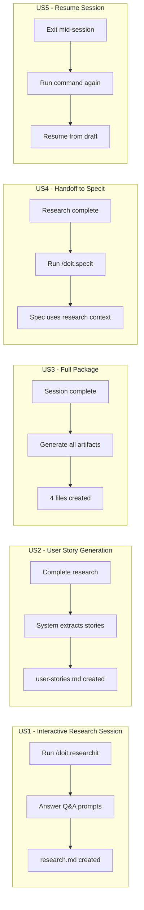

# Feature Specification: Research Command for Product Owners

**Feature Branch**: `052-researchit-command`
**Created**: 2026-01-29
**Status**: Draft
**Input**: User description: "Research command for Product Owners (/doit.researchit) - Pre-specit workflow stage for Application/Product Owners to define requirements in business terms without dictating technology."

## Summary

The `/doit.researchit` command provides a pre-specification workflow stage designed for Application and Product Owners to capture and structure business requirements before technical specification. It uses interactive Q&A to gather problem statements, user needs, goals, and constraints in business language, deliberately avoiding technology decisions. The command produces a comprehensive research package that serves as input for `/doit.specit`, ensuring requirements are properly defined before engineering begins.

## User Scenarios & Testing *(mandatory)*

### User Story 1 - Interactive Research Session (Priority: P1)

A Product Owner wants to define requirements for a new feature. They run `/doit.researchit` and are guided through an interactive Q&A session that helps them articulate the business problem, target users, desired outcomes, and constraints without requiring technical knowledge.

**Why this priority**: This is the core functionality - without interactive Q&A, the command cannot gather requirements from non-technical stakeholders. It enables the primary use case of bridging business and technical teams.

**Independent Test**: Can be fully tested by running `/doit.researchit [feature name]` and completing the Q&A session, resulting in a research.md file with structured business requirements.

**Acceptance Scenarios**:

1. **Given** a Product Owner with a feature idea, **When** they run `/doit.researchit "customer feedback system"`, **Then** they are presented with guided questions about the problem, users, goals, and constraints
2. **Given** an active Q&A session, **When** the user answers each question, **Then** their responses are captured and organized into structured sections
3. **Given** a completed Q&A session, **When** all required questions are answered, **Then** a research.md file is generated in the feature's specs directory
4. **Given** the Q&A session, **When** technology-specific questions arise, **Then** the system explicitly avoids asking about implementation details (languages, frameworks, databases)

---

### User Story 2 - User Story Generation (Priority: P1)

A Product Owner wants to capture user stories in a structured format. After completing the research Q&A, the system generates user stories in Given/When/Then format based on the captured requirements, making them ready for specification.

**Why this priority**: User stories are essential for `/doit.specit` to create proper specifications. Without structured user stories, the handoff to specification would lose critical information.

**Independent Test**: Can be tested by completing a research session and verifying that user-stories.md contains properly formatted Given/When/Then scenarios derived from the research.

**Acceptance Scenarios**:

1. **Given** a completed research session with defined user needs, **When** the session ends, **Then** user-stories.md is generated with stories in Given/When/Then format
2. **Given** multiple user types identified in research, **When** stories are generated, **Then** each user type has at least one dedicated user story
3. **Given** generated user stories, **When** reviewed, **Then** each story includes: actor, action, and expected outcome without technical implementation details

---

### User Story 3 - Full Research Package Generation (Priority: P2)

A Product Owner wants a complete research package including competitive analysis and stakeholder interview notes. The command generates all four research artifacts (research.md, user-stories.md, interview-notes.md, competitive-analysis.md) as a cohesive package.

**Why this priority**: The full package provides comprehensive context for specification, but the core research.md and user-stories.md are sufficient for MVP functionality.

**Independent Test**: Can be tested by running a complete research session and verifying all four artifact files are created with appropriate content.

**Acceptance Scenarios**:

1. **Given** a completed research Q&A, **When** the session ends, **Then** all four research artifacts are generated in the feature's specs directory
2. **Given** the interview-notes.md template, **When** generated, **Then** it includes stakeholder interview templates with suggested questions for each identified user type
3. **Given** the competitive-analysis.md template, **When** generated, **Then** it includes sections for identifying competitors, comparing features, and documenting differentiation opportunities

---

### User Story 4 - Research-to-Spec Handoff (Priority: P2)

A Product Owner has completed their research and wants to hand off to the development team. The research package is formatted to integrate seamlessly with `/doit.specit`, allowing the technical team to generate specifications from the captured requirements.

**Why this priority**: Seamless handoff ensures the workflow is opinionated and efficient, but the core research capture (P1) must work first.

**Independent Test**: Can be tested by completing research, then running `/doit.specit` and verifying it can consume the research artifacts as input context.

**Acceptance Scenarios**:

1. **Given** a completed research package, **When** a developer runs `/doit.specit`, **Then** the research artifacts are automatically loaded as context
2. **Given** research artifacts exist, **When** `/doit.specit` runs, **Then** it suggests feature name and initial content based on research.md
3. **Given** a successful handoff, **When** the spec is generated, **Then** it includes a reference link back to the research artifacts

---

### User Story 5 - Resume Incomplete Research (Priority: P3)

A Product Owner needs to pause a research session and resume later. The command saves progress and allows resuming from where they left off.

**Why this priority**: While convenient, most research sessions can be completed in one sitting. This is a quality-of-life improvement rather than core functionality.

**Independent Test**: Can be tested by starting a session, exiting mid-way, then running the command again and verifying it offers to resume.

**Acceptance Scenarios**:

1. **Given** an incomplete research session, **When** the user exits, **Then** progress is saved to a draft file
2. **Given** a saved draft exists, **When** the user runs `/doit.researchit` again, **Then** they are offered the option to resume or start fresh
3. **Given** the user chooses to resume, **When** the session continues, **Then** previously answered questions are pre-filled

---

### Edge Cases

- What happens when the user provides empty or minimal answers? System prompts for more detail with suggested examples.
- How does the system handle interruption (Ctrl+C)? Saves current progress to draft before exiting.
- What if research.md already exists? Offers to update existing or create new version.
- How are conflicting requirements handled? Flags conflicts and asks user to prioritize.

## User Journey Visualization

<!-- BEGIN:AUTO-GENERATED section="user-journey" -->

<!-- END:AUTO-GENERATED -->

## Requirements *(mandatory)*

### Functional Requirements

#### Core Q&A Workflow (P1)

- **FR-001**: System MUST provide an interactive Q&A session that guides users through defining business requirements
- **FR-002**: System MUST ask questions about: problem statement, target users, business goals, success metrics, and constraints
- **FR-003**: System MUST NOT ask questions about technology choices, implementation details, or technical architecture
- **FR-004**: System MUST accept free-form text answers and structure them into organized sections
- **FR-005**: System MUST generate research.md containing all captured requirements in a structured format

#### User Story Generation (P1)

- **FR-006**: System MUST generate user-stories.md with stories in Given/When/Then format
- **FR-007**: System MUST derive user stories from the captured user needs and goals
- **FR-008**: System MUST identify distinct user types/personas from research and create stories for each

#### Full Research Package (P2)

- **FR-009**: System MUST generate interview-notes.md with stakeholder interview templates
- **FR-010**: System MUST generate competitive-analysis.md with competitor comparison structure
- **FR-011**: System MUST create all artifacts in the specs/{feature}/ directory
- **FR-012**: System MUST create the feature directory structure if it doesn't exist

#### Workflow Integration (P2)

- **FR-013**: System MUST format research artifacts to be consumable by `/doit.specit`
- **FR-014**: System MUST include metadata (date, author context) in generated artifacts
- **FR-015**: System MUST provide a summary output showing all generated files and next steps

#### Session Management (P3)

- **FR-016**: System MUST save progress to a draft file when session is interrupted
- **FR-017**: System MUST offer to resume from draft when restarting with existing draft
- **FR-018**: System MUST clean up draft files after successful completion

### Key Entities

- **ResearchSession**: Active Q&A session with current question index, answers collected, and session state
- **ResearchArtifact**: Generated output file (research.md, user-stories.md, interview-notes.md, competitive-analysis.md)
- **UserStory**: Structured story with actor, action, outcome, and acceptance criteria
- **Persona**: Identified user type with characteristics, goals, and pain points

## Success Criteria *(mandatory)*

### Measurable Outcomes

- **SC-001**: Product Owners can complete a research session in under 15 minutes for a typical feature
- **SC-002**: Generated user stories require less than 20% revision when converted to specifications
- **SC-003**: Research artifacts provide sufficient context for `/doit.specit` to generate 80% of specification content automatically
- **SC-004**: 90% of research sessions result in a complete package without needing to restart
- **SC-005**: Non-technical stakeholders can complete the Q&A without assistance from developers
- **SC-006**: Time from initial idea to specification-ready research reduces by 50% compared to manual documentation

## Assumptions

- Product Owners have basic familiarity with the doit workflow and CLI commands
- A single research session covers one feature (not multiple features bundled together)
- The feature directory naming follows the existing pattern (###-feature-name)
- English is the primary language for Q&A prompts and artifacts
- Users have terminal/command-line access to run the command

## Out of Scope

- Integration with external project management tools (Jira, Azure DevOps, etc.)
- Multi-language support for Q&A prompts
- Collaborative research sessions (multiple users simultaneously)
- Automatic competitor research via web scraping
- Voice input or speech-to-text for answers
- AI-generated requirement suggestions (user provides all content)
