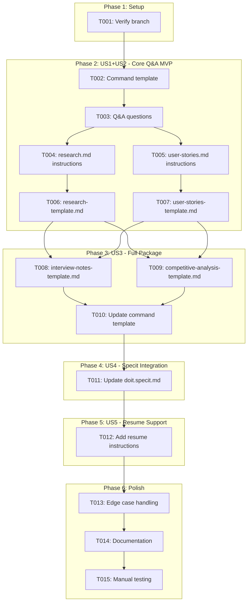
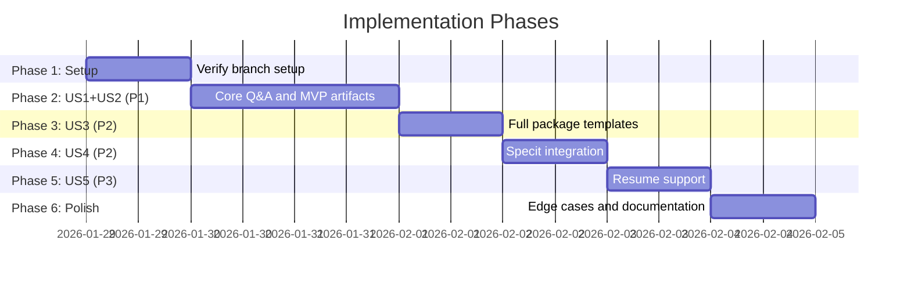

# Tasks: Research Command for Product Owners

**Input**: Design documents from `/specs/052-researchit-command/`
**Prerequisites**: plan.md (required), spec.md (required for user stories)

**Tests**: Not explicitly requested in spec - manual template testing only.

**Organization**: Tasks are grouped by user story to enable independent implementation and testing of each story.

**IMPORTANT**: This feature creates TEMPLATE files, NOT Python code. The AI assistant executes the template.

## Task Dependencies

<!-- BEGIN:AUTO-GENERATED section="task-dependencies" -->

<!-- END:AUTO-GENERATED -->

## Phase Timeline

<!-- BEGIN:AUTO-GENERATED section="phase-timeline" -->

<!-- END:AUTO-GENERATED -->

## Format: `[ID] [P?] [Story] Description`

- **[P]**: Can run in parallel (different files, no dependencies)
- **[Story]**: Which user story this task belongs to (e.g., US1, US2, US3)
- Include exact file paths in descriptions

## Path Conventions

- **Command Templates**: `templates/commands/*.md` (source templates)
- **Artifact Templates**: `.doit/templates/*.md` (output format templates)

---

## Phase 1: Setup

**Purpose**: Verify project setup and branch

- [x] T001 Verify on correct branch `052-researchit-command` and all design docs exist

---

## Phase 2: User Stories 1 & 2 - Core Q&A and MVP (Priority: P1)

**Goal**: Create the main command template with interactive Q&A that generates research.md and user-stories.md

**Independent Test**: Run `/doit.researchit [feature]` in AI assistant and verify Q&A flow produces research.md and user-stories.md

### Implementation for User Stories 1 & 2

- [x] T002 [US1] Create command template skeleton at `templates/commands/doit.researchit.md`:
  - Add header with command name and description
  - Add "Load Project Context" section (same pattern as other commands)
  - Add "Outline" section with numbered steps
  - Add "Next Steps" section template

- [x] T003 [US1] Add Q&A question set to `templates/commands/doit.researchit.md`:
  - Phase 1: Problem Understanding (3 questions)
    - "What problem are you trying to solve?"
    - "Who currently experiences this problem?"
    - "What happens today without this solution?"
  - Phase 2: Users and Goals (3 questions)
    - "Who are the primary users of this feature?"
    - "What does success look like for these users?"
    - "Are there different types of users with different needs?"
  - Phase 3: Requirements and Constraints (4 questions)
    - "What must this feature absolutely do? (Must-haves)"
    - "What would be nice to have but isn't essential?"
    - "What should this feature NOT do? (Explicit exclusions)"
    - "Are there any constraints (timeline, budget, compliance)?"
  - Phase 4: Success Metrics (2 questions)
    - "How will you measure if this feature is successful?"
    - "What would failure look like?"

- [x] T004 [US1] Add research.md generation instructions to `templates/commands/doit.researchit.md`:
  - Instructions to create `specs/{feature}/research.md`
  - Mapping of Q&A answers to research.md sections
  - Template structure for the output file

- [x] T005 [US2] Add user-stories.md generation instructions to `templates/commands/doit.researchit.md`:
  - Instructions to derive user stories from Q&A answers
  - Given/When/Then format specification
  - Persona extraction from user type answers

- [x] T006 [P] [US1] Create artifact template at `.doit/templates/research-template.md`:
  - Problem Statement section
  - Target Users section (with persona placeholders)
  - Business Goals section
  - Success Metrics section
  - Constraints section
  - Out of Scope section

- [x] T007 [P] [US2] Create artifact template at `.doit/templates/user-stories-template.md`:
  - User Story format with Given/When/Then
  - Persona reference structure
  - Priority placeholder
  - Acceptance criteria format

**Checkpoint**: US1 & US2 complete - Core Q&A MVP functional

---

## Phase 3: User Story 3 - Full Research Package (Priority: P2)

**Goal**: Add interview notes and competitive analysis templates to complete the research package

**Independent Test**: Run complete research session and verify all 4 artifact files are created

### Implementation for User Story 3

- [x] T008 [P] [US3] Create artifact template at `.doit/templates/interview-notes-template.md`:
  - Stakeholder interview template structure
  - Suggested questions per persona type
  - Notes capture format
  - Key insights section

- [x] T009 [P] [US3] Create artifact template at `.doit/templates/competitive-analysis-template.md`:
  - Competitor identification section
  - Feature comparison matrix structure
  - Differentiation opportunities section
  - Market positioning notes

- [x] T010 [US3] Update `templates/commands/doit.researchit.md` to generate all 4 artifacts:
  - Add instructions for interview-notes.md generation
  - Add instructions for competitive-analysis.md generation
  - Update summary output to list all files created

**Checkpoint**: US3 complete - Full research package generated

---

## Phase 4: User Story 4 - Specit Integration (Priority: P2)

**Goal**: Update `/doit.specit` to consume research artifacts as context

**Independent Test**: Complete research, run `/doit.specit`, verify spec includes research context

### Implementation for User Story 4

- [x] T011 [US4] Update `templates/commands/doit.specit.md` to detect and load research artifacts:
  - Add step to check for existing `research.md` in feature directory
  - Add step to load `user-stories.md` if exists
  - Add instruction to use research content as context for spec generation
  - Add reference link to research artifacts in generated spec

**Checkpoint**: US4 complete - Seamless research-to-spec handoff

---

## Phase 5: User Story 5 - Resume Support (Priority: P3)

**Goal**: Add instructions for handling incomplete sessions and resuming

**Independent Test**: Exit mid-session, run command again, verify resume offer

### Implementation for User Story 5

- [x] T012 [US5] Add session resume instructions to `templates/commands/doit.researchit.md`:
  - Instructions to check for existing draft/partial research.md
  - Prompt to offer resume or start fresh
  - Instructions for merging new answers with existing content

**Checkpoint**: US5 complete - Resume functionality available

---

## Phase 6: Polish & Cross-Cutting Concerns

**Purpose**: Edge cases, documentation, and final testing

- [x] T013 Add edge case handling to `templates/commands/doit.researchit.md`:
  - Guidance for minimal/empty answers (prompt for more detail)
  - Handling of conflicting requirements (ask for prioritization)
  - Existing research.md handling (update vs. new version)

- [x] T014 Update `specs/052-researchit-command/quickstart.md` with final usage examples

- [x] T015 Manual testing: Execute `/doit.researchit` end-to-end and verify:
  - All 12 Q&A questions are asked appropriately
  - All 4 artifact files are generated correctly
  - `/doit.specit` can consume the research artifacts
  - Next steps recommendation displays correctly

---

## Dependencies & Execution Order

### Phase Dependencies

- **Setup (Phase 1)**: No dependencies - start immediately
- **US1+US2 (Phase 2)**: Depends on Setup - core MVP
- **US3 (Phase 3)**: Depends on US1+US2 - extends with more artifacts
- **US4 (Phase 4)**: Depends on US3 - integrates with specit
- **US5 (Phase 5)**: Depends on US4 - adds quality-of-life resume
- **Polish (Phase 6)**: Depends on all user stories

### User Story Dependencies

- **User Story 1 (P1)**: Core Q&A - can start after setup
- **User Story 2 (P1)**: User story generation - same phase as US1 (tightly coupled)
- **User Story 3 (P2)**: Full package - extends US1+US2 artifacts
- **User Story 4 (P2)**: Specit integration - requires US3 complete
- **User Story 5 (P3)**: Resume support - can be added last

### Parallel Opportunities

- T006 and T007 can run in parallel (different template files)
- T008 and T009 can run in parallel (different template files)

---

## Implementation Strategy

### MVP First (User Stories 1 & 2 Only)

1. Complete Phase 1: Setup
2. Complete Phase 2: Core Q&A template + research.md + user-stories.md
3. **STOP and VALIDATE**: Run `/doit.researchit` and verify basic flow works
4. Demo to stakeholders

### Incremental Delivery

1. Setup → MVP works
2. Add US3 → Full package (4 files)
3. Add US4 → Specit integration
4. Add US5 → Resume support
5. Polish → Edge cases and docs

---

## Summary

| Phase | Tasks | User Stories | Files Modified |
|-------|-------|-------------|----------------|
| Setup | T001 | - | - |
| US1+US2 | T002-T007 | US1 (P1), US2 (P1) | 3 files |
| US3 | T008-T010 | US3 (P2) | 3 files |
| US4 | T011 | US4 (P2) | 1 file |
| US5 | T012 | US5 (P3) | 1 file |
| Polish | T013-T015 | - | 2 files |

**Total Tasks**: 15
**Files to Create**: 5 (1 command template + 4 artifact templates)
**Files to Modify**: 1 (doit.specit.md)

---

## Notes

- [P] tasks = different files, no dependencies
- [Story] label maps task to specific user story for traceability
- All files are markdown templates - NO Python code
- The AI assistant executes the command template directly
- Manual testing replaces automated tests for template-based features
