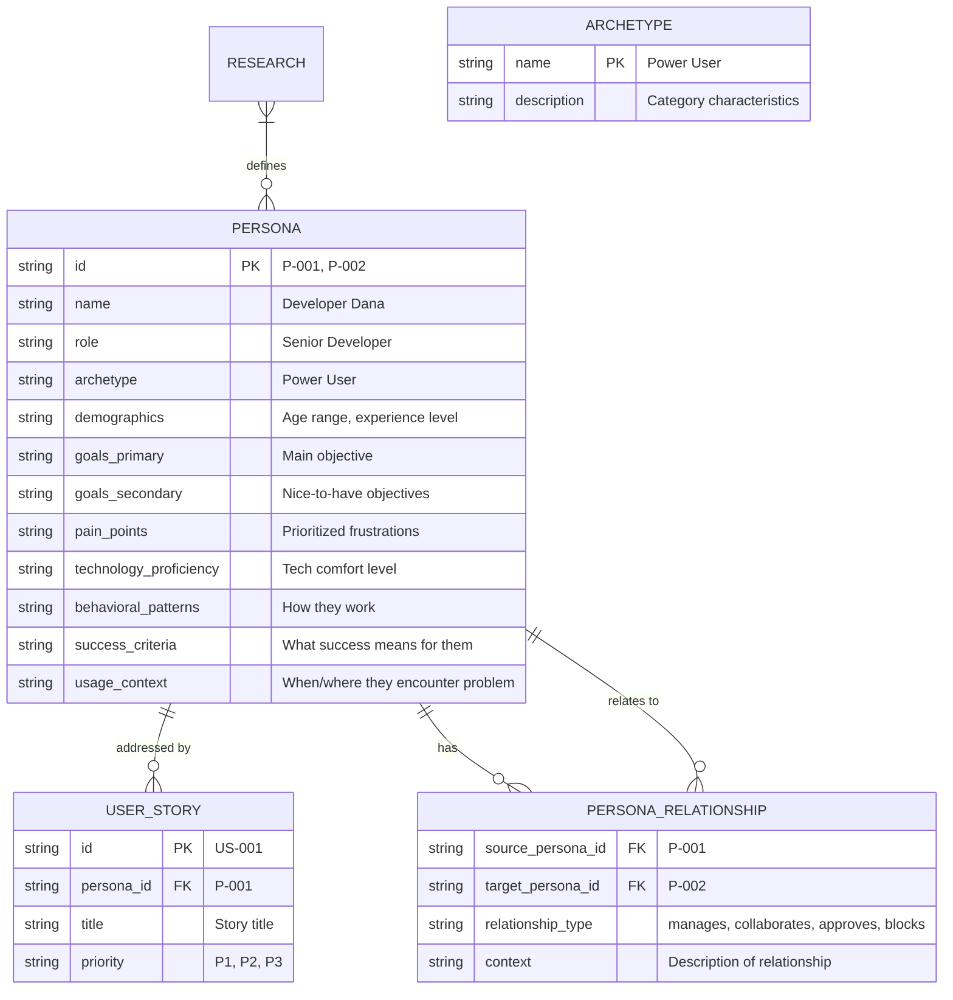

# Data Model: Stakeholder Persona Templates

**Branch**: `053-stakeholder-persona-templates` | **Date**: 2026-01-30

## Entity Relationships

<!-- BEGIN:AUTO-GENERATED section="er-diagram" -->

<!-- END:AUTO-GENERATED -->

## Entity Definitions

### Persona

A stakeholder profile representing a user type with comprehensive profile fields.

| Field | Type | Required | Description |
|-------|------|----------|-------------|
| id | string | Yes | Unique identifier (P-001, P-002, etc.) |
| name | string | Yes | Persona name (e.g., "Developer Dana") |
| role | string | Yes | Job title or role description |
| archetype | string | Yes | Category: Power User, Casual User, Administrator, Approver |
| demographics | string | No | Age range, experience level, team size |
| goals_primary | string | Yes | Main objective for this persona |
| goals_secondary | string | No | Nice-to-have objectives |
| pain_points | string[] | Yes | Prioritized list of frustrations |
| technology_proficiency | string | No | Technology comfort level (Low/Medium/High) |
| behavioral_patterns | string | No | How they typically work |
| success_criteria | string | Yes | What success means for this persona |
| usage_context | string | Yes | When/where they encounter the problem |
| relationships | PersonaRelationship[] | No | Links to other personas |

### Persona Relationship

A connection between two personas describing their working relationship.

| Field | Type | Required | Description |
|-------|------|----------|-------------|
| source_persona_id | string | Yes | ID of the persona this relationship is defined on |
| target_persona_id | string | Yes | ID of the related persona |
| relationship_type | enum | Yes | manages, collaborates, approves, blocks, reports_to |
| context | string | No | Description of the relationship dynamic |

### Archetype

Standard persona categories for classification.

| Value | Description |
|-------|-------------|
| Power User | Frequent user with advanced needs |
| Casual User | Occasional user with basic needs |
| Administrator | System management and configuration |
| Approver | Decision-maker who reviews/approves work |
| Observer | Stakeholder who views but doesn't interact directly |

## Template Structure

### persona-template.md

The comprehensive persona input template used during `/doit.researchit`:

```markdown
## Persona: {ID}

### Identity
- **Name**: {Persona Name}
- **Role**: {Job Title / Role}
- **Archetype**: {Power User | Casual User | Administrator | Approver | Observer}

### Demographics
- **Experience Level**: {Junior | Mid | Senior | Executive}
- **Team Size**: {Solo | Small Team | Large Team | Enterprise}
- **Domain Expertise**: {Description}

### Goals
**Primary Goal**: {Main objective}
**Secondary Goals**:
- {Goal 1}
- {Goal 2}

### Pain Points (prioritized)
1. {Most critical pain point}
2. {Second pain point}
3. {Third pain point}

### Behavioral Patterns
- **Technology Proficiency**: {Low | Medium | High}
- **Work Style**: {Description of how they work}
- **Decision Making**: {How they make decisions}

### Success Criteria
{What does success look like for this persona?}

### Usage Context
{When and where do they encounter this problem?}

### Relationships
| Related Persona | Relationship | Context |
|-----------------|--------------|---------|
| {P-002} | {manages} | {Description} |

### Conflicts & Tensions
{Document any conflicting goals with other personas}
```

### personas-output-template.md

The output format for generated `personas.md` artifact:

```markdown
# Personas: {FEATURE_NAME}

**Feature Branch**: `{BRANCH_NAME}`
**Created**: {DATE}
**Derived From**: `/doit.researchit` Q&A session

## Persona Summary

| ID | Name | Role | Archetype | Primary Goal |
|----|------|------|-----------|--------------|
| P-001 | {Name} | {Role} | {Type} | {Goal} |
| P-002 | {Name} | {Role} | {Type} | {Goal} |

---

## Detailed Profiles

{Full persona sections as defined in persona-template.md}

---

## Relationship Map

{Summary of all persona relationships}

---

## Conflicts & Tensions

{Consolidated view of competing goals between personas}
```

## Validation Rules

1. **Unique IDs**: Each persona MUST have a unique ID in format P-NNN
2. **Required Fields**: id, name, role, archetype, goals_primary, pain_points, success_criteria, usage_context
3. **Relationship Integrity**: All persona_ids in relationships MUST reference existing personas
4. **Archetype Values**: MUST be one of the defined enum values
5. **ID Format**: MUST match pattern `P-\d{3}` (e.g., P-001, P-012)
