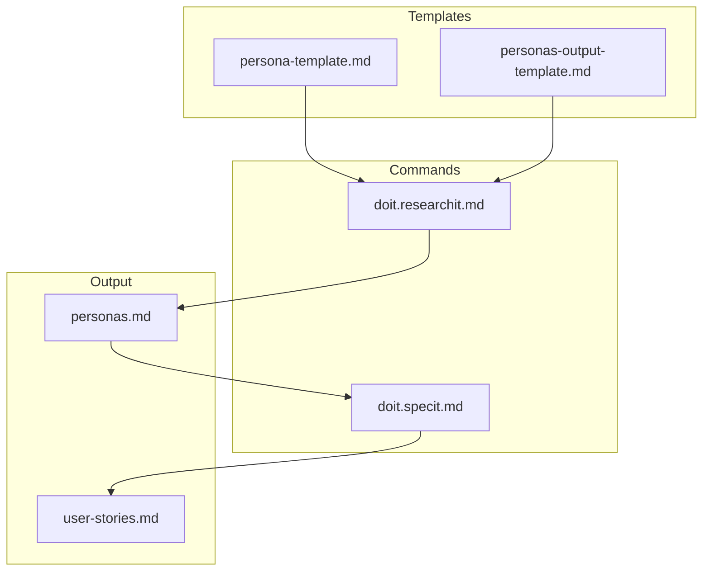

# Implementation Plan: Stakeholder Persona Templates

**Branch**: `053-stakeholder-persona-templates` | **Date**: 2026-01-30 | **Spec**: [spec.md](spec.md)
**Input**: Feature specification from `/specs/053-stakeholder-persona-templates/spec.md`

## Summary

Enhance the `/doit.researchit` workflow with a dedicated stakeholder persona template that provides comprehensive profile fields (10+ vs current 4), persona relationship mapping, unique persona IDs for traceability, and seamless integration with `/doit.specit` for user story generation.

This is a **template-only feature** - implementation consists entirely of markdown template files with no Python code changes required.

## Technical Context

**Language/Version**: Markdown (template files read by AI assistants)
**Primary Dependencies**: None (file-based templates only)
**Storage**: File-based markdown in `.doit/templates/` and `specs/` directories
**Testing**: Manual testing (AI assistant reads template and generates expected output)
**Target Platform**: AI coding assistants (Claude Code, GitHub Copilot, Cursor)
**Project Type**: single (template files only)
**Performance Goals**: N/A (no runtime code)
**Constraints**: Templates must be clear enough for AI assistants to parse and execute
**Scale/Scope**: 4 template files, 2 command template updates

## Architecture Overview

<!-- BEGIN:AUTO-GENERATED section="architecture" -->

<!-- END:AUTO-GENERATED -->

## Constitution Check

*GATE: Must pass before Phase 0 research. Re-check after Phase 1 design.*

| Principle | Status | Notes |
|-----------|--------|-------|
| I. Specification-First | ✅ PASS | Spec created before implementation |
| II. Persistent Memory | ✅ PASS | Templates stored in `.doit/templates/` |
| III. Auto-Generated Diagrams | ✅ PASS | No new diagrams required (persona profiles are text) |
| IV. Opinionated Workflow | ✅ PASS | Follows specit → planit → taskit workflow |
| V. AI-Native Design | ✅ PASS | Templates designed for AI assistant consumption |

**Gate Status**: ✅ PASS - All principles satisfied

## Project Structure

### Documentation (this feature)

```text
specs/053-stakeholder-persona-templates/
├── spec.md              # Feature specification (created)
├── plan.md              # This file
├── research.md          # Phase 0 output (N/A for template feature)
├── data-model.md        # Phase 1 output (persona entity definition)
└── tasks.md             # Phase 2 output (/doit.taskit)
```

### Source Code (repository root)

```text
.doit/templates/
├── persona-template.md           # NEW: Comprehensive persona profile template
├── personas-output-template.md   # NEW: Generated personas.md artifact format
├── research-template.md          # EXISTING: Update to reference persona-template
└── user-stories-template.md      # EXISTING: Update to reference persona IDs

templates/commands/
├── doit.researchit.md            # UPDATE: Add persona template questions
└── doit.specit.md                # UPDATE: Load personas.md for story generation
```

**Structure Decision**: Template-only feature uses existing `.doit/templates/` directory for new template files and modifies existing command templates in `templates/commands/`.

## Complexity Tracking

No constitution violations - this is a straightforward template addition.

## Implementation Approach

### Template Design Principles

1. **Comprehensive Fields**: Persona template includes 10+ fields vs current 4
2. **Structured Format**: Clear sections for AI parsability
3. **ID System**: Unique persona IDs (P-001, P-002) for cross-referencing
4. **Relationship Mapping**: Explicit section for persona-to-persona relationships
5. **Archetype Classification**: Standard categories (Power User, Casual User, Administrator)

### Integration Points

| Component | Integration | Direction |
|-----------|-------------|-----------|
| persona-template.md | doit.researchit.md | Template → Command |
| personas-output-template.md | doit.researchit.md | Template → Command |
| personas.md (generated) | doit.specit.md | Output → Command Input |
| user-stories.md | personas.md | Cross-reference via P-IDs |

### Template Field Mapping

| Current (research.md) | New (persona-template.md) |
|-----------------------|---------------------------|
| Role | Role + Archetype |
| Goals | Primary Goals + Secondary Goals |
| Pain Points | Pain Points (prioritized) |
| Usage Context | Usage Context + Behavioral Patterns |
| - | Demographics |
| - | Technology Proficiency |
| - | Success Criteria (for this persona) |
| - | Relationships |
| - | Conflicts & Tensions |
| - | Unique ID (P-001, P-002) |
