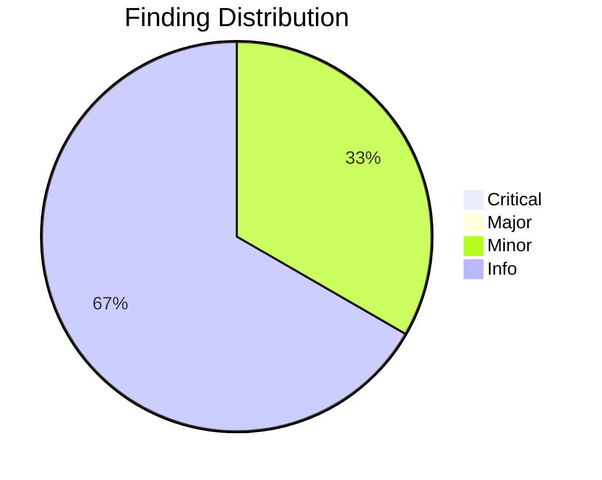
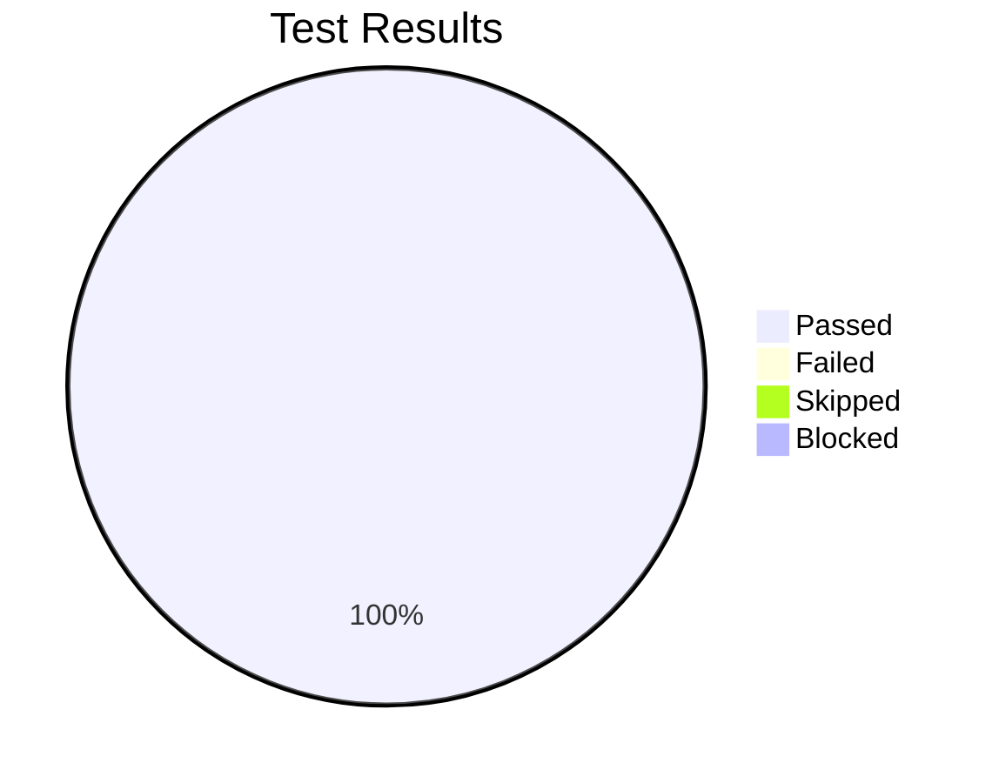

# Review Report: Stakeholder Persona Templates

**Date**: 2026-01-30
**Reviewer**: Claude Code
**Branch**: `053-stakeholder-persona-templates`

---

## Quality Overview

<!-- BEGIN:AUTO-GENERATED section="finding-distribution" -->

<!-- END:AUTO-GENERATED -->

---

## Code Review Summary

| Severity | Count |
|----------|-------|
| Critical | 0 |
| Major | 0 |
| Minor | 1 |
| Info | 2 |

### Files Reviewed

| Category | File | Status |
|----------|------|--------|
| Template | templates/persona-template.md | ✅ Compliant |
| Template | templates/personas-output-template.md | ✅ Compliant |
| Command | templates/commands/doit.researchit.md | ✅ Compliant |
| Command | templates/commands/doit.specit.md | ✅ Compliant |

### Requirement Compliance

| Requirement | Description | Status |
|-------------|-------------|--------|
| FR-001 | Template with 10+ fields | ✅ PASS (17 fields) |
| FR-002 | Required fields present | ✅ PASS |
| FR-003 | Relationship section | ✅ PASS |
| FR-004 | researchit persona questions | ✅ PASS |
| FR-005 | Generate personas.md | ✅ PASS |
| FR-006 | Unique IDs (P-NNN) | ✅ PASS |
| FR-007 | specit loads personas.md | ✅ PASS |
| FR-008 | Stories reference persona IDs | ✅ PASS |
| FR-009 | Standalone usage | ✅ PASS |
| FR-010 | Conflicts & Tensions section | ✅ PASS |

### Minor Findings

| File | Issue | Impact |
|------|-------|--------|
| tasks.md:99 | Task description references `.doit/templates/` but file is in `templates/` | Cosmetic - task executed correctly |

### Info Notes

| File | Note |
|------|------|
| persona-template.md | Uses `\|` escape in relationship types (required for markdown) |
| personas-output-template.md | Mermaid uses `flowchart LR` (valid syntax) |

---

## Test Results Overview

<!-- BEGIN:AUTO-GENERATED section="test-results" -->

<!-- END:AUTO-GENERATED -->

---

## Manual Testing Summary

| Metric | Count |
|--------|-------|
| Total Tests | 9 |
| Passed | 9 |
| Failed | 0 |
| Skipped | 0 |
| Blocked | 0 |

### Test Results

| Test ID | Description | User Story | Result |
|---------|-------------|------------|--------|
| MT-001 | persona-template.md has 17+ profile fields | US1 | ✅ PASS |
| MT-002 | personas-output-template.md has summary table, profiles, relationship map | US1 | ✅ PASS |
| MT-003 | researchit Phase 2 has questions Q2.1-Q2.7 for all persona fields | US1 | ✅ PASS |
| MT-004 | researchit Phase 2.5 has relationship questions | US2 | ✅ PASS |
| MT-005 | Bidirectional relationship documentation in researchit.md | US2 | ✅ PASS |
| MT-006 | specit.md has "Load Personas" section | US3 | ✅ PASS |
| MT-007 | specit.md user story format includes `Persona: P-XXX` | US3 | ✅ PASS |
| MT-008 | persona-template.md has standalone usage instructions | US4 | ✅ PASS |
| MT-009 | Validation checklist included in template | US4 | ✅ PASS |

---

## Sign-Off

- **Code Review**: ✅ Approved at 2026-01-30
- **Manual Testing**: ✅ Approved at 2026-01-30 (all tests passed)
- **Notes**: Template-only feature - no Python code changes. All 10 tasks completed successfully.

---

## Data Model Compliance

| Requirement | Status | Evidence |
|-------------|--------|----------|
| ID format P-NNN | ✅ PASS | Pattern enforced in templates |
| Archetype enum | ✅ PASS | Power User, Casual User, Administrator, Approver, Observer |
| Relationship types | ✅ PASS | manages, reports_to, collaborates, approves, blocks |
| Required fields | ✅ PASS | All 8 required fields present |

---

## Recommendations

1. **None blocking** - Implementation is complete and compliant with all requirements
2. Consider running a full end-to-end test with `/doit.researchit` → `/doit.specit` flow during UAT

---

## Next Steps

Ready for `/doit.checkin` to finalize and merge changes.
