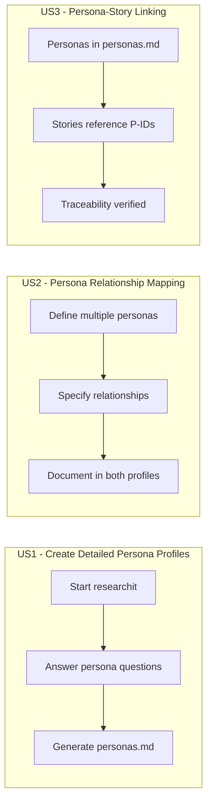
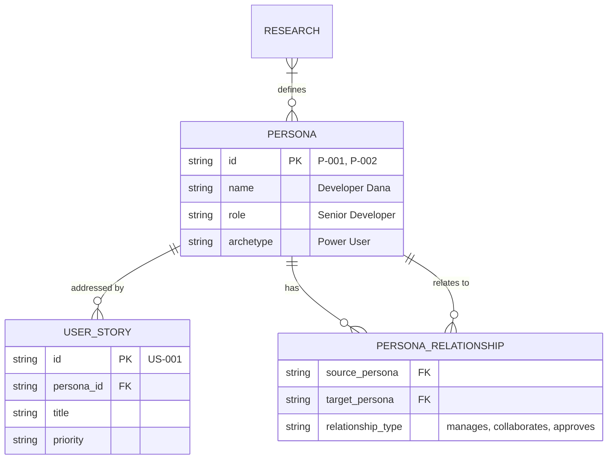

# Feature Specification: Stakeholder Persona Templates

**Feature Branch**: `053-stakeholder-persona-templates`
**Created**: 2026-01-30
**Status**: Draft
**Input**: User description: "Stakeholder Persona Templates"

## Overview

Enhance the `/doit.researchit` workflow with a dedicated stakeholder persona template that provides a comprehensive structure for capturing rich user profiles. The current research template has a minimal persona section (4 fields). This feature adds a dedicated `persona-template.md` that supports industry-standard persona documentation including behavioral patterns, technology proficiency, success criteria, and persona relationships.

## User Scenarios & Testing *(mandatory)*

### User Story 1 - Create Detailed Persona Profiles (Priority: P1)

As a Product Owner running `/doit.researchit`, I want a comprehensive persona template so that I can capture rich stakeholder profiles that go beyond basic role/goals/pain points.

**Why this priority**: The current persona section in research.md has only 4 fields. Detailed personas drive better user stories and more accurate specifications.

**Independent Test**: Can be fully tested by running `/doit.researchit` and verifying the persona questions capture all template fields, then checking the generated persona profile is complete.

**Acceptance Scenarios**:

1. **Given** I start a `/doit.researchit` session, **When** Phase 2 (Users and Goals) begins, **Then** the AI asks questions that populate all persona template fields
2. **Given** I have described a stakeholder, **When** the research artifacts are generated, **Then** a `personas.md` file is created with the full persona profile
3. **Given** I have multiple stakeholders, **When** I describe each one, **Then** each gets a separate persona section with all template fields

---

### User Story 2 - Persona Relationship Mapping (Priority: P2)

As a Product Owner, I want to capture how different personas relate to each other (e.g., manager/report, collaborator, approver) so that I can understand workflow dynamics.

**Why this priority**: Understanding persona relationships helps identify handoffs, approvals, and collaboration points in user journeys.

**Independent Test**: Can be tested by defining two related personas and verifying the relationship is documented in both profiles.

**Acceptance Scenarios**:

1. **Given** I have defined Persona A and Persona B, **When** I indicate A manages B, **Then** the relationship appears in both persona profiles
2. **Given** a persona has no relationships, **When** the profile is generated, **Then** the relationships section shows "No direct relationships identified"

---

### User Story 3 - Persona-Story Linking (Priority: P2)

As a Developer reading the spec, I want each user story to explicitly link to a defined persona so that I understand whose needs each story addresses.

**Why this priority**: Traceability from personas to user stories ensures coverage and helps prioritize based on persona importance.

**Independent Test**: Can be tested by checking that each user story in `user-stories.md` references a persona ID from `personas.md`.

**Acceptance Scenarios**:

1. **Given** personas are defined in `personas.md`, **When** `/doit.specit` generates user stories, **Then** each story includes a `Persona: P-001` reference
2. **Given** a user story references persona `P-002`, **When** I read `personas.md`, **Then** I can find persona `P-002` with full profile

---

### User Story 4 - Persona Template Standalone Usage (Priority: P3)

As a Product Owner working on an existing project, I want to use the persona template independently of `/doit.researchit` so that I can document stakeholders for brownfield projects.

**Why this priority**: Not all projects start with `/doit.researchit`; standalone template usage supports existing workflows.

**Independent Test**: Can be tested by copying the persona template directly and filling it out manually.

**Acceptance Scenarios**:

1. **Given** I copy `.doit/templates/persona-template.md`, **When** I fill in the placeholders, **Then** I have a valid persona document
2. **Given** I have manually created personas, **When** I run `/doit.specit`, **Then** the spec workflow can reference those personas

---

### Edge Cases

- What happens when a persona has conflicting goals with another persona? → Document in "Conflicts & Tensions" section
- How does system handle anonymous/unknown user types? → Use "Generic User" persona template variant
- What happens when no personas are defined? → `/doit.specit` uses a default "Primary User" placeholder

## User Journey Visualization

<!-- BEGIN:AUTO-GENERATED section="user-journey" -->

<!-- END:AUTO-GENERATED -->

## Entity Relationships

<!-- BEGIN:AUTO-GENERATED section="entity-relationships" -->

<!-- END:AUTO-GENERATED -->

## Requirements *(mandatory)*

### Functional Requirements

- **FR-001**: System MUST provide a `persona-template.md` with comprehensive profile fields
- **FR-002**: Template MUST include: name, role, archetype, demographics, goals, pain points, technology proficiency, behavioral patterns
- **FR-003**: Template MUST include relationship section for persona-to-persona mapping
- **FR-004**: `/doit.researchit` MUST ask questions that populate all persona template fields during Phase 2
- **FR-005**: System MUST generate `personas.md` artifact with all defined personas
- **FR-006**: Personas MUST have unique IDs (P-001, P-002, etc.) for story linking
- **FR-007**: `/doit.specit` MUST load `personas.md` when generating user stories
- **FR-008**: User stories MUST reference persona IDs for traceability
- **FR-009**: Template MUST be usable standalone (copy and fill manually)
- **FR-010**: Template MUST include a "Conflicts & Tensions" section for competing goals

### Key Entities

- **Persona**: A stakeholder profile representing a user type, with ID, demographics, goals, pain points, and behavioral patterns
- **Persona Relationship**: A connection between two personas (manages, collaborates, approves, blocks)
- **Archetype**: A categorization label (Power User, Casual User, Administrator, Approver)

## Success Criteria *(mandatory)*

### Measurable Outcomes

- **SC-001**: Persona profiles contain at least 10 documented fields vs. current 4 fields
- **SC-002**: 100% of user stories generated by `/doit.specit` link to a defined persona
- **SC-003**: Product Owners can create a complete persona profile in under 5 minutes using the template
- **SC-004**: Personas generated by `/doit.researchit` pass template validation (all required fields populated)

## Technical Notes

This is a **template-only feature** - implementation consists of:

1. New `.doit/templates/persona-template.md` file
2. Updates to `templates/commands/doit.researchit.md` to use the new template
3. Updates to `templates/commands/doit.specit.md` to load and reference personas
4. New `.doit/templates/personas-output-template.md` for generated `personas.md` artifact

No Python code changes required.
