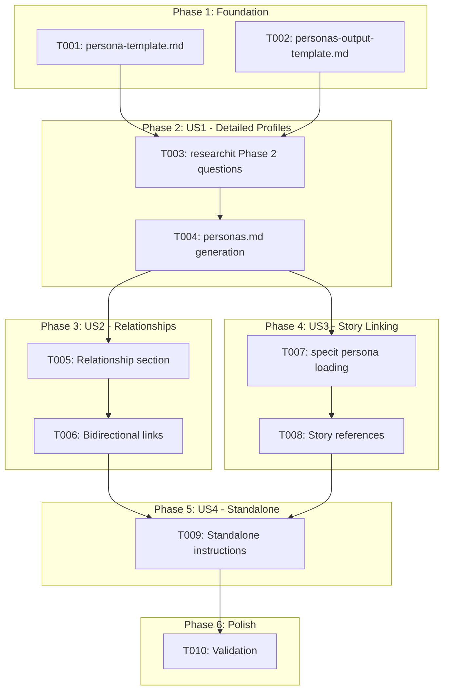
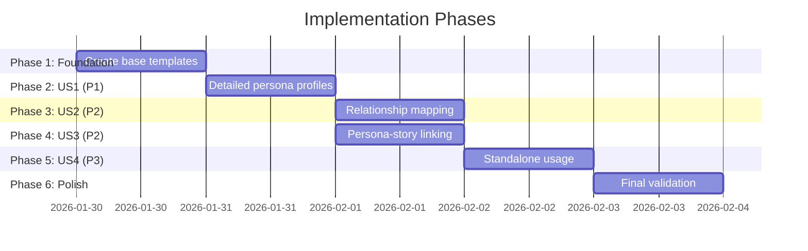

# Tasks: Stakeholder Persona Templates

**Input**: Design documents from `/specs/053-stakeholder-persona-templates/`
**Prerequisites**: plan.md ✅, spec.md ✅, data-model.md ✅, quickstart.md ✅

**Tests**: Not requested - tests are omitted per template-based feature nature.

**Organization**: Tasks are grouped by user story to enable independent implementation and testing of each story.

## Task Dependencies

<!-- BEGIN:AUTO-GENERATED section="task-dependencies" -->

<!-- END:AUTO-GENERATED -->

## Phase Timeline

<!-- BEGIN:AUTO-GENERATED section="phase-timeline" -->

<!-- END:AUTO-GENERATED -->

## Format: `[ID] [P?] [Story] Description`

- **[P]**: Can run in parallel (different files, no dependencies)
- **[Story]**: Which user story this task belongs to (e.g., US1, US2, US3, US4)
- Include exact file paths in descriptions

## Path Conventions

- **Templates**: `.doit/templates/` for output templates
- **Commands**: `templates/commands/` for slash command templates

---

## Phase 1: Foundation (Create Base Templates)

**Purpose**: Create the core persona templates that all user stories depend on

- [X] T001 [P] Create comprehensive persona profile template in .doit/templates/persona-template.md with 10+ fields: Identity (name, role, archetype), Demographics (experience level, team size, domain expertise), Goals (primary, secondary), Pain Points (prioritized list), Behavioral Patterns (technology proficiency, work style, decision making), Success Criteria, Usage Context, Relationships table, Conflicts & Tensions section
- [X] T002 [P] Create personas output template in .doit/templates/personas-output-template.md with: Persona Summary table, Detailed Profiles section, Relationship Map section, Conflicts & Tensions consolidated view

**Checkpoint**: Base templates ready - command integration can now begin

---

## Phase 2: User Story 1 - Create Detailed Persona Profiles (Priority: P1) 🎯 MVP

**Goal**: Product Owners can capture rich stakeholder profiles through `/doit.researchit` Q&A

**Independent Test**: Run `/doit.researchit`, answer persona questions, verify generated `personas.md` contains all 10+ fields per persona

### Implementation for User Story 1

- [X] T003 [US1] Update Phase 2 (Users and Goals) in templates/commands/doit.researchit.md to add comprehensive persona questions: archetype selection, demographics, technology proficiency, behavioral patterns, success criteria beyond basic role/goals/pain points
- [X] T004 [US1] Add personas.md generation logic in templates/commands/doit.researchit.md to output all persona profiles using personas-output-template.md format, assign unique IDs (P-001, P-002), include summary table

**Checkpoint**: US1 complete - `/doit.researchit` generates full persona profiles with 10+ fields

---

## Phase 3: User Story 2 - Persona Relationship Mapping (Priority: P2)

**Goal**: Capture how personas relate to each other (manager/report, collaborator, approver)

**Independent Test**: Define two personas with a relationship, verify relationship appears in both profiles

### Implementation for User Story 2

- [X] T005 [US2] Add relationship questions to Phase 2 in templates/commands/doit.researchit.md asking how personas work together: who manages whom, who collaborates with whom, who approves whose work, any blocking relationships
- [X] T006 [US2] Update personas.md generation in templates/commands/doit.researchit.md to populate relationship tables bidirectionally (if A manages B, add to both A and B profiles) and handle "No direct relationships identified" default

**Checkpoint**: US2 complete - persona relationships documented bidirectionally

---

## Phase 4: User Story 3 - Persona-Story Linking (Priority: P2)

**Goal**: Each user story explicitly links to a defined persona for traceability

**Independent Test**: Check that user stories in `user-stories.md` reference persona IDs from `personas.md`

### Implementation for User Story 3

- [X] T007 [US3] Add "Load Personas" section to templates/commands/doit.specit.md to check for specs/{feature}/personas.md, read persona IDs and names if found, store for user story generation
- [X] T008 [US3] Update user story generation in templates/commands/doit.specit.md to include `Persona: P-XXX` reference in each story header, require persona selection when generating stories

**Checkpoint**: US3 complete - all generated user stories reference a persona ID

---

## Phase 5: User Story 4 - Persona Template Standalone Usage (Priority: P3)

**Goal**: Persona template can be used independently of `/doit.researchit` for brownfield projects

**Independent Test**: Copy persona-template.md, fill placeholders manually, verify valid document created

### Implementation for User Story 4

- [X] T009 [US4] Add standalone usage instructions to .doit/templates/persona-template.md header including: how to copy and fill manually, placeholder syntax explanation, validation checklist, link to personas-output-template.md for multi-persona documents

**Checkpoint**: US4 complete - template usable standalone with clear instructions

---

## Phase 6: Polish & Cross-Cutting Concerns

**Purpose**: Validation and documentation

- [X] T010 Validate all templates against data-model.md requirements: verify 10+ fields in persona-template.md, verify ID format P-NNN enforced, verify relationship types match enum (manages, collaborates, approves, blocks, reports_to), verify archetype values match enum (Power User, Casual User, Administrator, Approver, Observer)

---

## Dependencies & Execution Order

### Phase Dependencies

- **Foundation (Phase 1)**: No dependencies - can start immediately
- **User Story 1 (Phase 2)**: Depends on Foundation (T001, T002)
- **User Story 2 (Phase 3)**: Depends on User Story 1 (T003, T004)
- **User Story 3 (Phase 4)**: Depends on User Story 1 (T004 generates personas.md)
- **User Story 4 (Phase 5)**: Depends on Foundation (T001 must exist)
- **Polish (Phase 6)**: Depends on all user stories complete

### User Story Dependencies

- **User Story 1 (P1)**: Foundation only - no story dependencies
- **User Story 2 (P2)**: Extends US1's persona questions and generation
- **User Story 3 (P2)**: Uses personas.md output from US1
- **User Story 4 (P3)**: Uses persona-template.md from Foundation

### Parallel Opportunities

- T001 and T002 can run in parallel (different files)
- US2 (Phase 3) and US3 (Phase 4) can run in parallel after US1 completes
- US4 (Phase 5) can start after Foundation, parallel with US1

---

## Parallel Example: Foundation Phase

```bash
# Launch both template creation tasks together:
Task: "Create persona-template.md in .doit/templates/"
Task: "Create personas-output-template.md in .doit/templates/"
```

---

## Implementation Strategy

### MVP First (User Story 1 Only)

1. Complete Phase 1: Foundation (create both templates)
2. Complete Phase 2: User Story 1 (researchit integration)
3. **STOP and VALIDATE**: Run `/doit.researchit` and verify persona profiles
4. Demo if ready - basic persona capture works

### Incremental Delivery

1. Complete Foundation → Templates ready
2. Add User Story 1 → Full persona profiles work → MVP!
3. Add User Story 2 → Relationships captured → Enhanced value
4. Add User Story 3 → Story traceability → Developer value
5. Add User Story 4 → Standalone usage → Brownfield support

---

## Notes

- [P] tasks = different files, no dependencies
- [Story] label maps task to specific user story for traceability
- This is a **template-only feature** - no Python code required
- All tasks create or modify markdown files only
- Commit after each task or logical group
- Stop at any checkpoint to validate story independently
