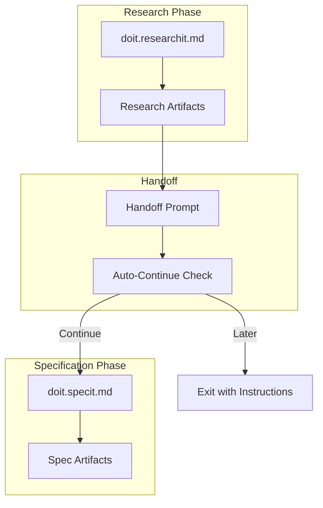

# Implementation Plan: Research-to-Spec Auto-Pipeline

**Branch**: `054-research-spec-pipeline` | **Date**: 2026-01-30 | **Spec**: [spec.md](spec.md)
**Input**: Feature specification from `/specs/054-research-spec-pipeline/spec.md`

## Summary

Enable seamless automatic handoff from `/doit.researchit` to `/doit.specit` with full context preservation. When a research session completes, the system prompts the user to continue to specification with all research artifacts pre-loaded, eliminating manual context switching.

This is a **template-only feature** - implementation consists entirely of markdown template modifications with no Python code changes required.

## Technical Context

**Language/Version**: Markdown (template files read by AI assistants)
**Primary Dependencies**: None (file-based templates only)
**Storage**: File-based markdown in `specs/` and `.doit/` directories
**Testing**: Manual testing (AI assistant reads template and generates expected output)
**Target Platform**: AI coding assistants (Claude Code, GitHub Copilot, Cursor)
**Project Type**: single (template files only)
**Performance Goals**: N/A (no runtime code)
**Constraints**: Templates must be clear enough for AI assistants to parse and execute
**Scale/Scope**: 2 template files modified, 0 new template files

## Architecture Overview

<!-- BEGIN:AUTO-GENERATED section="architecture" -->

<!-- END:AUTO-GENERATED -->

## Constitution Check

*GATE: Must pass before Phase 0 research. Re-check after Phase 1 design.*

| Principle | Status | Notes |
|-----------|--------|-------|
| I. Specification-First | ✅ PASS | Spec created before implementation |
| II. Persistent Memory | ✅ PASS | Research artifacts stored in `specs/{feature}/` directory |
| III. Auto-Generated Diagrams | ✅ PASS | No new diagrams required (workflow is text-based prompts) |
| IV. Opinionated Workflow | ✅ PASS | Enhances the enforced workflow: researchit → specit transition |
| V. AI-Native Design | ✅ PASS | Templates designed for AI assistant consumption via slash commands |

**Gate Status**: ✅ PASS - All principles satisfied

## Project Structure

### Documentation (this feature)

```text
specs/054-research-spec-pipeline/
├── spec.md              # Feature specification (created)
├── plan.md              # This file
├── quickstart.md        # Implementation steps
└── checklists/
    └── requirements.md  # Quality validation (created)
```

### Source Code (repository root)

```text
templates/commands/
├── doit.researchit.md   # UPDATE: Add handoff prompt and --auto-continue flag
└── doit.specit.md       # UPDATE: Enhance context loading confirmation
```

**Structure Decision**: Template-only feature modifies existing command templates in `templates/commands/`.

## Implementation Approach

### Template Modification Strategy

1. **doit.researchit.md Updates**:
   - Add `--auto-continue` flag detection in User Input section
   - Add handoff prompt section after Step 5 (Present Summary)
   - Add artifact summary before handoff prompt
   - Add "Later" option with resume instructions

2. **doit.specit.md Updates**:
   - Add confirmation message when research context is loaded
   - Add suggestion for recently researched feature when no args provided

### Integration Points

| Component | Integration | Direction |
|-----------|-------------|-----------|
| doit.researchit.md | Handoff prompt | Template → User |
| doit.researchit.md | doit.specit invocation | Template → Template |
| doit.specit.md | Research artifact detection | Template ← File System |
| doit.specit.md | Context confirmation | Template → User |

### Handoff Prompt Design

```markdown
---

## Continue to Specification?

The following research artifacts are ready for specification:
- research.md ✓
- user-stories.md ✓
- personas.md ✓ (if exists)
- interview-notes.md ✓ (if exists)
- competitive-analysis.md ✓ (if exists)

**Options**:
1. **Continue** - Run `/doit.specit` now with research pre-loaded
2. **Later** - Exit and resume later with `/doit.specit [feature-name]`

Your choice: _
```

### Auto-Continue Flag Design

```markdown
## User Input

```text
$ARGUMENTS
```

**Check for flags**:
- If `--auto-continue` flag present: Skip handoff prompt, invoke specit directly
- If no flags: Show interactive handoff prompt (default)
```

## Complexity Tracking

No constitution violations - this is a straightforward template enhancement.

## Phase 0: Research

**Status**: Not needed - no technical unknowns

This feature modifies existing template patterns. No external research required.

## Phase 1: Design

### Data Model

**Status**: N/A - No data entities

This feature does not introduce new data entities. It enhances workflow transitions between existing commands.

### API Contracts

**Status**: N/A - No APIs

This is a template-only feature with no API endpoints.

## Requirement Mapping

| Requirement | Implementation Location |
|-------------|------------------------|
| FR-001: Display handoff prompt | doit.researchit.md Step 6 (new) |
| FR-002: Prompt options | doit.researchit.md handoff section |
| FR-003: Preserve feature context | doit.researchit.md → doit.specit.md |
| FR-004: --auto-continue flag | doit.researchit.md User Input |
| FR-005: Load research artifacts | doit.specit.md (existing, enhanced) |
| FR-006: Artifact summary | doit.researchit.md handoff section |
| FR-007: Progress indicator | doit.researchit.md Next Steps (existing) |
| FR-008: Resume instructions | doit.researchit.md "Later" option |
| FR-009: Validate artifacts | doit.researchit.md before handoff |
| FR-010: Warn on missing artifacts | doit.researchit.md validation |
| FR-011: Suggest recent feature | doit.specit.md (new section) |
| FR-012: Preserve artifacts on failure | No action needed (file-based) |
