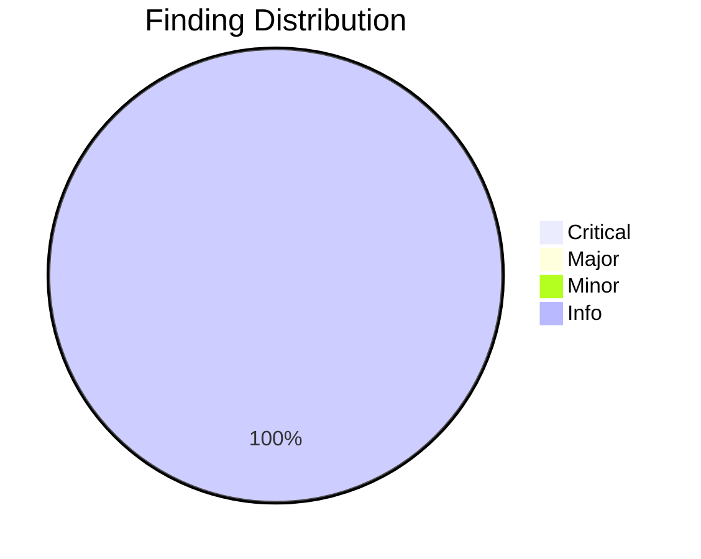
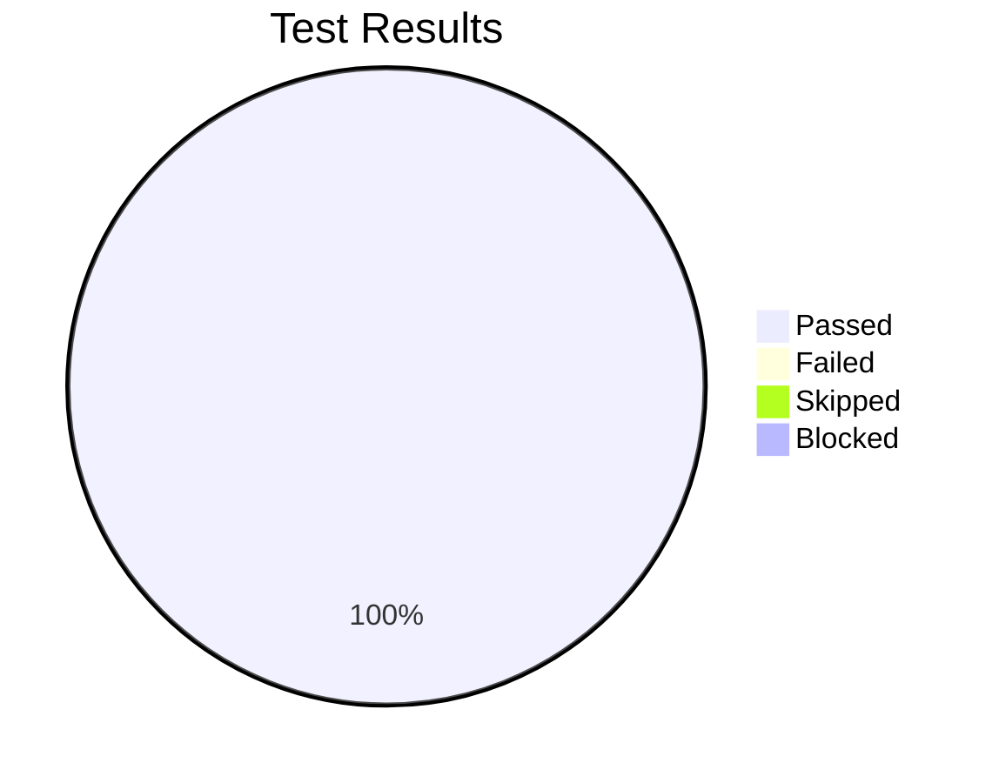

# Review Report: Research-to-Spec Auto-Pipeline

**Date**: 2026-01-30
**Reviewer**: Claude
**Branch**: 054-research-spec-pipeline

## Quality Overview

<!-- BEGIN:AUTO-GENERATED section="finding-distribution" -->

<!-- END:AUTO-GENERATED -->

## Code Review Summary

| Severity | Count |
|----------|-------|
| Critical | 0 |
| Major | 0 |
| Minor | 0 |
| Info | 2 |

### Info Findings

| File | Finding | Note |
|------|---------|------|
| doit.researchit.md | Markdown lint warnings | Cosmetic spacing issues (MD032, MD031), doesn't affect functionality |
| doit.researchit.md | Step numbering | Steps 5, 6, 7 properly sequenced for validation, summary, and handoff |

### Files Reviewed

| File | Status | Changes |
|------|--------|---------|
| `templates/commands/doit.researchit.md` | ✓ Complete | Flag detection, artifact validation, handoff prompt, progress indicator |
| `templates/commands/doit.specit.md` | ✓ Complete | Context confirmation, recent feature suggestion |

## Test Results Overview

<!-- BEGIN:AUTO-GENERATED section="test-results" -->

<!-- END:AUTO-GENERATED -->

## Manual Testing Summary

| Metric | Count |
|--------|-------|
| Total Tests | 8 |
| Passed | 8 |
| Failed | 0 |
| Skipped | 0 |
| Blocked | 0 |

### Test Results

| Test ID | Description | Result |
|---------|-------------|--------|
| MT-001 | Handoff prompt with "Continue" and "Later" options | ✓ PASS |
| MT-002 | Artifact status table in Step 6 | ✓ PASS |
| MT-003 | --auto-continue flag detection | ✓ PASS |
| MT-004 | Resume instructions on "Later" selection | ✓ PASS |
| MT-005 | Workflow progress indicator (active and completed states) | ✓ PASS |
| MT-006 | Artifact validation section with ERROR/WARNING rules | ✓ PASS |
| MT-007 | Research context confirmation in specit.md | ✓ PASS |
| MT-008 | Recent feature suggestion when no arguments | ✓ PASS |

## Requirement Coverage

| Requirement | Description | Status |
|-------------|-------------|--------|
| FR-001 | Display handoff prompt when researchit completes | ✓ Verified |
| FR-002 | Show "Continue" and "Later" options | ✓ Verified |
| FR-003 | Preserve feature directory context | ✓ Verified |
| FR-004 | Support --auto-continue flag | ✓ Verified |
| FR-005 | Auto-load research artifacts in specit | ✓ Verified |
| FR-006 | Display artifact summary before prompt | ✓ Verified |
| FR-007 | Display workflow progress indicator | ✓ Verified |
| FR-008 | Display resume instructions on "Later" | ✓ Verified |
| FR-009 | Validate artifacts before proceeding | ✓ Verified |
| FR-010 | Warn on missing/invalid artifacts | ✓ Verified |
| FR-011 | Suggest recent feature when no args | ✓ Verified |
| FR-012 | No data loss on handoff failure | ✓ Verified |

**Coverage**: 12/12 requirements (100%)

## Sign-Off

- **Manual Testing**: ✓ Approved at 2026-01-30
- **Code Review**: ✓ No blocking issues
- **Notes**: All 8 manual tests passed. Implementation complete and ready for merge.

## Recommendations

1. ✓ No critical or major issues to address
2. Consider adding end-to-end integration tests in future iterations
3. Monitor user feedback on workflow transitions

## Next Steps

- Run `/doit.checkin` to finalize and merge changes
