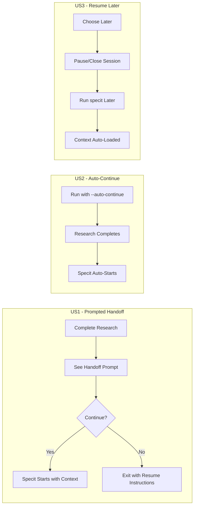

# Feature Specification: Research-to-Spec Auto-Pipeline

**Feature Branch**: `054-research-spec-pipeline`
**Created**: 2026-01-30
**Status**: Draft
**Input**: User description: "Research-to-Spec Auto-Pipeline"

## Overview

Enable seamless automatic handoff from `/doit.researchit` to `/doit.specit` with full context preservation. When a research session completes, the system prompts the user to continue to specification with all research artifacts pre-loaded, eliminating manual context switching and reducing the risk of losing captured requirements.

## User Scenarios & Testing *(mandatory)*

### User Story 1 - Prompted Handoff After Research (Priority: P1)

As a Product Owner completing a research session, I want to be prompted to continue to specification so that I can seamlessly transition without losing context or manually remembering the next step.

**Why this priority**: This is the core value proposition - reducing friction in the workflow transition and ensuring captured research doesn't get lost between sessions.

**Independent Test**: Complete a `/doit.researchit` session, verify prompt appears with options to continue to specit or exit, select continue, verify specit starts with correct feature context.

**Acceptance Scenarios**:

1. **Given** I complete a `/doit.researchit` session with all artifacts generated, **When** the session ends, **Then** I see a prompt asking if I want to continue to `/doit.specit`
2. **Given** I am prompted to continue to specit, **When** I select "Yes", **Then** `/doit.specit` is invoked with the feature name/directory pre-filled
3. **Given** I am prompted to continue to specit, **When** I select "No" or "Later", **Then** I return to the command line with a reminder of how to resume later
4. **Given** the handoff prompt appears, **When** I view it, **Then** I see a summary of what artifacts were created and will be used

---

### User Story 2 - Auto-Continue Flag (Priority: P2)

As a power user running batch workflows, I want to use a flag to automatically continue from research to spec without prompts so that I can streamline my workflow for familiar features.

**Why this priority**: Enhances efficiency for experienced users who know they always want to continue, but is not essential for the basic workflow.

**Independent Test**: Run `/doit.researchit --auto-continue [feature]`, complete the Q&A, verify specit starts automatically without prompting.

**Acceptance Scenarios**:

1. **Given** I run `/doit.researchit` with `--auto-continue` flag, **When** research artifacts are generated, **Then** `/doit.specit` is automatically invoked without prompting
2. **Given** I run `/doit.researchit` without any flags, **When** research completes, **Then** I am prompted (default behavior from US1)
3. **Given** I use `--auto-continue`, **When** an error occurs during research, **Then** the pipeline stops and reports the error without continuing to specit

---

### User Story 3 - Context Preservation Across Sessions (Priority: P2)

As a Product Owner who needs to pause between research and specification, I want the system to remember my progress so that I can resume the workflow later without re-entering information.

**Why this priority**: Supports real-world workflows where users may need breaks or stakeholder input between phases.

**Independent Test**: Complete researchit, choose "Later", close the session, run `/doit.specit` in the same feature directory, verify all research artifacts are loaded automatically.

**Acceptance Scenarios**:

1. **Given** I complete research and choose "Later" at the handoff prompt, **When** I later run `/doit.specit [feature-name]`, **Then** all research artifacts are automatically loaded as context
2. **Given** research artifacts exist in a feature directory, **When** I run specit for that feature, **Then** I see a confirmation that research context was loaded
3. **Given** I complete research but don't continue immediately, **When** I run `/doit.specit` without specifying a feature, **Then** the system suggests the most recently researched feature

---

### User Story 4 - Workflow Progress Indicator (Priority: P3)

As a user navigating the doit workflow, I want to see my progress through the pipeline so that I understand where I am and what comes next.

**Why this priority**: Improves user experience and orientation but doesn't affect core functionality.

**Independent Test**: Run researchit and complete it, verify progress indicator shows researchit complete and specit as next step, continue to specit, verify progress updates.

**Acceptance Scenarios**:

1. **Given** I complete any workflow step, **When** I view the completion message, **Then** I see a visual progress indicator showing completed and remaining steps
2. **Given** the progress indicator is displayed, **When** I view it, **Then** the current step is clearly highlighted and the next recommended step is identified

---

### Edge Cases

- What happens when research artifacts are incomplete or corrupted? → Validate artifacts before handoff, warn user if issues found
- What happens if specit encounters an error after auto-continue? → Report error clearly, do not lose research artifacts
- How does the system handle multiple feature directories? → Use the current branch/feature context, prompt if ambiguous
- What happens if user interrupts during handoff? → Preserve all artifacts, allow resumption via direct specit command

## User Journey Visualization

<!-- BEGIN:AUTO-GENERATED section="user-journey" -->

<!-- END:AUTO-GENERATED -->

## Requirements *(mandatory)*

### Functional Requirements

- **FR-001**: System MUST display a handoff prompt when `/doit.researchit` completes successfully
- **FR-002**: Handoff prompt MUST show options: "Continue to Specit", "Later", with clear descriptions
- **FR-003**: System MUST preserve feature directory context when transitioning from researchit to specit
- **FR-004**: System MUST support `--auto-continue` flag for `/doit.researchit` to skip prompting
- **FR-005**: System MUST automatically load all research artifacts (research.md, user-stories.md, personas.md, etc.) when specit starts after handoff
- **FR-006**: System MUST display a summary of created artifacts before the handoff prompt
- **FR-007**: System MUST display a workflow progress indicator showing completed and remaining steps
- **FR-008**: When user selects "Later", system MUST display instructions for resuming with `/doit.specit`
- **FR-009**: System MUST validate research artifacts exist and are readable before proceeding to specit
- **FR-010**: If artifacts are missing or invalid, system MUST warn user and allow them to proceed or abort
- **FR-011**: When running specit without arguments after recent research, system SHOULD suggest the researched feature
- **FR-012**: System MUST NOT lose any research artifacts if handoff fails or is interrupted

### Key Entities

- **Workflow State**: Tracks current position in the doit workflow pipeline (researchit → specit → planit → etc.)
- **Feature Context**: Bundle of feature directory path, branch name, and available artifacts
- **Handoff Prompt**: Interactive prompt configuration with options, descriptions, and default selection

## Success Criteria *(mandatory)*

### Measurable Outcomes

- **SC-001**: 90% of users who complete researchit proceed to specit within the same session when prompted
- **SC-002**: Users can transition from research to spec in under 5 seconds after completing research
- **SC-003**: 100% of research artifacts are available in specit context after handoff
- **SC-004**: Zero data loss during workflow transitions (all artifacts preserved)
- **SC-005**: Users report reduced cognitive load in workflow navigation (qualitative feedback)

## Technical Notes

This feature primarily involves updates to:

1. `templates/commands/doit.researchit.md` - Add handoff prompt and auto-continue flag
2. `templates/commands/doit.specit.md` - Enhance artifact loading and context display
3. Potentially a shared workflow state mechanism for progress tracking

No Python code changes expected - this is a template-only feature.
