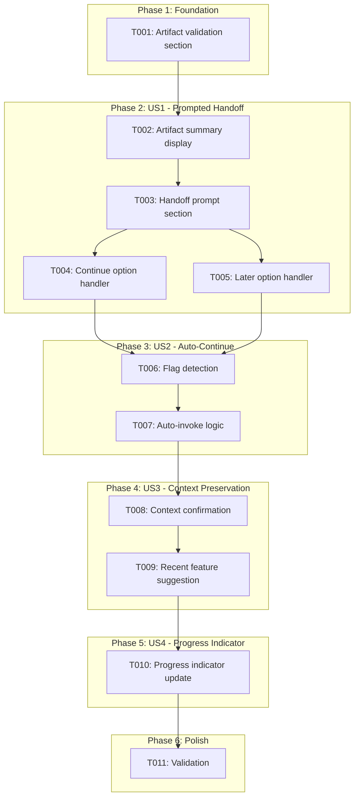
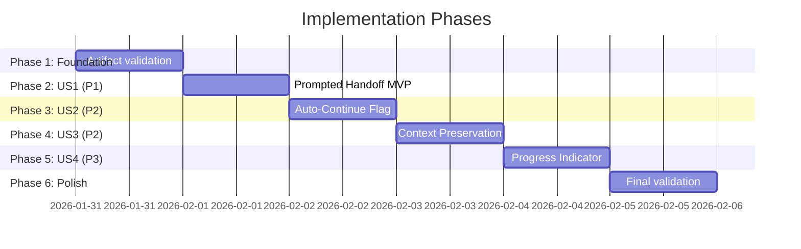

# Tasks: Research-to-Spec Auto-Pipeline

**Input**: Design documents from `/specs/054-research-spec-pipeline/`
**Prerequisites**: plan.md ✅, spec.md ✅, quickstart.md ✅

**Tests**: Not requested - tests are omitted per template-based feature nature.

**Organization**: Tasks are grouped by user story to enable independent implementation and testing of each story.

## Task Dependencies

<!-- BEGIN:AUTO-GENERATED section="task-dependencies" -->

<!-- END:AUTO-GENERATED -->

## Phase Timeline

<!-- BEGIN:AUTO-GENERATED section="phase-timeline" -->

<!-- END:AUTO-GENERATED -->

## Format: `[ID] [P?] [Story] Description`

- **[P]**: Can run in parallel (different files, no dependencies)
- **[Story]**: Which user story this task belongs to (e.g., US1, US2, US3, US4)
- Include exact file paths in descriptions

## Path Conventions

- **Templates**: `templates/commands/` for slash command templates

---

## Phase 1: Foundation (Shared Infrastructure)

**Purpose**: Create the foundational artifact validation that all user stories depend on

- [ ] T001 Add artifact validation section to templates/commands/doit.researchit.md before handoff prompt with checks for research.md existence, validation of required artifacts, and warning display for missing optional artifacts

**Checkpoint**: Artifact validation ready - handoff features can now begin

---

## Phase 2: User Story 1 - Prompted Handoff After Research (Priority: P1) 🎯 MVP

**Goal**: Product Owners see a handoff prompt when research completes, with options to continue or defer

**Independent Test**: Complete a `/doit.researchit` session, verify prompt appears with Continue/Later options, select Continue, verify specit starts with feature context

### Implementation for User Story 1

- [ ] T002 [US1] Add artifact summary display section to templates/commands/doit.researchit.md after Step 5 showing table of created artifacts (research.md, user-stories.md, personas.md, etc.) with checkmarks for existing files
- [ ] T003 [US1] Add handoff prompt section to templates/commands/doit.researchit.md with "Continue to Specification?" header, options list (1. Continue, 2. Later), and user choice input
- [ ] T004 [US1] Add "Continue" option handler to templates/commands/doit.researchit.md that invokes `/doit.specit {feature-name}` with feature directory context preserved
- [ ] T005 [US1] Add "Later" option handler to templates/commands/doit.researchit.md displaying resume instructions with exact command to run later (`/doit.specit [feature-name]`)

**Checkpoint**: US1 complete - `/doit.researchit` shows handoff prompt with working Continue/Later options

---

## Phase 3: User Story 2 - Auto-Continue Flag (Priority: P2)

**Goal**: Power users can use `--auto-continue` flag to skip the handoff prompt

**Independent Test**: Run `/doit.researchit --auto-continue test-feature`, complete Q&A, verify specit starts automatically without prompt

### Implementation for User Story 2

- [ ] T006 [US2] Add `--auto-continue` flag detection to templates/commands/doit.researchit.md User Input section with logic to extract feature description after removing flag from arguments
- [ ] T007 [US2] Add auto-invoke logic to templates/commands/doit.researchit.md that skips handoff prompt and directly invokes specit when `--auto-continue` flag is detected, with "Auto-continuing to specification..." message

**Checkpoint**: US2 complete - `--auto-continue` flag works to skip handoff prompt

---

## Phase 4: User Story 3 - Context Preservation Across Sessions (Priority: P2)

**Goal**: Users who choose "Later" can resume with full context when running specit later

**Independent Test**: Complete research, choose "Later", run `/doit.specit` later, verify research context is loaded and confirmed

### Implementation for User Story 3

- [ ] T008 [US3] Add research context confirmation message to templates/commands/doit.specit.md in "Load Research Artifacts" section displaying "Research Context Loaded" message with list of detected artifacts when research.md exists
- [ ] T009 [US3] Add recent feature suggestion to templates/commands/doit.specit.md when no arguments provided with logic to find most recently modified research.md and prompt user "Did you mean to continue with {feature-name}?"

**Checkpoint**: US3 complete - specit confirms context loaded and suggests recent features

---

## Phase 5: User Story 4 - Workflow Progress Indicator (Priority: P3)

**Goal**: Users see their progress through the doit workflow pipeline

**Independent Test**: Complete researchit, verify progress indicator shows researchit complete with specit as next step

### Implementation for User Story 4

- [ ] T010 [US4] Verify progress indicator in templates/commands/doit.researchit.md Next Steps section uses filled circle (●) for researchit and empty circles (○) for remaining steps, update if needed to show current step clearly highlighted

**Checkpoint**: US4 complete - workflow progress is clearly visible after each step

---

## Phase 6: Polish & Cross-Cutting Concerns

**Purpose**: Validation and final checks

- [ ] T011 Validate all template changes against spec requirements: verify handoff prompt displays (FR-001), options show correctly (FR-002), context preserved (FR-003), --auto-continue works (FR-004), artifacts load in specit (FR-005), summary displays (FR-006), progress indicator present (FR-007), resume instructions clear (FR-008)

---

## Dependencies & Execution Order

### Phase Dependencies

- **Foundation (Phase 1)**: No dependencies - can start immediately
- **User Story 1 (Phase 2)**: Depends on Foundation (T001)
- **User Story 2 (Phase 3)**: Depends on User Story 1 (needs handoff logic to skip)
- **User Story 3 (Phase 4)**: Can start after Foundation, parallel potential with US2
- **User Story 4 (Phase 5)**: Depends on User Story 1 (updates same file sections)
- **Polish (Phase 6)**: Depends on all user stories complete

### User Story Dependencies

- **User Story 1 (P1)**: Foundation only - this is the MVP
- **User Story 2 (P2)**: Extends US1's handoff logic with flag detection
- **User Story 3 (P2)**: Independent - modifies different file (specit.md)
- **User Story 4 (P3)**: Extends US1's completion flow

### Parallel Opportunities

- T004 and T005 can run in parallel (different handlers, same section)
- US2 and US3 can potentially run in parallel (different files)

---

## Implementation Strategy

### MVP First (User Story 1 Only)

1. Complete Phase 1: Foundation (T001)
2. Complete Phase 2: User Story 1 (T002-T005)
3. **STOP and VALIDATE**: Run `/doit.researchit` and verify handoff works
4. Demo if ready - basic handoff works with Continue/Later options

### Incremental Delivery

1. Complete Foundation → Artifact validation works
2. Add User Story 1 → Handoff prompt works → MVP!
3. Add User Story 2 → Power users get --auto-continue
4. Add User Story 3 → Context preservation enhanced
5. Add User Story 4 → Progress indicator polished

---

## Notes

- This is a **template-only feature** - no Python code required
- All tasks modify markdown files only
- Commit after each user story phase
- Stop at any checkpoint to validate story independently
- US1 (P1) is the MVP - can ship after Phase 2
