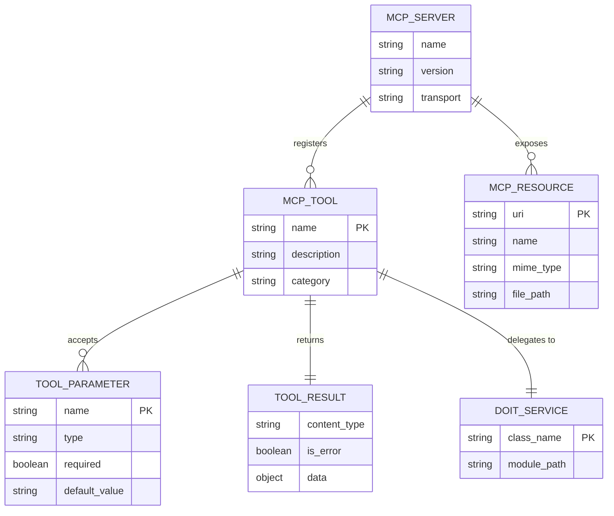

# Data Model: MCP Server for doit Operations

**Feature**: 055-mcp-server
**Date**: 2026-03-26

## ER Diagram

<!-- BEGIN:AUTO-GENERATED section="er-diagram" -->

<!-- END:AUTO-GENERATED -->

## Entities

### MCP Server

The central server instance that manages tool and resource registration.

- **name**: "doit" — the server identifier used in AI assistant configuration
- **version**: Matches the `doit-toolkit-cli` package version
- **transport**: "stdio" for MVP (subprocess communication)

### MCP Tool

An operation registered with the MCP server that AI assistants can invoke.

| Tool Name | Category | Service Class | Service Method |
| --- | --- | --- | --- |
| doit_validate | analysis | ValidationService | validate_file / validate_all |
| doit_status | reporting | StatusReporter | generate_report |
| doit_tasks | reporting | TaskParser | parse |
| doit_context | context | ContextLoader | load |
| doit_scaffold | setup | Scaffolder | create_doit_structure |
| doit_verify | setup | Validator | check_doit_folder |

### Tool Parameter

Typed input accepted by a tool. Parameters are defined via Python type hints and converted to JSON Schema by FastMCP.

### Tool Result

Structured JSON response returned by a tool. Always contains:

- `data`: The actual result payload (tool-specific schema)
- `is_error`: Boolean indicating if the operation failed
- Error results include `message` and `suggestion` fields

### MCP Resource

A read-only file exposed via the MCP resource protocol.

| URI | File Path | Description |
| --- | --- | --- |
| doit://memory/constitution | .doit/memory/constitution.md | Project principles and governance |
| doit://memory/roadmap | .doit/memory/roadmap.md | Feature roadmap with priorities |
| doit://memory/tech-stack | .doit/memory/tech-stack.md | Technology decisions |

### DOIT Service

An existing service class that a tool delegates to. No new services are created — all tools wrap existing classes.

## State Transitions

No state transitions apply. The MCP server is stateless — each tool call is independent. Project state is managed by the underlying services and the file system.
