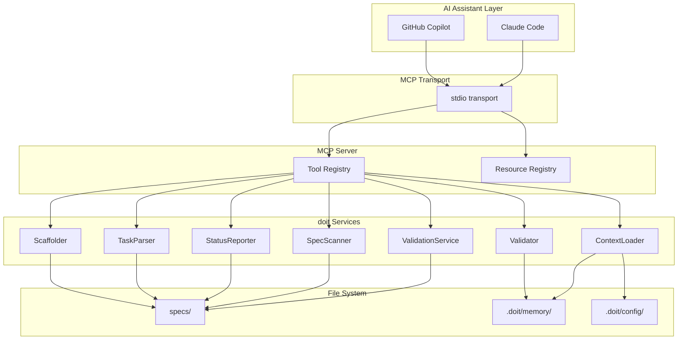

# Implementation Plan: MCP Server for doit Operations

**Branch**: `055-mcp-server` | **Date**: 2026-03-26 | **Spec**: [spec.md](spec.md)
**Input**: Feature specification from `/specs/055-mcp-server/spec.md`

## Summary

Expose doit's existing service layer as an MCP (Model Context Protocol) server, enabling AI assistants like Claude Code and GitHub Copilot to programmatically invoke doit operations (validate, status, tasks, context, scaffold, verify) through structured tool calls instead of requiring manual CLI commands. The server reuses all existing services with zero business logic duplication, wrapping them with MCP tool definitions that accept typed parameters and return structured JSON results.

## Technical Context

**Language/Version**: Python 3.11+ (per constitution)
**Primary Dependencies**: mcp (official MCP Python SDK with FastMCP), typer (CLI), rich (output)
**Storage**: File-based (markdown in `.doit/memory/`, JSON in `.doit/state/`)
**Testing**: pytest (per constitution)
**Target Platform**: Local CLI — subprocess spawned by AI assistants via stdio transport
**Project Type**: single (extends existing `src/doit_cli/` package)
**Performance Goals**: Tool responses within 2 seconds for projects with up to 50 spec files
**Constraints**: No network connectivity required, no external services, stdio transport only for MVP
**Scale/Scope**: 6 MCP tools + 3 MCP resources wrapping 7 existing service classes

## Architecture Overview

<!-- BEGIN:AUTO-GENERATED section="architecture" -->

<!-- END:AUTO-GENERATED -->

## Constitution Check

*GATE: Must pass before Phase 0 research. Re-check after Phase 1 design.*

| Principle | Status | Notes |
|-----------|--------|-------|
| I. Specification-First | PASS | Spec created before implementation |
| II. Persistent Memory | PASS | No new storage — reads existing `.doit/memory/` files |
| III. Auto-Generated Diagrams | PASS | Architecture and ER diagrams included in plan |
| IV. Opinionated Workflow | PASS | Follows specit → planit → taskit → implementit flow |
| V. AI-Native Design | PASS | Core purpose is AI assistant integration via MCP |
| Quality Standards | PASS | pytest tests required for all tools |
| Tech Stack Alignment | PASS | Python 3.11+, new dep `mcp` justified as core feature requirement |

**New dependency justification**: The `mcp` package (official MCP Python SDK) is required as this feature's core purpose is exposing doit as an MCP server. No alternative exists — MCP is the industry standard protocol for AI-tool integration.

## Project Structure

### Documentation (this feature)

```text
specs/055-mcp-server/
├── plan.md              # This file
├── spec.md              # Feature specification
├── research.md          # Phase 0 research output
├── data-model.md        # Phase 1 data model
├── checklists/
│   └── requirements.md  # Spec quality checklist
└── contracts/
    └── mcp-tools.md     # Tool definitions and schemas
```

### Source Code (repository root)

```text
src/doit_cli/
├── mcp/                       # NEW: MCP server package
│   ├── __init__.py
│   ├── server.py              # FastMCP server setup, tool/resource registration
│   └── tools/                 # Tool implementations (thin wrappers)
│       ├── __init__.py
│       ├── validate_tool.py   # doit_validate tool
│       ├── status_tool.py     # doit_status tool
│       ├── tasks_tool.py      # doit_tasks tool
│       ├── context_tool.py    # doit_context tool
│       ├── scaffold_tool.py   # doit_scaffold tool
│       └── verify_tool.py     # doit_verify tool
├── cli/
│   └── mcp_command.py         # NEW: `doit mcp serve` CLI command
├── services/                  # EXISTING: No changes needed
│   ├── validation_service.py  # Wrapped by validate_tool
│   ├── spec_scanner.py        # Wrapped by status_tool
│   ├── status_reporter.py     # Wrapped by status_tool
│   ├── task_parser.py         # Wrapped by tasks_tool
│   ├── context_loader.py      # Wrapped by context_tool
│   ├── scaffolder.py          # Wrapped by scaffold_tool
│   └── validator.py           # Wrapped by verify_tool
└── main.py                    # Add mcp_app subcommand

tests/
├── unit/
│   ├── test_mcp_server.py     # Server setup and registration tests
│   ├── test_mcp_validate.py   # Validate tool tests
│   ├── test_mcp_status.py     # Status tool tests
│   ├── test_mcp_tasks.py      # Tasks tool tests
│   ├── test_mcp_context.py    # Context tool tests
│   ├── test_mcp_scaffold.py   # Scaffold tool tests
│   └── test_mcp_verify.py     # Verify tool tests
└── integration/
    └── test_mcp_integration.py # End-to-end MCP protocol tests
```

**Structure Decision**: Extends the existing `src/doit_cli/` package with a new `mcp/` subpackage. Each tool is a thin wrapper that instantiates the appropriate service, calls its methods, and serializes results to JSON. No changes to existing services are required.

## Design Decisions

### D1: FastMCP over raw MCP SDK

Use the FastMCP API (included in `mcp` package) for tool registration. FastMCP auto-generates JSON schemas from Python type hints and docstrings, reducing boilerplate.

### D2: Tool-per-file organization

Each MCP tool gets its own file in `mcp/tools/` for clarity, testability, and adherence to single-responsibility. The server module imports and registers all tools.

### D3: Thin wrapper pattern

Each tool function:
1. Accepts typed parameters (from AI assistant)
2. Instantiates the appropriate service (with `Path.cwd()` as project root)
3. Calls the service method
4. Converts the result to a JSON-serializable dict
5. Returns as MCP text content

No business logic in tools — all logic stays in existing services.

### D4: stdio transport only (MVP)

stdio is the standard transport for local AI assistant integration. SSE/HTTP can be added later as a separate feature without changing tool implementations.

### D5: `mcp` as optional dependency

Add `mcp` to `[project.optional-dependencies]` under a `mcp` extra (e.g., `pip install doit-toolkit-cli[mcp]`). This keeps the core CLI lightweight for users who don't need MCP.

### D6: MCP Resources for project memory

Expose constitution.md, roadmap.md, and tech-stack.md as MCP resources with `doit://memory/{filename}` URIs. This allows AI assistants to read project context directly without tool calls.

## MCP Tool Specifications

### Tool: `doit_validate`
- **Parameters**: `spec_path: str | None` (optional — validates all if omitted)
- **Returns**: `{ specs: [{ name, path, passed, score, issues: [{ severity, line, message, recommendation }] }], summary: { total, passed, warned, failed, avg_score } }`
- **Service**: `ValidationService.validate_file()` or `validate_all()`

### Tool: `doit_status`
- **Parameters**: `include_roadmap: bool = false`, `status_filter: str | None`, `blocking_only: bool = false`
- **Returns**: `{ specs: [{ name, status, last_modified, is_blocking, validation_score }], summary: { total, by_status: {}, blocking_count }, roadmap?: [{ title, priority, status }] }`
- **Services**: `StatusReporter.generate_report()`, `ContextLoader.load_roadmap()`

### Tool: `doit_tasks`
- **Parameters**: `feature_name: str | None`, `include_dependencies: bool = false`
- **Returns**: `{ tasks: [{ id, description, status, priority, dependencies?, requirement_refs }], summary: { total, completed, pending } }`
- **Service**: `TaskParser.parse()`

### Tool: `doit_context`
- **Parameters**: `sources: list[str] | None` (filter to specific sources)
- **Returns**: `{ sources: [{ name, path, content, tokens, status }], summary: { total_sources, total_tokens } }`
- **Service**: `ContextLoader.load()`

### Tool: `doit_scaffold`
- **Parameters**: `tech_stack: str | None` (override if no constitution)
- **Returns**: `{ created_dirs: [str], created_files: [str], skipped: [str], summary: str }`
- **Service**: `Scaffolder.create_doit_structure()`

### Tool: `doit_verify`
- **Parameters**: none
- **Returns**: `{ checks: [{ name, passed, message }], all_passed: bool }`
- **Service**: `Validator.check_doit_folder()`, `check_agent_directory()`, `check_command_files()`

## MCP Resources

| URI | Name | MIME Type | Source File |
|-----|------|-----------|-------------|
| `doit://memory/constitution` | Project Constitution | text/markdown | `.doit/memory/constitution.md` |
| `doit://memory/roadmap` | Project Roadmap | text/markdown | `.doit/memory/roadmap.md` |
| `doit://memory/tech-stack` | Tech Stack | text/markdown | `.doit/memory/tech-stack.md` |

## Configuration Example

Users configure the MCP server in their AI assistant settings:

**Claude Code** (`.claude/settings.json` or `~/.claude/settings.json`):
```json
{
  "mcpServers": {
    "doit": {
      "command": "doit",
      "args": ["mcp", "serve"]
    }
  }
}
```

**GitHub Copilot** (`.vscode/settings.json`):
```json
{
  "github.copilot.chat.mcpServers": {
    "doit": {
      "command": "doit",
      "args": ["mcp", "serve"]
    }
  }
}
```

## Complexity Tracking

No constitution violations. The new `mcp` dependency is justified as the core feature requirement.
